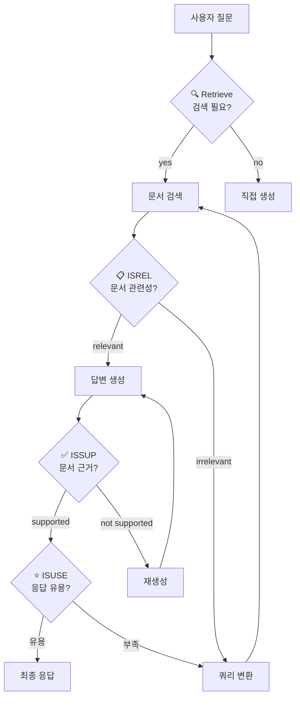
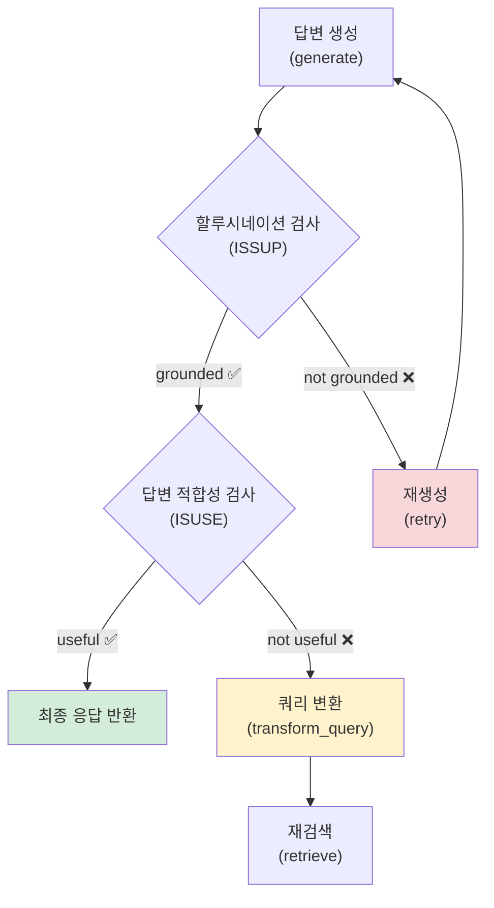
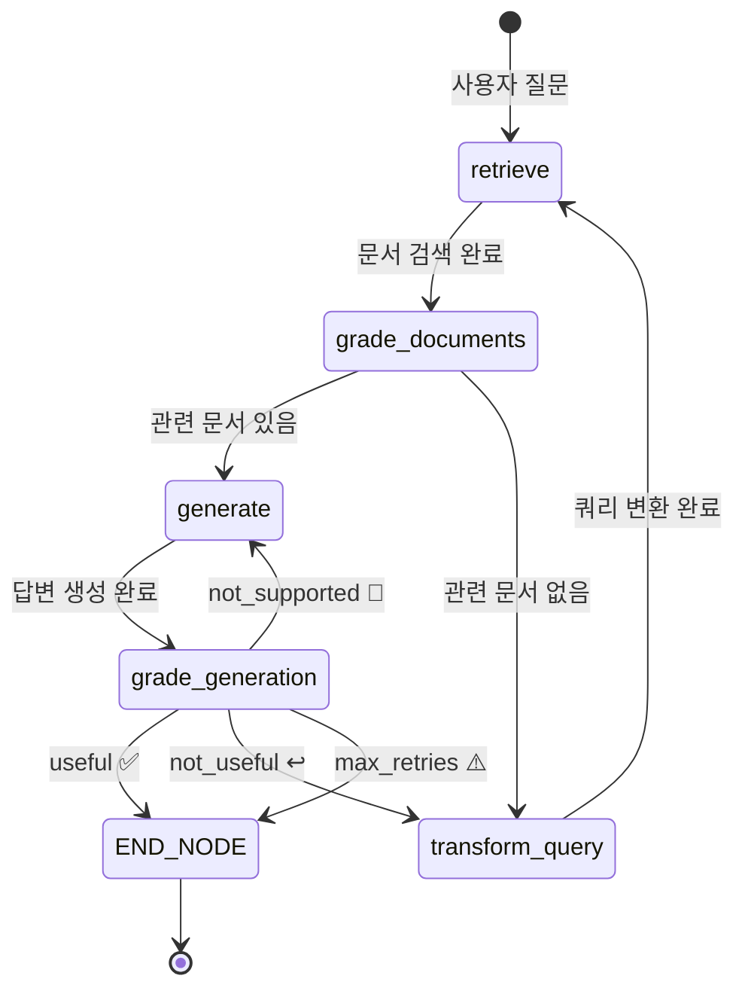
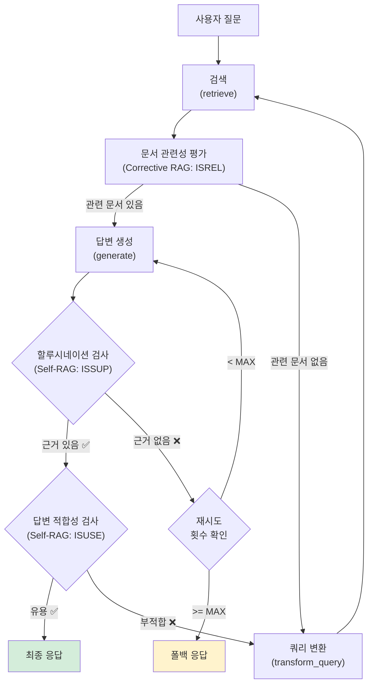

# Self-RAG — 생성 결과까지 자체 평가

> LLM이 검색 결과뿐 아니라 자신이 생성한 답변까지 스스로 평가하고, 할루시네이션이 감지되면 재생성하는 Self-RAG 전체 루프를 LangGraph로 구현합니다.

## 개요

이 섹션에서는 [16.4: Corrective RAG](16-에이전틱-rag-langgraph로-동적-검색-에이전트-구축/04-corrective-rag-검색-결과-평가와-재검색.md)에서 구현한 검색 결과 평가를 넘어, **생성된 답변 자체의 품질**까지 LLM이 자동으로 평가하는 Self-RAG 패턴을 완성합니다. 할루시네이션(Hallucination) 감지, 질문 적합성 평가, 최대 재시도 제한까지 포함한 완전한 자기 교정(Self-Corrective) RAG 그래프를 구축합니다.

**선수 지식**:
- [16.2: LangGraph 기초](16-에이전틱-rag-langgraph로-동적-검색-에이전트-구축/02-langgraph-기초-상태-그래프-프로그래밍.md)의 StateGraph, Node, Edge, Conditional Edge 개념
- [16.3: 검색 도구 RAG 에이전트](16-에이전틱-rag-langgraph로-동적-검색-에이전트-구축/03-검색-도구를-활용하는-rag-에이전트-구축.md)의 create_retriever_tool, ToolNode 패턴
- [16.4: Corrective RAG](16-에이전틱-rag-langgraph로-동적-검색-에이전트-구축/04-corrective-rag-검색-결과-평가와-재검색.md)의 GradeDocuments, 쿼리 변환, 웹 검색 폴백

**학습 목표**:
- Self-RAG 논문의 핵심 아이디어(반성 토큰 4종)를 이해한다
- GradeHallucinations와 GradeAnswer 모델로 생성 결과를 구조화 평가한다
- 할루시네이션 감지 → 재생성, 질문 부적합 → 쿼리 변환의 이중 검증 루프를 구현한다
- 최대 반복 횟수 제한으로 무한 루프를 방지하는 프로덕션 패턴을 익힌다

## 왜 알아야 할까?

[16.4: Corrective RAG](16-에이전틱-rag-langgraph로-동적-검색-에이전트-구축/04-corrective-rag-검색-결과-평가와-재검색.md)에서 우리는 검색된 문서의 **관련성**을 평가하는 방법을 배웠습니다. 관련 없는 문서를 걸러내고, 쿼리를 변환하거나 웹 검색으로 폴백하는 것까지 구현했죠. 그런데 한 가지 빈틈이 있습니다 — **검색된 문서가 좋아도, LLM이 엉뚱한 답변을 만들면 어쩌죠?**

실제로 이런 상황은 생각보다 흔합니다. 관련성 높은 문서 3개를 검색했는데, LLM이 문서에 없는 내용을 자신 있게 지어내는 경우가 있거든요. 이게 바로 할루시네이션입니다. Corrective RAG의 "입구 검문"만으로는 "출구 검수"까지 보장할 수 없는 셈이죠.

비유하자면, Corrective RAG는 요리에 쓸 **재료의 신선도**를 검사하는 것이고, Self-RAG는 완성된 **요리의 맛**까지 검사하는 것입니다. 아무리 좋은 재료를 써도 요리사가 레시피를 무시하면 맛없는 음식이 나올 수 있잖아요? Self-RAG는 이 마지막 관문까지 자동화합니다.

## 핵심 개념

### 개념 1: Self-RAG의 반성 토큰 — LLM에게 "자기 검열" 능력을 부여하다

> 💡 **비유**: 시험을 본 후 자기 답안을 스스로 채점하는 학생을 상상해보세요. "이 문제는 교과서를 봐야 하나?", "찾은 자료가 관련 있나?", "내 답이 자료에 근거했나?", "전체적으로 쓸만한 답인가?"를 단계별로 자문합니다. Self-RAG의 LLM이 바로 이런 자기 채점을 합니다.

Self-RAG 논문(Asai et al., 2023)은 LLM이 생성 과정에서 스스로를 평가할 수 있도록 **4가지 반성 토큰(Reflection Token)**을 정의했습니다:

| 반성 토큰 | 역할 | 판단 기준 |
|-----------|------|-----------|
| **Retrieve** | 검색이 필요한가? | `yes` / `no` / `continue` |
| **ISREL** | 검색된 문서가 관련 있는가? | `relevant` / `irrelevant` |
| **ISSUP** | 생성 결과가 문서에 근거하는가? | `fully supported` / `partially` / `no support` |
| **ISUSE** | 전체 응답이 유용한가? | 1~5 척도 |

> 📊 **그림 1**: Self-RAG의 4단계 반성 토큰 흐름



원본 논문에서는 이 4가지 토큰을 LLM의 어휘(vocabulary)에 특수 토큰으로 추가하여 학습시킵니다. 하지만 LangGraph 구현에서는 **별도의 LLM 호출**로 각 반성 토큰의 역할을 시뮬레이션하는데요, 이 방식이 실무에서 훨씬 유연하고 적용하기 쉽습니다.

### 개념 2: 할루시네이션 감지 — GradeHallucinations

> 💡 **비유**: 학생이 "참고 문헌에서 인용했습니다"라고 썼는데, 실제로 참고 문헌에 그런 내용이 없다면? 그게 바로 할루시네이션입니다. GradeHallucinations는 LLM의 답변이 검색된 문서에 **실제로 근거하는지** 교차 검증하는 채점관입니다.

[16.4](16-에이전틱-rag-langgraph로-동적-검색-에이전트-구축/04-corrective-rag-검색-결과-평가와-재검색.md)에서 `GradeDocuments`를 `with_structured_output()`으로 구현한 것처럼, 할루시네이션 감지도 Pydantic 모델과 구조화 출력을 사용합니다:

```python
from pydantic import BaseModel, Field

class GradeHallucinations(BaseModel):
    """생성된 답변이 검색 문서에 근거하는지 이진 평가"""
    binary_score: str = Field(
        description="답변이 사실에 근거하면 'yes', 아니면 'no'"
    )
```

할루시네이션 채점 체인은 검색된 문서(`documents`)와 생성된 답변(`generation`)을 함께 받아서, 답변의 모든 주장이 문서에서 뒷받침되는지 판단합니다:

```python
from langchain_core.prompts import ChatPromptTemplate
from langchain_openai import ChatOpenAI

# 할루시네이션 채점 프롬프트
hallucination_prompt = ChatPromptTemplate.from_messages([
    ("system", """You are a grader assessing whether an LLM generation is \
grounded in / supported by a set of retrieved facts.
Give a binary score 'yes' or 'no'. 'yes' means that the answer is \
grounded in / supported by the set of facts."""),
    ("human", "Set of facts:\n\n{documents}\n\nLLM generation: {generation}"),
])

# 구조화 출력을 사용하는 채점 LLM
llm = ChatOpenAI(model="gpt-4o-mini", temperature=0)
hallucination_grader = hallucination_prompt | llm.with_structured_output(
    GradeHallucinations
)
```

### 개념 3: 답변 적합성 평가 — GradeAnswer

> 💡 **비유**: 시험 답안이 교과서 내용에 충실하더라도, **질문에 대한 답이 아니면** 0점입니다. "한국의 수도는?"이라고 물었는데 "한국은 반도 국가입니다"라고 답하면, 사실이긴 하지만 질문에 맞지 않죠. GradeAnswer는 이 "질문-답변 적합성"을 평가합니다.

```python
class GradeAnswer(BaseModel):
    """답변이 질문을 적절히 해결하는지 이진 평가"""
    binary_score: str = Field(
        description="답변이 질문을 해결하면 'yes', 아니면 'no'"
    )

# 답변 적합성 채점 프롬프트
answer_prompt = ChatPromptTemplate.from_messages([
    ("system", """You are a grader assessing whether an answer addresses \
/ resolves a question.
Give a binary score 'yes' or 'no'. 'yes' means that the answer resolves \
the question."""),
    ("human", "User question:\n\n{question}\n\nLLM generation: {generation}"),
])

answer_grader = answer_prompt | llm.with_structured_output(GradeAnswer)
```

이제 두 가지 채점관이 준비되었습니다. 이 둘을 순차적으로 적용하면 Self-RAG의 **이중 검증 루프**가 완성됩니다:

1. **할루시네이션 검사** (ISSUP): 답변이 문서에 근거하는가?
2. **적합성 검사** (ISUSE): 답변이 질문을 해결하는가?

> 📊 **그림 2**: 이중 검증 루프의 의사결정 흐름



### 개념 4: 최대 반복 횟수 제한 — 무한 루프 방지

실무에서 Self-RAG를 운영하면 한 가지 위험이 있습니다. 할루시네이션 채점관이 계속 "no"를 반환하면 **무한히 재생성을 시도**할 수 있거든요. 이를 방지하려면 상태(State)에 반복 횟수 카운터를 추가해야 합니다:

```python
from typing import TypedDict

class GraphState(TypedDict):
    question: str          # 사용자 질문
    generation: str        # LLM 생성 답변
    documents: list[str]   # 검색된 문서 목록
    retry_count: int       # 재시도 횟수 카운터
```

조건부 엣지에서 `retry_count`가 최대값을 초과하면, 품질이 완벽하지 않더라도 현재 답변을 반환하거나 "답변을 생성하기 어렵습니다"라는 폴백 메시지를 제공합니다:

```python
MAX_RETRIES = 3  # 최대 재시도 횟수

def grade_generation(state: GraphState) -> str:
    """생성 결과를 평가하고 다음 경로를 결정"""
    retry_count = state.get("retry_count", 0)

    # 최대 재시도 초과 시 강제 종료
    if retry_count >= MAX_RETRIES:
        return "max_retries"

    # 1단계: 할루시네이션 검사
    score = hallucination_grader.invoke({
        "documents": format_docs(state["documents"]),
        "generation": state["generation"],
    })
    if score.binary_score == "no":
        return "not_supported"  # 재생성

    # 2단계: 답변 적합성 검사
    score = answer_grader.invoke({
        "question": state["question"],
        "generation": state["generation"],
    })
    if score.binary_score == "yes":
        return "useful"         # 최종 응답
    else:
        return "not_useful"     # 쿼리 변환 후 재검색
```

> 📊 **그림 3**: Self-RAG 전체 그래프 아키텍처 (최대 반복 포함)



## 실습: 직접 해보기

이제 Self-RAG의 모든 개념을 하나로 합쳐, [16.4의 Corrective RAG](16-에이전틱-rag-langgraph로-동적-검색-에이전트-구축/04-corrective-rag-검색-결과-평가와-재검색.md)를 확장한 완전한 Self-RAG 그래프를 구현해보겠습니다.

### 1단계: 환경 설정과 벡터 스토어 준비

```python
import os
from dotenv import load_dotenv

load_dotenv()

# 필수 패키지 설치 (최초 1회)
# pip install langchain-openai langchain-community langgraph chromadb tavily-python

from langchain_openai import ChatOpenAI, OpenAIEmbeddings
from langchain_community.vectorstores import Chroma
from langchain_core.documents import Document

# 예제 문서: RAG 관련 지식 베이스
docs = [
    Document(
        page_content="RAG는 Retrieval-Augmented Generation의 약자로, "
        "외부 지식을 검색하여 LLM 응답을 보강하는 기법입니다. "
        "2020년 Meta AI의 Patrick Lewis 등이 발표한 논문에서 처음 제안되었습니다.",
        metadata={"source": "rag_overview"},
    ),
    Document(
        page_content="벡터 데이터베이스는 임베딩 벡터를 저장하고 "
        "유사도 기반 검색을 수행하는 특수 데이터베이스입니다. "
        "ChromaDB, FAISS, Pinecone, Qdrant 등이 대표적입니다.",
        metadata={"source": "vector_db"},
    ),
    Document(
        page_content="LangGraph는 LangChain 팀이 만든 라이브러리로, "
        "LLM 애플리케이션을 상태 그래프로 구축할 수 있게 해줍니다. "
        "StateGraph, Node, Edge, Conditional Edge가 핵심 개념입니다.",
        metadata={"source": "langgraph"},
    ),
    Document(
        page_content="할루시네이션은 LLM이 학습 데이터나 제공된 컨텍스트에 없는 "
        "정보를 사실인 것처럼 생성하는 현상입니다. "
        "RAG는 이 문제를 완화하지만 완전히 해결하지는 못합니다.",
        metadata={"source": "hallucination"},
    ),
]

# 벡터 스토어 생성
embeddings = OpenAIEmbeddings(model="text-embedding-3-small")
vectorstore = Chroma.from_documents(docs, embeddings)
retriever = vectorstore.as_retriever(search_kwargs={"k": 2})
```

### 2단계: 채점 모델 정의

```python
from pydantic import BaseModel, Field
from langchain_core.prompts import ChatPromptTemplate

# --- 채점 모델 3종 ---
class GradeDocuments(BaseModel):
    """검색 문서의 관련성 이진 평가 (16.4 Corrective RAG에서 학습)"""
    binary_score: str = Field(
        description="문서가 질문에 관련 있으면 'yes', 없으면 'no'"
    )

class GradeHallucinations(BaseModel):
    """생성 답변이 검색 문서에 근거하는지 이진 평가"""
    binary_score: str = Field(
        description="답변이 사실에 근거하면 'yes', 아니면 'no'"
    )

class GradeAnswer(BaseModel):
    """답변이 질문을 적절히 해결하는지 이진 평가"""
    binary_score: str = Field(
        description="답변이 질문을 해결하면 'yes', 아니면 'no'"
    )

# --- LLM과 채점 체인 구성 ---
llm = ChatOpenAI(model="gpt-4o-mini", temperature=0)

# 문서 관련성 채점 (ISREL)
doc_grader_prompt = ChatPromptTemplate.from_messages([
    ("system", "You are a grader assessing relevance of a retrieved document "
     "to a user question. Give a binary score 'yes' or 'no' to indicate "
     "whether the document is relevant to the question."),
    ("human", "Retrieved document:\n\n{document}\n\n"
     "User question: {question}"),
])
doc_grader = doc_grader_prompt | llm.with_structured_output(GradeDocuments)

# 할루시네이션 채점 (ISSUP)
hallucination_prompt = ChatPromptTemplate.from_messages([
    ("system", "You are a grader assessing whether an LLM generation is "
     "grounded in / supported by a set of retrieved facts. "
     "Give a binary score 'yes' or 'no'. 'yes' means the answer is "
     "grounded in the set of facts."),
    ("human", "Set of facts:\n\n{documents}\n\nLLM generation: {generation}"),
])
hallucination_grader = hallucination_prompt | llm.with_structured_output(
    GradeHallucinations
)

# 답변 적합성 채점 (ISUSE)
answer_prompt = ChatPromptTemplate.from_messages([
    ("system", "You are a grader assessing whether an answer addresses / "
     "resolves a question. Give a binary score 'yes' or 'no'. "
     "'yes' means the answer resolves the question."),
    ("human", "User question:\n\n{question}\n\nLLM generation: {generation}"),
])
answer_grader = answer_prompt | llm.with_structured_output(GradeAnswer)
```

### 3단계: 상태와 노드 함수 정의

```python
from typing import TypedDict
from langchain_core.output_parsers import StrOutputParser

# --- 상태 스키마 ---
class GraphState(TypedDict):
    question: str        # 사용자 질문 (원본 또는 변환된)
    generation: str      # LLM 생성 답변
    documents: list[str] # 검색된 문서 리스트
    retry_count: int     # 재시도 횟수

MAX_RETRIES = 3  # 최대 재시도 횟수

# --- 문서 포맷 헬퍼 ---
def format_docs(docs: list) -> str:
    return "\n\n".join(
        d.page_content if hasattr(d, "page_content") else str(d)
        for d in docs
    )

# --- 노드 함수 ---
def retrieve(state: GraphState) -> dict:
    """벡터 스토어에서 관련 문서 검색"""
    question = state["question"]
    documents = retriever.invoke(question)
    return {"documents": documents, "question": question}

def grade_documents(state: GraphState) -> dict:
    """검색 문서의 관련성 평가 — 관련 문서만 필터링"""
    question = state["question"]
    documents = state["documents"]
    filtered = []
    for doc in documents:
        score = doc_grader.invoke({
            "question": question,
            "document": doc.page_content,
        })
        if score.binary_score == "yes":
            filtered.append(doc)
    return {"documents": filtered, "question": question}

def generate(state: GraphState) -> dict:
    """필터링된 문서를 기반으로 답변 생성"""
    question = state["question"]
    documents = state["documents"]

    # RAG 생성 프롬프트
    rag_prompt = ChatPromptTemplate.from_messages([
        ("system", "You are an assistant for question-answering tasks. "
         "Use the following retrieved context to answer the question. "
         "If you don't know, say you don't know. "
         "Keep the answer concise, in Korean."),
        ("human", "Question: {question}\n\nContext: {context}"),
    ])
    rag_chain = rag_prompt | llm | StrOutputParser()

    generation = rag_chain.invoke({
        "context": format_docs(documents),
        "question": question,
    })
    # retry_count 증가
    retry_count = state.get("retry_count", 0) + 1
    return {
        "generation": generation,
        "documents": documents,
        "question": question,
        "retry_count": retry_count,
    }

def transform_query(state: GraphState) -> dict:
    """질문을 검색에 더 적합하게 재작성"""
    question = state["question"]

    rewrite_prompt = ChatPromptTemplate.from_messages([
        ("system", "You are a question re-writer that converts an input "
         "question to a better version optimized for vectorstore retrieval. "
         "Output only the improved question, nothing else."),
        ("human", "Original question: {question}"),
    ])
    rewrite_chain = rewrite_prompt | llm | StrOutputParser()

    better_question = rewrite_chain.invoke({"question": question})
    return {"question": better_question, "documents": state["documents"]}
```

### 4단계: 조건부 엣지 함수 정의

```python
def decide_to_generate(state: GraphState) -> str:
    """관련 문서 존재 여부로 생성/변환 결정 (Corrective RAG 패턴)"""
    if not state["documents"]:
        return "transform_query"  # 관련 문서 없음 → 쿼리 변환
    return "generate"             # 관련 문서 있음 → 생성 진행

def grade_generation_v_documents_and_question(state: GraphState) -> str:
    """Self-RAG 핵심: 생성 결과의 이중 검증"""
    # 최대 재시도 초과 확인
    if state.get("retry_count", 0) >= MAX_RETRIES:
        return "max_retries"

    question = state["question"]
    documents = state["documents"]
    generation = state["generation"]

    # 1단계: 할루시네이션 검사 (ISSUP)
    hallucination_score = hallucination_grader.invoke({
        "documents": format_docs(documents),
        "generation": generation,
    })

    if hallucination_score.binary_score == "no":
        # 문서에 근거하지 않음 → 재생성
        return "not_supported"

    # 2단계: 답변 적합성 검사 (ISUSE)
    answer_score = answer_grader.invoke({
        "question": question,
        "generation": generation,
    })

    if answer_score.binary_score == "yes":
        return "useful"       # 통과! 최종 응답
    else:
        return "not_useful"   # 질문에 부적합 → 쿼리 변환
```

### 5단계: Self-RAG 그래프 조립과 실행

```python
from langgraph.graph import StateGraph, END

# --- 그래프 구성 ---
workflow = StateGraph(GraphState)

# 노드 등록
workflow.add_node("retrieve", retrieve)
workflow.add_node("grade_documents", grade_documents)
workflow.add_node("generate", generate)
workflow.add_node("transform_query", transform_query)

# 엣지 연결
workflow.set_entry_point("retrieve")
workflow.add_edge("retrieve", "grade_documents")

# 조건부 엣지 1: 문서 평가 후 분기 (Corrective RAG)
workflow.add_conditional_edges(
    "grade_documents",
    decide_to_generate,
    {
        "transform_query": "transform_query",
        "generate": "generate",
    },
)

# transform_query → retrieve 재검색 루프
workflow.add_edge("transform_query", "retrieve")

# 조건부 엣지 2: 생성 결과 평가 후 분기 (Self-RAG)
workflow.add_conditional_edges(
    "generate",
    grade_generation_v_documents_and_question,
    {
        "not_supported": "generate",      # 할루시네이션 → 재생성
        "not_useful": "transform_query",   # 부적합 → 쿼리 변환
        "useful": END,                     # 통과 → 종료
        "max_retries": END,                # 최대 재시도 → 강제 종료
    },
)

# 컴파일
app = workflow.compile()
```

### 6단계: 실행과 결과 확인

```run:python
# Self-RAG 그래프 실행
inputs = {"question": "RAG란 무엇인가요?", "retry_count": 0}
result = app.invoke(inputs)

print("=" * 50)
print(f"질문: {result['question']}")
print(f"답변: {result['generation']}")
print(f"재시도 횟수: {result['retry_count']}")
print(f"참조 문서 수: {len(result['documents'])}")
print("=" * 50)
```

```output
==================================================
질문: RAG란 무엇인가요?
답변: RAG는 Retrieval-Augmented Generation(검색 증강 생성)의 약자로, 외부 지식을 검색하여 LLM의 응답을 보강하는 기법입니다. 2020년 Meta AI의 Patrick Lewis 등이 발표한 논문에서 처음 제안되었습니다.
재시도 횟수: 1
참조 문서 수: 2
==================================================
```

그래프 실행 과정을 추적하면 각 노드가 어떤 순서로 호출되는지 확인할 수 있습니다:

```run:python
# 스트리밍으로 각 노드 실행 과정 추적
inputs = {"question": "LangGraph의 핵심 개념은?", "retry_count": 0}

for step in app.stream(inputs):
    for node_name, output in step.items():
        print(f"📍 노드: {node_name}")
        if "generation" in output and output["generation"]:
            print(f"   답변 미리보기: {output['generation'][:80]}...")
        if "documents" in output:
            print(f"   문서 수: {len(output['documents'])}")
    print("---")
```

```output
📍 노드: retrieve
   문서 수: 2
---
📍 노드: grade_documents
   문서 수: 2
---
📍 노드: generate
   답변 미리보기: LangGraph의 핵심 개념은 StateGraph, Node, Edge, Conditional Edge입니다. ...
   문서 수: 2
---
```

### Corrective RAG + Self-RAG 통합: Adaptive RAG

[16.4의 Corrective RAG](16-에이전틱-rag-langgraph로-동적-검색-에이전트-구축/04-corrective-rag-검색-결과-평가와-재검색.md)와 이번 세션의 Self-RAG를 결합하면 **Adaptive RAG** 패턴이 완성됩니다. 이것이 바로 [16.1](16-에이전틱-rag-langgraph로-동적-검색-에이전트-구축/01-에이전틱-rag란-왜-에이전트가-필요한가.md)에서 소개한 세 가지 접근법(Corrective, Self, Adaptive)의 통합이죠:

> 📊 **그림 4**: Adaptive RAG = Corrective RAG + Self-RAG 통합



이 그래프는 세 가지 자기 교정 메커니즘을 하나로 통합합니다:
- **Corrective RAG**: 검색 결과가 나쁘면 쿼리를 변환하고 재검색
- **Self-RAG (할루시네이션)**: 답변이 문서에 근거하지 않으면 재생성
- **Self-RAG (적합성)**: 답변이 질문과 맞지 않으면 쿼리 변환 후 전체 재시도

## 더 깊이 알아보기

### Self-RAG 논문의 탄생 — "LLM에게 자기 반성을 가르치다"

Self-RAG 논문은 워싱턴 대학교의 Akari Asai(아카리 아사이)가 주도하여 2023년 10월에 발표했습니다(arXiv:2310.11511). 이 논문은 이후 ICLR 2024에서 **Oral 발표(상위 1%)**로 선정되며 큰 주목을 받았습니다.

흥미로운 점은 "반성 토큰"이라는 아이디어의 영감인데요. Asai는 인간이 글을 쓸 때의 과정에서 힌트를 얻었다고 합니다. 우리가 리포트를 작성할 때 — "이 부분은 참고 자료를 찾아봐야겠다", "이 인용이 맞나 확인하자", "이게 질문에 대한 답이 맞나?" — 이런 **메타 인지적 자문**을 끊임없이 하잖아요? Self-RAG는 이 메타 인지 과정을 특수 토큰으로 형식화한 것입니다.

논문 이름에 담긴 세 가지 동사 — **Retrieve, Generate, Critique** — 가 바로 Self-RAG의 핵심 루프입니다. "검색하고, 생성하고, 비판하라." 이 단순한 원칙이 기존 RAG 대비 할루시네이션을 크게 줄이면서도, 불필요한 검색을 피해 효율성까지 높였습니다.

### Adaptive RAG 논문 — "쿼리 난이도에 따라 전략을 바꿔라"

Self-RAG가 "생성 후 자기 평가"에 집중했다면, Adaptive RAG(Jeong et al., 2024)는 "쿼리 분석 후 전략 선택"에 초점을 맞춥니다. 간단한 질문은 검색 없이 답하고, 중간 난이도는 단일 검색, 복잡한 질문은 반복 검색 — 이렇게 쿼리 복잡도에 따라 RAG 전략을 동적으로 선택합니다. LangGraph의 공식 튜토리얼에서는 이 두 논문의 아이디어를 결합한 Adaptive RAG 구현을 제공하고 있습니다.

## 흔한 오해와 팁

> ⚠️ **흔한 오해**: "Self-RAG를 쓰면 할루시네이션이 100% 사라진다" — 그렇지 않습니다. Self-RAG의 할루시네이션 채점관 자체도 LLM이므로, 미묘한 할루시네이션을 놓칠 수 있습니다. Self-RAG는 할루시네이션을 **크게 줄여주지만**, 완전히 제거하지는 못합니다. 프로덕션에서는 최대 재시도 제한과 함께 로깅을 통한 사후 모니터링이 필수입니다.

> 💡 **알고 계셨나요?**: 원본 Self-RAG 논문에서 반성 토큰(Retrieve, ISREL, ISSUP, ISUSE)은 GPT-4가 생성한 학습 데이터로 별도의 "Critic 모델"을 훈련시켜 만들었습니다. 즉, GPT-4가 선생님 역할을 하여 작은 모델에게 "자기 평가 능력"을 가르친 것이죠. LangGraph 구현에서는 이 과정을 별도 LLM 호출로 대체하여 훨씬 간단하게 구현합니다.

> 🔥 **실무 팁**: `grade_generation_v_documents_and_question`에서 **할루시네이션 검사를 먼저** 수행하세요. 답변이 문서에 근거하지 않는다면 적합성 검사는 의미가 없거든요. 또한 채점 LLM은 생성 LLM보다 작고 빠른 모델(예: `gpt-4o-mini`)을 사용하면 비용과 지연시간을 크게 줄일 수 있습니다. 채점은 단순 이진 판단이라 작은 모델로도 충분합니다.

> 🔥 **실무 팁**: `MAX_RETRIES`는 보통 2~3이 적당합니다. 1이면 자기 교정의 의미가 없고, 5 이상이면 사용자 대기 시간이 너무 길어집니다. 각 재시도마다 LLM 호출이 2~3회(생성 + 채점) 추가되므로, 비용과 품질의 균형을 고려하세요.

## 핵심 정리

| 개념 | 설명 |
|------|------|
| **Self-RAG** | 검색·생성·비판의 3단계 루프로 LLM이 자기 출력을 평가하고 교정하는 RAG 패턴 |
| **반성 토큰 4종** | Retrieve(검색 필요?), ISREL(문서 관련?), ISSUP(근거 있음?), ISUSE(유용함?) |
| **GradeHallucinations** | 생성 답변이 검색 문서에 근거하는지 이진 평가하는 Pydantic 모델 |
| **GradeAnswer** | 답변이 사용자 질문을 해결하는지 이진 평가하는 Pydantic 모델 |
| **이중 검증 루프** | 할루시네이션 검사(ISSUP) → 적합성 검사(ISUSE) 순서로 2단계 평가 |
| **grade_generation_v_documents_and_question** | Self-RAG의 핵심 조건부 엣지 — `useful` / `not_supported` / `not_useful` / `max_retries` 반환 |
| **MAX_RETRIES** | 무한 루프 방지를 위한 최대 재시도 횟수 (권장: 2~3) |
| **Adaptive RAG** | Corrective RAG(검색 품질 교정) + Self-RAG(생성 품질 교정)의 통합 패턴 |

## 다음 섹션 미리보기

이번 세션으로 **Chapter 16: 에이전틱 RAG**를 완성했습니다! Corrective RAG로 검색을 교정하고, Self-RAG로 생성까지 교정하는 완전한 자기 교정 RAG 시스템을 구축했죠. 다음 [Chapter 17: RAG 평가 — RAGAS 프레임워크로 시스템 성능 측정](17-rag-평가-ragas-프레임워크로-시스템-성능-측정/01-rag-평가란-무엇을-어떻게-측정할-것인가.md)에서는 이렇게 구축한 RAG 시스템의 성능을 **정량적으로 측정**하는 방법을 배웁니다. Faithfulness, Answer Relevancy, Context Precision, Context Recall — 이 네 가지 메트릭으로 우리 시스템이 실제로 얼마나 잘 작동하는지 숫자로 확인할 수 있게 됩니다.

## 참고 자료

- [Self-RAG: Learning to Retrieve, Generate, and Critique through Self-Reflection (Asai et al., 2023)](https://arxiv.org/abs/2310.11511) - Self-RAG의 원본 논문. 반성 토큰 4종의 정의와 학습 방법을 상세히 설명합니다
- [LangGraph Adaptive RAG 공식 튜토리얼](https://langchain-ai.github.io/langgraph/tutorials/rag/langgraph_adaptive_rag/) - Corrective RAG + Self-RAG를 결합한 Adaptive RAG의 공식 구현 예제
- [Self-Reflective RAG with LangGraph (LangChain 블로그)](https://blog.langchain.com/agentic-rag-with-langgraph/) - LangChain 팀이 작성한 Self-RAG 구현 가이드와 설계 철학
- [Self-RAG 공식 프로젝트 페이지](https://selfrag.github.io/) - 논문 저자들이 운영하는 프로젝트 페이지. 반성 토큰 다이어그램과 성능 비교표 포함
- [Self-RAG GitHub 구현 (AkariAsai/self-rag)](https://github.com/AkariAsai/self-rag) - 원본 논문의 공식 구현 코드. Critic 모델 학습과 추론 파이프라인 포함
- [LangGraph RAG From Scratch (GitHub)](https://github.com/langchain-ai/rag-from-scratch) - LangChain의 RAG 기초부터 고급까지 단계별 튜토리얼

---
### 🔗 Related Sessions
- [agentic_rag](../16-에이전틱-rag-langgraph로-동적-검색-에이전트-구축/01-에이전틱-rag란-왜-에이전트가-필요한가.md) (prerequisite)
- [stategraph](../16-에이전틱-rag-langgraph로-동적-검색-에이전트-구축/02-langgraph-기초-상태-그래프-프로그래밍.md) (prerequisite)
- [gradedocuments](../16-에이전틱-rag-langgraph로-동적-검색-에이전트-구축/04-corrective-rag-검색-결과-평가와-재검색.md) (prerequisite)
- [with_structured_output](../14-고급-청킹과-인덱싱-raptor-시멘틱-청킹-부모-자식-청킹/04-가설-질문-인덱싱과-요약-인덱싱.md) (prerequisite)
- [corrective_rag_graph](../16-에이전틱-rag-langgraph로-동적-검색-에이전트-구축/04-corrective-rag-검색-결과-평가와-재검색.md) (prerequisite)
- [query_transform](../16-에이전틱-rag-langgraph로-동적-검색-에이전트-구축/04-corrective-rag-검색-결과-평가와-재검색.md) (prerequisite)
- [toolnode](../16-에이전틱-rag-langgraph로-동적-검색-에이전트-구축/03-검색-도구를-활용하는-rag-에이전트-구축.md) (prerequisite)
