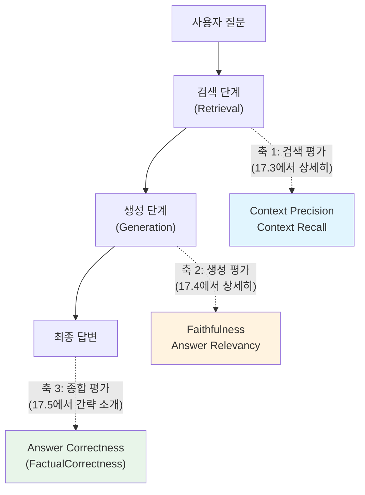
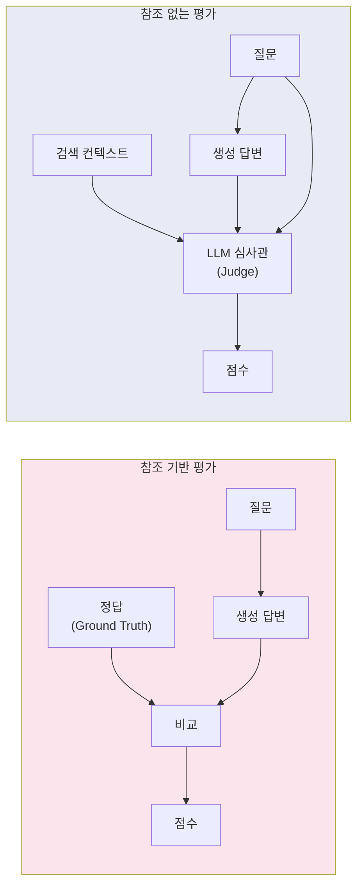
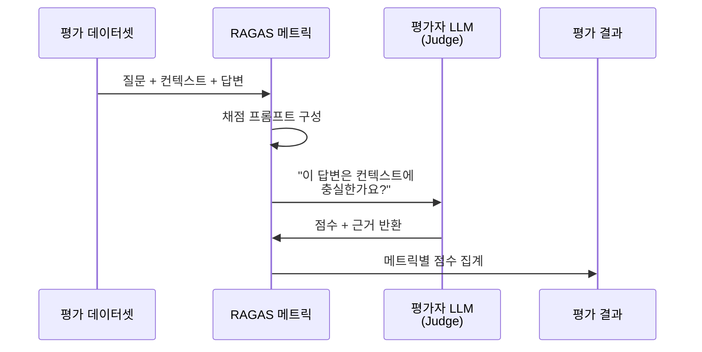
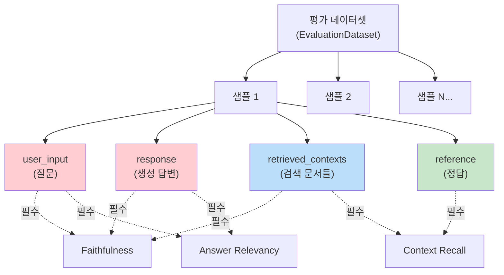

# RAG 평가란 — 무엇을 어떻게 측정할 것인가

> RAG 시스템의 품질을 체계적으로 측정하는 세 가지 축과 LLM-as-Judge 패러다임을 이해합니다.

## 개요

여러분은 지금까지 RAG 파이프라인을 설계하고, 검색 품질을 개선하고, 에이전틱 RAG까지 구현해 보았습니다. 그런데 한 가지 빠진 게 있죠 — **"내가 만든 RAG가 정말 잘 작동하는 걸까?"**라는 질문에 답하는 방법입니다. 이 섹션에서는 RAG 시스템의 성능을 **숫자로 측정하고 비교하는 방법론**을 배웁니다.

**선수 지식**: 기본 RAG 파이프라인의 구조와 동작 원리 ([Ch8. RAG 파이프라인 구축](08-기본-rag-파이프라인-구축-langchain으로-첫-rag-앱-만들기/01-langchain-v1-핵심-개념과-설정.md)에서 학습), 검색 품질 향상 기법 ([Ch10. 검색 품질 향상](10-검색-품질-향상-유사도-검색과-메타데이터-필터링/01-유사도-검색-심화-top-k와-임계값-최적화.md)), Faithfulness·Context Precision 등의 용어 ([Ch1. RAG 소개](01-rag-개요-llm의-한계와-rag의-필요성/01-llm의-한계-왜-외부-지식이-필요한가.md)에서 소개)
**학습 목표**:
- RAG 평가의 세 축(검색, 생성, 종합)이 왜 필요한지 이해한다
- 참조 기반(Reference-based) vs 참조 없는(Reference-free) 평가의 차이를 설명할 수 있다
- LLM-as-Judge 패러다임의 작동 원리와 장단점을 파악한다
- RAGAS 평가 데이터셋의 4가지 필드(`user_input`, `response`, `retrieved_contexts`, `reference`) 구조를 구성할 수 있다

## 왜 알아야 할까?

여러분이 요리 대회에 참가했다고 상상해 보세요. 맛있는 요리를 만들었는데, 심사위원 없이 "아마 맛있을 거야"라고 스스로 판단한다면 어떨까요? RAG 시스템도 마찬가지입니다.

실무에서 RAG를 운영하다 보면 이런 상황을 자주 만나게 됩니다:
- 청킹 전략을 바꿨는데, **정말로** 검색 품질이 좋아진 건지 확인해야 할 때
- 리랭커를 추가했는데, 비용 대비 효과가 있는지 **정량적으로** 비교해야 할 때
- 프로덕션에 배포한 RAG가 사용자에게 **할루시네이션 없는** 답변을 제공하는지 모니터링해야 할 때

평가 없는 RAG 개발은 **계기판 없이 비행기를 조종하는 것**과 같습니다. 이 챕터에서 배울 RAGAS 프레임워크는 그 계기판 역할을 해줍니다.

## 핵심 개념

### 개념 1: RAG 평가의 세 가지 축

> 💡 **비유**: RAG 평가는 레스토랑 평가와 비슷합니다. "좋은 재료를 골랐는가?"(검색 품질), "요리를 잘 했는가?"(생성 품질), "손님이 만족했는가?"(종합 품질) — 이 세 가지를 모두 봐야 레스토랑의 진짜 실력을 알 수 있죠.

RAG 시스템은 크게 **검색(Retrieval)**과 **생성(Generation)** 두 단계로 이루어져 있습니다. 따라서 평가도 이 두 단계를 각각, 그리고 함께 봐야 합니다.

> 📊 **그림 1**: RAG 평가의 세 가지 축 — 이 챕터에서는 축 1(검색 평가)과 축 2(생성 평가)를 집중적으로 다루고, 축 3(종합 평가)은 [17.5 통합 평가 실행](17-rag-평가-ragas-프레임워크로-시스템-성능-측정/05-자동화된-rag-평가-파이프라인-구축.md)에서 간략히 소개합니다.



**축 1 — 검색 평가 (Retrieval Evaluation)**
검색기가 질문에 관련된 문서를 **정확하게** 가져왔는지 봅니다.
- **Context Precision**: 검색된 문서 중 실제로 관련 있는 문서의 비율. "가져온 재료 중 쓸모 있는 게 얼마나 되나?"
- **Context Recall**: 답변에 필요한 정보가 검색된 문서에 얼마나 포함되어 있는지. "필요한 재료를 빠뜨리지 않았나?"

**축 2 — 생성 평가 (Generation Evaluation)**
LLM이 검색된 문서를 바탕으로 **충실하고 적절한** 답변을 생성했는지 봅니다.
- **Faithfulness(충실도)**: 답변의 모든 주장이 검색된 컨텍스트에서 근거를 찾을 수 있는지. "재료에 없는 걸 지어내지 않았나?"
- **Answer Relevancy(답변 관련성)**: 답변이 원래 질문에 얼마나 적합한지. "질문에 맞는 요리를 내놓았나?"

**축 3 — 종합 평가 (End-to-End Evaluation)**
검색과 생성을 합쳐서 최종 답변의 전체적인 품질을 봅니다.
- **Answer Correctness(FactualCorrectness)**: 생성된 답변이 정답(ground truth)과 얼마나 일치하는지
- 사용자 만족도, 응답 시간 등 비기능적 측면도 포함

축 1과 축 2가 각 단계의 품질을 독립적으로 측정한다면, 축 3은 파이프라인 전체를 관통하는 **최종 결과물의 정확도**를 측정합니다. 이 챕터에서는 축 1과 축 2를 [17.3](17-rag-평가-ragas-프레임워크로-시스템-성능-측정/03-ragas-검색-메트릭-context-precision과-recall.md)~[17.4](17-rag-평가-ragas-프레임워크로-시스템-성능-측정/04-평가-데이터셋-구축과-자동-생성.md)에서 깊이 있게 다루고, 축 3의 종합 평가 메트릭은 [17.5](17-rag-평가-ragas-프레임워크로-시스템-성능-측정/05-자동화된-rag-평가-파이프라인-구축.md)에서 `evaluate()` 통합 실행 시 `FactualCorrectness`(또는 `AnswerCorrectness`) 메트릭을 포함하여 간략히 소개합니다.

> ⚠️ **흔한 오해**: "Faithfulness가 높으면 좋은 RAG다"라고 생각하기 쉽지만, 검색된 컨텍스트 자체가 엉뚱하면 Faithfulness가 1.0이어도 **틀린 답변**이 나올 수 있습니다. 그래서 세 축을 **모두** 봐야 합니다.

### 개념 2: 참조 기반 vs 참조 없는 평가

> 💡 **비유**: 시험을 채점하는 두 가지 방법을 생각해 보세요. **모범답안(정답지)**과 비교해서 채점하는 방법이 있고, 모범답안 없이 **답안 자체의 논리성과 완성도**만 보고 채점하는 방법이 있습니다. RAG 평가에서도 이 두 가지 접근이 모두 쓰입니다.

**참조 기반 평가 (Reference-based)**
- 사람이 미리 작성한 **정답(ground truth/reference)**이 필요합니다
- 생성된 답변을 정답과 비교하여 점수를 매깁니다
- 대표 메트릭: Context Recall, Answer Correctness
- 장점: 객관적이고 신뢰도 높음
- 단점: 정답 데이터셋을 만드는 데 **시간과 비용**이 많이 듦

**참조 없는 평가 (Reference-free)**
- 정답 없이 **질문, 검색 컨텍스트, 생성 답변**만으로 평가합니다
- LLM이 답변의 충실도, 관련성 등을 자동으로 판단합니다
- 대표 메트릭: Faithfulness, Answer Relevancy, Context Precision
- 장점: 정답 없이도 **자동화된 평가** 가능
- 단점: LLM 판단에 의존하므로 **평가자 모델의 품질**에 영향받음

> 📊 **그림 2**: 참조 기반 vs 참조 없는 평가 비교



RAGAS 프레임워크의 강력한 점은 바로 **참조 없는 평가**를 주력으로 지원한다는 것입니다. 모든 메트릭에 정답이 필요한 게 아니기 때문에, 프로덕션 환경에서 실시간으로 품질을 모니터링하는 것이 가능해지죠.

### 개념 3: LLM-as-Judge 패러다임

> 💡 **비유**: 요리 대회에서 AI 심사위원을 도입한 것과 같습니다. 사람 심사위원처럼 완벽하진 않지만, **24시간 쉬지 않고** 수만 건의 답변을 일관된 기준으로 채점할 수 있다는 엄청난 장점이 있습니다.

LLM-as-Judge는 **강력한 LLM(예: GPT-4, Claude)을 평가자로 사용**하여 RAG 출력의 품질을 자동으로 판단하는 패러다임입니다. RAGAS를 비롯한 최신 RAG 평가 프레임워크들의 핵심 엔진이죠.

작동 원리는 이렇습니다:

1. 평가 대상(질문, 컨텍스트, 답변)을 **구조화된 프롬프트**에 넣습니다
2. 평가자 LLM이 미리 정의된 **채점 기준(rubric)**에 따라 점수를 매깁니다
3. 선택적으로 **근거(reasoning)**도 함께 출력합니다

> 📊 **그림 3**: LLM-as-Judge 동작 흐름



```run:python
# LLM-as-Judge의 핵심 아이디어를 의사 코드로 이해하기
evaluation_prompt = """
[질문]: 파이썬의 GIL이란 무엇인가요?

[검색된 컨텍스트]:
1. GIL(Global Interpreter Lock)은 CPython에서 한 번에 하나의 
   스레드만 파이썬 바이트코드를 실행하도록 제한하는 뮤텍스입니다.
2. GIL은 메모리 관리의 스레드 안전성을 보장합니다.

[생성된 답변]: 
GIL은 Global Interpreter Lock의 약자로, CPython에서 한 번에 
하나의 스레드만 실행되도록 하는 잠금 메커니즘입니다.

[평가 기준]: 답변의 모든 주장이 컨텍스트에서 근거를 찾을 수 있는가?
"""

# 실제 RAGAS에서는 이런 프롬프트를 자동으로 구성하고,
# LLM 응답을 파싱하여 0~1 사이 점수로 변환합니다.
faithfulness_score = 1.0  # 모든 주장이 컨텍스트에 근거함
print(f"Faithfulness 점수: {faithfulness_score}")
print(f"판정: 답변이 검색된 컨텍스트에 충실합니다.")
```

```output
Faithfulness 점수: 1.0
판정: 답변이 검색된 컨텍스트에 충실합니다.
```

> 🔥 **실무 팁**: LLM-as-Judge에서 평가자 모델의 품질이 중요합니다. 일반적으로 **평가 대상 모델보다 같거나 더 강력한 모델**을 평가자로 사용하는 것이 권장됩니다. 예를 들어 GPT-3.5로 생성한 답변을 GPT-4로 평가하는 식이죠.

### 개념 4: 평가 데이터셋의 구조

> 💡 **비유**: 시험지를 만든다고 생각해 보세요. 시험지에는 **문제**(질문), **모범답안**(참조), **학생이 참고한 교재 내용**(컨텍스트), **학생의 답안**(응답) — 이 네 가지가 필요합니다. RAGAS 평가 데이터셋도 정확히 이 네 가지로 구성됩니다.

RAGAS v0.4에서 평가 데이터셋은 `SingleTurnSample` 객체의 컬렉션으로 구성됩니다. 각 샘플에는 다음 네 가지 필드가 있습니다:

| 필드 | 설명 | 필수 여부 |
|------|------|-----------|
| `user_input` | 사용자의 질문 | 필수 |
| `response` | RAG가 생성한 답변 | 필수 |
| `retrieved_contexts` | 검색된 문서 목록 (`list[str]`) | 메트릭에 따라 |
| `reference` | 사람이 작성한 정답 (ground truth) | 메트릭에 따라 |

> 📊 **그림 4**: 평가 데이터셋 구조와 메트릭별 필수 필드



각 메트릭이 어떤 필드를 사용하는지 정리하면 이렇습니다:

| 메트릭 | user_input | response | retrieved_contexts | reference |
|--------|:----------:|:--------:|:------------------:|:---------:|
| Faithfulness | ✅ | ✅ | ✅ | - |
| Answer Relevancy | ✅ | ✅ | - | - |
| Context Precision | ✅ | - | ✅ | ✅ |
| Context Recall | ✅ | - | ✅ | ✅ |
| Answer Correctness | ✅ | ✅ | - | ✅ |

핵심은 이것입니다: **Faithfulness와 Answer Relevancy는 `reference`(정답) 없이도 측정할 수 있습니다.** 바로 이 점이 RAGAS가 프로덕션 환경에서도 활용 가능한 이유입니다.

```python
from ragas import SingleTurnSample, EvaluationDataset

# 하나의 평가 샘플 구성
sample = SingleTurnSample(
    user_input="RAG에서 청킹이 왜 중요한가요?",  # 사용자 질문
    
    response="청킹은 긴 문서를 작은 단위로 나누는 과정으로, "
             "검색 정확도와 LLM의 컨텍스트 윈도우 활용에 직접적으로 영향을 미칩니다.",  # RAG 답변
    
    retrieved_contexts=[  # 검색된 문서들
        "텍스트 청킹은 긴 문서를 검색에 적합한 작은 단위로 분할하는 과정이다.",
        "적절한 청크 크기는 검색 정확도와 LLM 컨텍스트 윈도우 활용에 영향을 준다.",
    ],
    
    reference="청킹은 문서를 작은 단위로 분할하는 과정으로, "
              "검색 품질과 LLM의 컨텍스트 윈도우 효율성에 핵심적인 역할을 한다.",  # 정답 (선택)
)

# 여러 샘플로 데이터셋 구성
dataset = EvaluationDataset(samples=[sample])
```

## 실습: 직접 해보기

실제 RAGAS 평가를 실행하기 전에, 먼저 평가 데이터셋을 직접 구성해 봅시다. 이 실습에서는 RAGAS의 핵심 데이터 구조를 이해하는 데 집중합니다.

```python
# 필요한 패키지 설치
# pip install ragas>=0.4.0

from ragas import SingleTurnSample, EvaluationDataset

# === 평가 데이터셋 구성 ===
# 실제 RAG 파이프라인의 입출력을 수집하여 구성합니다.

samples = [
    # 샘플 1: 정확한 답변 예시
    SingleTurnSample(
        user_input="벡터 데이터베이스란 무엇인가요?",
        response="벡터 데이터베이스는 고차원 벡터를 저장하고 "
                 "유사도 기반 검색을 효율적으로 수행하는 특수 데이터베이스입니다. "
                 "ChromaDB, FAISS, Pinecone 등이 대표적입니다.",
        retrieved_contexts=[
            "벡터 데이터베이스는 고차원 벡터 데이터를 저장하고 유사도 검색을 수행하는 특수 DB이다.",
            "대표적인 벡터 DB로는 ChromaDB, FAISS, Pinecone, Qdrant 등이 있다.",
        ],
        reference="벡터 데이터베이스는 고차원 벡터를 효율적으로 저장하고 "
                  "유사도 기반 검색을 수행하는 특수 데이터베이스이다.",
    ),
    
    # 샘플 2: 할루시네이션이 포함된 답변 예시
    SingleTurnSample(
        user_input="임베딩 모델의 차원 수는 보통 얼마인가요?",
        response="일반적으로 임베딩 모델은 768~3072 차원의 벡터를 생성합니다. "
                 "OpenAI의 text-embedding-3-large는 3072차원이며, "
                 "Google의 Gemini 임베딩은 10000차원입니다.",  # 마지막 문장은 부정확
        retrieved_contexts=[
            "OpenAI의 text-embedding-3-small은 1536차원, "
            "text-embedding-3-large는 3072차원 벡터를 생성한다.",
            "BERT 기반 모델은 일반적으로 768차원 벡터를 출력한다.",
        ],
        reference="임베딩 모델의 차원 수는 모델에 따라 다르며, "
                  "768차원(BERT 기반)부터 3072차원(OpenAI large)까지 다양하다.",
    ),
    
    # 샘플 3: 관련 없는 컨텍스트가 검색된 경우
    SingleTurnSample(
        user_input="RAG에서 리랭킹의 역할은 무엇인가요?",
        response="리랭킹은 초기 검색 결과를 Cross-Encoder 모델로 재채점하여 "
                 "가장 관련성 높은 문서를 상위로 올리는 과정입니다.",
        retrieved_contexts=[
            "리랭킹은 초기 검색 결과를 Cross-Encoder로 재채점하여 정렬하는 기법이다.",
            "BM25는 키워드 빈도 기반의 전통적 검색 알고리즘이다.",  # 관련성 낮음
            "LangChain은 LLM 애플리케이션 개발 프레임워크이다.",  # 관련성 낮음
        ],
        reference="리랭킹은 Bi-Encoder의 초기 검색 결과를 Cross-Encoder로 "
                  "재채점하여 검색 정확도를 높이는 기법이다.",
    ),
]

# 데이터셋 생성
eval_dataset = EvaluationDataset(samples=samples)
```

```run:python
# 데이터셋 구조 확인 (RAGAS 설치 없이 개념 이해용)
# 실제로는 위의 EvaluationDataset을 사용합니다.

dataset_preview = [
    {
        "user_input": "벡터 데이터베이스란 무엇인가요?",
        "response": "벡터 데이터베이스는 고차원 벡터를 저장하고...",
        "retrieved_contexts": ["벡터 DB는 고차원 벡터 데이터를...", "대표적인 벡터 DB로는..."],
        "reference": "벡터 데이터베이스는 고차원 벡터를...",
    },
    {
        "user_input": "임베딩 모델의 차원 수는?",
        "response": "일반적으로 768~3072 차원...(+ 할루시네이션)",
        "retrieved_contexts": ["text-embedding-3-small은 1536차원...", "BERT는 768차원..."],
        "reference": "768~3072차원까지 다양하다.",
    },
]

print(f"평가 데이터셋 크기: {len(dataset_preview)}개 샘플")
print(f"\n--- 샘플 1 ---")
for key, value in dataset_preview[0].items():
    if isinstance(value, list):
        print(f"  {key}: [{len(value)}개 문서]")
    else:
        print(f"  {key}: {value[:40]}...")

print(f"\n각 메트릭이 사용하는 필드:")
print(f"  Faithfulness     → user_input + response + retrieved_contexts")
print(f"  Answer Relevancy → user_input + response")
print(f"  Context Recall   → user_input + retrieved_contexts + reference")
```

```output
평가 데이터셋 크기: 2개 샘플

--- 샘플 1 ---
  user_input: 벡터 데이터베이스란 무엇인가요?...
  response: 벡터 데이터베이스는 고차원 벡터를 저장하고......
  retrieved_contexts: [2개 문서]
  reference: 벡터 데이터베이스는 고차원 벡터를......

각 메트릭이 사용하는 필드:
  Faithfulness     → user_input + response + retrieved_contexts
  Answer Relevancy → user_input + response
  Context Recall   → user_input + retrieved_contexts + reference
```

```run:python
# 메트릭별로 어떤 "질문"을 던지는지 직관적으로 이해하기
metrics_explained = {
    "Faithfulness": {
        "질문": "답변의 모든 주장이 컨텍스트에서 근거를 찾을 수 있는가?",
        "점수 범위": "0.0 ~ 1.0",
        "1.0 의미": "모든 주장이 컨텍스트에 근거함",
        "0.0 의미": "컨텍스트에 근거 없는 주장(할루시네이션)",
    },
    "Answer Relevancy": {
        "질문": "답변이 원래 질문에 적합한가?",
        "점수 범위": "0.0 ~ 1.0", 
        "1.0 의미": "질문에 완벽히 부합하는 답변",
        "0.0 의미": "질문과 무관한 답변",
    },
    "Context Precision": {
        "질문": "검색된 문서 중 관련 있는 문서가 상위에 있는가?",
        "점수 범위": "0.0 ~ 1.0",
        "1.0 의미": "관련 문서가 모두 상위에 위치",
        "0.0 의미": "관련 없는 문서만 검색됨",
    },
    "Context Recall": {
        "질문": "정답에 필요한 정보가 검색 결과에 포함되어 있는가?",
        "점수 범위": "0.0 ~ 1.0",
        "1.0 의미": "필요한 정보가 모두 검색됨",
        "0.0 의미": "필요한 정보가 전혀 검색되지 않음",
    },
}

for name, info in metrics_explained.items():
    print(f"📏 {name}")
    print(f"   → {info['질문']}")
    print(f"   → 점수: {info['점수 범위']} (1.0 = {info['1.0 의미']})")
    print()
```

```output
📏 Faithfulness
   → 답변의 모든 주장이 컨텍스트에서 근거를 찾을 수 있는가?
   → 점수: 0.0 ~ 1.0 (1.0 = 모든 주장이 컨텍스트에 근거함)

📏 Answer Relevancy
   → 답변이 원래 질문에 적합한가?
   → 점수: 0.0 ~ 1.0 (1.0 = 질문에 완벽히 부합하는 답변)

📏 Context Precision
   → 검색된 문서 중 관련 있는 문서가 상위에 있는가?
   → 점수: 0.0 ~ 1.0 (1.0 = 관련 문서가 모두 상위에 위치)

📏 Context Recall
   → 정답에 필요한 정보가 검색 결과에 포함되어 있는가?
   → 점수: 0.0 ~ 1.0 (1.0 = 필요한 정보가 모두 검색됨)
```

## 더 깊이 알아보기

### RAGAS의 탄생 — "정답 없이도 평가할 수 있다면?"

RAG 평가의 역사를 이해하려면 2023년 9월로 거슬러 올라가야 합니다. Shahul Es, Jithin James 등 인도 출신 연구자들이 한 가지 근본적인 질문을 던졌습니다: **"사람이 일일이 정답을 만들지 않아도 RAG를 평가할 수 있지 않을까?"**

그때까지 NLP 평가는 대부분 **참조 기반**이었습니다. BLEU, ROUGE 같은 메트릭은 모두 사람이 작성한 정답(reference)이 필요했죠. 하지만 RAG 시스템은 수만 건의 질문을 처리하는데, 각각에 정답을 다는 건 현실적으로 불가능했습니다.

RAGAS 팀은 발상을 뒤집었습니다. **"평가 대상인 LLM보다 더 강력한 LLM에게 평가를 맡기면 어떨까?"** 이것이 바로 LLM-as-Judge 패러다임의 시작이었고, 2023년 9월에 발표된 논문 [*"RAGAS: Automated Evaluation of Retrieval Augmented Generation"*](https://arxiv.org/abs/2309.15217)이 이 아이디어를 체계화했습니다.

이 논문은 EACL 2024에 채택되었고, RAGAS는 빠르게 RAG 평가의 사실상 표준(de facto standard)으로 자리 잡았습니다. 2025년 말 기준 v0.4에 이르면서 RAG뿐 아니라 에이전트 워크플로, SQL 생성 등 다양한 LLM 애플리케이션 평가로 범위를 넓혔습니다.

> 💡 **알고 계셨나요?**: "RAGAS"라는 이름은 **R**etrieval **A**ugmented **G**eneration **As**sessment의 약자인 동시에, 인도 고전 음악의 선율 체계인 "라가(Raga)"에서 영감을 받았다고 합니다. 여러 선율이 조화를 이루듯, 여러 메트릭이 조화롭게 RAG를 평가한다는 의미를 담고 있습니다.

### 전통적 평가에서 LLM-as-Judge로의 진화

RAG 이전의 전통적 NLP 평가 흐름을 간단히 짚어보면:

- **2002년 — BLEU**: 기계번역 평가를 위해 등장. n-gram 일치율 기반
- **2004년 — ROUGE**: 요약 평가용. 정답과의 겹침(recall) 측정
- **2015년 — BERTScore**: 임베딩 기반 의미 유사도로 진화
- **2023년 — RAGAS**: LLM을 평가자로 활용. 참조 없는 평가의 대중화
- **2024~2025년 — 다양한 LLM-as-Judge 프레임워크**: DeepEval, TruLens, Langfuse 등 생태계 확장

이 진화의 핵심은 **"토큰 매칭 → 의미 매칭 → 추론 기반 판단"**으로의 전환입니다. LLM-as-Judge는 단순히 단어가 겹치는지가 아니라, **논리적으로 맞는 답변인지** 추론할 수 있다는 점에서 혁신적입니다.

## 흔한 오해와 팁

> ⚠️ **흔한 오해**: "평가 데이터셋에는 반드시 정답(reference)이 필요하다"고 생각하기 쉽습니다. 하지만 RAGAS의 핵심 메트릭 중 **Faithfulness와 Answer Relevancy는 정답 없이도** 측정할 수 있습니다. 정답이 필요한 건 Context Recall과 Answer Correctness뿐입니다. 프로덕션 모니터링에서는 정답 없는 메트릭만으로도 충분히 유용합니다.

> 💡 **알고 계셨나요?**: RAGAS v0.4에서 기존의 `ground_truths`(리스트) 필드가 `reference`(단일 문자열)로 변경되었습니다. 또한 `evaluate()` 함수 대신 `@experiment()` 데코레이터 기반의 실험 워크플로가 도입되어, 평가 결과를 더 체계적으로 추적할 수 있게 되었습니다.

> 🔥 **실무 팁**: 평가 데이터셋은 **최소 50~100개 샘플**로 시작하는 것을 권장합니다. 샘플이 너무 적으면 통계적으로 의미 없는 점수가 나오고, 너무 많으면 LLM API 비용이 급증합니다. 다양한 질문 유형(사실 질문, 비교 질문, 추론 질문)을 골고루 포함하세요.

## 핵심 정리

| 개념 | 설명 |
|------|------|
| RAG 평가의 세 축 | 검색(Retrieval), 생성(Generation), 종합(End-to-End) 품질을 각각 측정 |
| 참조 기반 평가 | 사람이 작성한 정답(reference)과 비교. 정확하지만 비용이 큼 |
| 참조 없는 평가 | 정답 없이 LLM이 자동 판단. RAGAS의 핵심 강점 |
| LLM-as-Judge | 강력한 LLM을 평가자로 사용하는 패러다임. 자동화·확장성이 장점 |
| Faithfulness | 답변이 검색 컨텍스트에 충실한 정도 (참조 불필요) |
| Answer Relevancy | 답변이 질문에 적합한 정도 (참조 불필요) |
| Context Precision | 검색 결과 중 관련 문서의 비율 (참조 필요) |
| Context Recall | 필요한 정보가 검색 결과에 포함된 정도 (참조 필요) |
| Answer Correctness | 최종 답변이 정답과 일치하는 정도 (종합 평가, 17.5에서 소개) |
| SingleTurnSample | RAGAS v0.4의 평가 단위. `user_input`, `response`, `retrieved_contexts`, `reference` 필드 |
| EvaluationDataset | SingleTurnSample의 컬렉션. 평가 실행의 입력 |

## 다음 섹션 미리보기

이번 섹션에서 RAG 평가의 **큰 그림**과 핵심 개념을 이해했습니다. 다음 섹션 **"RAGAS 설치와 첫 평가 실행"**에서는 RAGAS를 실제로 설치하고, 우리가 구성한 평가 데이터셋으로 Faithfulness, Answer Relevancy 등의 메트릭을 **실제로 측정**해 봅니다. 오늘 배운 이론이 어떻게 코드로 연결되는지 직접 확인할 수 있습니다.

## 참고 자료

- [RAGAS 공식 문서 — Metrics 개념](https://docs.ragas.io/en/stable/concepts/metrics/) - RAGAS 메트릭의 정의, 계산 방식, 필수 필드를 공식 문서에서 확인
- [RAGAS 논문: Automated Evaluation of Retrieval Augmented Generation (arXiv)](https://arxiv.org/abs/2309.15217) - RAGAS의 이론적 토대. 참조 없는 평가의 동기와 메트릭 설계를 다룬 원본 논문
- [Retrieval-Augmented Generation for Large Language Models: A Survey (arXiv)](https://arxiv.org/abs/2312.10997) - RAG 전반에 대한 서베이 논문. 평가 방법론 섹션에서 다양한 접근법 비교
- [Evidently AI — A Complete Guide to RAG Evaluation](https://www.evidentlyai.com/llm-guide/rag-evaluation) - 세 축 기반 RAG 평가 방법론을 실무 관점에서 정리한 가이드
- [RAGAS v0.3→v0.4 마이그레이션 가이드](https://docs.ragas.io/en/stable/howtos/migrations/migrate_from_v03_to_v04/) - 최신 API 변경사항과 코드 예제

---
### 🔗 Related Sessions
- [hallucination](../01-rag-개요-llm의-한계와-rag의-필요성/01-llm의-한계-왜-외부-지식이-필요한가.md) (prerequisite)
- [embedding](../05-임베딩-모델-이해-텍스트를-벡터로-변환/01-임베딩의-기본-개념-단어에서-문장까지.md) (prerequisite)
- [reranking](../02-rag-아키텍처-핵심-컴포넌트와-파이프라인-구조/03-advanced-rag-검색-전후-최적화-전략.md) (prerequisite)
- [rag](../01-rag-개요-llm의-한계와-rag의-필요성/02-rag의-핵심-개념-검색-증강-생성이란.md) (prerequisite)
- [chunking](../04-텍스트-청킹-전략-문서-분할과-최적화/01-청킹의-중요성과-기본-원리.md) (prerequisite)
- [cross-encoder](../12-리랭킹으로-검색-정확도-높이기-cohere-rerank-활용/01-리랭킹의-원리-왜-초기-검색으로는-부족한가.md) (prerequisite)
