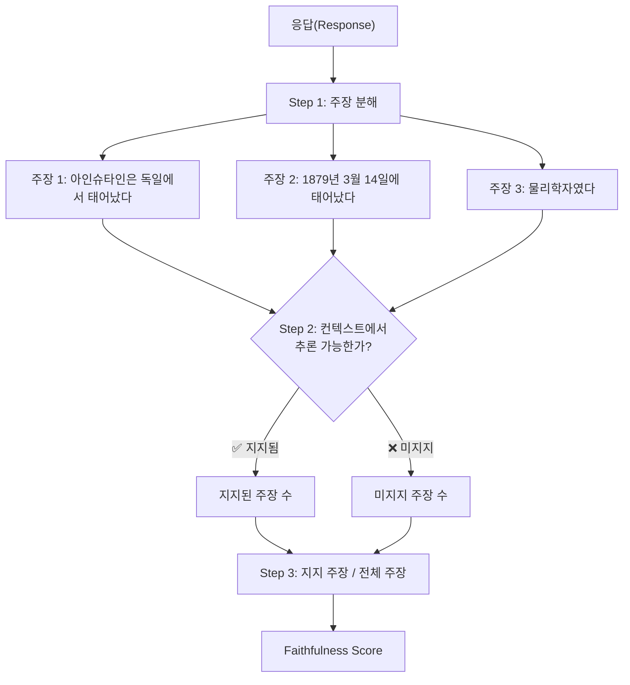
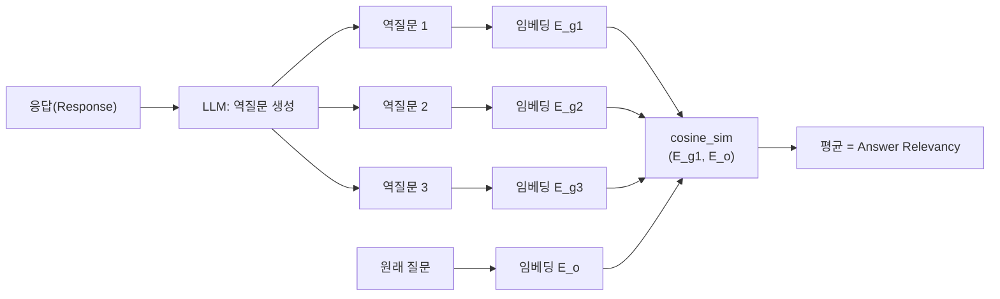
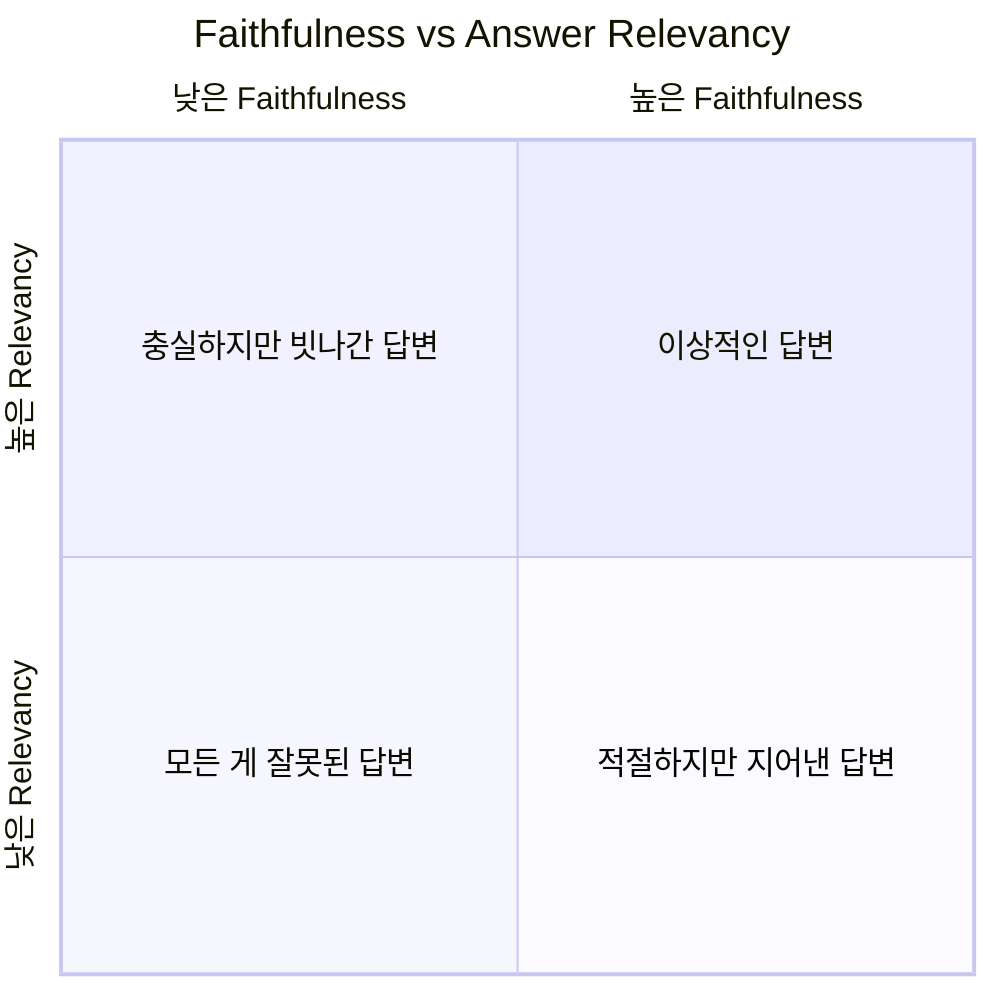
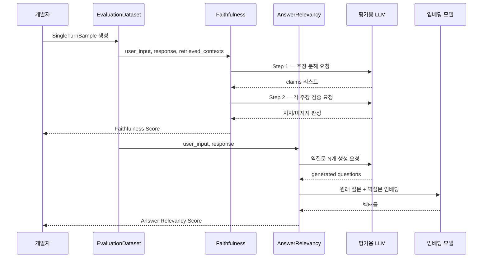

# RAGAS 핵심 메트릭 — Faithfulness와 Answer Relevancy

> RAG 시스템이 "거짓말하지 않는지", "질문에 맞게 대답하는지"를 수치로 측정하는 두 가지 핵심 메트릭을 마스터합니다.

## 개요

이 섹션에서는 RAGAS 프레임워크의 가장 중요한 두 메트릭인 **Faithfulness(충실도)**와 **Answer Relevancy(답변 관련성)**의 작동 원리를 깊이 있게 이해하고, 실제 Python 코드로 측정하는 방법을 학습합니다.

**선수 지식**: [17.1 RAG 평가란](17-rag-평가-ragas-프레임워크로-시스템-성능-측정/01-rag-평가란-무엇을-어떻게-측정할-것인가.md)에서 배운 RAG 평가의 세 축, SingleTurnSample과 EvaluationDataset 구조, LLM-as-Judge 패러다임

**학습 목표**:
- Faithfulness 메트릭의 주장 분해(Claim Decomposition) → NLI 검증 과정을 설명할 수 있다
- Answer Relevancy 메트릭의 역질문 생성 → 코사인 유사도 평균 계산 과정을 이해한다
- 두 메트릭의 수학적 공식을 해석하고, 점수 변화의 원인을 분석할 수 있다
- RAGAS를 설치하고 Python 코드로 실제 평가를 실행할 수 있다

## 왜 알아야 할까?

RAG 시스템을 만들었다고 끝이 아닙니다. "잘 동작하는 것 같다"는 느낌과 "Faithfulness 0.92, Answer Relevancy 0.87"이라는 수치 사이에는 큰 차이가 있거든요.

Faithfulness는 **할루시네이션 탐지기**입니다. 검색된 컨텍스트에 없는 내용을 LLM이 지어냈는지 잡아냅니다. Answer Relevancy는 **초점 검사기**입니다. 답변이 질문의 의도에서 벗어나지 않았는지 확인하죠. 이 두 메트릭만 제대로 이해해도 RAG 시스템의 가장 흔한 두 가지 실패 — "거짓말"과 "딴소리" — 를 정량적으로 포착할 수 있습니다.

## 핵심 개념

### 개념 1: Faithfulness — 답변이 컨텍스트에 충실한가?

> 💡 **비유**: Faithfulness는 **오픈북 시험의 채점 기준**과 같습니다. 시험 중에 교과서를 펼쳐놓고 답을 쓰는 오픈북 시험에서, 채점관은 "학생의 답안에 있는 모든 주장이 교과서에서 확인 가능한가?"를 검사합니다. 교과서(= retrieved_contexts)에 없는 내용을 학생(= LLM)이 적었다면? 그건 충실하지 못한 답변이죠.

Faithfulness는 **응답(response)이 검색된 컨텍스트(retrieved_contexts)에 얼마나 사실적으로 일치하는지** 측정합니다. 0에서 1 사이의 값을 가지며, 1에 가까울수록 모든 주장이 컨텍스트에 근거한 것입니다.

#### 측정 과정: 주장 분해 → NLI 검증

Faithfulness의 핵심 아이디어는 자연어 추론(Natural Language Inference, NLI)에서 왔습니다. NLI는 "전제(premise)가 주어졌을 때 가설(hypothesis)이 참인지 판단"하는 과제인데요, RAGAS는 이걸 이렇게 활용합니다:

**Step 1 — 주장 분해(Claim Decomposition)**: LLM이 응답을 개별 사실적 주장(claim)으로 쪼갭니다.

**Step 2 — 주장 검증(Claim Verification)**: 각 주장이 컨텍스트에서 추론 가능한지 LLM이 판단합니다.

**Step 3 — 점수 계산**: 지지되는 주장의 비율을 계산합니다.

> 📊 **그림 1**: Faithfulness 측정 과정 — 주장 분해부터 점수 계산까지



#### 수학적 정의

$$\text{Faithfulness} = \frac{|V|}{|S|}$$

- $|V|$: 컨텍스트에 의해 **지지되는(Verified)** 주장의 수
- $|S|$: 응답에서 추출한 **전체 주장(Statements)**의 수

예를 들어, 응답에서 주장 3개가 추출되었는데 그중 2개가 컨텍스트에서 확인된다면:

$$\text{Faithfulness} = \frac{2}{3} \approx 0.667$$

#### 구체적 예시

질문: "아인슈타인은 언제, 어디서 태어났나요?"

컨텍스트: *"알베르트 아인슈타인은 1879년 3월 14일 독일 울름에서 태어났다."*

| 응답 | 추출 주장 | 지지 여부 | 점수 |
|------|-----------|-----------|------|
| "아인슈타인은 독일에서 1879년 3월 14일에 태어났습니다" | ① 독일 출생 ② 3월 14일 | ✅✅ | **1.0** |
| "아인슈타인은 독일에서 1879년 3월 **20일**에 태어났습니다" | ① 독일 출생 ② 3월 20일 | ✅❌ | **0.5** |

두 번째 응답은 날짜를 잘못 말했기 때문에, 절반의 주장만 지지되어 0.5가 됩니다. 바로 이런 식으로 할루시네이션을 수치화하는 거죠.

### 개념 2: Answer Relevancy — 답변이 질문에 적합한가?

> 💡 **비유**: Answer Relevancy는 **면접관의 "질문에 답하세요" 평가**와 같습니다. 면접에서 "당신의 강점이 뭔가요?"라고 물었는데, 지원자가 "저는 서울에 살고 있고, 취미는 등산입니다"라고 답하면? 내용 자체는 사실일 수 있지만, 질문의 의도와 동떨어졌죠. Answer Relevancy는 바로 이 "초점"을 측정합니다.

Answer Relevancy는 **응답이 원래 질문의 의도에 얼마나 잘 부합하는지** 측정합니다. 사실 여부(Faithfulness)와는 독립적으로, 답변이 질문에 "맞는 답"인지를 평가하는 거죠.

#### 측정 과정: 역질문 생성 → 코사인 유사도

이 메트릭의 접근법이 정말 기발한데요 — **역질문(Reverse Question)** 방식을 사용합니다:

**Step 1 — 역질문 생성**: LLM이 응답만 보고 "이 답변에 대한 원래 질문은 뭐였을까?"를 역으로 추측하여 N개의 질문을 생성합니다 (기본 N=3).

**Step 2 — 임베딩 계산**: 원래 질문과 생성된 역질문들을 각각 임베딩합니다.

**Step 3 — 유사도 평균**: 원래 질문 임베딩과 각 역질문 임베딩의 코사인 유사도를 계산하고 평균냅니다.

> 📊 **그림 2**: Answer Relevancy 측정 과정 — 역질문 생성과 코사인 유사도



왜 이런 방식을 쓸까요? 핵심 직관은 이렇습니다: **좋은 답변을 보면 원래 질문을 정확히 복원할 수 있어야 한다**는 것입니다. 답변이 질문에서 벗어날수록, 역으로 생성한 질문도 원래 질문과 달라지겠죠.

#### 수학적 정의

$$\text{Answer Relevancy} = \frac{1}{N} \sum_{i=1}^{N} \text{cosine\_sim}(E_{g_i}, E_o) = \frac{1}{N} \sum_{i=1}^{N} \frac{E_{g_i} \cdot E_o}{\|E_{g_i}\| \|E_o\|}$$

- $E_{g_i}$: i번째 역생성 질문의 임베딩 벡터
- $E_o$: 원래 사용자 질문의 임베딩 벡터
- $N$: 생성할 역질문 수 (기본값 3)

코사인 유사도는 이론적으로 -1~1 범위이므로, Answer Relevancy도 엄밀히는 0~1이 보장되지 않습니다. 하지만 실제로는 거의 항상 0~1 범위에 들어옵니다.

#### 구체적 예시

질문: "파이썬에서 리스트를 정렬하는 방법은?"

| 응답 | 역질문 예시 | 유사도 | 점수 |
|------|------------|--------|------|
| "`sorted()` 함수나 `.sort()` 메서드를 사용합니다" | "파이썬 리스트 정렬 방법은?" | 높음 | **~0.95** |
| "파이썬은 1991년 귀도 반 로섬이 만들었습니다" | "파이썬의 역사는?" | 낮음 | **~0.35** |

두 번째 응답은 사실이지만, 질문과 전혀 관련없는 답이라 낮은 점수를 받습니다.

### 개념 3: 두 메트릭의 관계 — 독립적이지만 보완적

> 📊 **그림 3**: Faithfulness와 Answer Relevancy의 2×2 매트릭스



이 두 메트릭은 서로 다른 축을 측정합니다:

| 상황 | Faithfulness | Answer Relevancy | 진단 |
|------|-------------|------------------|------|
| 컨텍스트 기반 + 질문에 맞는 답 | 높음 | 높음 | 이상적 |
| 컨텍스트 기반이지만 질문과 무관 | 높음 | 낮음 | 검색은 좋지만 생성에 문제 |
| 질문에 맞지만 지어낸 내용 | 낮음 | 높음 | 할루시네이션 주의! |
| 질문과도 무관, 사실도 아닌 답 | 낮음 | 낮음 | 전면 재설계 필요 |

> ⚠️ **흔한 오해**: "Faithfulness가 높으면 좋은 답변이다"라고 생각하기 쉽지만, **Faithfulness가 1.0이어도 Answer Relevancy가 0.3일 수 있습니다**. 검색된 문서의 내용을 충실히 옮겼지만, 질문과 무관한 내용이라면요. 두 메트릭을 반드시 함께 봐야 합니다.

### 개념 4: RAGAS 설치와 기본 설정

RAGAS를 설치하고 평가를 위한 환경을 구성합니다. 이 챕터에서는 **ragas >= 0.2** 버전의 API를 기준으로 설명합니다.

```bash
# RAGAS 설치 (0.2 이상 버전 사용)
pip install "ragas>=0.2.0"

# OpenAI API 키 설정 (RAGAS의 LLM-as-Judge에 필요)
export OPENAI_API_KEY="your-api-key-here"
```

```python
# 필수 임포트 — RAGAS >= 0.2 메트릭 API
from ragas.metrics import Faithfulness, AnswerRelevancy
from ragas.llms import llm_factory
from openai import AsyncOpenAI

# LLM 설정 — 평가용 모델 (gpt-4o-mini 권장: 비용 효율적)
client = AsyncOpenAI()
evaluator_llm = llm_factory("gpt-4o-mini", client=client)
```

> 🔥 **실무 팁**: 평가용 LLM으로 `gpt-4o-mini`를 추천합니다. `gpt-4o` 대비 비용이 훨씬 저렴하면서도 주장 분해와 검증에 충분한 성능을 보여줍니다. 수천 건의 평가를 돌릴 때 비용 차이가 큽니다.

## 실습: 직접 해보기

실제 RAG 시나리오를 가정하여 Faithfulness와 Answer Relevancy를 측정해봅시다. 앞서 [17.1 RAG 평가란](17-rag-평가-ragas-프레임워크로-시스템-성능-측정/01-rag-평가란-무엇을-어떻게-측정할-것인가.md)에서 배운 SingleTurnSample 구조를 활용합니다.

### Step 1: 평가 데이터 준비

```python
from ragas.dataset_schema import SingleTurnSample, EvaluationDataset

# 시나리오: RAG 시스템에 "LangChain이 뭔가요?"라고 질문한 상황
sample_good = SingleTurnSample(
    user_input="LangChain이 뭔가요?",
    response="LangChain은 LLM을 활용한 애플리케이션 개발을 위한 오픈소스 프레임워크입니다. "
             "Harrison Chase가 2022년 10월에 처음 출시했으며, "
             "프롬프트 관리, 체인 구성, 메모리 관리 등의 기능을 제공합니다.",
    retrieved_contexts=[
        "LangChain은 대규모 언어 모델(LLM)을 활용한 애플리케이션을 쉽게 만들 수 있도록 돕는 "
        "오픈소스 프레임워크이다. Harrison Chase가 2022년 10월에 출시했다.",
        "LangChain의 주요 기능에는 프롬프트 관리, 체인(Chain) 구성, "
        "에이전트(Agent), 메모리 관리 등이 있다."
    ]
)

# 시나리오: 할루시네이션이 포함된 나쁜 응답
sample_bad = SingleTurnSample(
    user_input="LangChain이 뭔가요?",
    response="LangChain은 Google이 개발한 상용 AI 플랫폼으로, "
             "월 구독료가 99달러입니다. 2020년에 출시되었습니다.",
    retrieved_contexts=[
        "LangChain은 대규모 언어 모델(LLM)을 활용한 애플리케이션을 쉽게 만들 수 있도록 돕는 "
        "오픈소스 프레임워크이다. Harrison Chase가 2022년 10월에 출시했다.",
        "LangChain의 주요 기능에는 프롬프트 관리, 체인(Chain) 구성, "
        "에이전트(Agent), 메모리 관리 등이 있다."
    ]
)
```

### Step 2: Faithfulness 평가 실행

```python
import asyncio
from ragas.metrics import Faithfulness
from ragas.llms import llm_factory
from openai import AsyncOpenAI

# LLM 설정
client = AsyncOpenAI()
llm = llm_factory("gpt-4o-mini", client=client)

# Faithfulness 스코어러 생성
faithfulness_scorer = Faithfulness(llm=llm)

async def evaluate_faithfulness():
    # 좋은 응답 평가
    good_result = await faithfulness_scorer.ascore(
        user_input=sample_good.user_input,
        response=sample_good.response,
        retrieved_contexts=sample_good.retrieved_contexts
    )
    print(f"좋은 응답 Faithfulness: {good_result.value:.3f}")

    # 나쁜 응답 평가
    bad_result = await faithfulness_scorer.ascore(
        user_input=sample_bad.user_input,
        response=sample_bad.response,
        retrieved_contexts=sample_bad.retrieved_contexts
    )
    print(f"나쁜 응답 Faithfulness: {bad_result.value:.3f}")

asyncio.run(evaluate_faithfulness())
```

```output
좋은 응답 Faithfulness: 1.000
나쁜 응답 Faithfulness: 0.000
```

좋은 응답은 모든 주장이 컨텍스트에서 확인 가능하므로 1.0, 나쁜 응답은 "Google이 개발", "상용 플랫폼", "월 99달러", "2020년 출시" 등 모든 주장이 컨텍스트와 불일치하므로 0.0에 가까운 점수를 받습니다.

### Step 3: Answer Relevancy 평가 실행

```python
from ragas.metrics import AnswerRelevancy
from ragas.embeddings import embedding_factory

# 임베딩 모델도 필요 (역질문과 원래 질문의 유사도 계산용)
embeddings = embedding_factory("text-embedding-3-small", client=client)

# Answer Relevancy 스코어러 생성
relevancy_scorer = AnswerRelevancy(llm=llm, embeddings=embeddings)

# 질문에 맞는 답 vs 빗나간 답
sample_irrelevant = SingleTurnSample(
    user_input="LangChain이 뭔가요?",
    response="Python은 1991년 귀도 반 로섬이 개발한 프로그래밍 언어입니다. "
             "간결한 문법과 풍부한 생태계로 인기가 높습니다.",
    retrieved_contexts=[
        "Python은 1991년 귀도 반 로섬이 개발한 범용 프로그래밍 언어이다."
    ]
)

async def evaluate_relevancy():
    # 좋은 응답 — 질문에 맞는 답
    good_score = await relevancy_scorer.ascore(
        user_input=sample_good.user_input,
        response=sample_good.response
    )
    print(f"관련성 높은 응답 Relevancy: {good_score.value:.3f}")

    # 나쁜 응답 — 질문과 무관한 답
    irrelevant_score = await relevancy_scorer.ascore(
        user_input=sample_irrelevant.user_input,
        response=sample_irrelevant.response
    )
    print(f"관련성 낮은 응답 Relevancy: {irrelevant_score.value:.3f}")

asyncio.run(evaluate_relevancy())
```

```output
관련성 높은 응답 Relevancy: 0.921
관련성 낮은 응답 Relevancy: 0.347
```

### Step 4: 두 메트릭을 함께 평가하는 통합 코드

실무에서는 여러 메트릭을 한꺼번에 측정하는 것이 일반적입니다. RAGAS의 `evaluate()` 함수를 활용하면 데이터셋 전체를 한 번에 평가할 수 있습니다.

```run:python
# 통합 평가 결과 출력 예시
# (실제 실행 시 RAGAS evaluate() 사용, 여기서는 결과 구조 확인)
results = {
    "sample_1 (좋은 응답)": {"faithfulness": 1.000, "answer_relevancy": 0.921},
    "sample_2 (할루시네이션)": {"faithfulness": 0.000, "answer_relevancy": 0.412},
    "sample_3 (빗나간 답)": {"faithfulness": 0.833, "answer_relevancy": 0.347},
}

for name, scores in results.items():
    status = "✅" if scores["faithfulness"] > 0.7 and scores["answer_relevancy"] > 0.7 else "❌"
    print(f"{status} {name}")
    print(f"   Faithfulness: {scores['faithfulness']:.3f} | Relevancy: {scores['answer_relevancy']:.3f}")
```

```output
✅ sample_1 (좋은 응답)
   Faithfulness: 1.000 | Relevancy: 0.921
❌ sample_2 (할루시네이션)
   Faithfulness: 0.000 | Relevancy: 0.412
❌ sample_3 (빗나간 답)
   Faithfulness: 0.833 | Relevancy: 0.347
```

> 📊 **그림 4**: RAGAS 평가 실행 흐름 — 데이터 준비부터 결과 분석까지



## 더 깊이 알아보기

### RAGAS의 탄생 이야기

RAGAS 프레임워크는 2023년 9월, Shahul Es, Jithin James, Luis Espinosa-Anke, Steven Schockaert가 발표한 논문 *"RAGAS: Automated Evaluation of Retrieval Augmented Generation"* (arXiv:2309.15217)에서 시작되었습니다. 이 논문은 2024년 유럽 전산언어학 학회(EACL)에서 정식 발표되었죠.

흥미로운 건 이 프로젝트의 GitHub 조직 이름이 **"explodinggradients(폭발하는 그레디언트)"**라는 점입니다. 딥러닝에서 악명 높은 기울기 폭발(exploding gradient) 문제를 유머러스하게 이름으로 삼은 건데, "문제를 두려워하지 말고 정면으로 마주하자"는 의미가 아닐까 싶습니다.

RAGAS의 핵심 기여는 **참조 없는(reference-free) 평가**를 가능하게 한 것입니다. 기존에는 사람이 정답(ground truth)을 만들어야 평가를 할 수 있었는데, RAGAS는 LLM-as-Judge 패러다임으로 이 병목을 해소했습니다. 현재 AWS, Microsoft, Databricks 등에서 매월 500만 건 이상의 평가를 처리하며, Y Combinator Winter 2024 배치에 선정된 스타트업이 되었습니다.

### Faithfulness의 NLI 뿌리

Faithfulness 메트릭의 "주장 분해 → 검증" 접근법은 NLP의 오래된 과제인 **자연어 추론(Natural Language Inference)**에 뿌리를 두고 있습니다. NLI에서는 전제(premise)가 주어졌을 때 가설(hypothesis)이 "수반(entailment)", "모순(contradiction)", "중립(neutral)" 중 무엇인지를 판단합니다. RAGAS는 이 아이디어를 "컨텍스트(전제)가 주장(가설)을 수반하는가?"로 변환한 것이죠. 학문적으로는 수십 년 된 개념이지만, LLM을 NLI 판별기로 활용한 것이 RAGAS의 영리한 점입니다.

## 흔한 오해와 팁

> ⚠️ **흔한 오해**: "Faithfulness 1.0이면 완벽한 답변이다" — 아닙니다! Faithfulness는 **거짓이 없다**는 것만 보장하지, **빠진 정보가 없다**는 건 보장하지 않습니다. 컨텍스트에 10가지 중요 정보가 있는데 딱 하나만 말해도, 그 하나가 맞으면 Faithfulness는 1.0입니다. 정보의 완전성은 Answer Relevancy나 Context Recall로 보완해야 합니다.

> 💡 **알고 계셨나요?**: Answer Relevancy의 "역질문 생성" 아이디어는 교육학의 **역교수법(Reverse Teaching)**과 비슷합니다. 학생에게 "이 답을 보고 문제를 만들어봐"라고 하면, 학생이 내용을 제대로 이해했는지 알 수 있죠. RAGAS도 같은 논리입니다 — 좋은 답변이면 원래 질문을 정확하게 복원할 수 있어야 합니다.

> 🔥 **실무 팁**: 평가 비용을 절약하려면 **임계값 기반 알림**을 설정하세요. 모든 샘플을 매번 전수 평가하기보다, Faithfulness < 0.7 또는 Answer Relevancy < 0.6인 샘플만 상세 분석하는 방식이 효율적입니다. 프로덕션 환경에서는 무작위 샘플링(예: 전체의 10%)으로 주기적 모니터링을 하는 것도 좋습니다.

> 🔥 **실무 팁**: RAGAS의 API는 버전에 따라 변화가 있으니, 프로젝트 시작 시 `pip show ragas`로 설치된 버전을 확인하세요. 이 챕터에서는 `ragas >= 0.2` 기준으로 `ragas.metrics`에서 `Faithfulness`, `AnswerRelevancy` 등의 메트릭 클래스를 직접 임포트하는 방식을 사용합니다. 공식 문서의 마이그레이션 가이드를 참고하면 버전 간 차이를 빠르게 파악할 수 있습니다.

## 핵심 정리

| 개념 | 설명 |
|------|------|
| **Faithfulness** | 응답의 모든 주장이 검색된 컨텍스트에 의해 지지되는 비율. `지지 주장 수 / 전체 주장 수` |
| **주장 분해(Claim Decomposition)** | LLM이 응답을 개별 사실적 주장으로 분리하는 과정. Faithfulness의 첫 번째 단계 |
| **NLI 검증** | 자연어 추론 기반으로 각 주장이 컨텍스트에서 추론 가능한지 판단하는 과정 |
| **Answer Relevancy** | 응답에서 역생성한 질문들과 원래 질문의 코사인 유사도 평균. 답변의 초점 정확도 측정 |
| **역질문 생성** | 응답만 보고 "원래 질문이 뭐였을까?"를 LLM이 추측하는 방식. Answer Relevancy의 핵심 기법 |
| **두 메트릭의 관계** | 독립적이지만 보완적 — Faithfulness(사실성)와 Relevancy(적합성)를 함께 봐야 정확한 진단 가능 |
| **ragas.metrics API** | `ragas >= 0.2` 기준 API. `from ragas.metrics import Faithfulness, AnswerRelevancy`로 사용 |

## 다음 섹션 미리보기

Faithfulness와 Answer Relevancy가 **생성(Generation)** 품질을 평가하는 메트릭이었다면, 다음 섹션에서 다룰 **Context Precision과 Context Recall**은 **검색(Retrieval)** 품질을 측정하는 메트릭입니다. "올바른 문서를 가져왔는가?"와 "필요한 문서를 빠짐없이 가져왔는가?"를 어떻게 수치화하는지 알아보겠습니다.

## 참고 자료

- [RAGAS 공식 문서 — Faithfulness 메트릭](https://docs.ragas.io/en/stable/concepts/metrics/available_metrics/faithfulness/) - 주장 분해와 검증 과정의 공식 설명 및 최신 API 예제
- [RAGAS 공식 문서 — Response Relevancy 메트릭](https://docs.ragas.io/en/stable/concepts/metrics/available_metrics/answer_relevance/) - 역질문 생성 방식과 코사인 유사도 계산의 상세 문서
- [RAGAS 논문 (arXiv:2309.15217)](https://arxiv.org/abs/2309.15217) - Shahul Es et al., "RAGAS: Automated Evaluation of Retrieval Augmented Generation" — 프레임워크의 이론적 기반
- [RAGAS Quick Start 가이드](https://docs.ragas.io/en/stable/getstarted/quickstart/) - 설치부터 첫 평가 실행까지의 공식 튜토리얼
- [Langfuse — RAGAS를 활용한 RAG 파이프라인 평가](https://langfuse.com/guides/cookbook/evaluation_of_rag_with_ragas) - 프로덕션 환경에서 RAGAS를 통합하는 실전 가이드

---
### 🔗 Related Sessions
- [faithfulness](../17-rag-평가-ragas-프레임워크로-시스템-성능-측정/01-rag-평가란-무엇을-어떻게-측정할-것인가.md) (prerequisite)
- [answer relevancy](../17-rag-평가-ragas-프레임워크로-시스템-성능-측정/01-rag-평가란-무엇을-어떻게-측정할-것인가.md) (prerequisite)
- [singleturnsample](../17-rag-평가-ragas-프레임워크로-시스템-성능-측정/01-rag-평가란-무엇을-어떻게-측정할-것인가.md) (prerequisite)
- [evaluationdataset](../17-rag-평가-ragas-프레임워크로-시스템-성능-측정/01-rag-평가란-무엇을-어떻게-측정할-것인가.md) (prerequisite)
- [llm-as-judge](../17-rag-평가-ragas-프레임워크로-시스템-성능-측정/01-rag-평가란-무엇을-어떻게-측정할-것인가.md) (prerequisite)
