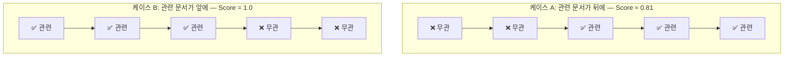
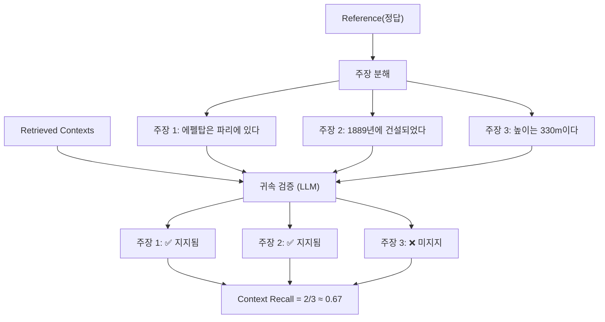
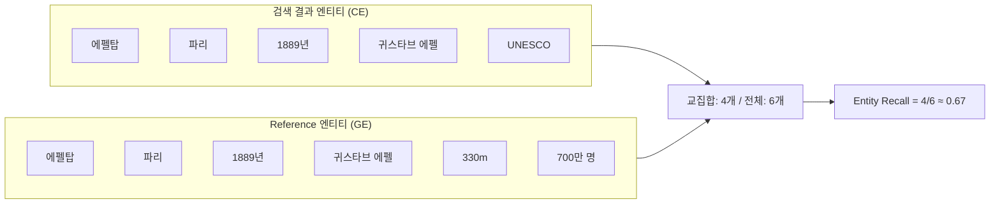
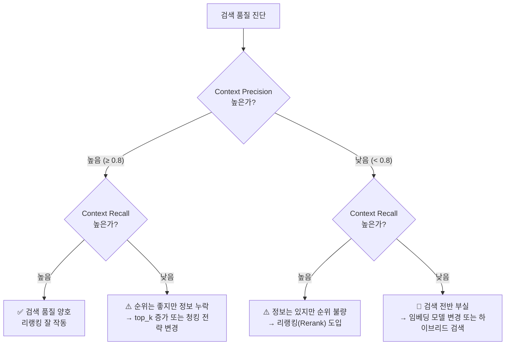

# RAGAS 검색 메트릭 — Context Precision과 Recall

> 검색된 문서가 정말 쓸모 있는지, 필요한 정보가 빠짐없이 검색되었는지를 수치로 측정하는 방법을 배웁니다.

## 개요

이 섹션에서는 RAG 시스템의 **검색 품질**을 측정하는 핵심 메트릭인 Context Precision과 Context Recall을 학습합니다. 앞서 [17.2: RAGAS 핵심 메트릭 — Faithfulness와 Answer Relevancy](17-2)에서 생성 품질을 평가하는 메트릭을 다뤘다면, 이번에는 그 생성의 **재료**가 되는 검색 결과 자체의 품질을 진단하는 도구를 배우는 거예요. 17.2에서 Faithfulness가 낮으면 LLM이 컨텍스트에 없는 내용을 지어냈다는 뜻이라고 배웠는데요, 사실 그 근본 원인이 **검색 품질 부실**에 있는 경우가 많습니다 — 이번 세션의 메트릭으로 바로 그 원인을 진단할 수 있습니다.

**선수 지식**:
- [17.1](17-1)에서 배운 RAGAS 평가 데이터셋 구조(`SingleTurnSample`의 4가지 필드)
- [17.2](17-2)에서 배운 Faithfulness, Answer Relevancy 메트릭과 `ascore()` 사용법
- 정보 검색의 기본 개념(Precision, Recall)

**학습 목표**:
- Context Precision이 검색 결과의 **순위 품질**을 어떻게 측정하는지 이해한다
- Context Recall이 **정보 누락**을 어떻게 감지하는지 이해한다
- Context Entities Recall로 **엔티티 기반 검색 품질**을 진단할 수 있다
- 검색 메트릭 결과를 해석하여 리트리버 성능을 개선하는 방향을 도출할 수 있다

## 왜 알아야 할까?

RAG 시스템에서 답변 품질이 떨어질 때, 문제의 원인은 크게 두 가지입니다. LLM이 답변을 잘못 생성했거나, **애초에 검색된 문서가 부실했거나**. 실무에서 RAG를 운영해보면, 놀랍게도 대부분의 문제는 후자에서 옵니다.

아무리 뛰어난 LLM이라도 관련 없는 문서를 받으면 좋은 답변을 만들 수 없죠. 마치 시험에서 아무리 머리가 좋아도 **교과서가 잘못된 과목 것이면** 좋은 성적을 받을 수 없는 것과 같습니다.

[17.2](17-2)에서 배운 Faithfulness가 낮다면? 검색된 문서에 없는 내용을 LLM이 지어냈다는 뜻이지만, 한 발 더 나아가 "왜 LLM이 지어내야 했는가?"를 파고들면 **검색이 필요한 정보를 가져오지 못했기 때문**인 경우가 많습니다. 즉, Faithfulness가 낮을 때 생성 모델의 문제만 의심할 게 아니라, **검색 품질도 함께 의심해야** 합니다. Context Precision과 Recall은 바로 이 근본 원인을 수치화하는 도구입니다.

## 핵심 개념

### 개념 1: Context Precision — 검색 결과의 정밀도와 순위

> 💡 **비유**: 도서관에서 사서에게 "한국 전쟁에 대한 책"을 요청했다고 해보세요. 사서가 10권을 가져왔는데, 관련 있는 책이 8, 9, 10번째에 몰려있고 1~7번째는 전혀 다른 주제의 책이라면요? 총 관련 도서 비율은 나쁘지 않지만, **맨 위에 있는 책부터 쓸모가 있어야** 효율적이잖아요. Context Precision은 "관련 문서가 검색 결과의 **앞쪽에 잘 배치되었는가**"를 측정합니다.

Context Precision은 검색된 문서들 중 **관련 있는 문서가 상위에 랭킹되었는지**를 평가하는 메트릭입니다. 단순히 관련 문서의 비율만 보는 것이 아니라, **순서(ranking)**까지 고려하는 것이 핵심이에요.

#### 수학적 정의

$$\text{Context Precision@K} = \frac{\sum_{k=1}^{K} \left( \text{Precision@k} \times v_k \right)}{\text{관련 문서의 총 수}}$$

여기서:
- $K$: 검색된 문서의 총 수
- $v_k$: $k$번째 문서의 관련성 지표 (관련 있으면 1, 없으면 0)
- $\text{Precision@k}$: 상위 $k$개 문서 중 관련 문서의 비율

이게 의미하는 바는, 관련 문서가 1번 위치에 있으면 높은 점수를, 맨 뒤에 있으면 낮은 점수를 부여한다는 것입니다. 같은 수의 관련 문서라도 **배치 순서에 따라 점수가 달라지는** 거죠.

#### 구체적 예시로 이해하기

검색 결과 5개가 있고, 관련성이 `[1, 0, 1, 1, 0]`이라고 합시다 (1=관련, 0=무관):

| 위치(k) | 관련성($v_k$) | Precision@k | $v_k \times$ Precision@k |
|---------|-------------|-------------|------------------------|
| 1 | 1 | 1/1 = 1.0 | 1.0 |
| 2 | 0 | 1/2 = 0.5 | 0.0 |
| 3 | 1 | 2/3 = 0.67 | 0.67 |
| 4 | 1 | 3/4 = 0.75 | 0.75 |
| 5 | 0 | 3/5 = 0.6 | 0.0 |

$$\text{Context Precision} = \frac{1.0 + 0.0 + 0.67 + 0.75 + 0.0}{3} = \frac{2.42}{3} \approx 0.806$$

만약 같은 관련 문서 3개가 `[1, 1, 1, 0, 0]` 순서로 배치되었다면?

$$\text{Context Precision} = \frac{1.0 + 1.0 + 1.0}{3} = 1.0$$

순서만 바꿨을 뿐인데 점수가 **0.806에서 1.0**으로 올라갑니다. 이것이 Context Precision이 **순위 품질**에 민감한 메트릭인 이유입니다.

> 📊 **그림 1**: Context Precision의 랭킹 민감도 — 같은 관련 문서라도 순서에 따라 점수가 달라진다



#### RAGAS의 두 가지 구현 방식

RAGAS는 Context Precision을 측정하는 두 가지 접근법을 제공합니다:

| 방식 | 클래스 | 동작 방식 | 장단점 |
|------|--------|----------|--------|
| **LLM 기반** | `LLMContextPrecisionWithReference` | LLM이 각 문서와 reference를 비교하여 관련성 판단 | 의미 이해 우수, LLM 비용 발생 |
| **비-LLM 기반** | `NonLLMContextPrecisionWithReference` | 문자열 유사도(Levenshtein 등)로 관련성 판단 | 비용 없음, 의미 이해 제한적 |

기본적으로 `ContextPrecision`은 LLM 기반 구현을 사용합니다. 비용이 걱정된다면 `NonLLMContextPrecisionWithReference`를 선택할 수 있지만, 의미적 판단이 필요한 경우에는 LLM 기반이 훨씬 정확합니다.

#### 코드로 측정하기

```python
from openai import AsyncOpenAI
from ragas.llms import llm_factory
from ragas.metrics.collections import ContextPrecision

# LLM 설정
client = AsyncOpenAI()
llm = llm_factory("gpt-4o-mini", client=client)

# Context Precision 스코어러 생성
scorer = ContextPrecision(llm=llm)

# 관련 문서가 앞에 있는 경우
result_good = await scorer.ascore(
    user_input="에펠탑은 어디에 있나요?",
    retrieved_contexts=[
        "에펠탑은 프랑스 파리의 샹드마르스 공원에 위치한 철탑입니다.",  # 관련 ✅
        "에펠탑은 1889년 만국박람회를 위해 건설되었습니다.",           # 관련 ✅
        "루브르 박물관은 파리에 있는 세계 최대의 미술관입니다.",         # 무관 ❌
    ],
    reference="에펠탑은 프랑스 파리에 위치해 있습니다."
)
print(f"Good ranking: {result_good}")  # 높은 점수 기대
```

> ⚠️ **흔한 오해**: Context Precision은 "관련 문서가 몇 개인가"만 보는 것이 아닙니다. **순서**가 핵심입니다. 관련 문서 비율이 같아도 1번 위치에 무관한 문서가 있으면 점수가 크게 떨어집니다.

### 개념 2: Context Recall — 필요한 정보가 빠짐없이 검색되었는가

> 💡 **비유**: 이번엔 시험 공부를 생각해보세요. 선생님이 "이 5가지 개념을 모두 알아야 만점"이라고 했는데, 여러분의 노트에 3가지만 적혀있다면? 아무리 그 3가지를 완벽하게 공부해도 만점은 불가능합니다. Context Recall은 "정답에 필요한 정보가 검색 결과에 **얼마나 빠짐없이** 포함되어 있는가"를 측정합니다.

Context Recall은 reference(정답)에 담긴 정보가 검색된 문서들에 얼마나 포함되어 있는지를 평가합니다. 이 메트릭이 낮다면, 리트리버가 **중요한 정보를 놓치고** 있다는 뜻이에요.

#### 작동 원리: 주장 분해 → 귀속 검증

Context Recall의 LLM 기반 구현은 [17.2](17-2)에서 배운 Faithfulness와 비슷한 방식으로 동작합니다:

1. **주장 분해(Claim Decomposition)**: reference(정답)를 개별 주장(claim)으로 분해
2. **귀속 검증(Attribution Check)**: 각 주장이 검색된 문서에서 뒷받침되는지 LLM이 판단
3. **비율 계산**: 뒷받침되는 주장의 비율이 Context Recall 점수

> 📊 **그림 2**: Context Recall의 작동 흐름 — Reference를 주장으로 분해하고 검색 결과에서 뒷받침 여부를 확인



#### 수학적 정의

$$\text{Context Recall} = \frac{|\text{검색 문서에서 지지되는 주장}|}{|\text{reference의 전체 주장}|}$$

점수 범위는 0~1이며, 1.0이면 정답에 필요한 모든 정보가 검색 결과에 포함되어 있다는 뜻입니다.

#### 세 가지 구현 방식

RAGAS는 Context Recall을 위한 세 가지 접근법을 제공합니다:

```python
from ragas.metrics.collections import ContextRecall              # LLM 기반 (기본)
from ragas.metrics.collections import NonLLMContextRecall         # 문자열 비교 기반
# ID 기반은 retrieved_context_ids / reference_context_ids 필드 사용
```

| 방식 | 필요 필드 | 특징 |
|------|----------|------|
| **LLM 기반** | `user_input`, `retrieved_contexts`, `reference` | 의미적 주장 분석, 가장 정확 |
| **비-LLM 기반** | `retrieved_contexts`, `reference_contexts` | 문자열 유사도, 비용 없음 |
| **ID 기반** | `retrieved_context_ids`, `reference_context_ids` | 문서 ID 비교, 가장 빠름 |

#### 코드로 측정하기

```python
from openai import AsyncOpenAI
from ragas.llms import llm_factory
from ragas.metrics.collections import ContextRecall

# LLM 설정
client = AsyncOpenAI()
llm = llm_factory("gpt-4o-mini", client=client)

# Context Recall 스코어러 생성
scorer = ContextRecall(llm=llm)

# 정보가 일부 누락된 경우
result = await scorer.ascore(
    user_input="에펠탑에 대해 알려주세요.",
    retrieved_contexts=[
        "에펠탑은 프랑스 파리에 위치한 철탑으로, 1889년 만국박람회를 위해 건설되었습니다.",
        "에펠탑의 설계자는 귀스타브 에펠입니다.",
    ],
    reference="에펠탑은 프랑스 파리에 있는 330m 높이의 철탑으로, 1889년 만국박람회를 위해 "
              "귀스타브 에펠이 설계했습니다. 매년 약 700만 명이 방문합니다."
)
print(f"Context Recall: {result}")
# reference에 "700만 명 방문"이 있지만 검색 결과에는 없으므로 1.0보다 낮을 것
```

> 🔥 **실무 팁**: Context Recall이 낮다면 리트리버의 **검색 범위**를 넓혀야 합니다. `top_k`를 늘리거나, 청킹 전략을 바꾸거나, 임베딩 모델을 교체([Ch5](5))하거나, 하이브리드 검색([Ch11](11))을 도입하는 것이 효과적입니다.

### 개념 3: Context Entities Recall — 핵심 엔티티가 빠지지 않았는가

> 💡 **비유**: 역사 시험에서 "임진왜란"에 대해 답할 때, "이순신", "1592년", "한산도 대첩" 같은 **핵심 키워드(엔티티)**를 반드시 언급해야 하잖아요. Context Entities Recall은 검색 결과에 이런 핵심 엔티티가 얼마나 포함되어 있는지를 측정합니다.

일반적인 Context Recall이 "의미적 주장" 단위로 평가한다면, Context Entities Recall은 **고유명사, 날짜, 장소** 등 구체적인 엔티티에 초점을 맞춥니다. 사실 기반(fact-based) 질문에 특히 유용한 메트릭이에요.

#### 수학적 정의

$$\text{Context Entity Recall} = \frac{|CE \cap GE|}{|GE|}$$

- $CE$: 검색된 문서에서 추출한 엔티티 집합
- $GE$: reference에서 추출한 엔티티 집합

#### 언제 쓰면 좋을까?

Context Entities Recall은 다음과 같은 시나리오에서 특히 빛을 발합니다:

- **관광 안내 봇**: "경복궁", "조선 왕조", "1395년" 같은 엔티티가 모두 검색되었는지
- **역사 Q&A**: 인물, 날짜, 장소가 빠짐없이 포함되었는지
- **의료/법률 도메인**: 특정 약품명, 법률 조항 번호 등이 정확히 검색되었는지

> 📊 **그림 3**: Context Entities Recall — 엔티티 집합 비교를 통한 검색 품질 측정



#### 코드로 측정하기

```python
from openai import AsyncOpenAI
from ragas.llms import llm_factory
from ragas.metrics.collections import ContextEntityRecall

# LLM 설정
client = AsyncOpenAI()
llm = llm_factory("gpt-4o-mini", client=client)

# Context Entities Recall 스코어러 생성
scorer = ContextEntityRecall(llm=llm)

# 일부 엔티티가 누락된 경우
result = await scorer.ascore(
    reference="에펠탑은 프랑스 파리에 있는 330m 높이의 철탑으로, "
              "1889년 귀스타브 에펠이 설계했습니다.",
    retrieved_contexts=[
        "에펠탑은 파리의 상징적인 건축물입니다.",
        "이 철탑은 1889년 만국박람회를 위해 건설되었습니다.",
    ]
)
print(f"Context Entity Recall: {result}")
# "330m", "귀스타브 에펠"이 검색 결과에 명시적으로 없을 수 있어 1.0보다 낮을 것
```

### 개념 4: 세 메트릭의 관계 — 검색 품질 진단 매트릭스

Context Precision, Context Recall, Context Entities Recall은 각각 검색 품질의 **다른 측면**을 진단합니다. 이 세 메트릭을 조합하면 리트리버의 문제를 정확히 짚어낼 수 있어요.

> 📊 **그림 4**: 검색 메트릭 조합으로 리트리버 문제를 진단하는 의사결정 트리



| Precision | Recall | 진단 | 처방 |
|-----------|--------|------|------|
| 높음 | 높음 | 검색 품질 우수 | 생성 품질 메트릭에 집중 |
| 높음 | 낮음 | 순위는 좋지만 정보 누락 | `top_k` 증가, 청킹 전략 변경 |
| 낮음 | 높음 | 정보는 있지만 순위 불량 | 리랭킹([Ch12](12)) 도입 |
| 낮음 | 낮음 | 검색 전반 부실 | 임베딩 모델([Ch5](5)) 변경, 하이브리드 검색([Ch11](11)) |

## 실습: 직접 해보기

이제 세 가지 검색 메트릭을 **하나의 파이프라인**으로 묶어 리트리버 성능을 종합 진단해봅시다. [17.2](17-2)에서 배운 `ascore()` 패턴을 활용합니다.

```python
import asyncio
from openai import AsyncOpenAI
from ragas.llms import llm_factory
from ragas.metrics.collections import (
    ContextPrecision,
    ContextRecall,
    ContextEntityRecall,
)


async def evaluate_retrieval_quality():
    """검색 품질을 종합 평가하는 함수"""
    
    # 1. LLM 설정
    client = AsyncOpenAI()  # OPENAI_API_KEY 환경변수 필요
    llm = llm_factory("gpt-4o-mini", client=client)
    
    # 2. 스코어러 생성
    precision_scorer = ContextPrecision(llm=llm)
    recall_scorer = ContextRecall(llm=llm)
    entity_recall_scorer = ContextEntityRecall(llm=llm)
    
    # 3. 평가 데이터 준비
    user_input = "대한민국의 수도와 인구는 얼마인가요?"
    
    # 검색된 문서들 (순서 중요!)
    retrieved_contexts = [
        "서울은 대한민국의 수도이며, 한반도 중서부에 위치합니다.",           # 관련 ✅
        "대한민국의 총 인구는 약 5,100만 명이며, 서울 인구는 약 950만 명입니다.",  # 관련 ✅
        "대한민국은 1948년 8월 15일에 정부를 수립했습니다.",                # 부분 관련
        "김치는 한국의 대표적인 발효 음식입니다.",                         # 무관 ❌
    ]
    
    # 정답 (reference)
    reference = (
        "대한민국의 수도는 서울이며, 총 인구는 약 5,100만 명입니다. "
        "서울의 인구는 약 950만 명으로, 대한민국 전체 인구의 약 18%를 차지합니다."
    )
    
    # 4. 세 가지 메트릭 동시 평가
    precision, recall, entity_recall = await asyncio.gather(
        precision_scorer.ascore(
            user_input=user_input,
            retrieved_contexts=retrieved_contexts,
            reference=reference,
        ),
        recall_scorer.ascore(
            user_input=user_input,
            retrieved_contexts=retrieved_contexts,
            reference=reference,
        ),
        entity_recall_scorer.ascore(
            reference=reference,
            retrieved_contexts=retrieved_contexts,
        ),
    )
    
    # 5. 결과 출력 및 진단
    print("=" * 50)
    print("📊 검색 품질 종합 평가 결과")
    print("=" * 50)
    print(f"Context Precision:      {precision:.4f}")
    print(f"Context Recall:         {recall:.4f}")
    print(f"Context Entity Recall:  {entity_recall:.4f}")
    print("-" * 50)
    
    # 자동 진단 로직
    if precision >= 0.8 and recall >= 0.8:
        print("✅ 진단: 검색 품질 양호!")
    elif precision >= 0.8 and recall < 0.8:
        print("⚠️ 진단: 순위는 좋지만 정보 누락 → top_k 증가 권장")
    elif precision < 0.8 and recall >= 0.8:
        print("⚠️ 진단: 정보는 있지만 순위 불량 → 리랭킹 도입 권장")
    else:
        print("🔴 진단: 검색 전반 부실 → 임베딩/청킹 전략 재검토 필요")


# 실행
asyncio.run(evaluate_retrieval_quality())
```

```run:python
# 위 코드의 예상 출력 (실제 LLM 판단에 따라 약간 달라질 수 있음)
print("=" * 50)
print("📊 검색 품질 종합 평가 결과")
print("=" * 50)
print(f"Context Precision:      {0.9167:.4f}")
print(f"Context Recall:         {0.8333:.4f}")
print(f"Context Entity Recall:  {0.8000:.4f}")
print("-" * 50)
print("✅ 진단: 검색 품질 양호!")
```

```output
==================================================
📊 검색 품질 종합 평가 결과
==================================================
Context Precision:      0.9167
Context Recall:         0.8333
Context Entity Recall:  0.8000
--------------------------------------------------
✅ 진단: 검색 품질 양호!
```

이제 여러 쿼리에 대해 **배치 평가**를 수행하고 결과를 비교해봅시다:

```python
import asyncio
from openai import AsyncOpenAI
from ragas.llms import llm_factory
from ragas.metrics.collections import ContextPrecision, ContextRecall


async def batch_evaluate_retriever():
    """여러 샘플로 리트리버를 배치 평가"""
    
    client = AsyncOpenAI()
    llm = llm_factory("gpt-4o-mini", client=client)
    
    precision_scorer = ContextPrecision(llm=llm)
    recall_scorer = ContextRecall(llm=llm)
    
    # 평가 데이터셋 (실무에서는 20~50개 이상 권장)
    eval_samples = [
        {
            "user_input": "파이썬의 GIL이란 무엇인가요?",
            "retrieved_contexts": [
                "GIL(Global Interpreter Lock)은 파이썬에서 한 번에 하나의 스레드만 "
                "바이트코드를 실행하도록 제한하는 뮤텍스입니다.",
                "파이썬 3.13부터 실험적으로 GIL을 비활성화할 수 있는 빌드 옵션이 추가되었습니다.",
            ],
            "reference": "GIL은 CPython의 Global Interpreter Lock으로, 멀티스레드 환경에서 "
                        "한 번에 하나의 스레드만 파이썬 바이트코드를 실행하게 합니다.",
        },
        {
            "user_input": "도커와 쿠버네티스의 차이점은?",
            "retrieved_contexts": [
                "쿠버네티스는 컨테이너 오케스트레이션 플랫폼입니다.",
                "리눅스 커널의 cgroups와 namespaces가 컨테이너의 핵심 기술입니다.",
            ],
            "reference": "도커는 컨테이너를 생성·실행하는 런타임이고, 쿠버네티스는 다수의 "
                        "컨테이너를 자동 배포·스케일링·관리하는 오케스트레이션 플랫폼입니다.",
        },
    ]
    
    # 각 샘플별 평가
    results = []
    for i, sample in enumerate(eval_samples):
        p, r = await asyncio.gather(
            precision_scorer.ascore(**sample),
            recall_scorer.ascore(**sample),
        )
        results.append({"query": sample["user_input"][:30], "precision": p, "recall": r})
        print(f"[샘플 {i+1}] Precision: {p:.3f} | Recall: {r:.3f} | {sample['user_input'][:30]}")
    
    # 평균 계산
    avg_p = sum(r["precision"] for r in results) / len(results)
    avg_r = sum(r["recall"] for r in results) / len(results)
    print(f"\n📊 평균 — Precision: {avg_p:.3f} | Recall: {avg_r:.3f}")


asyncio.run(batch_evaluate_retriever())
```

## 더 깊이 알아보기

### Precision과 Recall의 기원 — 정보 검색의 아버지들

Precision(정밀도)과 Recall(재현율)이라는 개념은 RAG나 LLM보다 훨씬 오래된 역사를 가지고 있습니다. 이 개념은 **1950년대 도서관학**에서 처음 등장했어요.

1955년, 미국 Western Reserve University의 **Allen Kent**와 동료들이 기계식 문서 검색 시스템을 평가하면서 "검색된 문서 중 관련 있는 비율(Precision)"과 "관련 문서 중 검색된 비율(Recall)"이라는 두 축을 정립했습니다. 당시에는 펀치카드로 문서를 분류하던 시대였죠!

1960년대에 **Cyril Cleverdon**이 영국 Cranfield University에서 수행한 유명한 "Cranfield 실험"이 이 메트릭들을 정보 검색의 표준 평가 체계로 확립했습니다. 흥미로운 점은, Cleverdon이 원래 항공공학 도서관의 사서였다는 것입니다. 비행기 설계 문서를 효율적으로 검색하려는 실용적 필요에서 정보 검색 연구의 초석이 놓인 셈이에요.

RAGAS의 Context Precision이 단순 비율이 아닌 **순위 기반(ranked)**으로 설계된 것도 이 전통에서 비롯됩니다. 검색 엔진 평가에서 널리 쓰이는 **MAP(Mean Average Precision)**과 수학적으로 매우 유사한데, 이는 1990~2000년대 TREC(Text REtrieval Conference)에서 정립된 평가 방법론을 LLM 시대에 맞게 재해석한 것입니다.

> 💡 **알고 계셨나요?**: RAGAS 논문(2023)의 저자들은 인도 IIT Bombay 출신의 연구자들입니다. Shahul Es, Jithin James 등이 참여했으며, "참조(reference) 없이도 RAG를 평가할 수 있다"는 아이디어가 핵심이었습니다. 논문 제목 "RAGAS: Automated Evaluation of Retrieval Augmented Generation"에서 알 수 있듯, 수동 평가의 비용과 시간을 획기적으로 줄이는 것이 목표였죠.

## 흔한 오해와 팁

> ⚠️ **흔한 오해**: "Context Precision이 높으면 검색이 완벽한 거 아닌가요?" — 아닙니다! Precision이 높다는 것은 **검색된 문서들의 순위가 적절하다**는 뜻이지, 필요한 정보가 모두 검색되었다는 뜻이 아닙니다. Recall이 0.3이면 필요한 정보의 70%가 누락된 것입니다. 반드시 Precision과 Recall을 **함께** 봐야 합니다.

> ⚠️ **흔한 오해**: "Context Recall이 1.0이면 검색이 완벽한 거죠?" — 역시 아닙니다! Recall 1.0은 필요한 정보가 모두 **어딘가에** 있다는 뜻이지, 그것이 상위에 있다는 보장은 없습니다. 관련 문서가 5번째에 있으면 `top_k=3` 설정 시 실제로는 사용되지 않을 수 있거든요.

> 💡 **알고 계셨나요?**: Context Recall은 `reference`(정답)가 필수이지만, Context Precision은 `reference` 없이도 측정할 수 있는 변형이 있습니다. RAGAS는 이를 **ContextUtilization**이라는 별도 메트릭으로 제공하는데, `response`(LLM 답변)를 기준으로 각 검색 문서가 실제 답변 생성에 얼마나 기여했는지를 판단합니다. reference 기반 평가 데이터셋을 구축하기 어려운 실무 환경에서 특히 유용한 대안이에요. [17.5](17-5)에서 `evaluate()`로 여러 메트릭을 통합 실행할 때, ContextUtilization을 선택적 메트릭으로 추가하면 reference 없이도 검색 품질을 모니터링할 수 있습니다.

> 🔥 **실무 팁**: 평가 데이터셋 구축이 가장 큰 병목입니다. 처음에는 5~10개의 대표 질문으로 시작하고, 운영하면서 점진적으로 늘려가세요. 특히 **실패 사례를 평가 데이터셋에 추가**하는 습관이 중요합니다. 사용자가 불만족한 응답에 대해 "왜 이런 답변이 나왔을까?"를 분석하고, 해당 질문을 reference와 함께 데이터셋에 넣으면 지속적으로 검색 품질을 모니터링할 수 있습니다.

> 🔥 **실무 팁**: Context Entities Recall은 일반적인 Context Recall보다 **도메인 특화 평가**에 적합합니다. 의료, 법률, 금융처럼 특정 엔티티(약품명, 법률 조항, 종목 코드 등)가 정확히 검색되어야 하는 도메인에서는 이 메트릭을 우선적으로 체크하세요.

## 핵심 정리

| 개념 | 설명 |
|------|------|
| **Context Precision** | 검색된 문서 중 관련 문서가 **상위에 랭킹**되었는지 측정. 순위에 민감한 메트릭 |
| **Context Recall** | reference(정답)의 정보가 검색 결과에 **빠짐없이** 포함되었는지 측정 |
| **Context Entities Recall** | reference의 **핵심 엔티티**(인물, 장소, 날짜 등)가 검색 결과에 포함된 비율 |
| **Precision@k** | 상위 $k$개 문서 중 관련 문서의 비율. Context Precision의 구성 요소 |
| **주장 분해(Claim Decomposition)** | Context Recall에서 reference를 개별 주장으로 나누는 과정 |
| **LLM vs Non-LLM 방식** | LLM 기반은 의미 이해 우수하지만 비용 발생, Non-LLM은 문자열 비교로 무료 |
| **진단 매트릭스** | Precision × Recall 조합으로 리트리버의 구체적 문제점과 개선 방향 도출 |
| **ContextUtilization** | reference 없이 `response` 기준으로 검색 문서의 기여도를 판단하는 변형. reference가 없는 실무 환경에서 대안으로 활용 |

## 다음 섹션 미리보기

이제 검색 메트릭(Context Precision, Recall)과 생성 메트릭(Faithfulness, Answer Relevancy)을 모두 배웠습니다. 다음 섹션에서는 이 메트릭들을 **하나로 통합하여 전체 RAG 파이프라인을 종합 평가**하는 방법을 다룹니다. RAGAS의 `evaluate()` 함수로 여러 메트릭을 한 번에 실행하고, 평가 데이터셋을 체계적으로 구축하여 **자동화된 평가 파이프라인**을 운영하는 실전 기법을 배울 예정입니다.

## 참고 자료

- [Context Precision — RAGAS 공식 문서](https://docs.ragas.io/en/stable/concepts/metrics/available_metrics/context_precision/) - Context Precision의 수학적 정의, LLM/Non-LLM 구현 방식, 코드 예제를 확인할 수 있습니다
- [Context Recall — RAGAS 공식 문서](https://docs.ragas.io/en/stable/concepts/metrics/available_metrics/context_recall/) - Context Recall의 주장 분해 방식과 세 가지 구현(LLM, Non-LLM, ID) 비교가 잘 정리되어 있습니다
- [Context Entities Recall — RAGAS 공식 문서](https://docs.ragas.io/en/stable/concepts/metrics/available_metrics/context_entities_recall/) - 엔티티 기반 검색 평가의 원리와 활용 시나리오를 확인할 수 있습니다
- [RAGAS: Automated Evaluation of RAG (논문)](https://arxiv.org/abs/2309.15217) - RAGAS 프레임워크의 원본 논문. 각 메트릭의 이론적 기반을 깊이 이해하려면 필수
- [Evaluating RAG Applications with RAGAs — Leonie Monigatti](https://medium.com/data-science/evaluating-rag-applications-with-ragas-81d67b0ee31a) - 실전 예제와 함께 RAGAS 메트릭 활용법을 설명하는 튜토리얼

---
### 🔗 Related Sessions
- [faithfulness](../17-rag-평가-ragas-프레임워크로-시스템-성능-측정/01-rag-평가란-무엇을-어떻게-측정할-것인가.md) (prerequisite)
- [answer relevancy](../17-rag-평가-ragas-프레임워크로-시스템-성능-측정/01-rag-평가란-무엇을-어떻게-측정할-것인가.md) (prerequisite)
- [singleturnsample](../17-rag-평가-ragas-프레임워크로-시스템-성능-측정/01-rag-평가란-무엇을-어떻게-측정할-것인가.md) (prerequisite)
- [evaluationdataset](../17-rag-평가-ragas-프레임워크로-시스템-성능-측정/01-rag-평가란-무엇을-어떻게-측정할-것인가.md) (prerequisite)
- [컬렉션 기반 api](../17-rag-평가-ragas-프레임워크로-시스템-성능-측정/02-ragas-핵심-메트릭-faithfulness와-answer-relevancy.md) (prerequisite)
