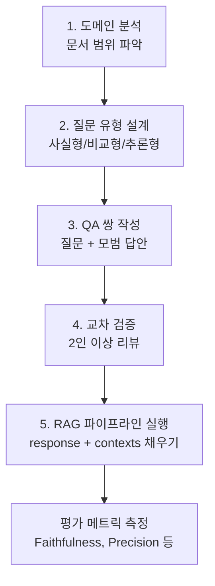
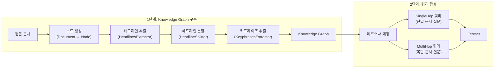
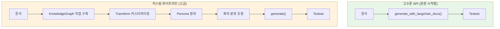
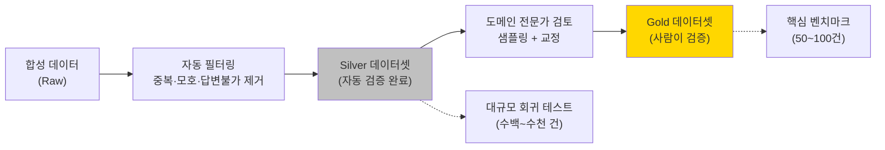

# 평가 데이터셋 구축과 자동 생성

> 좋은 시험 문제 없이는 학생의 실력을 정확히 측정할 수 없듯, 좋은 평가 데이터셋 없이는 RAG 시스템의 성능을 제대로 파악할 수 없습니다.

## 개요

이 섹션에서는 RAG 시스템 평가의 기반이 되는 **평가 데이터셋**을 체계적으로 구축하는 방법을 학습합니다. 수동으로 골든 데이터셋(Golden Dataset)을 만드는 가이드부터, RAGAS의 `TestsetGenerator`를 활용한 자동 합성 데이터 생성, 그리고 도메인별 데이터셋 설계 전략까지 다룹니다.

**선수 지식**:
- [17.1 RAG 평가란](17-rag-평가-ragas-프레임워크로-시스템-성능-측정/01-rag-평가란-무엇을-어떻게-측정할-것인가.md)에서 배운 `SingleTurnSample`과 `EvaluationDataset`의 4가지 필드 구조
- [17.2 Faithfulness와 Answer Relevancy](17-rag-평가-ragas-프레임워크로-시스템-성능-측정/02-ragas-핵심-메트릭-faithfulness와-answer-relevancy.md), [17.3 Context Precision과 Recall](17-rag-평가-ragas-프레임워크로-시스템-성능-측정/03-ragas-검색-메트릭-context-precision과-recall.md)에서 배운 핵심 메트릭의 작동 원리

**학습 목표**:
- 수동 평가 데이터셋(QA 쌍)을 효과적으로 작성할 수 있다
- RAGAS `TestsetGenerator`의 고수준 API로 합성 데이터를 빠르게 생성할 수 있다
- 내부 아키텍처(Knowledge Graph → 쿼리 합성)를 이해하고 필요 시 커스터마이징할 수 있다
- 자동 생성된 합성 데이터의 품질을 검증하고 보정할 수 있다
- 도메인과 목적에 맞는 평가 데이터셋 설계 전략을 수립할 수 있다

## 왜 알아야 할까?

앞서 세 개 세션에 걸쳐 Faithfulness, Answer Relevancy, Context Precision, Context Recall 등 강력한 메트릭을 배웠습니다. 하지만 이 메트릭들은 **입력으로 넣는 데이터셋의 품질**에 전적으로 의존합니다. 편향된 질문만 넣으면 편향된 점수가 나오고, 너무 쉬운 질문만 넣으면 모든 시스템이 만점을 받겠죠.

실무에서 RAG 시스템을 운영하다 보면 이런 상황에 직면합니다:

- "우리 시스템 성능이 좋은 건지, 테스트가 쉬운 건지 모르겠어요"
- "100개 QA 쌍을 수작업으로 만들었는데, 범위가 충분한지 확신이 없어요"
- "문서가 500개 넘는데, 일일이 질문을 만들 시간이 없어요"

평가 데이터셋은 RAG 시스템의 **시험 문제지**입니다. 시험 문제가 부실하면 성적표가 무의미하듯, 데이터셋이 부실하면 아무리 좋은 메트릭도 허수가 됩니다. 이 세션에서 체계적인 데이터셋 구축법을 익히면, 앞서 배운 메트릭들이 비로소 진짜 힘을 발휘하게 됩니다.

## 핵심 개념

### 개념 1: 골든 데이터셋 — 수동 평가 데이터셋의 설계

> 💡 **비유**: 골든 데이터셋은 **모범답안이 있는 기출문제집**과 같습니다. 학원 강사가 시험 범위를 꼼꼼히 분석해서 핵심 유형별로 문제를 출제하고, 정답과 풀이까지 작성하는 것처럼 — 골든 데이터셋도 도메인 전문가가 핵심 시나리오를 커버하는 질문을 설계하고, 정확한 정답(reference)을 작성한 데이터셋입니다.

**골든 데이터셋(Golden Dataset)**이란, 사람이 직접 검증한 질문-답변-컨텍스트 조합으로 구성된 **신뢰할 수 있는 기준 데이터셋**입니다. 자동 평가의 기준점이 되기 때문에 "골든(금과 같이 귀한)"이라는 이름이 붙었죠.

[17.1](17-rag-평가-ragas-프레임워크로-시스템-성능-측정/01-rag-평가란-무엇을-어떻게-측정할-것인가.md)에서 배운 `SingleTurnSample`의 4가지 필드를 떠올려보세요:

| 필드 | 역할 | 골든 데이터셋에서의 의미 |
|------|------|--------------------------|
| `user_input` | 사용자 질문 | 도메인 전문가가 설계한 평가 질문 |
| `reference` | 정답 | 사람이 검증한 모범 답안 |
| `response` | RAG 응답 | 평가 시 RAG 시스템이 생성 (사전 작성 X) |
| `retrieved_contexts` | 검색된 문서 | 평가 시 RAG 시스템이 검색 (사전 작성 X) |

핵심 포인트가 있습니다. 골든 데이터셋에서 **미리 작성하는 것은 `user_input`과 `reference` 두 가지뿐**이라는 거예요. `response`와 `retrieved_contexts`는 실제 RAG 파이프라인을 돌려서 채워 넣습니다.

#### 골든 데이터셋 작성 5단계

> 📊 **그림 1**: 골든 데이터셋 구축 워크플로



**1단계: 도메인 분석** — 문서를 주제별로 분류하고, 각 주제가 차지하는 비중을 파악합니다.

**2단계: 질문 유형 설계** — 다양한 난이도와 유형의 질문을 설계합니다:

```python
# 골든 데이터셋 질문 유형 예시
question_types = {
    "사실형(Factual)": "특정 사실을 직접 묻는 질문",
    # 예: "ChromaDB의 기본 유사도 메트릭은 무엇인가?"

    "비교형(Comparative)": "두 개념을 비교하는 질문",
    # 예: "FAISS와 ChromaDB의 스케일링 전략 차이는?"

    "추론형(Reasoning)": "여러 정보를 종합해야 하는 질문",
    # 예: "문서가 10만 건일 때 최적의 청킹+인덱싱 조합은?"

    "엣지 케이스": "문서에 없는 정보를 묻는 질문",
    # 예: "RAG 시스템에서 양자 컴퓨팅을 활용하는 방법은?"
}
```

**3단계: QA 쌍 작성** — 질문과 모범 답안을 작성합니다.

```python
from ragas.dataset_schema import SingleTurnSample, EvaluationDataset

# 수동으로 골든 데이터셋 구축
golden_samples = [
    SingleTurnSample(
        user_input="RAG에서 청킹 크기가 검색 품질에 미치는 영향은?",
        reference=(
            "청킹 크기가 작으면 정밀한 검색이 가능하지만 맥락이 부족할 수 있고, "
            "크면 맥락은 풍부하지만 노이즈가 증가합니다. "
            "일반적으로 256~512 토큰이 균형점으로 권장됩니다."
        )
    ),
    SingleTurnSample(
        user_input="Cosine Similarity와 Euclidean Distance의 차이는?",
        reference=(
            "Cosine Similarity는 벡터 방향(각도)을 기준으로 유사도를 측정하여 "
            "텍스트 길이에 덜 민감합니다. Euclidean Distance는 벡터 간 절대적 "
            "거리를 측정하여 임베딩의 크기(magnitude)에 영향을 받습니다."
        )
    ),
    SingleTurnSample(
        user_input="HNSW 인덱스의 ef_construction 파라미터 역할은?",
        reference=(
            "ef_construction은 인덱스 빌드 시 탐색하는 이웃 후보 수를 결정합니다. "
            "값이 클수록 인덱스 품질이 높아지지만 빌드 시간이 증가합니다. "
            "일반적으로 128~256 범위가 권장됩니다."
        )
    ),
]

golden_dataset = EvaluationDataset(samples=golden_samples)
```

**4단계: 교차 검증** — 최소 2명이 서로의 QA 쌍을 리뷰합니다.

**5단계: RAG 파이프라인 실행** — 실제 시스템을 돌려 `response`와 `retrieved_contexts`를 채웁니다.

```python
# RAG 파이프라인으로 response와 contexts 채우기
async def fill_rag_responses(
    golden_dataset: EvaluationDataset,
    rag_chain,  # LangChain RAG 체인
    retriever    # 벡터스토어 리트리버
) -> EvaluationDataset:
    """골든 데이터셋에 RAG 응답을 채워넣는 함수"""
    filled_samples = []

    for sample in golden_dataset.samples:
        # 검색 수행
        docs = retriever.invoke(sample.user_input)
        contexts = [doc.page_content for doc in docs]

        # RAG 응답 생성
        response = rag_chain.invoke({"question": sample.user_input})

        filled_samples.append(
            SingleTurnSample(
                user_input=sample.user_input,
                reference=sample.reference,
                response=response,
                retrieved_contexts=contexts
            )
        )

    return EvaluationDataset(samples=filled_samples)
```

> ⚠️ **흔한 오해**: "골든 데이터셋에 `response`도 미리 써넣어야 하는 것 아닌가요?" — 아닙니다! `reference`(정답)만 미리 작성하고, `response`(RAG 응답)는 **평가할 때마다 RAG 시스템을 돌려서** 생성합니다. RAG 파이프라인을 수정할 때마다 같은 골든 데이터셋으로 재평가하면 성능 변화를 정확히 추적할 수 있거든요.

#### 적정 규모는?

Microsoft의 RAG 평가 가이드라인에 따르면, **50~100개의 QA 쌍**으로 시작하는 것이 좋습니다. 핵심은 양이 아니라 **커버리지(coverage)**입니다:

```python
# 질문 분포 설계 예시 (총 80개 기준)
dataset_distribution = {
    "사실형 질문": 30,        # 37.5% — 기본 검색 능력
    "비교형 질문": 15,        # 18.75% — 다중 문서 종합
    "추론형 질문": 15,        # 18.75% — 깊은 이해도
    "엣지 케이스": 10,        # 12.5% — 할루시네이션 탐지
    "다중 맥락 질문": 10,     # 12.5% — 멀티홉 검색
}
```

### 개념 2: RAGAS TestsetGenerator — 자동 합성 데이터 생성

> 💡 **비유**: 수동으로 골든 데이터셋을 만드는 것이 **장인이 손으로 시험 문제를 출제하는 것**이라면, `TestsetGenerator`는 **AI가 문서를 읽고 자동으로 시험 문제를 출제해주는 똑똑한 출제 로봇**입니다. 이 로봇은 먼저 문서의 구조를 파악하고(Knowledge Graph), 다양한 학생 유형(Persona)을 상상하며, 단순 질문부터 여러 문서를 넘나드는 복합 질문까지 골고루 만들어냅니다.

문서가 수백, 수천 개라면 수동 작성은 현실적이지 않습니다. RAGAS의 `TestsetGenerator`는 문서에서 자동으로 다양한 유형의 QA 쌍을 합성해줍니다. 17.2~17.3에서 `evaluate()` 호출이 간단했던 것처럼, 테스트셋 생성도 **고수준 API 한 줄이면 충분**합니다.

#### 가장 빠른 시작: generate_with_langchain_docs

LangChain 문서를 이미 갖고 있다면, Knowledge Graph 구축부터 쿼리 합성까지 **한 번에** 처리하는 고수준 API를 사용하세요. 17.2~17.3에서 메트릭을 간단히 호출했듯, 데이터셋 생성도 이렇게 간결합니다:

```python
from langchain_community.document_loaders import DirectoryLoader
from ragas.testset import TestsetGenerator
from ragas.llms import LangchainLLMWrapper
from ragas.embeddings import LangchainEmbeddingsWrapper
from langchain_openai import ChatOpenAI, OpenAIEmbeddings

# LLM 및 임베딩 모델 초기화
generator_llm = LangchainLLMWrapper(ChatOpenAI(model="gpt-4o-mini"))
generator_embeddings = LangchainEmbeddingsWrapper(OpenAIEmbeddings())

# 문서 로드
loader = DirectoryLoader("./docs", glob="**/*.md")
docs = loader.load()

# 고수준 API — KG 구축 + 쿼리 합성을 한 번에
generator = TestsetGenerator(
    llm=generator_llm,
    embedding_model=generator_embeddings,
)

dataset = generator.generate_with_langchain_docs(
    docs,
    testset_size=20,  # 20개 QA 쌍 생성
)

# 결과 확인
df = dataset.to_pandas()
print(df[["user_input", "reference"]].head())
```

이 한 번의 호출로 내부적으로는 **2단계 파이프라인**이 자동 실행됩니다:

> 📊 **그림 2**: TestsetGenerator의 2단계 파이프라인



`generate_with_langchain_docs()`를 호출하면 이 모든 단계가 자동으로 진행됩니다. 문서를 넣기만 하면 다양한 유형의 QA 쌍이 나오는 거죠.

#### 쿼리 분포와 페르소나 커스터마이징

고수준 API를 쓰더라도 **쿼리 분포**와 **페르소나**는 커스터마이징할 수 있습니다. RAGAS는 세 가지 기본 쿼리 합성기를 제공합니다:

| 합성기 | 기본 비율 | 설명 |
|--------|-----------|------|
| `SingleHopSpecificQuerySynthesizer` | 50% | 단일 문서에서 특정 사실을 묻는 질문 |
| `MultiHopAbstractQuerySynthesizer` | 25% | 여러 문서를 종합하는 추상적 질문 |
| `MultiHopSpecificQuerySynthesizer` | 25% | 여러 문서의 구체적 사실을 연결하는 질문 |

```python
from ragas.testset.synthesizers import default_query_distribution
from ragas.testset import TestsetGenerator

# 기본 쿼리 분포 사용
query_distribution = default_query_distribution(generator_llm)

generator = TestsetGenerator(
    llm=generator_llm,
    embedding_model=generator_embeddings,
)

# 쿼리 분포를 지정하면서 고수준 API 사용
dataset = generator.generate_with_langchain_docs(
    docs,
    testset_size=20,
    query_distribution=query_distribution,  # 기본 분포 (50/25/25)
)
```

**페르소나(Persona)**를 정의하면 다양한 관점의 질문이 생성됩니다. 실제 사용자가 다양한 배경과 목적을 갖고 있듯, 페르소나에 맞는 질문이 만들어지는 거죠:

```python
from ragas.testset.persona import Persona

# 도메인에 맞는 페르소나 정의
personas = [
    Persona(
        name="RAG 입문자",
        role_description="RAG 개념을 처음 접하는 주니어 개발자. "
        "기본적인 용어와 동작 원리에 대한 질문을 함"
    ),
    Persona(
        name="시니어 ML 엔지니어",
        role_description="프로덕션 RAG 시스템을 운영 중인 경력 개발자. "
        "성능 최적화, 스케일링, 비용 효율에 관심이 많음"
    ),
    Persona(
        name="비기술 PM",
        role_description="기술적 배경 없이 RAG 프로젝트를 관리하는 PM. "
        "비즈니스 가치와 한계점에 대한 질문을 함"
    ),
]

# 페르소나를 적용한 생성
generator_with_personas = TestsetGenerator(
    llm=generator_llm,
    embedding_model=generator_embeddings,
    persona_list=personas,  # 페르소나 리스트 전달
)

dataset = generator_with_personas.generate_with_langchain_docs(
    docs,
    testset_size=30,
)
```

> 📊 **그림 3**: 고수준 API vs 커스텀 파이프라인 비교



대부분의 경우 고수준 API로 충분합니다. 하지만 Knowledge Graph를 저장해서 재사용하거나, Transform을 세밀하게 조정해야 할 때는 커스텀 파이프라인이 필요합니다. 이 내부 동작은 아래 "내부 동작 이해" 섹션에서 자세히 다룹니다.

#### 내부 동작 이해: Knowledge Graph 직접 구축하기

고수준 API가 내부에서 어떤 일을 하는지 이해하면, 문제가 생겼을 때 디버깅하거나 세밀한 커스터마이징을 할 수 있습니다. `generate_with_langchain_docs()`는 내부적으로 다음 과정을 수행합니다:

**1단계: Knowledge Graph 구축** — 문서를 **Knowledge Graph(지식 그래프)**로 변환합니다. 이 과정에서 세 가지 핵심 변환(Transform)이 적용됩니다:

| Transform | 역할 | 비유 |
|-----------|------|------|
| `HeadlinesExtractor` | 문서에서 섹션 제목 추출 | 교과서 목차 뽑기 |
| `HeadlineSplitter` | 제목 기준으로 문서를 하위 섹션으로 분할 | 단원별로 자르기 |
| `KeyphrasesExtractor` | 각 섹션에서 핵심 키워드 추출 | 형광펜으로 중요 단어 표시 |

이 과정을 직접 제어하고 싶다면 저수준 API를 사용합니다:

```python
from ragas.testset.graph import KnowledgeGraph, Node, NodeType
from ragas.testset.transforms import (
    apply_transforms,
    HeadlinesExtractor,
    HeadlineSplitter,
    KeyphrasesExtractor,
)

# Knowledge Graph 생성
kg = KnowledgeGraph()

for doc in docs:  # LangChain Document 리스트
    kg.nodes.append(
        Node(
            type=NodeType.DOCUMENT,
            properties={
                "page_content": doc.page_content,
                "document_metadata": doc.metadata,
            },
        )
    )

# 변환(Transform) 적용
transforms = [
    HeadlinesExtractor(llm=generator_llm, max_num=20),   # 헤드라인 최대 20개 추출
    HeadlineSplitter(max_tokens=1500),                     # 1500토큰 단위로 분할
    KeyphrasesExtractor(llm=generator_llm),                # 핵심 키프레이즈 추출
]

apply_transforms(kg, transforms=transforms)

# Knowledge Graph 저장 (재사용 가능!)
kg.save("knowledge_graph.json")
```

> 🔥 **실무 팁**: Knowledge Graph 구축은 LLM 호출이 많아 시간과 비용이 듭니다. `kg.save()`로 저장해두면 다음에 `KnowledgeGraph.load("knowledge_graph.json")`으로 바로 불러와서 쿼리 합성 단계만 다시 수행할 수 있습니다. 이것이 저수준 API를 쓰는 가장 큰 이유입니다.

**2단계: 저장된 Knowledge Graph로 쿼리 합성** — 저장해둔 KG를 불러와 `generate()`를 호출합니다:

```python
from ragas.testset import TestsetGenerator
from ragas.testset.synthesizers import default_query_distribution

# 저장된 KG 불러오기
kg = KnowledgeGraph.load("knowledge_graph.json")

query_dist = default_query_distribution(generator_llm)

# KG를 직접 주입하여 생성
generator = TestsetGenerator(
    llm=generator_llm,
    embedding_model=generator_embeddings,
    knowledge_graph=kg,  # 미리 구축한 KG 전달
)

testset = generator.generate(
    testset_size=20,
    query_distribution=query_dist,
)

df = testset.to_pandas()
print(df.columns.tolist())
```

정리하면, **빠르게 시작할 때는 `generate_with_langchain_docs()`**, KG를 저장·재사용하거나 Transform을 세밀하게 조정할 때는 **KG 직접 구축 + `generate()`**를 사용하면 됩니다.

### 개념 3: 합성 데이터 품질 검증

> 💡 **비유**: AI 출제 로봇이 만든 시험 문제를 **교수님이 최종 검수하는 과정**입니다. 로봇이 가끔 엉뚱한 문제를 내거나, 답이 틀린 문제를 내거나, 너무 비슷한 문제를 반복할 수 있으니까요.

자동 생성된 데이터셋을 그대로 쓰면 안 됩니다. 합성 데이터에는 다음과 같은 문제가 발생할 수 있어요:

| 문제 유형 | 예시 | 해결 방법 |
|-----------|------|-----------|
| 모호한 질문 | "이것은 어떻게 작동하나요?" | 구체적 키워드 포함 여부 필터링 |
| 답이 없는 질문 | 문서에 정보가 없는 내용 질문 | 리트리버로 검증 |
| 중복 질문 | 동일 사실에 대한 표현만 다른 질문들 | 임베딩 유사도로 중복 탐지 |
| 너무 쉬운 질문 | 문서 제목을 그대로 묻는 질문 | 난이도 분포 검증 |

아래 코드는 합성 데이터셋의 품질을 자동으로 검증하는 파이프라인입니다:

```python
import numpy as np
from sklearn.metrics.pairwise import cosine_similarity


def validate_synthetic_dataset(
    testset_df,
    retriever,
    embedding_model,
    similarity_threshold: float = 0.92,
    min_context_docs: int = 1,
) -> dict:
    """합성 데이터셋 품질 검증 파이프라인"""

    results = {
        "total": len(testset_df),
        "filtered_out": [],
        "issues": [],
    }

    questions = testset_df["user_input"].tolist()

    # 1. 중복 질문 탐지 (임베딩 유사도 기반)
    embeddings = embedding_model.embed_documents(questions)
    sim_matrix = cosine_similarity(embeddings)
    np.fill_diagonal(sim_matrix, 0)  # 자기 자신과의 유사도 제거

    for i in range(len(questions)):
        for j in range(i + 1, len(questions)):
            if sim_matrix[i][j] > similarity_threshold:
                results["issues"].append({
                    "type": "duplicate",
                    "indices": (i, j),
                    "similarity": float(sim_matrix[i][j]),
                })

    # 2. 검색 가능성 검증 (리트리버로 관련 문서 찾기)
    for idx, question in enumerate(questions):
        docs = retriever.invoke(question)
        if len(docs) < min_context_docs:
            results["issues"].append({
                "type": "unanswerable",
                "index": idx,
                "question": question,
            })

    # 3. 질문 길이/품질 필터
    for idx, question in enumerate(questions):
        if len(question) < 10:
            results["issues"].append({
                "type": "too_short",
                "index": idx,
                "question": question,
            })

    results["valid_count"] = results["total"] - len(
        set(
            item.get("index", item.get("indices", (None,))[0])
            for item in results["issues"]
        )
    )

    return results
```

```run:python
# 검증 결과 해석 예시
validation_result = {
    "total": 50,
    "valid_count": 43,
    "issues": [
        {"type": "duplicate", "indices": (3, 17), "similarity": 0.95},
        {"type": "duplicate", "indices": (8, 22), "similarity": 0.93},
        {"type": "unanswerable", "index": 5, "question": "양자 RAG의 미래는?"},
        {"type": "unanswerable", "index": 31, "question": "GPT-6의 임베딩 차원은?"},
        {"type": "too_short", "index": 12, "question": "RAG란?"},
    ],
}

print(f"총 샘플: {validation_result['total']}개")
print(f"유효 샘플: {validation_result['valid_count']}개")
print(f"문제 발견: {len(validation_result['issues'])}건")
print()
for issue in validation_result["issues"]:
    if issue["type"] == "duplicate":
        print(f"  [중복] 질문 {issue['indices'][0]}번 ↔ {issue['indices'][1]}번 "
              f"(유사도: {issue['similarity']:.2f})")
    elif issue["type"] == "unanswerable":
        print(f"  [답변 불가] {issue['index']}번: \"{issue['question']}\"")
    elif issue["type"] == "too_short":
        print(f"  [너무 짧음] {issue['index']}번: \"{issue['question']}\"")
```

```output
총 샘플: 50개
유효 샘플: 43개
문제 발견: 5건
  [중복] 질문 3번 ↔ 17번 (유사도: 0.95)
  [중복] 질문 8번 ↔ 22번 (유사도: 0.93)
  [답변 불가] 5번: "양자 RAG의 미래는?"
  [답변 불가] 31번: "GPT-6의 임베딩 차원은?"
  [너무 짧음] 12번: "RAG란?"
```

### 개념 4: 도메인별 데이터셋 설계 전략

> 💡 **비유**: 의대 시험과 법대 시험은 같은 형식이더라도 출제 전략이 완전히 다릅니다. 의대는 증상→진단→처방의 연쇄 추론을, 법대는 판례 해석과 논리적 반박을 중시하죠. RAG 평가 데이터셋도 **도메인 특성에 맞게 전략을 달리해야** 합니다.

범용 데이터셋은 범용적인 답만 줍니다. 실무에서 의미 있는 평가를 하려면 도메인의 특성을 반영한 맞춤 전략이 필요합니다.

#### 도메인별 전략 비교

```python
# 도메인별 쿼리 분포 커스터마이징 예시
domain_strategies = {
    "기술 문서 (API 레퍼런스)": {
        "사실형": 0.50,        # "함수 X의 반환 타입은?" — 정확한 검색 중요
        "비교형": 0.20,        # "v1 vs v2 차이점은?"
        "코드 생성형": 0.20,   # "X를 사용한 예시 코드는?"
        "엣지 케이스": 0.10,   # 존재하지 않는 API 질문
    },
    "법률 문서": {
        "사실형": 0.30,        # "X법 Y조의 내용은?"
        "추론형": 0.35,        # "A 사례에 적용 가능한 조항은?"
        "비교형": 0.25,        # "개정 전후 차이는?"
        "엣지 케이스": 0.10,   # 모호한 법적 해석
    },
    "고객 지원 FAQ": {
        "사실형": 0.40,        # "반품 절차는?"
        "다중 맥락": 0.25,     # "해외 주문이면서 불량품인 경우?"
        "패러프레이즈": 0.25,  # 같은 질문을 다른 표현으로
        "엣지 케이스": 0.10,   # 정책에 없는 상황
    },
}
```

커스텀 쿼리 분포를 `TestsetGenerator`에 적용하는 방법은 다음과 같습니다:

```python
from ragas.testset.synthesizers.single_hop.specific import (
    SingleHopSpecificQuerySynthesizer,
)
from ragas.testset.synthesizers.multi_hop.abstract import (
    MultiHopAbstractQuerySynthesizer,
)
from ragas.testset.synthesizers.multi_hop.specific import (
    MultiHopSpecificQuerySynthesizer,
)

# 기술 문서용: 단일 문서 질문 비중 높이기
tech_doc_distribution = [
    (SingleHopSpecificQuerySynthesizer(llm=generator_llm), 0.60),
    (MultiHopAbstractQuerySynthesizer(llm=generator_llm), 0.15),
    (MultiHopSpecificQuerySynthesizer(llm=generator_llm), 0.25),
]

# 법률 문서용: 복합 추론 질문 비중 높이기
legal_distribution = [
    (SingleHopSpecificQuerySynthesizer(llm=generator_llm), 0.30),
    (MultiHopAbstractQuerySynthesizer(llm=generator_llm), 0.40),
    (MultiHopSpecificQuerySynthesizer(llm=generator_llm), 0.30),
]

# 고수준 API에 커스텀 분포 적용
tech_testset = generator.generate_with_langchain_docs(
    docs,
    testset_size=50,
    query_distribution=tech_doc_distribution,
)
```

#### Silver → Gold 전략

대규모 평가에서 가장 실용적인 접근법은 **Silver → Gold 승격(Promotion)** 전략입니다:

> 📊 **그림 4**: Silver → Gold 데이터셋 승격 워크플로



1. **Raw → Silver**: `TestsetGenerator`로 대량 생성 → 자동 검증 필터링
2. **Silver → Gold**: Silver에서 전략적으로 샘플링 → 도메인 전문가가 교정

이렇게 하면 수동 검증의 비용은 줄이면서, 대규모 + 고품질 두 마리 토끼를 잡을 수 있습니다.

```python
def promote_silver_to_gold(
    silver_df,
    sample_size: int = 50,
    stratify_by: str = "synthesizer_name",
) -> list[dict]:
    """Silver 데이터셋에서 Gold 후보를 층화 샘플링"""

    # 쿼리 유형별 비례 샘플링
    if stratify_by in silver_df.columns:
        gold_candidates = silver_df.groupby(stratify_by).apply(
            lambda x: x.sample(
                n=min(len(x), max(1, int(sample_size * len(x) / len(silver_df)))),
                random_state=42,
            )
        ).reset_index(drop=True)
    else:
        gold_candidates = silver_df.sample(n=sample_size, random_state=42)

    # 사람 리뷰용 형식으로 변환
    review_items = []
    for _, row in gold_candidates.iterrows():
        review_items.append({
            "question": row["user_input"],
            "reference": row.get("reference", ""),
            "review_status": "pending",  # pending → approved / revised / rejected
            "reviewer_notes": "",
        })

    return review_items
```

## 실습: 직접 해보기

아래는 **문서 로드 → 테스트셋 생성 → 골든 데이터 병합 → 품질 검증**까지의 전체 파이프라인입니다. 고수준 API를 사용하여 가장 실용적인 워크플로를 보여드립니다.

```python
"""
RAG 평가 데이터셋 구축 실습 — 전체 파이프라인
필요 패키지: pip install ragas langchain langchain-openai langchain-community
"""

import os
from dotenv import load_dotenv

load_dotenv()  # .env에서 OPENAI_API_KEY 로드

# === 1단계: 문서 준비 ===
from langchain_core.documents import Document

# 실습용 샘플 문서 (실제로는 DirectoryLoader 등으로 로드)
sample_docs = [
    Document(
        page_content=(
            "RAG(Retrieval-Augmented Generation)는 외부 지식 소스에서 관련 정보를 "
            "검색하여 LLM의 응답 생성을 보강하는 기법입니다. 2020년 Meta AI의 "
            "Patrick Lewis 팀이 제안했습니다. RAG는 파라메트릭 지식(LLM 내부)과 "
            "비파라메트릭 지식(외부 문서)을 결합하여 할루시네이션을 줄이고 "
            "최신 정보를 반영할 수 있습니다."
        ),
        metadata={"source": "rag_overview.md", "chapter": "1"},
    ),
    Document(
        page_content=(
            "텍스트 청킹은 긴 문서를 작은 단위로 나누는 과정입니다. "
            "고정 크기 청킹은 지정된 토큰 수로 균일하게 자르며, "
            "시멘틱 청킹은 의미 단위로 분할합니다. 청크 크기가 너무 작으면 "
            "맥락이 부족하고, 너무 크면 노이즈가 증가합니다. "
            "일반적으로 256~512 토큰, 오버랩 50~100 토큰이 권장됩니다."
        ),
        metadata={"source": "chunking.md", "chapter": "4"},
    ),
    Document(
        page_content=(
            "벡터 데이터베이스는 고차원 벡터를 효율적으로 저장하고 유사도 기반 "
            "검색을 수행합니다. ChromaDB는 로컬 개발에 적합한 오픈소스 벡터DB이며, "
            "FAISS는 Facebook이 개발한 고성능 유사도 검색 라이브러리입니다. "
            "Pinecone은 완전 관리형 클라우드 벡터DB로 프로덕션 환경에 적합합니다. "
            "HNSW 인덱스는 그래프 기반 ANN 알고리즘으로 대부분의 벡터DB에서 "
            "기본 인덱스로 사용됩니다."
        ),
        metadata={"source": "vector_db.md", "chapter": "6"},
    ),
]

# === 2단계: LLM 및 임베딩 모델 초기화 ===
from ragas.llms import LangchainLLMWrapper
from ragas.embeddings import LangchainEmbeddingsWrapper
from langchain_openai import ChatOpenAI, OpenAIEmbeddings

generator_llm = LangchainLLMWrapper(ChatOpenAI(model="gpt-4o-mini"))
generator_embeddings = LangchainEmbeddingsWrapper(OpenAIEmbeddings())

# === 3단계: 고수준 API로 합성 데이터 생성 ===
from ragas.testset import TestsetGenerator
from ragas.testset.synthesizers import default_query_distribution

generator = TestsetGenerator(
    llm=generator_llm,
    embedding_model=generator_embeddings,
)

# 한 줄로 KG 구축 + 쿼리 합성 완료!
testset = generator.generate_with_langchain_docs(
    sample_docs,
    testset_size=10,
    query_distribution=default_query_distribution(generator_llm),
)

# 결과를 DataFrame으로 변환
df = testset.to_pandas()
print(f"생성된 테스트셋 크기: {len(df)}")
print(f"컬럼: {df.columns.tolist()}")
print("\n--- 샘플 질문 3개 ---")
for i, row in df.head(3).iterrows():
    print(f"  Q{i+1}: {row['user_input'][:80]}...")

# === 4단계: 골든 데이터셋과 합성 데이터셋 병합 ===
from ragas.dataset_schema import SingleTurnSample, EvaluationDataset

# 수동 골든 샘플 추가
golden_samples = [
    SingleTurnSample(
        user_input="RAG를 처음 제안한 연구팀은 어디인가?",
        reference="2020년 Meta AI(Facebook AI Research)의 Patrick Lewis 팀이 제안했습니다.",
    ),
    SingleTurnSample(
        user_input="ChromaDB와 FAISS의 주요 차이점은?",
        reference=(
            "ChromaDB는 로컬 개발에 적합한 오픈소스 벡터DB이고, "
            "FAISS는 Facebook이 개발한 고성능 유사도 검색 라이브러리입니다."
        ),
    ),
]

# 합성 데이터에서 SingleTurnSample 변환
synthetic_samples = [
    SingleTurnSample(
        user_input=row["user_input"],
        reference=row.get("reference", ""),
    )
    for _, row in df.iterrows()
]

# 병합
all_samples = golden_samples + synthetic_samples
combined_dataset = EvaluationDataset(samples=all_samples)
print(f"\n최종 데이터셋 크기: {len(combined_dataset.samples)}개")
print(f"  - 골든 샘플: {len(golden_samples)}개")
print(f"  - 합성 샘플: {len(synthetic_samples)}개")
```

> 🔥 **실무 팁**: 위 실습에서는 `generate_with_langchain_docs()`로 빠르게 생성했지만, 프로덕션에서 반복적으로 테스트셋을 생성한다면 개념 2의 "내부 동작 이해" 섹션에서 소개한 KG 직접 구축 방식을 사용하세요. KG를 한 번 저장해두면 이후에는 KG 구축 비용 없이 쿼리 합성만 반복할 수 있습니다.

## 더 깊이 알아보기

### 합성 데이터의 탄생 — "기계가 시험 문제를 만들 수 있을까?"

자동 질문 생성(Automatic Question Generation, AQG)의 역사는 놀랍게도 1976년까지 거슬러 올라갑니다. John Wolfe가 컴퓨터를 이용해 교육용 시험 문제를 자동 생성하는 연구를 발표한 것이 시초였죠. 하지만 당시에는 규칙 기반(rule-based) 접근이어서 "빈칸 채우기" 수준이 한계였습니다.

2019년, GPT-2의 등장과 함께 상황이 극적으로 바뀝니다. LLM이 문맥을 이해하고 자연스러운 질문을 생성할 수 있게 된 거죠. 2023년 RAGAS 프레임워크의 `TestsetGenerator`는 이를 한 단계 더 발전시켰습니다. 단순히 질문만 만드는 게 아니라, **Knowledge Graph를 구축하고 그 위에서 다양한 난이도와 유형의 질문을 체계적으로 합성**하는 방식이었거든요.

RAGAS 팀(현 Vibrant Labs, 이전 Exploding Gradients)의 Shahul ES와 Jithin James는 "평가 없는 RAG는 눈 감고 운전하는 것"이라며, 평가의 진입 장벽을 낮추는 것이 미션이라고 밝혔습니다. `TestsetGenerator`는 바로 그 미션의 핵심 결과물이었죠 — 수작업으로 수백 개의 QA 쌍을 만들어야 했던 병목을 LLM으로 해결한 것입니다.

> 💡 **알고 계셨나요?**: RAGAS의 원래 GitHub organization 이름은 "explodinggradients"(폭발하는 그래디언트)였습니다. 딥러닝의 유명한 문제인 "gradient exploding"에서 따온 유머러스한 이름이었는데, 프로젝트가 성장하며 "Vibrant Labs"로 리브랜딩했습니다. 지금도 GitHub URL에는 옛 이름의 흔적이 남아있죠.

### FlashRAG — 대규모 RAG 연구를 위한 벤치마크 도구

중국 인민대학교(RUC)의 NLP 연구팀이 만든 [FlashRAG](https://github.com/RUC-NLPIR/FlashRAG)는 RAG 연구를 위한 통합 벤치마크 프레임워크입니다. 36개의 사전 구축된 RAG 벤치마크 데이터셋을 제공하며, 12가지 최신 RAG 방법론을 통일된 인터페이스로 비교할 수 있습니다. 자체적인 평가 데이터셋을 만들기 전에, 도메인에 맞는 기존 벤치마크가 있는지 FlashRAG에서 확인해보는 것도 좋은 전략입니다.

## 흔한 오해와 팁

> ⚠️ **흔한 오해**: "합성 데이터셋이면 충분하니까 골든 데이터셋은 안 만들어도 되겠지?" — 그렇지 않습니다! 합성 데이터는 커버리지를 넓히는 데 좋지만, **LLM이 생성한 질문은 LLM이 잘 답할 수 있는 질문에 편향**될 수 있습니다. 사람만이 낼 수 있는 엣지 케이스, 모호한 질문, 실수를 유도하는 질문은 수동으로 만들어야 합니다. 핵심 벤치마크는 골든, 대규모 회귀 테스트는 합성 — 이렇게 용도를 나누세요.

> 🔥 **실무 팁**: 데이터셋은 **살아있는 문서**입니다. RAG 파이프라인을 업데이트할 때마다 `response`와 `retrieved_contexts`만 다시 채우면 됩니다. 이를 위해 `user_input`과 `reference`만 담은 "질문 뱅크"를 Git 등 버전 관리 시스템에 보관하고, CI/CD 파이프라인에서 자동으로 평가를 실행하면 성능 회귀(regression)를 즉시 감지할 수 있습니다.

> 💡 **알고 계셨나요?**: Google의 RAG 평가 팀은 내부적으로 **"adversarial examples"(적대적 예제)**를 데이터셋의 10~15%로 유지한다고 합니다. 문서에 있는 내용과 미묘하게 다른 질문, 일부러 오해를 유도하는 질문을 포함시켜 시스템의 할루시네이션 취약점을 일찍 발견하는 전략이죠.

## 핵심 정리

| 개념 | 설명 |
|------|------|
| 골든 데이터셋 | 사람이 직접 작성·검증한 QA 쌍. 핵심 벤치마크로 사용 (50~100개) |
| `user_input` + `reference` | 골든 데이터셋에서 미리 작성하는 두 필드. `response`와 `contexts`는 RAG 실행 시 채움 |
| `generate_with_langchain_docs()` | 고수준 API. 문서를 넣으면 KG 구축 + 쿼리 합성을 한 번에 수행 |
| `TestsetGenerator` | RAGAS의 자동 테스트셋 생성기. Knowledge Graph → 쿼리 합성 2단계로 동작 |
| Knowledge Graph | 문서를 노드·관계로 변환한 지식 구조. Transform(헤드라인 추출, 분할, 키프레이즈)으로 구축. 저수준 API로 직접 제어 가능 |
| 쿼리 합성기 | SingleHop(50%), MultiHopAbstract(25%), MultiHopSpecific(25%)의 기본 분포 |
| Persona | 다양한 사용자 유형을 정의하여 질문의 관점과 난이도를 다양화 |
| 품질 검증 | 중복 탐지(임베딩 유사도), 검색 가능성 검증, 길이/품질 필터 |
| Silver → Gold 전략 | 합성(Silver) → 자동 필터 → 전문가 검토 → Gold 승격. 효율과 품질의 균형 |
| 도메인별 분포 설계 | 기술 문서는 사실형↑, 법률은 추론형↑, FAQ는 패러프레이즈↑ |

## 다음 섹션 미리보기

지금까지 개별 메트릭(17.2~17.3)과 데이터셋(17.4)을 따로따로 배웠습니다. 다음 세션 **[17.5 종합 평가 파이프라인과 자동화](17-rag-평가-ragas-프레임워크로-시스템-성능-측정/05-자동화된-rag-평가-파이프라인-구축.md)**에서는 이 모든 조각을 하나로 합칩니다. RAGAS의 `evaluate()` 함수로 모든 메트릭을 한 번에 측정하고, CI/CD에 통합하여 RAG 파이프라인 업데이트 때마다 자동으로 성능 리포트를 생성하는 방법을 배웁니다.

## 참고 자료

- [RAGAS Testset Generation 공식 문서](https://docs.ragas.io/en/stable/getstarted/rag_testset_generation/) - TestsetGenerator의 전체 API와 사용법을 다루는 공식 가이드
- [RAGAS Test Data Generation 개념 문서](https://docs.ragas.io/en/stable/concepts/test_data_generation/) - Knowledge Graph, Transform, Synthesizer 아키텍처의 설계 철학
- [RAGAS Single-hop Query Testset 생성 가이드](https://docs.ragas.io/en/stable/howtos/applications/singlehop_testset_gen/) - 커스텀 Transform과 Persona를 활용한 상세 예제
- [FlashRAG — Python Toolkit for RAG Research](https://github.com/RUC-NLPIR/FlashRAG) - 36개 사전 구축 벤치마크 데이터셋과 12가지 RAG 방법론 비교 프레임워크
- [The Path to a Golden Dataset — Microsoft Data Science](https://medium.com/data-science-at-microsoft/the-path-to-a-golden-dataset-or-how-to-evaluate-your-rag-045e23d1f13f) - Microsoft의 RAG 골든 데이터셋 구축 경험과 베스트 프랙티스
- [Know Your RAG: Dataset Taxonomy and Generation Strategies](https://arxiv.org/html/2411.19710v1) - RAG 평가 데이터셋의 분류 체계와 생성 전략을 다룬 2024년 논문

---
### 🔗 Related Sessions
- [context recall](../17-rag-평가-ragas-프레임워크로-시스템-성능-측정/01-rag-평가란-무엇을-어떻게-측정할-것인가.md) (prerequisite)
- [context precision](../17-rag-평가-ragas-프레임워크로-시스템-성능-측정/01-rag-평가란-무엇을-어떻게-측정할-것인가.md) (prerequisite)
- [faithfulness](../17-rag-평가-ragas-프레임워크로-시스템-성능-측정/01-rag-평가란-무엇을-어떻게-측정할-것인가.md) (prerequisite)
- [answer relevancy](../17-rag-평가-ragas-프레임워크로-시스템-성능-측정/01-rag-평가란-무엇을-어떻게-측정할-것인가.md) (prerequisite)
- [singleturnsample](../17-rag-평가-ragas-프레임워크로-시스템-성능-측정/01-rag-평가란-무엇을-어떻게-측정할-것인가.md) (prerequisite)
- [evaluationdataset](../17-rag-평가-ragas-프레임워크로-시스템-성능-측정/01-rag-평가란-무엇을-어떻게-측정할-것인가.md) (prerequisite)
- [llm-as-judge](../17-rag-평가-ragas-프레임워크로-시스템-성능-측정/01-rag-평가란-무엇을-어떻게-측정할-것인가.md) (prerequisite)
