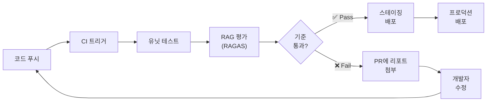
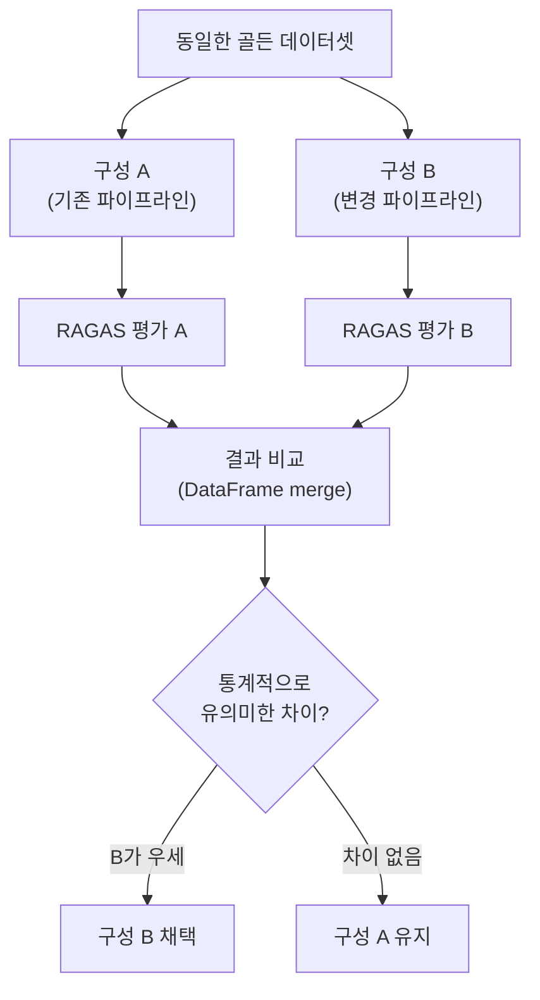
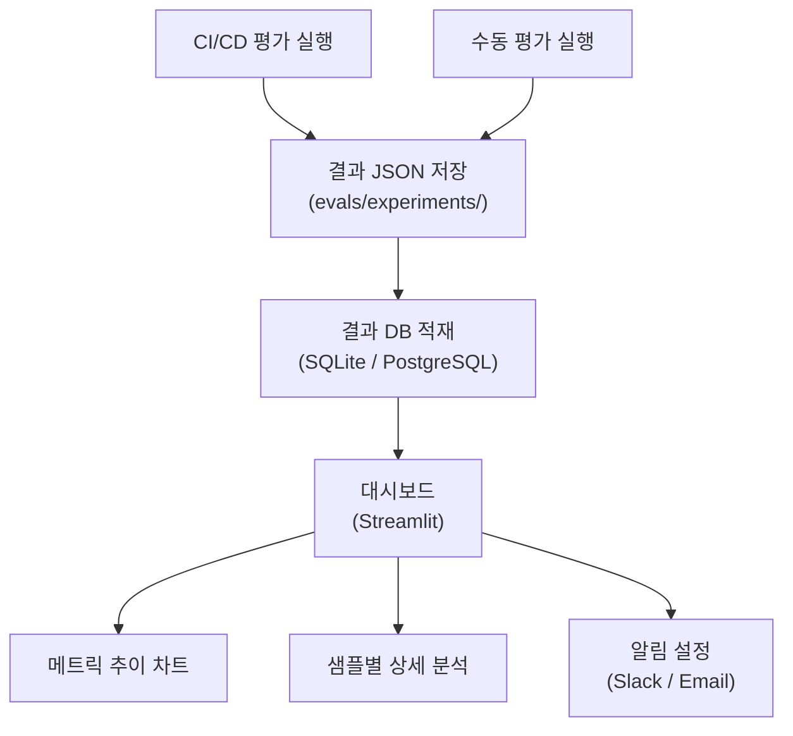
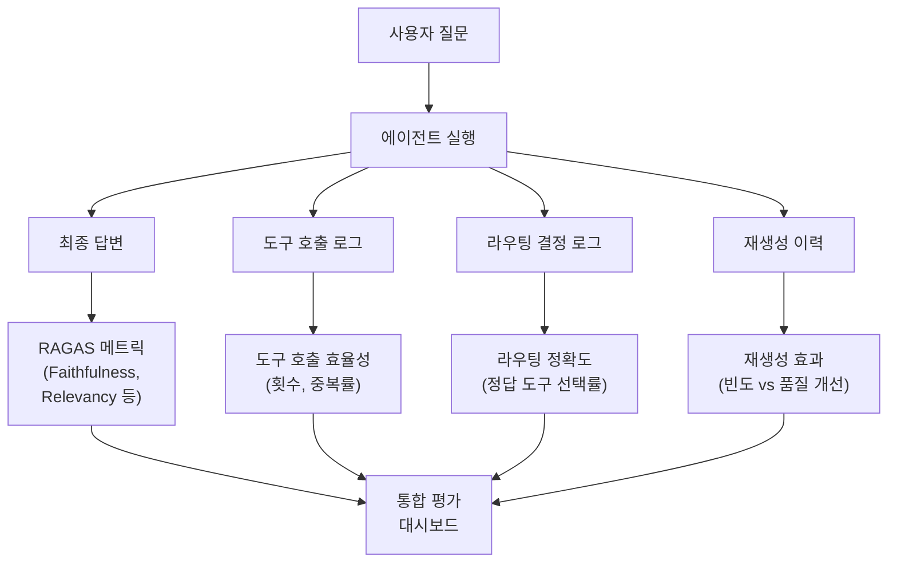
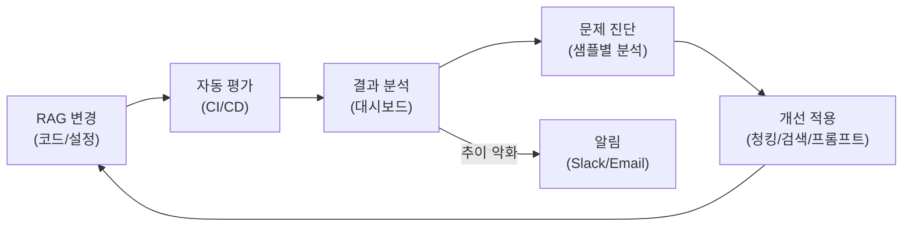

# 자동화된 RAG 평가 파이프라인 구축

> CI/CD에 RAG 평가를 통합하고, 회귀 테스트와 A/B 테스트로 검색·생성 품질을 지속적으로 모니터링하는 방법을 배웁니다.

## 개요

이 섹션에서는 앞서 배운 RAGAS 메트릭과 데이터셋 구축 지식을 하나의 **자동화된 평가 파이프라인**으로 통합합니다. 코드 변경이 발생할 때마다 RAG 시스템의 품질을 자동으로 검증하고, 성능 추이를 추적하며, 구성 변경의 효과를 과학적으로 비교하는 시스템을 구축합니다. 나아가 [16장](16-에이전틱-rag-langgraph로-동적-검색-에이전트-구축/01-에이전틱-rag란-왜-에이전트가-필요한가.md)에서 다룬 에이전틱 RAG처럼 도구 호출과 라우팅이 포함된 복잡한 파이프라인도 체계적으로 평가하는 방법을 배웁니다.

**선수 지식**: [17.1 RAG 평가란](17-rag-평가-ragas-프레임워크로-시스템-성능-측정/01-rag-평가란-무엇을-어떻게-측정할-것인가.md)에서 배운 평가의 세 축, [17.2](17-rag-평가-ragas-프레임워크로-시스템-성능-측정/02-ragas-핵심-메트릭-faithfulness와-answer-relevancy.md)~[17.3](17-rag-평가-ragas-프레임워크로-시스템-성능-측정/03-ragas-검색-메트릭-context-precision과-recall.md)에서 배운 RAGAS 핵심 메트릭(Faithfulness, Answer Relevancy, Context Precision/Recall), [17.4 평가 데이터셋 구축](17-rag-평가-ragas-프레임워크로-시스템-성능-측정/04-평가-데이터셋-구축과-자동-생성.md)에서 배운 골든 데이터셋과 TestsetGenerator, [16장](16-에이전틱-rag-langgraph로-동적-검색-에이전트-구축/01-에이전틱-rag란-왜-에이전트가-필요한가.md)에서 배운 에이전틱 RAG의 도구 호출·라우팅·Self-RAG 개념

**학습 목표**:
- `evaluate()`로 모든 메트릭을 통합 실행하고 결과를 분석할 수 있다
- GitHub Actions에 RAG 평가를 통합하여 회귀 테스트를 자동화할 수 있다
- A/B 테스트로 RAG 구성 변경의 효과를 객관적으로 비교할 수 있다
- 에이전틱 RAG의 도구 호출 효율성, 라우팅 정확도, 재생성 빈도를 측정할 수 있다
- 평가 결과를 대시보드로 시각화하고 지속적 개선 프로세스를 운영할 수 있다

## 왜 알아야 할까?

여러분이 RAG 시스템을 운영한다고 상상해 보세요. 어느 날 임베딩 모델을 바꿨는데, 검색 품질이 미묘하게 나빠졌습니다. 하지만 아무도 눈치채지 못했죠. 한 달 뒤 사용자 불만이 쌓여서야 문제를 알게 됩니다. 이미 수천 건의 잘못된 답변이 나간 뒤인 거죠.

이런 상황을 막으려면 **"코드에 테스트가 있듯이, RAG에도 평가가 있어야 한다"**는 원칙이 필요합니다. 소프트웨어 개발에서 CI/CD가 버그를 미리 잡아주듯, RAG 평가 파이프라인은 품질 저하를 배포 전에 잡아냅니다.

에이전틱 RAG를 운영 중이라면 상황은 더 복잡해집니다. 에이전트가 도구를 잘못 선택하거나, 불필요하게 많이 호출하거나, Self-RAG가 재생성만 반복하면서 레이턴시와 비용만 늘어나는 일이 생기거든요. 이런 에이전트 고유의 문제도 자동화된 평가로 잡아내야 합니다.

실제로 프로덕션 RAG 시스템을 운영하는 팀의 대부분이 평가 자동화를 도입한 후 "문제를 발견하는 시간이 주 단위에서 분 단위로 줄었다"고 보고합니다. 이번 세션은 여러분의 RAG 시스템에 이 안전망을 씌우는 방법을 다룹니다.

## 핵심 개념

### 개념 1: `evaluate()` — 통합 평가의 시작점

> 💡 **비유**: 건강검진에서 혈압, 혈당, 콜레스테롤을 따로따로 검사받는 것과 종합검진 패키지로 한 번에 돌리는 것의 차이를 떠올려 보세요. `evaluate()`는 RAG의 **종합검진 패키지**입니다. Faithfulness, Answer Relevancy, Context Precision, Context Recall — 모든 메트릭을 한 번의 호출로 실행하고, 결과를 하나의 리포트로 받아볼 수 있죠.

앞선 세션에서는 개별 메트릭의 `ascore()`로 하나씩 측정했습니다. 하지만 실무에서는 `evaluate()` 함수 하나로 모든 메트릭을 통합 실행합니다.

아래 코드에서 `FactualCorrectness`라는 새로운 메트릭이 등장하는데요, 이것은 생성된 답변의 **사실적 정확성**을 참조 답변(reference)과 대조하여 측정하는 메트릭입니다. [17.1](17-rag-평가-ragas-프레임워크로-시스템-성능-측정/01-rag-평가란-무엇을-어떻게-측정할-것인가.md)에서 배운 "축 3: 종합 평가"의 Answer Correctness가 의미적 유사성에 가깝다면, FactualCorrectness는 개별 사실(fact) 단위로 정답과의 일치 여부를 더 엄밀하게 검증합니다.

```python
from ragas import evaluate, EvaluationDataset
from ragas.metrics import (
    Faithfulness,
    AnswerRelevancy,
    LLMContextRecall,
    LLMContextPrecisionWithReference,
    FactualCorrectness,
)
from ragas.llms import LangchainLLMWrapper
from langchain_openai import ChatOpenAI

# 평가용 LLM 설정
evaluator_llm = LangchainLLMWrapper(ChatOpenAI(model="gpt-4o"))

# 메트릭 리스트 정의
metrics = [
    Faithfulness(llm=evaluator_llm),
    AnswerRelevancy(llm=evaluator_llm),
    LLMContextRecall(llm=evaluator_llm),                  # RAGAS 0.2.x+ 표준 클래스명
    LLMContextPrecisionWithReference(llm=evaluator_llm),   # RAGAS 0.2.x+ 표준 클래스명
    FactualCorrectness(llm=evaluator_llm),                 # 사실 단위 정확성 평가
]

# 통합 평가 실행
result = evaluate(
    dataset=evaluation_dataset,   # EvaluationDataset 객체
    metrics=metrics,
    llm=evaluator_llm,
    batch_size=5,                 # 동시 처리 수 제어
    show_progress=True,           # 진행 상황 표시
)
```

> ⚠️ **흔한 오해 — RAGAS 메트릭 클래스 이름 혼동**: 인터넷의 오래된 튜토리얼에서 `ContextPrecision`, `ContextRecall`이라는 클래스 이름을 볼 수 있는데요, 이것은 RAGAS 0.1.x의 **레거시 이름**입니다. RAGAS 0.2.x 이후에는 `LLMContextPrecisionWithReference`와 `LLMContextRecall`이 표준 클래스명으로 변경되었습니다. 이 책에서는 최신 API 기준인 0.2.x+ 클래스명을 사용합니다. 만약 [17.3](17-rag-평가-ragas-프레임워크로-시스템-성능-측정/03-ragas-검색-메트릭-context-precision과-recall.md)에서 `ContextPrecision`/`ContextRecall`이라는 이름을 봤다면, 동일한 메트릭의 레거시 별칭이라고 이해하시면 됩니다.

`evaluate()`의 주요 파라미터를 정리하면 이렇습니다:

| 파라미터 | 설명 | 기본값 |
|----------|------|--------|
| `dataset` | `EvaluationDataset` 또는 HuggingFace `Dataset` | 필수 |
| `metrics` | 측정할 메트릭 리스트 | `None` (자동 선택) |
| `llm` | 평가에 사용할 LLM | `None` |
| `batch_size` | 동시 처리 배치 크기 | `None` (전체) |
| `callbacks` | LangChain 스타일 콜백 | `None` |
| `raise_exceptions` | 에러 시 즉시 중단 여부 | `False` |
| `column_map` | 컬럼명 매핑 딕셔너리 | `None` |

반환되는 `EvaluationResult` 객체는 `to_pandas()`로 DataFrame 변환이 가능합니다:

```run:python
# 결과 분석 예시 (evaluate 실행 후)
import pandas as pd

# result.to_pandas() 결과 시뮬레이션
data = {
    "user_input": ["RAG란 무엇인가요?", "벡터 DB 장점은?", "청킹 전략 추천해주세요"],
    "faithfulness": [0.92, 0.85, 0.71],
    "answer_relevancy": [0.88, 0.91, 0.65],
    "context_recall": [1.0, 0.75, 0.50],
    "context_precision": [0.90, 0.80, 0.60],
}
df = pd.DataFrame(data)

# 전체 평균 점수
print("=== RAG 종합 평가 결과 ===")
for col in ["faithfulness", "answer_relevancy", "context_recall", "context_precision"]:
    print(f"  {col}: {df[col].mean():.4f}")

# 품질 기준 미달 샘플 필터링
threshold = 0.70
weak = df[(df["faithfulness"] < threshold) | (df["context_recall"] < threshold)]
print(f"\n품질 기준 미달 ({threshold} 미만): {len(weak)}건")
print(weak[["user_input", "faithfulness", "context_recall"]].to_string(index=False))
```

```output
=== RAG 종합 평가 결과 ===
  faithfulness: 0.8267
  answer_relevancy: 0.8133
  context_recall: 0.7500
  context_precision: 0.7667

품질 기준 미달 (0.7 미만): 1건
          user_input  faithfulness  context_recall
청킹 전략 추천해주세요          0.71             0.5
```

> ⚠️ **흔한 오해**: `evaluate()`에 메트릭을 지정하지 않으면 모든 메트릭이 자동으로 실행된다고 생각하기 쉽습니다. 실제로는 데이터셋에 포함된 필드를 기반으로 실행 가능한 메트릭만 자동 선택합니다. `reference` 필드가 없으면 Context Recall은 실행되지 않으니, 명시적으로 메트릭 리스트를 지정하는 것이 안전합니다.

### 개념 2: CI/CD 파이프라인에 평가 통합하기

> 💡 **비유**: 공장에서 제품을 출하하기 전에 품질 검사(QC) 라인을 거치죠? CI/CD 파이프라인의 RAG 평가는 **소프트웨어의 출하 전 품질 검사**와 같습니다. 코드를 변경할 때마다 자동으로 돌아가는 "RAG 품질 검사관"을 배치하는 겁니다.

RAG 평가를 CI/CD에 통합하는 핵심 아이디어는 단순합니다: **코드 변경 → 평가 자동 실행 → 기준 미달 시 배포 차단**. 이를 pytest 기반 테스트로 구현하면 기존 소프트웨어 테스트 인프라를 그대로 활용할 수 있습니다.

> 📊 **그림 1**: RAG 평가가 포함된 CI/CD 파이프라인 흐름



먼저, 평가 로직을 pytest 테스트로 감쌉니다:

```python
# tests/test_rag_quality.py
import pytest
import json
from pathlib import Path
from ragas import evaluate, EvaluationDataset
from ragas.metrics import Faithfulness, AnswerRelevancy, LLMContextRecall
from ragas.llms import LangchainLLMWrapper
from langchain_openai import ChatOpenAI

# 품질 기준선 정의
QUALITY_THRESHOLDS = {
    "faithfulness": 0.80,
    "answer_relevancy": 0.75,
    "context_recall": 0.70,
}

@pytest.fixture(scope="session")
def evaluator_llm():
    """평가용 LLM (세션 당 1번만 초기화)"""
    return LangchainLLMWrapper(ChatOpenAI(model="gpt-4o-mini"))

@pytest.fixture(scope="session")
def golden_dataset():
    """골든 데이터셋 로드"""
    path = Path("evals/datasets/golden_dataset.json")
    data = json.loads(path.read_text())
    return EvaluationDataset.from_list(data)

@pytest.fixture(scope="session")
def eval_result(golden_dataset, evaluator_llm):
    """평가 실행 (한 번만 실행하고 결과 재사용)"""
    metrics = [
        Faithfulness(llm=evaluator_llm),
        AnswerRelevancy(llm=evaluator_llm),
        LLMContextRecall(llm=evaluator_llm),
    ]
    return evaluate(
        dataset=golden_dataset,
        metrics=metrics,
        llm=evaluator_llm,
        raise_exceptions=False,
    )

def test_faithfulness_above_threshold(eval_result):
    """생성 답변이 컨텍스트에 충실한지 검증"""
    score = eval_result["faithfulness"]
    assert score >= QUALITY_THRESHOLDS["faithfulness"], (
        f"Faithfulness {score:.4f} < {QUALITY_THRESHOLDS['faithfulness']}"
    )

def test_answer_relevancy_above_threshold(eval_result):
    """답변이 질문에 관련 있는지 검증"""
    score = eval_result["answer_relevancy"]
    assert score >= QUALITY_THRESHOLDS["answer_relevancy"], (
        f"Answer Relevancy {score:.4f} < {QUALITY_THRESHOLDS['answer_relevancy']}"
    )

def test_context_recall_above_threshold(eval_result):
    """검색이 필요한 정보를 충분히 가져오는지 검증"""
    score = eval_result["context_recall"]
    assert score >= QUALITY_THRESHOLDS["context_recall"], (
        f"Context Recall {score:.4f} < {QUALITY_THRESHOLDS['context_recall']}"
    )

def test_no_catastrophic_failure(eval_result):
    """개별 샘플 중 치명적 실패(0.3 미만)가 없는지 검증"""
    df = eval_result.to_pandas()
    catastrophic = df[df["faithfulness"] < 0.3]
    assert len(catastrophic) == 0, (
        f"치명적 할루시네이션 발견: {len(catastrophic)}건"
    )
```

이제 GitHub Actions 워크플로에 연결합니다:

```yaml
# .github/workflows/rag-eval.yml
name: RAG Quality Gate

on:
  pull_request:
    paths:
      - "src/retrievers/**"
      - "src/chains/**"
      - "src/prompts/**"
      - "config/rag_config.yaml"

jobs:
  rag-evaluation:
    runs-on: ubuntu-latest
    timeout-minutes: 30
    steps:
      - uses: actions/checkout@v4

      - name: Set up Python
        uses: actions/setup-python@v5
        with:
          python-version: "3.11"

      - name: Install dependencies
        run: pip install -r requirements.txt

      - name: Run RAG evaluation
        env:
          OPENAI_API_KEY: ${{ secrets.OPENAI_API_KEY }}
        run: |
          pytest tests/test_rag_quality.py -v \
            --tb=short \
            --junitxml=eval-results.xml

      - name: Save evaluation report
        if: always()
        uses: actions/upload-artifact@v4
        with:
          name: rag-eval-report
          path: eval-results.xml

      - name: Comment PR with results
        if: failure()
        uses: actions/github-script@v7
        with:
          script: |
            github.rest.issues.createComment({
              issue_number: context.issue.number,
              owner: context.repo.owner,
              repo: context.repo.repo,
              body: '❌ RAG 품질 게이트 실패. eval-results.xml 아티팩트를 확인하세요.'
            })
```

> 🔥 **실무 팁**: CI 환경에서 RAGAS 평가는 LLM API 호출 비용이 발생합니다. 비용을 줄이려면 (1) 골든 데이터셋을 20~30개로 유지하고, (2) 평가 LLM으로 `gpt-4o-mini`를 사용하며, (3) `paths` 필터로 RAG 관련 코드 변경 시에만 트리거하세요.

### 개념 3: A/B 테스트로 RAG 구성 비교하기

> 💡 **비유**: 카페에서 새로운 원두를 도입할 때, 기존 원두와 신규 원두로 커피를 만들어 블라인드 테스트하죠? RAG A/B 테스트도 마찬가지입니다. 임베딩 모델을 바꾸거나 청킹 전략을 수정했을 때, **동일한 데이터셋으로 두 구성을 나란히 비교**하여 어느 쪽이 더 나은지 객관적으로 판단합니다.

RAG 시스템에서 자주 A/B 테스트하는 변수들은 이렇습니다:

| 비교 대상 | 예시 |
|-----------|------|
| 임베딩 모델 | `text-embedding-3-small` vs `text-embedding-3-large` |
| 청킹 전략 | 고정 크기 500토큰 vs 시맨틱 청킹 |
| 검색 파라미터 | `top_k=3` vs `top_k=5` |
| 리랭커 적용 | 리랭커 없음 vs Cohere Rerank |
| 프롬프트 템플릿 | 간결한 지시 vs 상세한 지시 |

> 📊 **그림 2**: A/B 테스트를 통한 RAG 구성 비교 흐름



A/B 테스트를 코드로 구현하면 다음과 같습니다:

```python
# ab_test_rag.py
import json
from pathlib import Path
from ragas import evaluate, EvaluationDataset
from ragas.metrics import Faithfulness, AnswerRelevancy, LLMContextRecall
from ragas.llms import LangchainLLMWrapper
from langchain_openai import ChatOpenAI

def run_ab_test(
    dataset_path: str,
    config_a_results: list[dict],  # 구성 A로 생성한 응답 데이터
    config_b_results: list[dict],  # 구성 B로 생성한 응답 데이터
) -> dict:
    """두 RAG 구성의 평가 결과를 비교합니다."""
    evaluator_llm = LangchainLLMWrapper(ChatOpenAI(model="gpt-4o-mini"))
    metrics = [
        Faithfulness(llm=evaluator_llm),
        AnswerRelevancy(llm=evaluator_llm),
        LLMContextRecall(llm=evaluator_llm),
    ]

    # 구성 A 평가
    dataset_a = EvaluationDataset.from_list(config_a_results)
    result_a = evaluate(dataset=dataset_a, metrics=metrics, llm=evaluator_llm)

    # 구성 B 평가
    dataset_b = EvaluationDataset.from_list(config_b_results)
    result_b = evaluate(dataset=dataset_b, metrics=metrics, llm=evaluator_llm)

    # 결과 비교
    comparison = {}
    for metric_name in ["faithfulness", "answer_relevancy", "context_recall"]:
        score_a = result_a[metric_name]
        score_b = result_b[metric_name]
        diff = score_b - score_a
        comparison[metric_name] = {
            "config_a": round(score_a, 4),
            "config_b": round(score_b, 4),
            "diff": round(diff, 4),
            "winner": "B" if diff > 0.02 else ("A" if diff < -0.02 else "동일"),
        }

    return comparison
```

```run:python
# A/B 테스트 결과 출력 시뮬레이션
comparison = {
    "faithfulness": {"config_a": 0.8200, "config_b": 0.8750, "diff": 0.0550, "winner": "B"},
    "answer_relevancy": {"config_a": 0.7800, "config_b": 0.8100, "diff": 0.0300, "winner": "B"},
    "context_recall": {"config_a": 0.7500, "config_b": 0.7200, "diff": -0.0300, "winner": "A"},
}

print("=== A/B 테스트 결과 ===")
print(f"{'메트릭':<22} {'구성A':>8} {'구성B':>8} {'차이':>8} {'승자':>6}")
print("-" * 56)
for name, vals in comparison.items():
    print(f"{name:<22} {vals['config_a']:>8.4f} {vals['config_b']:>8.4f} "
          f"{vals['diff']:>+8.4f} {vals['winner']:>6}")
```

```output
=== A/B 테스트 결과 ===
메트릭                   구성A     구성B       차이     승자
--------------------------------------------------------
faithfulness             0.8200   0.8750  +0.0550      B
answer_relevancy         0.7800   0.8100  +0.0300      B
context_recall           0.7500   0.7200  -0.0300      A
```

이 결과를 보면 구성 B(새 파이프라인)가 생성 품질은 높이지만 검색 재현율은 떨어집니다. 이런 **트레이드오프**를 숫자로 확인할 수 있다는 것이 A/B 테스트의 핵심 가치입니다.

### 개념 4: 평가 결과 대시보드와 추이 추적

> 💡 **비유**: 체중을 한 번 재는 것과 매일 기록해서 그래프로 보는 것은 다릅니다. RAG 평가 대시보드는 시스템의 **건강 추이 그래프**입니다. 점수가 서서히 떨어지는 추세가 보이면, 문제가 커지기 전에 선제 대응할 수 있죠.

평가를 한 번 실행하는 것에서 끝나면 안 됩니다. 매번의 평가 결과를 저장하고, 시간 경과에 따른 **추이를 추적**해야 합니다. 이를 위한 기본 구조를 만들어 봅시다.

> 📊 **그림 3**: 평가 결과 저장 및 대시보드 아키텍처



평가 결과를 JSON Lines 형태로 누적 저장하면 이력 관리가 용이합니다:

```python
# eval_tracker.py
import json
from datetime import datetime, timezone
from pathlib import Path
from dataclasses import dataclass, asdict

@dataclass
class EvalRecord:
    """평가 결과 레코드"""
    timestamp: str
    git_commit: str
    experiment_name: str
    dataset_size: int
    metrics: dict[str, float]
    config: dict  # RAG 파이프라인 설정 스냅샷

    def to_dict(self) -> dict:
        return asdict(self)

class EvalTracker:
    """평가 결과를 JSONL 파일에 누적 저장하는 추적기"""

    def __init__(self, log_path: str = "evals/history.jsonl"):
        self.log_path = Path(log_path)
        self.log_path.parent.mkdir(parents=True, exist_ok=True)

    def log(self, record: EvalRecord) -> None:
        """새 평가 결과를 추가합니다."""
        with open(self.log_path, "a") as f:
            f.write(json.dumps(record.to_dict(), ensure_ascii=False) + "\n")

    def load_history(self) -> list[dict]:
        """전체 평가 이력을 로드합니다."""
        if not self.log_path.exists():
            return []
        records = []
        for line in self.log_path.read_text().strip().split("\n"):
            if line:
                records.append(json.loads(line))
        return records

    def check_regression(
        self,
        current: dict[str, float],
        threshold: float = 0.05,
    ) -> list[str]:
        """최근 평가 대비 회귀가 발생했는지 확인합니다."""
        history = self.load_history()
        if not history:
            return []

        last = history[-1]["metrics"]
        regressions = []
        for metric, score in current.items():
            prev = last.get(metric, 0)
            if prev - score > threshold:
                regressions.append(
                    f"{metric}: {prev:.4f} → {score:.4f} "
                    f"(▼{prev - score:.4f})"
                )
        return regressions
```

이 추적기를 CI 파이프라인과 연결하면 회귀 감지를 자동화할 수 있습니다:

```python
# CI 파이프라인에서 사용
import subprocess

tracker = EvalTracker()
git_commit = subprocess.check_output(
    ["git", "rev-parse", "--short", "HEAD"]
).decode().strip()

# evaluate() 실행 후...
record = EvalRecord(
    timestamp=datetime.now(timezone.utc).isoformat(),
    git_commit=git_commit,
    experiment_name="nightly-eval",
    dataset_size=50,
    metrics={
        "faithfulness": result["faithfulness"],
        "answer_relevancy": result["answer_relevancy"],
        "context_recall": result["context_recall"],
    },
    config={"embedding_model": "text-embedding-3-small", "top_k": 5},
)
tracker.log(record)

# 회귀 확인
regressions = tracker.check_regression(record.metrics)
if regressions:
    print("⚠️ 회귀 감지!")
    for r in regressions:
        print(f"  - {r}")
```

### 개념 5: RAGAS CLI로 빠른 평가 프로젝트 세팅

RAGAS는 CLI 도구도 제공합니다. `ragas quickstart rag_eval` 명령으로 평가 프로젝트의 뼈대를 즉시 생성할 수 있는데요, 이 방식은 처음 평가를 도입할 때 특히 유용합니다.

```bash
# 프로젝트 생성 (uvx: 설치 없이 실행)
uvx ragas quickstart rag_eval -o ./my-rag-eval
cd my-rag-eval

# 의존성 설치 및 평가 실행
pip install -e .
python evals.py
```

생성되는 프로젝트 구조는 이렇습니다:

```
my-rag-eval/
├── rag.py              # RAG 앱 구현체 (교체 가능)
├── evals.py            # 평가 워크플로 정의
├── pyproject.toml      # 프로젝트 설정
└── evals/
    ├── datasets/       # 테스트 데이터셋
    ├── experiments/     # 실행 결과 (CSV)
    └── logs/           # 실행 로그
```

`evals.py`에서 자신의 RAG 시스템을 `rag.py`의 함수로 교체하고, `datasets/`에 골든 데이터셋을 넣으면 바로 자동화된 평가를 시작할 수 있습니다.

### 개념 6: 에이전틱 RAG 평가 — 도구 호출과 라우팅까지 측정하기

> 💡 **비유**: 일반 택시 기사를 평가할 때는 "목적지에 잘 도착했는가"만 보면 됩니다. 하지만 배달 기사를 평가할 때는 "최적 경로를 선택했는가", "불필요한 경유를 하진 않았는가", "재배달이 얼마나 발생했는가"까지 봐야 하죠. 에이전틱 RAG도 마찬가지입니다. 단순 RAG와 달리 **에이전트가 어떤 도구를 몇 번 호출했는지, 라우팅 판단이 정확했는지, 재생성이 실제로 품질을 올렸는지**까지 평가해야 전체 그림이 보입니다.

[16장](16-에이전틱-rag-langgraph로-동적-검색-에이전트-구축/01-에이전틱-rag란-왜-에이전트가-필요한가.md)에서 배운 에이전틱 RAG는 도구 선택, 쿼리 라우팅, Self-RAG 재검색 등 기존 RAG에 없던 의사결정 단계가 추가됩니다. 이런 에이전트 고유의 행동을 평가하지 않으면, RAGAS 메트릭이 모두 높아도 실제 사용자 경험은 나쁠 수 있습니다 — 예를 들어 답변은 정확한데 도구를 10번이나 호출해서 응답이 30초 걸리는 식이죠.

에이전틱 RAG 평가에서 추적해야 할 핵심 메트릭은 세 가지입니다:

| 메트릭 | 측정 대상 | 왜 중요한가 |
|--------|-----------|-------------|
| **도구 호출 효율성** | 질문당 평균 도구 호출 횟수, 불필요한 호출 비율 | 과도한 호출 → 레이턴시/비용 증가 |
| **라우팅 정확도** | 에이전트가 올바른 도구/데이터소스를 선택한 비율 | 잘못된 라우팅 → 무관한 컨텍스트 검색 |
| **Self-RAG 재생성 효과** | 재생성 빈도 대비 실제 품질 개선 폭 | 재생성만 반복하고 품질은 제자리 → 낭비 |

> 📊 **그림 5**: 에이전틱 RAG 평가 — 기존 RAGAS 메트릭과 에이전트 메트릭의 결합



이 메트릭들을 측정하려면, 에이전트 실행 과정에서 **중간 로그를 수집**해야 합니다. LangGraph나 LangChain의 콜백을 활용하면 도구 호출 이력을 자동으로 캡처할 수 있죠. 아래는 이 로그를 기반으로 에이전틱 RAG 고유 메트릭을 계산하는 평가기입니다:

```python
# agentic_rag_evaluator.py
"""에이전틱 RAG 고유 메트릭 평가기"""
from dataclasses import dataclass

@dataclass
class AgentTrace:
    """에이전트 실행 추적 데이터"""
    question: str
    tool_calls: list[dict]       # [{"tool": "vector_search", "query": "...", "result_count": 5}, ...]
    routing_decisions: list[dict] # [{"selected": "vector_search", "correct": "vector_search"}, ...]
    regenerations: list[dict]     # [{"attempt": 1, "faithfulness": 0.6}, {"attempt": 2, "faithfulness": 0.85}]
    final_answer: str
    total_latency_ms: float


def evaluate_tool_call_efficiency(traces: list[AgentTrace]) -> dict:
    """도구 호출 효율성을 평가합니다."""
    total_calls = 0
    redundant_calls = 0   # 동일 도구를 동일 쿼리로 반복 호출한 경우

    for trace in traces:
        calls = trace.tool_calls
        total_calls += len(calls)
        # 동일 (도구, 쿼리) 조합의 중복 호출 탐지
        seen = set()
        for call in calls:
            key = (call["tool"], call.get("query", ""))
            if key in seen:
                redundant_calls += 1
            seen.add(key)

    avg_calls = total_calls / len(traces) if traces else 0
    redundancy_rate = redundant_calls / total_calls if total_calls else 0

    return {
        "avg_tool_calls_per_question": round(avg_calls, 2),
        "redundant_call_rate": round(redundancy_rate, 4),
        "total_calls": total_calls,
    }


def evaluate_routing_accuracy(traces: list[AgentTrace]) -> dict:
    """라우팅 정확도를 평가합니다."""
    correct = 0
    total = 0

    for trace in traces:
        for decision in trace.routing_decisions:
            total += 1
            if decision["selected"] == decision["correct"]:
                correct += 1

    accuracy = correct / total if total else 0
    return {
        "routing_accuracy": round(accuracy, 4),
        "correct_routes": correct,
        "total_routes": total,
    }


def evaluate_self_rag_effectiveness(traces: list[AgentTrace]) -> dict:
    """Self-RAG 재생성의 효과를 분석합니다."""
    regen_counts = []           # 질문당 재생성 횟수
    quality_improvements = []   # 재생성으로 인한 품질 개선 폭
    wasted_regens = 0           # 품질이 개선되지 않은 재생성 수

    for trace in traces:
        regens = trace.regenerations
        if len(regens) <= 1:
            regen_counts.append(0)
            continue

        regen_counts.append(len(regens) - 1)  # 첫 생성 제외
        first_score = regens[0].get("faithfulness", 0)
        last_score = regens[-1].get("faithfulness", 0)
        improvement = last_score - first_score
        quality_improvements.append(improvement)

        # 재생성했지만 품질 개선이 0.05 미만인 경우
        if improvement < 0.05:
            wasted_regens += 1

    avg_regens = sum(regen_counts) / len(regen_counts) if regen_counts else 0
    avg_improvement = (
        sum(quality_improvements) / len(quality_improvements)
        if quality_improvements else 0
    )

    return {
        "avg_regenerations_per_question": round(avg_regens, 2),
        "avg_quality_improvement": round(avg_improvement, 4),
        "wasted_regeneration_count": wasted_regens,
    }
```

```run:python
# 에이전틱 RAG 평가 결과 시뮬레이션
# 도구 호출 효율성
tool_efficiency = {
    "avg_tool_calls_per_question": 2.4,
    "redundant_call_rate": 0.0833,
    "total_calls": 24,
}

# 라우팅 정확도
routing = {
    "routing_accuracy": 0.8500,
    "correct_routes": 17,
    "total_routes": 20,
}

# Self-RAG 재생성 효과
self_rag = {
    "avg_regenerations_per_question": 0.6,
    "avg_quality_improvement": 0.1250,
    "wasted_regeneration_count": 2,
}

print("=== 에이전틱 RAG 평가 결과 ===\n")

print("📌 도구 호출 효율성")
print(f"  평균 호출 횟수/질문: {tool_efficiency['avg_tool_calls_per_question']}")
print(f"  중복 호출 비율:      {tool_efficiency['redundant_call_rate']:.1%}")

print("\n📌 라우팅 정확도")
print(f"  정확도: {routing['routing_accuracy']:.1%} "
      f"({routing['correct_routes']}/{routing['total_routes']})")

print("\n📌 Self-RAG 재생성 효과")
print(f"  평균 재생성 횟수/질문: {self_rag['avg_regenerations_per_question']}")
print(f"  평균 품질 개선폭:      {self_rag['avg_quality_improvement']:+.4f}")
print(f"  낭비된 재생성:         {self_rag['wasted_regeneration_count']}건")
```

```output
=== 에이전틱 RAG 평가 결과 ===

📌 도구 호출 효율성
  평균 호출 횟수/질문: 2.4
  중복 호출 비율:      8.3%

📌 라우팅 정확도
  정확도: 85.0% (17/20)

📌 Self-RAG 재생성 효과
  평균 재생성 횟수/질문: 0.6
  평균 품질 개선폭:      +0.1250
  낭비된 재생성:         2건
```

이 결과를 보면 라우팅 정확도 85%는 양호하지만, 중복 호출이 8.3% 발생하고 낭비된 재생성이 2건 있습니다. 이런 비효율을 CI/CD 파이프라인에서 자동으로 잡아내면, 에이전틱 RAG의 레이턴시와 비용을 체계적으로 관리할 수 있습니다.

> ⚠️ **흔한 오해**: "RAGAS 메트릭만 높으면 에이전틱 RAG도 잘 동작하는 것 아닌가요?" — 아닙니다. 에이전트가 도구를 10번 호출해서 결국 좋은 답변을 만들어낼 수 있지만, 그 과정에서 레이턴시가 30초, API 비용이 10배로 늘어날 수 있습니다. RAGAS 메트릭은 **결과의 품질**을 측정하고, 에이전틱 메트릭은 **과정의 효율성**을 측정합니다. 둘 다 봐야 완전한 평가입니다.

이 에이전틱 메트릭들을 앞서 만든 CI/CD 파이프라인에 통합하려면, 품질 기준선에 에이전트 관련 기준을 추가하면 됩니다:

```python
# 에이전틱 RAG용 품질 기준선 확장
AGENTIC_THRESHOLDS = {
    # 기존 RAGAS 메트릭
    "faithfulness": 0.80,
    "answer_relevancy": 0.75,
    "context_recall": 0.70,
    # 에이전틱 RAG 메트릭
    "avg_tool_calls_per_question": 4.0,    # 이하여야 통과
    "redundant_call_rate": 0.15,            # 이하여야 통과
    "routing_accuracy": 0.80,               # 이상이어야 통과
    "wasted_regeneration_count": 5,         # 이하여야 통과
}

def check_agentic_quality_gate(
    ragas_result: dict,
    agentic_result: dict,
) -> tuple[bool, list[str]]:
    """RAGAS + 에이전틱 메트릭을 함께 검증합니다."""
    failures = []

    # RAGAS 메트릭: 기준 이상이어야 통과
    for metric in ["faithfulness", "answer_relevancy", "context_recall"]:
        score = ragas_result.get(metric, 0)
        if score < AGENTIC_THRESHOLDS[metric]:
            failures.append(f"{metric}: {score:.4f} < {AGENTIC_THRESHOLDS[metric]}")

    # 도구 호출 효율성: 기준 이하여야 통과
    avg_calls = agentic_result.get("avg_tool_calls_per_question", 0)
    if avg_calls > AGENTIC_THRESHOLDS["avg_tool_calls_per_question"]:
        failures.append(f"avg_tool_calls: {avg_calls} > {AGENTIC_THRESHOLDS['avg_tool_calls_per_question']}")

    redundancy = agentic_result.get("redundant_call_rate", 0)
    if redundancy > AGENTIC_THRESHOLDS["redundant_call_rate"]:
        failures.append(f"redundant_call_rate: {redundancy:.1%} > {AGENTIC_THRESHOLDS['redundant_call_rate']:.0%}")

    # 라우팅 정확도: 기준 이상이어야 통과
    routing_acc = agentic_result.get("routing_accuracy", 0)
    if routing_acc < AGENTIC_THRESHOLDS["routing_accuracy"]:
        failures.append(f"routing_accuracy: {routing_acc:.1%} < {AGENTIC_THRESHOLDS['routing_accuracy']:.0%}")

    # 낭비된 재생성: 기준 이하여야 통과
    wasted = agentic_result.get("wasted_regeneration_count", 0)
    if wasted > AGENTIC_THRESHOLDS["wasted_regeneration_count"]:
        failures.append(f"wasted_regens: {wasted} > {AGENTIC_THRESHOLDS['wasted_regeneration_count']}")

    return len(failures) == 0, failures
```

## 실습: 직접 해보기

이제 앞서 배운 모든 요소를 결합하여, **실행 가능한 자동화 평가 파이프라인**을 처음부터 구축해 봅시다.

### 1단계: 프로젝트 구조 생성

```bash
mkdir -p rag_eval_pipeline/{src,evals/{datasets,experiments},tests}
cd rag_eval_pipeline
```

### 2단계: 골든 데이터셋 준비

```python
# evals/datasets/create_golden_dataset.py
"""골든 데이터셋을 JSON 파일로 생성합니다."""
import json
from pathlib import Path

# 실제 프로젝트에서는 도메인 전문가가 작성한 QA 쌍을 사용합니다
golden_data = [
    {
        "user_input": "RAG에서 청킹이 중요한 이유는 무엇인가요?",
        "response": "청킹은 긴 문서를 검색에 적합한 크기로 분할하는 과정입니다. "
                    "적절한 청킹은 관련 정보를 정확하게 검색하고, "
                    "LLM의 컨텍스트 윈도우를 효율적으로 활용하는 데 핵심적입니다.",
        "retrieved_contexts": [
            "청킹(Chunking)은 문서를 작은 단위로 분할하는 과정으로, "
            "검색 정확도와 LLM 컨텍스트 활용에 직접적인 영향을 미칩니다.",
            "청크 크기가 너무 크면 노이즈가 포함되고, "
            "너무 작으면 맥락이 손실됩니다.",
        ],
        "reference": "청킹은 문서를 검색 최적화된 크기로 분할하며, "
                     "검색 정확도와 컨텍스트 윈도우 효율성에 핵심적입니다.",
    },
    {
        "user_input": "벡터 데이터베이스와 일반 데이터베이스의 차이점은?",
        "response": "벡터 데이터베이스는 고차원 벡터를 저장하고 "
                    "유사도 기반 검색(ANN)을 수행하는 데 특화되어 있습니다. "
                    "일반 RDBMS의 정확 일치 쿼리와 달리, "
                    "의미적 유사성을 기반으로 검색합니다.",
        "retrieved_contexts": [
            "벡터 데이터베이스는 임베딩 벡터를 HNSW 등의 인덱스로 저장하여 "
            "근사 최근접 이웃(ANN) 검색을 빠르게 수행합니다.",
            "전통적 RDBMS는 B-tree 인덱스로 정확 일치 및 범위 쿼리에 최적화되어 있지만, "
            "고차원 벡터의 유사도 검색에는 적합하지 않습니다.",
        ],
        "reference": "벡터 DB는 고차원 벡터의 유사도 검색에 특화되어 있으며, "
                     "ANN 알고리즘으로 의미 기반 검색을 수행합니다.",
    },
    {
        "user_input": "Faithfulness 메트릭은 무엇을 측정하나요?",
        "response": "Faithfulness는 LLM이 생성한 답변이 검색된 컨텍스트에 "
                    "얼마나 충실한지를 측정합니다. 답변의 각 주장을 "
                    "컨텍스트에서 검증할 수 있는 비율로 계산됩니다.",
        "retrieved_contexts": [
            "Faithfulness(충실도)는 생성된 답변의 각 주장(claim)을 추출한 뒤, "
            "해당 주장이 검색된 컨텍스트로부터 추론 가능한지 NLI로 검증합니다.",
            "Faithfulness = 지지되는 주장 수 / 전체 주장 수",
        ],
        "reference": "Faithfulness는 생성 답변의 각 주장이 검색 컨텍스트로 "
                     "뒷받침되는 비율을 측정하는 메트릭입니다.",
    },
]

output_path = Path("evals/datasets/golden_dataset.json")
output_path.parent.mkdir(parents=True, exist_ok=True)
output_path.write_text(json.dumps(golden_data, ensure_ascii=False, indent=2))
print(f"골든 데이터셋 저장: {output_path} ({len(golden_data)}건)")
```

### 3단계: 평가 실행기 구현

```python
# src/evaluator.py
"""RAGAS 기반 RAG 평가 실행기"""
import json
import subprocess
from datetime import datetime, timezone
from pathlib import Path

from ragas import evaluate, EvaluationDataset
from ragas.metrics import (
    Faithfulness,
    AnswerRelevancy,
    LLMContextRecall,
    LLMContextPrecisionWithReference,
)
from ragas.llms import LangchainLLMWrapper
from langchain_openai import ChatOpenAI


# 품질 기준선
THRESHOLDS = {
    "faithfulness": 0.80,
    "answer_relevancy": 0.75,
    "context_recall": 0.70,
    "context_precision": 0.70,
}


def load_golden_dataset(path: str = "evals/datasets/golden_dataset.json") -> list[dict]:
    """골든 데이터셋을 로드합니다."""
    return json.loads(Path(path).read_text())


def run_evaluation(
    dataset: list[dict],
    model: str = "gpt-4o-mini",
) -> dict:
    """RAGAS 평가를 실행하고 결과를 반환합니다."""
    evaluator_llm = LangchainLLMWrapper(ChatOpenAI(model=model))
    eval_dataset = EvaluationDataset.from_list(dataset)

    metrics = [
        Faithfulness(llm=evaluator_llm),
        AnswerRelevancy(llm=evaluator_llm),
        LLMContextRecall(llm=evaluator_llm),
        LLMContextPrecisionWithReference(llm=evaluator_llm),
    ]

    result = evaluate(
        dataset=eval_dataset,
        metrics=metrics,
        llm=evaluator_llm,
        batch_size=5,
        raise_exceptions=False,
    )

    return result


def save_result(result, experiment_name: str = "eval") -> Path:
    """평가 결과를 CSV와 JSONL로 저장합니다."""
    timestamp = datetime.now(timezone.utc).strftime("%Y%m%d_%H%M%S")

    # CSV로 상세 결과 저장
    df = result.to_pandas()
    csv_path = Path(f"evals/experiments/{experiment_name}_{timestamp}.csv")
    csv_path.parent.mkdir(parents=True, exist_ok=True)
    df.to_csv(csv_path, index=False)

    # JSONL로 요약 결과 추가
    git_commit = "unknown"
    try:
        git_commit = subprocess.check_output(
            ["git", "rev-parse", "--short", "HEAD"],
            stderr=subprocess.DEVNULL,
        ).decode().strip()
    except (subprocess.CalledProcessError, FileNotFoundError):
        pass

    summary = {
        "timestamp": datetime.now(timezone.utc).isoformat(),
        "git_commit": git_commit,
        "experiment": experiment_name,
        "metrics": {
            k: round(v, 4) for k, v in result.items()
            if isinstance(v, (int, float))
        },
    }

    history_path = Path("evals/history.jsonl")
    with open(history_path, "a") as f:
        f.write(json.dumps(summary, ensure_ascii=False) + "\n")

    return csv_path


def check_quality_gate(result) -> tuple[bool, list[str]]:
    """품질 기준을 통과하는지 확인합니다."""
    failures = []
    for metric, threshold in THRESHOLDS.items():
        score = result.get(metric, 0)
        if score < threshold:
            failures.append(f"{metric}: {score:.4f} < {threshold}")
    return len(failures) == 0, failures


if __name__ == "__main__":
    # 데이터셋 로드 → 평가 → 저장 → 품질 게이트
    dataset = load_golden_dataset()
    print(f"데이터셋 로드: {len(dataset)}건")

    result = run_evaluation(dataset)
    csv_path = save_result(result, experiment_name="manual")
    print(f"결과 저장: {csv_path}")

    passed, failures = check_quality_gate(result)
    if passed:
        print("✅ 품질 게이트 통과!")
    else:
        print("❌ 품질 게이트 실패:")
        for f in failures:
            print(f"  - {f}")
```

### 4단계: pytest 테스트 작성

```python
# tests/test_rag_quality.py
"""RAG 품질 회귀 테스트 — CI/CD에서 자동 실행"""
import pytest
from src.evaluator import (
    load_golden_dataset,
    run_evaluation,
    check_quality_gate,
    save_result,
    THRESHOLDS,
)


@pytest.fixture(scope="session")
def eval_result():
    """평가를 한 번 실행하고 결과를 공유합니다."""
    dataset = load_golden_dataset()
    result = run_evaluation(dataset)
    save_result(result, experiment_name="ci")
    return result


class TestRAGQuality:
    """RAG 품질 메트릭 테스트 모음"""

    def test_faithfulness(self, eval_result):
        score = eval_result["faithfulness"]
        assert score >= THRESHOLDS["faithfulness"], (
            f"Faithfulness 회귀: {score:.4f} < {THRESHOLDS['faithfulness']}"
        )

    def test_answer_relevancy(self, eval_result):
        score = eval_result["answer_relevancy"]
        assert score >= THRESHOLDS["answer_relevancy"], (
            f"Answer Relevancy 회귀: {score:.4f} < {THRESHOLDS['answer_relevancy']}"
        )

    def test_context_recall(self, eval_result):
        score = eval_result["context_recall"]
        assert score >= THRESHOLDS["context_recall"], (
            f"Context Recall 회귀: {score:.4f} < {THRESHOLDS['context_recall']}"
        )

    def test_no_catastrophic_samples(self, eval_result):
        """개별 샘플 중 극단적 실패가 없는지 확인"""
        df = eval_result.to_pandas()
        catastrophic = df[df["faithfulness"] < 0.3]
        assert len(catastrophic) == 0, (
            f"치명적 할루시네이션 {len(catastrophic)}건 발견"
        )


class TestQualityGate:
    """품질 게이트 통합 테스트"""

    def test_overall_gate_passes(self, eval_result):
        passed, failures = check_quality_gate(eval_result)
        assert passed, f"품질 게이트 실패: {failures}"
```

### 5단계: 간단한 Streamlit 대시보드

```python
# dashboard.py
"""RAG 평가 결과 대시보드 (Streamlit)"""
import json
from pathlib import Path
import pandas as pd
import streamlit as st

st.set_page_config(page_title="RAG 평가 대시보드", layout="wide")
st.title("📊 RAG 평가 대시보드")

# 평가 이력 로드
history_path = Path("evals/history.jsonl")
if not history_path.exists():
    st.warning("아직 평가 이력이 없습니다. 평가를 실행해 주세요.")
    st.stop()

records = []
for line in history_path.read_text().strip().split("\n"):
    if line:
        records.append(json.loads(line))

df = pd.json_normalize(records)
df["timestamp"] = pd.to_datetime(df["timestamp"])

# 메트릭 추이 차트
st.subheader("메트릭 추이")
metric_cols = [c for c in df.columns if c.startswith("metrics.")]
chart_df = df[["timestamp"] + metric_cols].set_index("timestamp")
chart_df.columns = [c.replace("metrics.", "") for c in chart_df.columns]
st.line_chart(chart_df)

# 최근 평가 요약
st.subheader("최근 평가 결과")
latest = records[-1]
cols = st.columns(4)
for i, (metric, score) in enumerate(latest["metrics"].items()):
    with cols[i % 4]:
        delta = None
        if len(records) > 1:
            prev = records[-2]["metrics"].get(metric, score)
            delta = round(score - prev, 4)
        st.metric(label=metric, value=f"{score:.4f}", delta=delta)

# 실험 비교 테이블
st.subheader("전체 평가 이력")
display_df = df[["timestamp", "git_commit", "experiment"] + metric_cols].copy()
display_df.columns = [c.replace("metrics.", "") for c in display_df.columns]
st.dataframe(display_df.sort_values("timestamp", ascending=False), hide_index=True)
```

```bash
# 대시보드 실행
streamlit run dashboard.py
```

## 더 깊이 알아보기

### "소프트웨어 테스팅의 RAG 버전" — 왜 이렇게 만들어졌을까?

RAGAS 프레임워크의 자동화 철학은 소프트웨어 공학의 **지속적 통합(Continuous Integration)** 역사에서 비롯됩니다. 2000년대 초 Martin Fowler가 "매일 통합하고, 매번 테스트하라"는 CI 원칙을 대중화했는데요, 이것이 20년 뒤 LLM 시대에 "매번 평가하라"로 변형된 겁니다.

RAGAS의 핵심 논문(Shahul Es et al., 2023)은 흥미로운 동기에서 출발합니다. 당시 RAG 시스템을 평가하려면 사람이 직접 수백 개의 답변을 읽고 점수를 매겨야 했습니다. 연구팀은 "LLM이 LLM을 평가할 수 있다면?"이라는 질문을 던졌고, **참조 답변 없이도(reference-free)** 자동 평가가 가능한 프레임워크를 설계했습니다. 이 접근 덕분에 골든 데이터셋 없이도 평가를 시작할 수 있게 되었고, CI/CD 자동화의 문턱이 크게 낮아졌죠.

최근에는 DeepEval 같은 프레임워크가 pytest와의 긴밀한 통합을 내세우며, "RAG 평가를 유닛 테스트처럼" 하자는 움직임이 더 강해지고 있습니다. RAGAS 역시 CLI 도구와 `@experiment` 데코레이터를 도입하며 이 방향으로 발전하고 있습니다.

> 💡 **알고 계셨나요?**: RAGAS 논문은 2023년 9월 arXiv에 공개된 뒤 1년 만에 GitHub 스타 7,000개를 넘겼습니다. "RAG를 만드는 사람은 많지만, 제대로 평가하는 사람은 드물다"는 현실이 이 폭발적 관심의 배경이었죠.

### 에이전틱 RAG 평가의 부상 — 왜 기존 메트릭만으로는 부족한가?

에이전틱 RAG 평가에 대한 관심은 2024년부터 급격히 높아졌습니다. LangGraph, AutoGen 같은 에이전트 프레임워크가 대중화되면서, "에이전트가 올바른 판단을 내리고 있는가?"를 측정하는 문제가 떠올랐거든요. 기존 RAGAS 메트릭은 **최종 출력의 품질**만 평가하므로, 에이전트의 **중간 의사결정 과정**은 블랙박스로 남아 있었습니다.

이에 대응해 RAGAS 팀은 `AgentGoalAccuracyWithReference`, `ToolCallAccuracy` 같은 에이전트 전용 메트릭을 0.2.x에서 도입하기 시작했고, LangSmith와 Langfuse 같은 관측성(Observability) 플랫폼도 도구 호출 트레이싱을 핵심 기능으로 추가했습니다. 에이전틱 RAG 평가는 아직 표준화 초기 단계이지만, 프로덕션에서 에이전트를 운영한다면 지금부터 추적 체계를 갖추는 것이 현명합니다.

## 흔한 오해와 팁

> ⚠️ **흔한 오해**: "평가 점수가 0.9 이상이면 프로덕션에 안전하다." — 평균 점수가 높아도 개별 샘플에서 치명적 실패(할루시네이션)가 발생할 수 있습니다. 반드시 `to_pandas()`로 **샘플별 점수 분포**를 확인하고, 최솟값과 표준편차를 함께 모니터링하세요.

> 💡 **알고 계셨나요?**: RAGAS 평가 시 사용하는 "판별 LLM"의 품질이 평가 결과에 영향을 줍니다. 동일한 RAG 출력이라도 GPT-4o로 평가하면 0.85, GPT-4o-mini로 평가하면 0.82가 나올 수 있습니다. 중요한 것은 **동일한 평가 LLM을 일관되게 사용**하여 점수 간 비교 가능성을 확보하는 것입니다.

> 🔥 **실무 팁**: CI/CD에서 RAG 평가를 매 PR마다 돌리면 API 비용이 부담될 수 있습니다. 실무에서 권장하는 전략은: (1) **PR 단위**: 핵심 5~10개 샘플로 스모크 테스트, (2) **야간(Nightly)**: 전체 골든 데이터셋(50~100개)으로 정밀 평가, (3) **주간(Weekly)**: TestsetGenerator로 합성 데이터까지 포함한 포괄 평가. 이 3단계 전략으로 비용과 품질 사이의 균형을 잡을 수 있습니다.

> 🔥 **실무 팁**: A/B 테스트 결과를 해석할 때 0.01~0.02 수준의 차이는 **LLM 평가 자체의 노이즈**일 수 있습니다. 의미 있는 차이로 판단하려면 최소 0.03 이상의 차이를 기준으로 삼거나, 동일 데이터셋으로 3회 반복 평가하여 표준편차를 확인하세요.

> 🔥 **실무 팁**: 에이전틱 RAG의 도구 호출 로그를 수집할 때는 LangSmith나 Langfuse 같은 관측성 플랫폼을 활용하세요. 이 플랫폼들은 LangGraph/LangChain 콜백과 자동 연동되어, 별도 로깅 코드 없이도 도구 호출 이력, 라우팅 결정, 재생성 시도를 자동으로 트레이싱합니다. 수집된 트레이스 데이터를 에이전틱 메트릭 평가기에 그대로 넘기면 됩니다.

## 핵심 정리

| 개념 | 설명 |
|------|------|
| `evaluate()` | RAGAS의 통합 평가 함수. 데이터셋과 메트릭 리스트를 받아 한 번에 평가 실행 |
| `EvaluationResult` | 평가 결과 객체. `to_pandas()`로 DataFrame 변환, 딕셔너리 접근 가능 |
| `FactualCorrectness` | 생성 답변의 개별 사실이 참조 답변과 일치하는지 검증하는 메트릭 |
| `LLMContextRecall` / `LLMContextPrecisionWithReference` | RAGAS 0.2.x+의 표준 컨텍스트 평가 메트릭 (레거시명: `ContextRecall`, `ContextPrecision`) |
| 품질 게이트(Quality Gate) | 메트릭별 최소 기준선을 설정하고, 미달 시 배포를 차단하는 메커니즘 |
| 회귀 테스트(Regression Test) | 코드 변경 후 기존 품질이 유지되는지 검증하는 자동화된 테스트 |
| A/B 테스트 | 동일 데이터셋으로 두 RAG 구성을 비교하여 객관적으로 우열을 판단 |
| 평가 추이 추적 | JSONL/CSV에 평가 결과를 누적 저장하고 시간에 따른 변화를 모니터링 |
| RAGAS CLI | `ragas quickstart rag_eval`로 평가 프로젝트 뼈대를 즉시 생성 |
| 도구 호출 효율성 | 에이전틱 RAG에서 질문당 도구 호출 횟수와 중복 호출 비율을 측정하는 메트릭 |
| 라우팅 정확도 | 에이전트가 올바른 도구/데이터소스를 선택한 비율 |
| Self-RAG 재생성 효과 | 재생성 빈도 대비 실제 품질 개선 폭. 낭비된 재생성 식별에 활용 |
| 3단계 평가 전략 | PR(스모크) → 야간(정밀) → 주간(포괄)으로 비용과 품질의 균형 확보 |

> 📊 **그림 4**: 지속적 RAG 개선 사이클 — 평가 기반 피드백 루프



## 다음 섹션 미리보기

17장에서 RAGAS 프레임워크로 RAG 시스템을 체계적으로 평가하는 방법을 모두 배웠습니다. 다음 장인 [18장: RAG 최적화와 디버깅](18-rag-최적화와-디버깅-성능-개선-전략/01-rag-실패-패턴-분류와-진단.md)에서는 평가 결과를 바탕으로 **실제로 성능을 개선하는 전략**을 다룹니다. 검색 품질이 낮다면 리트리버를 어떻게 튜닝할지, 생성 품질이 낮다면 프롬프트를 어떻게 고칠지 — 평가가 짚어준 문제를 해결하는 구체적인 기법들을 배우게 됩니다.

## 참고 자료

- [RAGAS 공식 문서 — evaluate() 레퍼런스](https://docs.ragas.io/en/stable/references/evaluate/) - `evaluate()` 함수의 전체 파라미터와 반환 타입을 확인할 수 있는 공식 API 문서
- [RAGAS 공식 문서 — CLI RAG Evaluation](https://docs.ragas.io/en/stable/howtos/cli/rag_eval/) - `ragas quickstart rag_eval` CLI 도구 사용법과 프로젝트 구조 가이드
- [RAGAS 공식 문서 — Agentic Metrics](https://docs.ragas.io/en/stable/concepts/metrics/available_metrics/agents/) - `AgentGoalAccuracyWithReference`, `ToolCallAccuracy` 등 에이전트 전용 메트릭 가이드
- [RAGAS 논문 (Shahul Es et al., 2023)](https://arxiv.org/abs/2309.15217) - RAGAS의 이론적 기반과 reference-free 자동 평가 방법론을 다룬 원본 논문
- [Confident AI — CI/CD에서 RAG 평가하기](https://www.confident-ai.com/blog/how-to-evaluate-rag-applications-in-ci-cd-pipelines-with-deepeval) - DeepEval을 활용한 CI/CD 통합 평가의 실전 가이드
- [Evidently AI — GitHub Actions로 LLM 테스트 자동화](https://www.evidentlyai.com/blog/llm-unit-testing-ci-cd-github-actions) - GitHub Actions 워크플로에 LLM 평가를 통합하는 구체적인 설정 방법
- [Langfuse — RAGAS와 함께하는 RAG 파이프라인 평가](https://langfuse.com/guides/cookbook/evaluation_of_rag_with_ragas) - Langfuse 관측성 플랫폼과 RAGAS를 연동한 프로덕션 평가 가이드

---
### 🔗 Related Sessions
- [context recall](../17-rag-평가-ragas-프레임워크로-시스템-성능-측정/01-rag-평가란-무엇을-어떻게-측정할-것인가.md) (prerequisite)
- [context precision](../17-rag-평가-ragas-프레임워크로-시스템-성능-측정/01-rag-평가란-무엇을-어떻게-측정할-것인가.md) (prerequisite)
- [faithfulness](../17-rag-평가-ragas-프레임워크로-시스템-성능-측정/01-rag-평가란-무엇을-어떻게-측정할-것인가.md) (prerequisite)
- [answer relevancy](../17-rag-평가-ragas-프레임워크로-시스템-성능-측정/01-rag-평가란-무엇을-어떻게-측정할-것인가.md) (prerequisite)
- [singleturnsample](../17-rag-평가-ragas-프레임워크로-시스템-성능-측정/01-rag-평가란-무엇을-어떻게-측정할-것인가.md) (prerequisite)
- [evaluationdataset](../17-rag-평가-ragas-프레임워크로-시스템-성능-측정/01-rag-평가란-무엇을-어떻게-측정할-것인가.md) (prerequisite)
- [golden dataset](../17-rag-평가-ragas-프레임워크로-시스템-성능-측정/04-평가-데이터셋-구축과-자동-생성.md) (prerequisite)
- [testsetgenerator](../17-rag-평가-ragas-프레임워크로-시스템-성능-측정/04-평가-데이터셋-구축과-자동-생성.md) (prerequisite)
