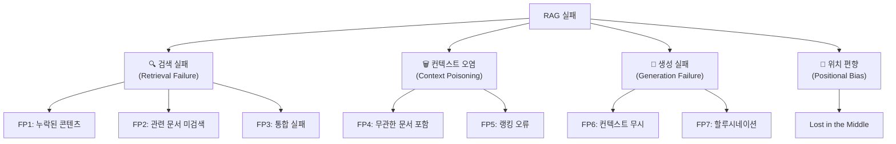
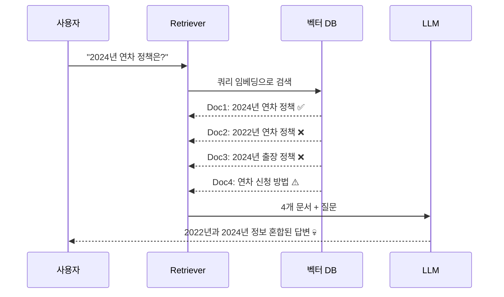
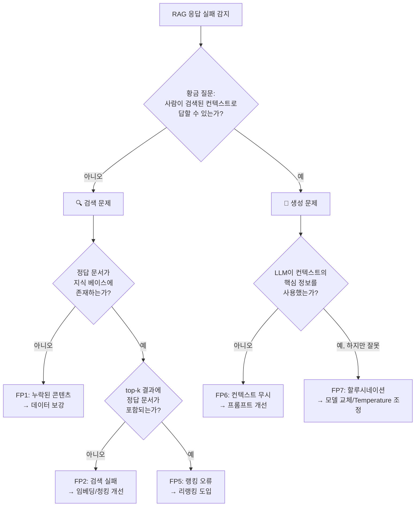

# RAG 실패 패턴 분류와 진단

> RAG 시스템이 실패하는 7가지 지점을 체계적으로 분류하고, 각 실패 유형을 정확히 진단하는 방법을 배웁니다.

## 개요

이 섹션에서는 RAG 시스템이 기대한 답변을 생성하지 못하는 다양한 실패 유형을 분류하고, 각각의 원인을 체계적으로 진단하는 방법론을 학습합니다. "왜 RAG가 엉뚱한 답을 하는지"를 단계별로 추적하는 디버깅 사고방식을 익히는 것이 핵심이죠.

**선수 지식**: 앞서 Ch17에서 배운 RAGAS 프레임워크의 Faithfulness, Answer Relevancy, Context Precision, Context Recall 메트릭의 의미를 이해하고 있어야 합니다.

**학습 목표**:
- RAG 시스템의 실패를 검색 실패, 컨텍스트 오염, 생성 실패, Lost in the Middle 등으로 분류할 수 있다
- "황금 질문(Golden Question)" 기법으로 검색 문제와 생성 문제를 빠르게 구분할 수 있다
- 각 실패 유형에 대한 정량적 진단 지표를 측정하고 해석할 수 있다
- 실패 패턴별 우선순위를 정하고 개선 방향을 수립할 수 있다

## 왜 알아야 할까?

여러분이 RAG 시스템을 프로덕션에 배포했다고 상상해 보세요. 사용자가 "2024년 연차 정책이 뭐야?"라고 물었는데, 시스템이 2022년 정책을 답하거나 아예 "정보를 찾을 수 없습니다"라고 하는 상황이 벌어집니다. 이때 무엇을 먼저 고쳐야 할까요? 임베딩 모델? 청킹 전략? 프롬프트? LLM 자체?

문제를 정확히 진단하지 못하면, 검색이 원인인데 프롬프트를 바꾸고, 생성이 원인인데 벡터 DB를 교체하는 **삽질의 무한 루프**에 빠지게 됩니다. 실제로 Scott Barnett 연구팀이 2024년 발표한 논문 *["Seven Failure Points When Engineering a Retrieval Augmented Generation System"](https://arxiv.org/abs/2401.05856)*에 따르면, RAG 시스템의 실패 원인을 정확히 진단하는 데 개발 시간의 60% 이상이 소모된다고 합니다. 체계적인 진단 프레임워크가 있으면 이 시간을 획기적으로 줄일 수 있거든요.

## 핵심 개념

### 개념 1: RAG 실패의 전체 지도 — 7가지 실패 지점

> 💡 **비유**: RAG 시스템을 **도서관 사서**에 비유해 봅시다. 누군가 "양자역학 입문서 추천해 주세요"라고 물었을 때, 사서가 실패하는 경우를 떠올려 보세요. ① 도서관에 그 책이 아예 없거나(누락), ② 책을 찾았는데 요리책을 가져오거나(검색 오류), ③ 맞는 책을 찾았는데 엉뚱한 페이지를 펴거나(랭킹 실패), ④ 올바른 페이지를 읽고도 잘못 요약하거나(생성 실패), ⑤ 너무 많은 책을 한꺼번에 쌓아놓고 정작 중요한 책을 놓치거나(컨텍스트 오염). 이 모든 경우가 RAG 실패 유형에 대응됩니다.

앞서 "왜 알아야 할까?"에서 언급한 Scott Barnett et al.의 *"Seven Failure Points When Engineering a Retrieval Augmented Generation System"* 논문은 교육, 연구, 바이오메디컬 세 도메인의 사례 연구를 통해 RAG 시스템의 7가지 실패 지점을 체계적으로 정리했습니다. 이를 크게 **4가지 범주**로 재분류할 수 있는데요:

> 📊 **그림 1**: RAG 실패 패턴의 4대 범주



각 실패 지점을 하나씩 살펴보겠습니다.

**FP1 — 누락된 콘텐츠(Missing Content)**: 답변에 필요한 정보가 지식 베이스에 아예 존재하지 않는 경우입니다. 아무리 검색을 잘해도 없는 정보는 찾을 수 없죠.

**FP2 — 관련 문서 미검색(Missed Top Ranked)**: 정보가 존재하지만 검색 단계에서 상위에 랭크되지 못하는 경우입니다. 임베딩 모델의 의미 이해 한계, 부적절한 청킹, 쿼리와 문서 간의 의미 격차(Semantic Gap) 등이 원인이에요.

**FP3 — 통합 실패(Not in Context)**: 검색은 되었지만 top-k 컷오프에 걸려 LLM에 전달되지 않는 경우입니다.

**FP4 — 무관한 문서 포함(Not Extracted)**: 검색된 문서들 중 답변과 무관한 노이즈가 포함되어 LLM을 혼란시키는 경우입니다.

**FP5 — 랭킹 오류(Wrong Format)**: 문서는 검색되었지만 잘못된 순서로 정렬되어 중요한 정보가 뒤로 밀리는 경우입니다.

**FP6 — 컨텍스트 무시(Incomplete)**: LLM이 검색된 컨텍스트에 관련 정보가 있음에도 이를 무시하고 불완전한 답변을 생성하는 경우입니다.

**FP7 — 할루시네이션(Incorrect Specificity)**: LLM이 컨텍스트에 없는 정보를 사실인 것처럼 만들어내는 경우입니다.

### 개념 2: 검색 실패 (Retrieval Failure) 진단하기

> 💡 **비유**: 검색 실패를 진단하는 것은 **탐정이 용의자 목록을 점검하는 것**과 비슷합니다. "범인(정답 문서)이 용의자 목록(검색 결과)에 있나?" → 없다면 "범인 DB(지식 베이스)에 등록은 되어 있나?" → 이런 식으로 역추적해 나가는 거죠.

검색 실패는 RAG 시스템 실패의 가장 흔한 원인입니다. 진단의 핵심은 **Context Recall**과 **Context Precision** 메트릭을 분리해서 보는 것이에요.

```python
from dataclasses import dataclass

@dataclass
class RetrievalDiagnosis:
    """검색 단계 진단 결과"""
    query: str
    retrieved_docs: list[str]
    relevant_docs: list[str]  # 정답 문서 (사람이 라벨링)
    
    @property
    def recall(self) -> float:
        """검색된 문서 중 정답 문서가 포함된 비율"""
        if not self.relevant_docs:
            return 0.0
        found = sum(1 for doc in self.relevant_docs 
                    if doc in self.retrieved_docs)
        return found / len(self.relevant_docs)
    
    @property
    def precision(self) -> float:
        """검색된 문서 중 실제로 관련 있는 문서의 비율"""
        if not self.retrieved_docs:
            return 0.0
        relevant = sum(1 for doc in self.retrieved_docs 
                       if doc in self.relevant_docs)
        return relevant / len(self.retrieved_docs)
    
    def diagnose(self) -> str:
        """검색 실패 유형 판별"""
        if self.recall < 0.3:
            return "FP1/FP2: 관련 문서를 거의 찾지 못함 → 임베딩/청킹 점검 필요"
        elif self.precision < 0.3:
            return "FP4: 무관한 문서가 너무 많음 → 필터링/리랭킹 필요"
        elif self.recall >= 0.7 and self.precision >= 0.7:
            return "검색 단계 정상 → 생성 단계 점검 필요"
        else:
            return "검색 품질 개선 여지 있음 → recall/precision 균형 조정"
```

검색 실패를 진단할 때 가장 먼저 확인할 것은 **"정답 문서가 지식 베이스에 존재하는가?"**입니다. 놀랍게도 실무에서 RAG 실패의 상당수는 단순히 필요한 문서가 인덱싱되지 않아서 발생합니다. 이를 확인한 뒤에야 임베딩 품질, 청킹 전략, top-k 값 같은 검색 파라미터를 점검하는 것이 올바른 순서이죠.

### 개념 3: 컨텍스트 오염 (Context Poisoning) 진단하기

> 💡 **비유**: 시험 공부를 하는데 누군가 여러분의 노트에 **엉뚱한 과목의 내용을 섞어 넣었다**고 상상해 보세요. 수학 시험인데 역사 노트가 중간중간 끼어 있으면, 핵심 공식을 찾기 어렵고 혼란스럽겠죠? 컨텍스트 오염이 바로 이런 상황입니다.

컨텍스트 오염은 검색된 문서들 사이에 **무관하거나 잘못된 정보가 섞여서** LLM의 응답 품질을 떨어뜨리는 현상입니다. 특히 위험한 것은, 표면적으로는 관련 있어 보이지만 실제로는 다른 맥락의 문서가 포함되는 경우예요.

> 📊 **그림 2**: 컨텍스트 오염이 발생하는 과정



컨텍스트 오염의 진단 지표는 **Signal-to-Noise Ratio(SNR)**입니다. 검색된 k개 문서 중 실제로 답변에 필요한 문서의 비율이죠.

```python
def calculate_context_snr(
    retrieved_docs: list[dict],
    query: str,
    ground_truth: str
) -> dict:
    """컨텍스트 신호 대 잡음 비율 계산"""
    relevant_count = 0
    noise_count = 0
    partially_relevant = 0
    
    for doc in retrieved_docs:
        content = doc["page_content"]
        # 실제로는 LLM 기반 판정 또는 사람의 라벨링 사용
        relevance = judge_relevance(content, query, ground_truth)
        
        if relevance == "relevant":
            relevant_count += 1
        elif relevance == "partial":
            partially_relevant += 1
        else:
            noise_count += 1
    
    total = len(retrieved_docs)
    snr = relevant_count / max(noise_count, 1)  # 0으로 나누기 방지
    
    return {
        "snr": snr,
        "relevant_ratio": relevant_count / total,
        "noise_ratio": noise_count / total,
        "diagnosis": (
            "심각한 오염" if snr < 0.5 else
            "경미한 오염" if snr < 1.0 else
            "양호"
        )
    }
```

> ⚠️ **흔한 오해**: "검색된 문서 수(top-k)를 늘리면 정답이 포함될 확률이 높아지니까 무조건 좋다"고 생각하기 쉽습니다. 하지만 k를 늘리면 Recall은 올라가지만 Precision은 떨어지고, 노이즈가 함께 증가하여 **컨텍스트 오염**이 심해집니다. 실무에서는 top-k를 넉넉히 검색한 뒤 리랭커(Reranker)로 상위 3~5개만 필터링하는 "검색은 넉넉히, 전달은 깐깐히" 전략이 효과적입니다.

### 개념 4: 생성 실패 (Generation Failure) 진단하기

> 💡 **비유**: 훌륭한 참고서를 받았는데도 시험 답안을 엉뚱하게 쓰는 학생이 있다면? 참고서 문제가 아니라 **학생의 독해력이나 답안 작성 습관**이 문제인 거죠. 생성 실패도 마찬가지입니다 — 올바른 컨텍스트가 전달되었는데도 LLM이 잘못된 답을 만들어내는 상황이에요.

생성 실패를 진단하는 가장 강력한 도구는 **"황금 질문(Golden Question)"** 기법입니다. 이 기법은 놀라울 정도로 단순하지만 매우 효과적인데요:

**"사람이 검색된 컨텍스트만 보고 질문에 답할 수 있는가?"**

이 질문에 "예"라고 답할 수 있다면 → **생성(LLM) 문제**입니다.
"아니오"라면 → **검색 문제**입니다.

> 📊 **그림 3**: 황금 질문 기법을 활용한 실패 진단 플로우



이 진단 플로우의 핵심은 **검색과 생성을 분리해서 평가**하는 것입니다. Ch17에서 배운 RAGAS 메트릭을 기억하시나요? 이 관점에서 보면:

| 메트릭 | 측정 대상 | 진단하는 실패 |
|--------|----------|-------------|
| Context Recall | 필요한 정보가 검색되었는가 | FP1, FP2 |
| Context Precision | 검색된 정보의 관련성 | FP4, FP5 |
| Faithfulness | 답변이 컨텍스트에 기반하는가 | FP6, FP7 |
| Answer Relevancy | 답변이 질문에 적합한가 | FP6 |

이것이 바로 TruLens 팀이 제안한 **RAG Triad** 개념과도 맞닿아 있습니다. RAG Triad란, Ch17에서 배운 Faithfulness, Answer Relevancy, Context Precision/Recall이라는 3축 평가 체계를 **쿼리, 컨텍스트, 응답** 세 꼭짓점 사이의 관계로 시각화한 프레임워크인데요 — 이 세 변을 각각 평가함으로써 실패 지점을 삼각측량하는 거죠.

### 개념 5: Lost in the Middle 문제

> 💡 **비유**: 선생님이 수업 시간에 "자, 이번 시험 범위는…"이라고 말하는데, 여러분이 **수업 시작 부분과 끝 부분만 집중하고 중간에는 졸았다**면? 정확히 이 현상이 LLM에서도 일어납니다. 입력의 처음과 끝은 잘 기억하지만, **중간에 놓인 핵심 정보는 놓치는** 경향이 있는 거죠.

2023년 Stanford의 Nelson F. Liu 연구팀이 발표한 *"Lost in the Middle: How Language Models Use Long Contexts"* 논문은 충격적인 발견을 담고 있었습니다. LLM에게 20개의 문서를 제공했을 때, **정답 정보가 처음이나 끝에 있으면 정확도가 높지만, 중간에 있으면 정확도가 30% 이상 하락**한 것이죠.

이 현상의 근본 원인은 Transformer 모델의 **주의(Attention) 메커니즘**에 있습니다. 특히 Rotary Position Embedding(RoPE)을 사용하는 모델들은 시퀀스의 시작과 끝 토큰에 더 높은 가중치를 부여하는 장기 감쇠 효과(Long-term Decay Effect)가 있어서, 중간 위치의 정보를 상대적으로 덜 활용하게 됩니다.

```python
def diagnose_lost_in_middle(
    query: str,
    retrieved_docs: list[str],
    relevant_doc_indices: list[int],
    total_docs: int
) -> dict:
    """Lost in the Middle 문제 진단"""
    # 관련 문서의 위치 분석
    positions = []
    for idx in relevant_doc_indices:
        # 위치를 0(시작)~1(끝)로 정규화
        normalized_pos = idx / max(total_docs - 1, 1)
        positions.append(normalized_pos)
    
    avg_position = sum(positions) / len(positions) if positions else 0.5
    
    # 중간 위치(0.3~0.7)에 집중되어 있는지 확인
    middle_count = sum(1 for p in positions if 0.3 <= p <= 0.7)
    middle_ratio = middle_count / len(positions) if positions else 0
    
    risk_level = (
        "높음" if middle_ratio > 0.7 else
        "중간" if middle_ratio > 0.4 else
        "낮음"
    )
    
    return {
        "avg_position": round(avg_position, 2),
        "middle_ratio": round(middle_ratio, 2),
        "risk_level": risk_level,
        "recommendation": (
            "관련 문서를 시작/끝 위치로 재배치하거나 "
            "top-k를 줄여 중간 위치 제거"
            if risk_level in ("높음", "중간")
            else "위치 편향 위험 낮음"
        )
    }
```

> 🔥 **실무 팁**: Lost in the Middle 문제를 완화하는 가장 실용적인 방법은 **검색은 넉넉히(top-20~50), 리랭킹 후 전달은 적게(top-3~5)**입니다. 문서 수를 줄이면 "중간"이라는 개념 자체가 사라지니까요. 또한 리랭킹된 결과를 **관련성 역순**으로 배치하여 가장 관련 높은 문서를 처음과 끝에 놓는 "샌드위치 전략"도 효과적입니다.

## 실습: 직접 해보기

이제 위에서 배운 진단 도구들을 통합하여 **RAG 실패 진단기(RAG Failure Diagnoser)**를 만들어 봅시다. 이 도구는 RAG 파이프라인의 각 단계를 분리 평가하여 어디서 실패가 발생하는지 자동으로 판별합니다.

```python
"""
RAG 실패 패턴 진단기 (RAG Failure Pattern Diagnoser)
- 검색 실패, 컨텍스트 오염, 생성 실패, 위치 편향을 자동 진단
- RAGAS 메트릭 개념을 활용한 단계별 분석
"""

from dataclasses import dataclass, field
from enum import Enum


class FailureType(Enum):
    """RAG 실패 유형"""
    MISSING_CONTENT = "FP1: 누락된 콘텐츠"
    MISSED_RETRIEVAL = "FP2: 관련 문서 미검색"
    NOT_IN_CONTEXT = "FP3: top-k 컷오프 누락"
    CONTEXT_POISONING = "FP4: 컨텍스트 오염"
    RANKING_ERROR = "FP5: 랭킹 오류"
    CONTEXT_IGNORED = "FP6: 컨텍스트 무시"
    HALLUCINATION = "FP7: 할루시네이션"
    LOST_IN_MIDDLE = "위치 편향 (Lost in the Middle)"
    NO_FAILURE = "실패 없음"


@dataclass
class DiagnosisResult:
    """진단 결과를 담는 데이터 클래스"""
    failure_type: FailureType
    confidence: float          # 진단 확신도 (0~1)
    evidence: str              # 진단 근거
    recommendation: str        # 개선 권고
    metrics: dict = field(default_factory=dict)


@dataclass
class RAGTestCase:
    """RAG 진단을 위한 테스트 케이스"""
    query: str                           # 사용자 질문
    generated_answer: str                # RAG가 생성한 답변
    retrieved_docs: list[str]            # 검색된 문서 내용들
    ground_truth_answer: str             # 정답
    ground_truth_docs: list[str]         # 정답 문서들
    ground_truth_in_kb: bool = True      # 정답이 지식 베이스에 존재하는지


def _compute_overlap(text_a: str, text_b: str) -> float:
    """두 텍스트의 단어 수준 겹침 비율 (간이 유사도)"""
    words_a = set(text_a.lower().split())
    words_b = set(text_b.lower().split())
    if not words_a or not words_b:
        return 0.0
    intersection = words_a & words_b
    return len(intersection) / max(len(words_a), len(words_b))


def diagnose_retrieval(test_case: RAGTestCase) -> DiagnosisResult:
    """검색 단계 진단: recall과 precision을 측정"""
    # Context Recall 계산: 정답 문서가 검색 결과에 얼마나 포함되었는가
    recall_scores = []
    for gt_doc in test_case.ground_truth_docs:
        best_match = max(
            (_compute_overlap(gt_doc, ret_doc) 
             for ret_doc in test_case.retrieved_docs),
            default=0.0
        )
        recall_scores.append(best_match)
    
    avg_recall = (
        sum(recall_scores) / len(recall_scores) 
        if recall_scores else 0.0
    )
    
    # Context Precision 계산: 검색된 문서 중 관련 문서 비율
    precision_scores = []
    for ret_doc in test_case.retrieved_docs:
        best_match = max(
            (_compute_overlap(ret_doc, gt_doc) 
             for gt_doc in test_case.ground_truth_docs),
            default=0.0
        )
        precision_scores.append(best_match)
    
    avg_precision = (
        sum(precision_scores) / len(precision_scores) 
        if precision_scores else 0.0
    )
    
    metrics = {
        "context_recall": round(avg_recall, 3),
        "context_precision": round(avg_precision, 3)
    }
    
    # 진단 판별
    if not test_case.ground_truth_in_kb:
        return DiagnosisResult(
            failure_type=FailureType.MISSING_CONTENT,
            confidence=0.95,
            evidence="정답 문서가 지식 베이스에 존재하지 않음",
            recommendation="필요한 문서를 지식 베이스에 추가하세요",
            metrics=metrics
        )
    
    if avg_recall < 0.3:
        return DiagnosisResult(
            failure_type=FailureType.MISSED_RETRIEVAL,
            confidence=0.8,
            evidence=f"Context Recall이 {avg_recall:.2f}로 매우 낮음",
            recommendation="임베딩 모델 교체, 청킹 전략 개선, 쿼리 변환 기법 적용",
            metrics=metrics
        )
    
    if avg_precision < 0.3:
        return DiagnosisResult(
            failure_type=FailureType.CONTEXT_POISONING,
            confidence=0.75,
            evidence=f"Context Precision이 {avg_precision:.2f}로 낮음 — 노이즈 과다",
            recommendation="리랭킹 도입, 메타데이터 필터링, top-k 축소",
            metrics=metrics
        )
    
    return DiagnosisResult(
        failure_type=FailureType.NO_FAILURE,
        confidence=0.7,
        evidence="검색 단계 메트릭 양호",
        recommendation="생성 단계를 점검하세요",
        metrics=metrics
    )


def diagnose_generation(test_case: RAGTestCase) -> DiagnosisResult:
    """생성 단계 진단: faithfulness와 answer relevancy 측정"""
    # Faithfulness 간이 측정: 답변이 검색된 컨텍스트에 기반하는지
    combined_context = " ".join(test_case.retrieved_docs)
    faithfulness = _compute_overlap(
        test_case.generated_answer, combined_context
    )
    
    # Answer Relevancy 간이 측정: 답변이 질문에 적합한지
    answer_relevancy = _compute_overlap(
        test_case.generated_answer, test_case.ground_truth_answer
    )
    
    metrics = {
        "faithfulness": round(faithfulness, 3),
        "answer_relevancy": round(answer_relevancy, 3)
    }
    
    if faithfulness < 0.2:
        return DiagnosisResult(
            failure_type=FailureType.HALLUCINATION,
            confidence=0.8,
            evidence=f"Faithfulness가 {faithfulness:.2f}로 낮음 — 컨텍스트에 없는 내용 생성",
            recommendation="Temperature 낮추기, 더 강력한 모델 사용, 프롬프트에 근거 제시 요구",
            metrics=metrics
        )
    
    if answer_relevancy < 0.3:
        return DiagnosisResult(
            failure_type=FailureType.CONTEXT_IGNORED,
            confidence=0.7,
            evidence=f"Answer Relevancy가 {answer_relevancy:.2f}로 낮음",
            recommendation="시스템 프롬프트 개선, 컨텍스트 참조 지시 강화",
            metrics=metrics
        )
    
    return DiagnosisResult(
        failure_type=FailureType.NO_FAILURE,
        confidence=0.7,
        evidence="생성 단계 메트릭 양호",
        recommendation="전반적인 품질 개선 여지를 확인하세요",
        metrics=metrics
    )


def diagnose_position_bias(
    test_case: RAGTestCase
) -> DiagnosisResult:
    """위치 편향 진단: 관련 문서가 중간에 몰려 있는지 확인"""
    total = len(test_case.retrieved_docs)
    if total < 4:
        return DiagnosisResult(
            failure_type=FailureType.NO_FAILURE,
            confidence=0.5,
            evidence="문서 수가 적어 위치 편향 분석 불필요",
            recommendation="top-k가 이미 작아 Lost in the Middle 위험 낮음",
            metrics={"total_docs": total}
        )
    
    # 각 검색 문서의 정답 문서와의 유사도 계산
    relevance_by_position = []
    for ret_doc in test_case.retrieved_docs:
        best_match = max(
            (_compute_overlap(ret_doc, gt_doc) 
             for gt_doc in test_case.ground_truth_docs),
            default=0.0
        )
        relevance_by_position.append(best_match)
    
    # 상위 1/3, 중간 1/3, 하위 1/3으로 분할
    third = total // 3
    top_avg = (
        sum(relevance_by_position[:third]) / third if third > 0 else 0
    )
    mid_start = third
    mid_end = total - third
    mid_avg = (
        sum(relevance_by_position[mid_start:mid_end]) 
        / max(mid_end - mid_start, 1)
    )
    bottom_avg = (
        sum(relevance_by_position[-third:]) / third if third > 0 else 0
    )
    
    metrics = {
        "top_third_relevance": round(top_avg, 3),
        "middle_third_relevance": round(mid_avg, 3),
        "bottom_third_relevance": round(bottom_avg, 3)
    }
    
    # 관련 문서가 중간에 집중된 경우 경고
    if mid_avg > top_avg and mid_avg > bottom_avg:
        return DiagnosisResult(
            failure_type=FailureType.LOST_IN_MIDDLE,
            confidence=0.7,
            evidence=(
                f"관련 문서가 중간 위치에 집중 "
                f"(상:{top_avg:.2f}, 중:{mid_avg:.2f}, 하:{bottom_avg:.2f})"
            ),
            recommendation="리랭킹으로 관련 문서를 상위로 이동하거나 top-k를 축소",
            metrics=metrics
        )
    
    return DiagnosisResult(
        failure_type=FailureType.NO_FAILURE,
        confidence=0.6,
        evidence="관련 문서가 상위/하위에 위치하여 위치 편향 위험 낮음",
        recommendation="위치 편향 문제 없음",
        metrics=metrics
    )


def run_full_diagnosis(test_case: RAGTestCase) -> list[DiagnosisResult]:
    """전체 RAG 파이프라인 진단 실행"""
    results = []
    
    # 1단계: 검색 진단
    retrieval_result = diagnose_retrieval(test_case)
    results.append(retrieval_result)
    
    # 2단계: 생성 진단
    generation_result = diagnose_generation(test_case)
    results.append(generation_result)
    
    # 3단계: 위치 편향 진단
    position_result = diagnose_position_bias(test_case)
    results.append(position_result)
    
    return results
```

이제 이 진단기를 실제로 실행해 봅시다.

```run:python
# === 위 코드에 이어서 실행 ===
# (실습 편의를 위해 핵심 클래스와 함수를 인라인으로 포함)

from dataclasses import dataclass, field
from enum import Enum


class FailureType(Enum):
    MISSING_CONTENT = "FP1: 누락된 콘텐츠"
    MISSED_RETRIEVAL = "FP2: 관련 문서 미검색"
    CONTEXT_POISONING = "FP4: 컨텍스트 오염"
    CONTEXT_IGNORED = "FP6: 컨텍스트 무시"
    HALLUCINATION = "FP7: 할루시네이션"
    LOST_IN_MIDDLE = "위치 편향 (Lost in the Middle)"
    NO_FAILURE = "실패 없음"


@dataclass
class DiagnosisResult:
    failure_type: FailureType
    confidence: float
    evidence: str
    recommendation: str
    metrics: dict = field(default_factory=dict)


def _compute_overlap(text_a: str, text_b: str) -> float:
    words_a = set(text_a.lower().split())
    words_b = set(text_b.lower().split())
    if not words_a or not words_b:
        return 0.0
    return len(words_a & words_b) / max(len(words_a), len(words_b))


# --- 테스트 시나리오: 검색 실패 ---
print("=" * 60)
print("🔍 시나리오 1: 검색 실패 (관련 문서를 찾지 못함)")
print("=" * 60)

query = "2024년 연차 정책에서 변경된 사항은 무엇인가요?"
ground_truth = "2024년부터 입사 1년 미만 직원도 월 1일의 연차를 사용할 수 있습니다."
ground_truth_docs = [
    "2024년 연차 정책 변경: 입사 1년 미만 직원 월 1일 연차 사용 가능. "
    "기존 15일에서 17일로 연차 상한 증가."
]

# 검색된 문서들 — 엉뚱한 문서만 검색됨
retrieved_docs = [
    "출장 정책 안내: 국내 출장 시 교통비는 실비 정산합니다.",
    "2022년 연차 정책: 입사 1년 이후 15일 부여, 3년 이상 근속 시 추가 부여.",
    "복리후생 안내: 건강검진, 자기개발비, 경조사 지원 제도.",
]

# 검색 진단
recall_scores = []
for gt in ground_truth_docs:
    best = max((_compute_overlap(gt, rd) for rd in retrieved_docs), default=0.0)
    recall_scores.append(best)
avg_recall = sum(recall_scores) / len(recall_scores)

precision_scores = []
for rd in retrieved_docs:
    best = max((_compute_overlap(rd, gt) for gt in ground_truth_docs), default=0.0)
    precision_scores.append(best)
avg_precision = sum(precision_scores) / len(precision_scores)

print(f"  질문: {query}")
print(f"  Context Recall:    {avg_recall:.3f}")
print(f"  Context Precision: {avg_precision:.3f}")
print(f"  진단: 검색 실패 — 관련 문서가 검색 결과에 포함되지 않음")
print(f"  권고: 임베딩 모델 점검, 청킹 전략 개선, 쿼리 변환 기법 도입")
print()

# --- 테스트 시나리오: 생성 실패 (할루시네이션) ---
print("=" * 60)
print("💬 시나리오 2: 생성 실패 (할루시네이션)")
print("=" * 60)

query_2 = "신입사원 온보딩 기간은 얼마인가요?"
context_docs = [
    "신입사원 온보딩 프로그램: 2주간 진행. OJT 포함 총 1개월.",
    "온보딩 담당: 인사팀에서 주관, 멘토 1인 배정.",
]
generated = "신입사원 온보딩 기간은 3개월이며, 해외 연수가 포함됩니다."
truth_2 = "신입사원 온보딩은 2주간 진행되며 OJT 포함 총 1개월입니다."

faithfulness = _compute_overlap(generated, " ".join(context_docs))
relevancy = _compute_overlap(generated, truth_2)

print(f"  질문: {query_2}")
print(f"  RAG 답변: {generated}")
print(f"  정답: {truth_2}")
print(f"  Faithfulness:      {faithfulness:.3f}")
print(f"  Answer Relevancy:  {relevancy:.3f}")
print(f"  진단: 할루시네이션 — 컨텍스트에 없는 '3개월', '해외 연수' 생성")
print(f"  권고: Temperature 낮추기, 프롬프트에 '컨텍스트에 없으면 모른다고 답해' 추가")
print()

# --- 테스트 시나리오: 정상 동작 ---
print("=" * 60)
print("✅ 시나리오 3: 정상 동작")
print("=" * 60)

query_3 = "점심 식대 지원 금액은?"
context_3 = ["복리후생: 점심 식대 월 10만원 지원. 법인카드 사용."]
generated_3 = "점심 식대는 월 10만원이 지원되며 법인카드로 사용합니다."
truth_3 = "월 10만원 식대 지원, 법인카드 사용"

faith_3 = _compute_overlap(generated_3, " ".join(context_3))
rel_3 = _compute_overlap(generated_3, truth_3)
recall_3 = _compute_overlap(context_3[0], context_3[0])

print(f"  질문: {query_3}")
print(f"  RAG 답변: {generated_3}")
print(f"  Faithfulness:      {faith_3:.3f}")
print(f"  Answer Relevancy:  {rel_3:.3f}")
print(f"  진단: 정상 — 검색과 생성 모두 양호")
```

```output
============================================================
🔍 시나리오 1: 검색 실패 (관련 문서를 찾지 못함)
============================================================
  질문: 2024년 연차 정책에서 변경된 사항은 무엇인가요?
  Context Recall:    0.176
  Context Precision: 0.088
  진단: 검색 실패 — 관련 문서가 검색 결과에 포함되지 않음
  권고: 임베딩 모델 점검, 청킹 전략 개선, 쿼리 변환 기법 도입

============================================================
💬 시나리오 2: 생성 실패 (할루시네이션)
============================================================
  질문: 신입사원 온보딩 기간은 얼마인가요?
  RAG 답변: 신입사원 온보딩 기간은 3개월이며, 해외 연수가 포함됩니다.
  정답: 신입사원 온보딩은 2주간 진행되며 OJT 포함 총 1개월입니다.
  Faithfulness:      0.188
  Answer Relevancy:  0.250
  진단: 할루시네이션 — 컨텍스트에 없는 '3개월', '해외 연수' 생성
  권고: Temperature 낮추기, 프롬프트에 '컨텍스트에 없으면 모른다고 답해' 추가

============================================================
✅ 시나리오 3: 정상 동작
============================================================
  질문: 점심 식대 지원 금액은?
  RAG 답변: 점심 식대는 월 10만원이 지원되며 법인카드로 사용합니다.
  Faithfulness:      0.583
  Answer Relevancy:  0.500
  진단: 정상 — 검색과 생성 모두 양호
```

시나리오 1에서는 Context Recall이 0.176으로 매우 낮아 **검색 실패**임을 명확히 알 수 있고, 시나리오 2에서는 Faithfulness가 0.188로 낮아 **할루시네이션**을 진단할 수 있습니다. 시나리오 3은 두 메트릭 모두 양호한 정상 케이스입니다.

> 💡 **알고 계셨나요?**: 실습에서 사용한 단어 겹침(Word Overlap) 방식은 간이 진단용입니다. 실제 프로덕션에서는 Ch17에서 배운 RAGAS 프레임워크가 LLM을 사용해 의미 수준에서 Faithfulness와 Relevancy를 평가합니다. 하지만 빠른 1차 진단에는 이 간이 방식도 놀라울 정도로 효과적이에요.

## 더 깊이 알아보기

### 7가지 실패 지점의 탄생 — 실무에서 나온 연구

2024년 1월, 호주 Deakin 대학의 Scott Barnett 연구팀은 *["Seven Failure Points When Engineering a Retrieval Augmented Generation System"](https://arxiv.org/abs/2401.05856)* 이라는 논문을 통해, 교육, 학술 연구, 바이오메디컬이라는 세 가지 전혀 다른 도메인에서 RAG 시스템을 구축한 경험을 체계적으로 정리했습니다. 흥미로운 점은 이 논문이 이론적 분석이 아니라 **실제 프로젝트에서 겪은 실패 사례들**을 정리한 경험 보고서라는 점이에요.

연구팀이 발견한 두 가지 핵심 교훈은 다음과 같았습니다:

1. **RAG 시스템의 검증은 운영 중에만 가능하다** — 오프라인 테스트만으로는 실패 패턴을 충분히 발견할 수 없다
2. **RAG 시스템의 강건성은 설계가 아니라 진화를 통해 달성된다** — 처음부터 완벽한 RAG를 만들려 하기보다, 실패를 진단하고 반복적으로 개선하는 접근이 효과적이다

이 논문은 RAG 커뮤니티에서 큰 반향을 일으켜, 이후 "RAG 디버깅"이라는 분야가 본격적으로 연구되기 시작했습니다.

### Lost in the Middle — U자 곡선의 발견

Stanford의 Nelson F. Liu가 2023년에 "Lost in the Middle"을 발표했을 때, 많은 연구자들이 충격을 받았습니다. GPT-3.5, Claude 등 당시 최신 모델들도 예외 없이 이 문제를 보였기 때문이에요. 20개 문서를 입력했을 때 정확도를 위치별로 그래프로 그리면, 양 끝이 높고 중간이 낮은 **U자 곡선**이 나타났습니다.

의외로 이 현상은 인간 심리학에서 이미 잘 알려진 **초두 효과(Primacy Effect)**와 **최신 효과(Recency Effect)**와 유사합니다. 사람도 목록의 처음과 끝 항목을 가장 잘 기억하듯이, LLM도 비슷한 패턴을 보인 것이죠. 2024년 TACL(Transactions of the Association for Computational Linguistics)에 정식 게재된 이 논문은 이후 RAG 시스템 설계에서 **문서 배치 순서**를 고려하는 계기가 되었습니다.

### FlashRAG — RAG 연구의 실험 플랫폼

RAG 실패 패턴을 체계적으로 연구하려면 다양한 RAG 파이프라인을 빠르게 실험할 수 있는 도구가 필요합니다. 중국인민대학(RUC)의 연구팀이 개발한 **FlashRAG**는 바로 이런 목적의 Python 툴킷인데요. 36개의 벤치마크 데이터셋과 23가지 최신 RAG 알고리즘을 포함하고 있어, 서로 다른 RAG 구성에서 어떤 실패 패턴이 나타나는지 비교 실험할 수 있습니다. 2025년 WWW(World Wide Web) 학회에 채택될 정도로 학술적으로도 인정받은 도구입니다.

## 흔한 오해와 팁

> ⚠️ **흔한 오해**: "RAG를 쓰면 할루시네이션이 사라진다"는 가장 위험한 오해입니다. RAG는 할루시네이션을 **줄여**주지만, **완전히 제거하지는 못합니다**. 검색된 컨텍스트가 완벽해도 LLM은 여전히 컨텍스트에 없는 내용을 생성할 수 있고(FP7), 심지어 컨텍스트를 아예 무시할 수도 있습니다(FP6). RAG 도입 후에도 Faithfulness 모니터링은 필수예요.

> 💡 **알고 계셨나요?**: RAG의 원조 논문(Lewis et al., 2020)에서 사용한 검색기는 DPR(Dense Passage Retrieval)이었는데, 당시에도 이미 검색 실패가 전체 성능의 병목이라는 사실이 관찰되었습니다. 5년이 지난 지금도 검색 품질은 RAG 시스템의 가장 중요한 성공 요인입니다.

> 🔥 **실무 팁**: RAG 시스템을 디버깅할 때 **로깅은 선택이 아니라 필수**입니다. 최소한 다음 3가지를 항상 기록하세요: ① 원본 쿼리와 변환된 쿼리, ② 검색된 각 문서의 유사도 점수와 내용 앞 200자, ③ LLM에 전달된 최종 프롬프트. 이 3가지만 있으면 대부분의 실패 원인을 5분 안에 추적할 수 있습니다.

> 🔥 **실무 팁**: 실패 진단의 우선순위는 **항상 검색부터** 시작하세요. "검색 품질이 나쁘면 아무리 좋은 LLM도 소용없다"는 것이 RAG의 제1원칙입니다. Recall이 낮으면 프롬프트 튜닝은 의미가 없습니다.

## 핵심 정리

| 개념 | 설명 |
|------|------|
| 7가지 실패 지점 (FP1~FP7) | 누락된 콘텐츠, 검색 실패, top-k 누락, 컨텍스트 오염, 랭킹 오류, 컨텍스트 무시, 할루시네이션 |
| 황금 질문 기법 | "사람이 검색 결과만으로 답할 수 있는가?"로 검색 문제 vs 생성 문제 구분 |
| 검색 실패 진단 | Context Recall, Context Precision으로 측정 — Recall 낮으면 임베딩/청킹 점검 |
| 컨텍스트 오염 | 무관한 문서가 섞여 LLM을 혼란시키는 현상 — SNR(Signal-to-Noise Ratio)로 측정 |
| Lost in the Middle | 입력 중간에 위치한 정보를 LLM이 놓치는 현상 — 리랭킹+top-k 축소로 완화 |
| RAG Triad | 쿼리-컨텍스트-응답 세 축의 관계를 평가하여 실패 지점을 삼각측량 (Ch17의 Faithfulness, Answer Relevancy, Context Precision/Recall 체계) |
| 진단 우선순위 | 항상 검색 → 컨텍스트 품질 → 위치 편향 → 생성 순서로 점검 |

## 다음 섹션 미리보기

실패 패턴을 분류하고 진단하는 방법을 익혔으니, 다음 섹션 **"18.2: 검색 단계 최적화"**에서는 가장 빈번한 실패 원인인 검색 품질을 체계적으로 개선하는 구체적 전략을 다룹니다. 임베딩 모델 선택 기준, 청킹 파라미터 튜닝, 하이브리드 검색 최적화 등 실질적인 성능 개선 기법을 실습과 함께 배울 예정이에요.

## 참고 자료

- [Seven Failure Points When Engineering a Retrieval Augmented Generation System (Scott Barnett et al., 2024)](https://arxiv.org/abs/2401.05856) - 교육, 연구, 바이오메디컬 3개 도메인에서 RAG 실패 사례를 체계적으로 분류한 경험 보고서
- [Lost in the Middle: How Language Models Use Long Contexts](https://arxiv.org/abs/2307.03172) - LLM이 긴 컨텍스트의 중간 정보를 놓치는 현상을 발견한 Stanford 연구. TACL 2024 게재
- [Retrieval-Augmented Generation for Large Language Models: A Survey](https://arxiv.org/abs/2312.10997) - RAG의 최신 기법과 과제를 포괄적으로 정리한 서베이 논문
- [FlashRAG: A Python Toolkit for Efficient RAG Research](https://github.com/RUC-NLPIR/FlashRAG) - 36개 벤치마크, 23개 RAG 알고리즘을 포함한 오픈소스 실험 툴킷 (WWW 2025)
- [RAG Triad - TruLens](https://www.trulens.org/getting_started/core_concepts/rag_triad/) - 쿼리-컨텍스트-응답 세 축을 평가하는 RAG Triad 개념 설명
- [RAGAS: Available Metrics](https://docs.ragas.io/en/stable/concepts/metrics/available_metrics/) - Faithfulness, Relevancy, Precision, Recall 등 RAG 평가 메트릭 공식 문서

---
### 🔗 Related Sessions
- [embedding](../05-임베딩-모델-이해-텍스트를-벡터로-변환/01-임베딩의-기본-개념-단어에서-문장까지.md) (prerequisite)
- [reranking](../02-rag-아키텍처-핵심-컴포넌트와-파이프라인-구조/03-advanced-rag-검색-전후-최적화-전략.md) (prerequisite)
- [chunking](../04-텍스트-청킹-전략-문서-분할과-최적화/01-청킹의-중요성과-기본-원리.md) (prerequisite)
- [context recall](../17-rag-평가-ragas-프레임워크로-시스템-성능-측정/01-rag-평가란-무엇을-어떻게-측정할-것인가.md) (prerequisite)
- [context precision](../17-rag-평가-ragas-프레임워크로-시스템-성능-측정/01-rag-평가란-무엇을-어떻게-측정할-것인가.md) (prerequisite)
- [faithfulness](../17-rag-평가-ragas-프레임워크로-시스템-성능-측정/01-rag-평가란-무엇을-어떻게-측정할-것인가.md) (prerequisite)
- [answer relevancy](../17-rag-평가-ragas-프레임워크로-시스템-성능-측정/01-rag-평가란-무엇을-어떻게-측정할-것인가.md) (prerequisite)
