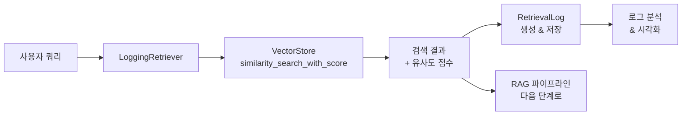
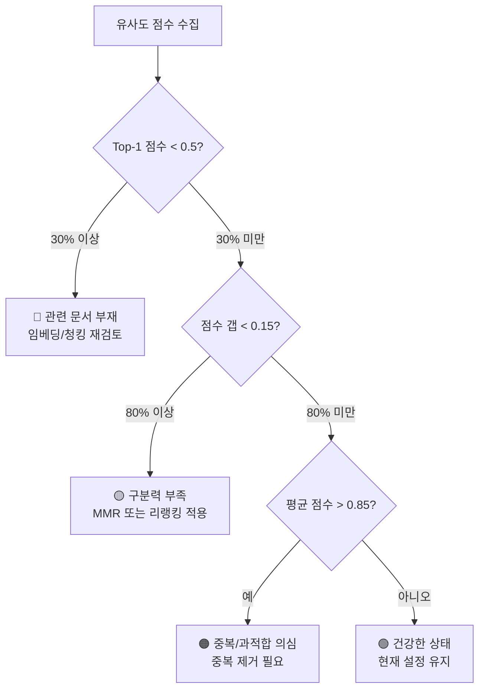
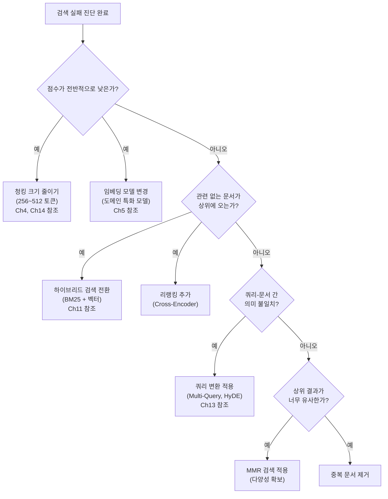

# 검색 단계 디버깅과 최적화

> 검색 결과를 로깅하고 분석하여 RAG 검색 품질을 체계적으로 개선하는 방법을 배웁니다.

## 개요

이 섹션에서는 RAG 파이프라인에서 **검색 단계**를 집중적으로 디버깅하고 최적화하는 방법을 다룹니다. 앞서 [18.1: RAG 실패 패턴 분류와 진단](18-rag-최적화와-디버깅-성능-개선-전략/01-rag-실패-패턴-분류와-진단.md)에서 실패 유형을 분류하고 "검색부터 먼저 진단하라"는 원칙을 배웠는데요, 이번 세션에서는 그 진단 결과를 기반으로 **구체적인 해결책**을 적용하는 단계로 넘어갑니다.

좋은 소식이 있습니다. 이번 세션에서 다루는 기법 대부분은 **이미 배운 개념의 실전 적용**이에요. [Ch5-6](05-임베딩-모델-이해-텍스트를-벡터로-변환/01-임베딩의-기본-개념-단어에서-문장까지.md)에서 벡터 검색과 유사도 점수를, [Ch10-11](10-검색-품질-향상-유사도-검색과-메타데이터-필터링/01-유사도-검색-심화-top-k와-임계값-최적화.md)에서 검색 평가와 하이브리드 검색을 배웠죠? 이번에는 그 지식을 "디버깅"이라는 렌즈로 다시 바라보는 겁니다.

**선수 지식**: RAG 실패 패턴 7가지(18.1), 벡터 검색과 유사도 계산(Ch5-6), 검색 평가 메트릭(Ch10), 하이브리드 검색(Ch11)
**학습 목표**:
- 검색 결과를 체계적으로 로깅하고 유사도 점수 분포를 분석할 수 있다
- 쿼리-문서 유사도 히스토그램을 시각화하여 검색 품질을 판단할 수 있다
- 검색 실패 원인(청킹, 임베딩, 검색 방식, 쿼리 변환)에 맞는 해결책을 선택할 수 있다
- 검색 파라미터 그리드 서치로 최적 설정을 자동 탐색할 수 있다

## 왜 알아야 할까?

RAG 시스템에서 "답변이 이상해요"라는 피드백을 받으면, 대부분의 개발자가 프롬프트를 수정하거나 모델을 바꿔봅니다. 하지만 18.1에서 배운 것처럼, **RAG 실패의 60~70%는 검색 단계에서 발생**하거든요(나머지는 생성 단계 25~35%, 기타 5~10% 정도입니다). 프롬프트를 아무리 다듬어도, 애초에 잘못된 문서가 검색되었다면 LLM은 정확한 답을 생성할 수 없습니다.

문제는 검색 실패가 **눈에 잘 보이지 않는다**는 점입니다. LLM이 그럴듯한 답변을 생성해버리기 때문에, 검색된 문서가 실제로 관련이 있었는지 확인하지 않으면 원인을 놓칠 수 있죠. 이번 세션에서 배울 **검색 로깅, 유사도 분포 분석, 파라미터 그리드 서치**는 이 "보이지 않는 실패"를 체계적으로 드러내고 해결하는 도구입니다.

## 핵심 개념

### 빠른 복습: 유사도 점수란?

이번 세션 전체에서 **유사도 점수**를 계속 다루기 때문에, [Ch5-6](05-임베딩-모델-이해-텍스트를-벡터로-변환/01-임베딩의-기본-개념-단어에서-문장까지.md)에서 배운 내용을 잠깐 되짚어 볼게요. 벡터 검색에서 쿼리와 문서의 유사도를 측정하는 대표적인 방식이 **코사인 유사도(Cosine Similarity)**입니다. 두 벡터가 같은 방향이면 1, 직교하면 0, 반대 방향이면 -1이 나오죠.

```run:python
# Ch5-6 복습: 코사인 유사도 계산
import math

def cosine_similarity(vec_a, vec_b):
    """두 벡터의 코사인 유사도 계산"""
    dot = sum(a * b for a, b in zip(vec_a, vec_b))
    norm_a = math.sqrt(sum(a ** 2 for a in vec_a))
    norm_b = math.sqrt(sum(b ** 2 for b in vec_b))
    return dot / (norm_a * norm_b)

# "RAG 검색 최적화"와 각 문서의 (가상) 임베딩 비교
query = [0.8, 0.6, 0.1]
doc_relevant = [0.75, 0.65, 0.12]   # 관련 문서
doc_partial = [0.5, 0.3, 0.7]       # 부분 관련
doc_unrelated = [0.1, 0.05, 0.95]   # 무관 문서

print("쿼리: 'RAG 검색 최적화'")
print(f"  vs 관련 문서:   {cosine_similarity(query, doc_relevant):.4f}")
print(f"  vs 부분 관련:   {cosine_similarity(query, doc_partial):.4f}")
print(f"  vs 무관 문서:   {cosine_similarity(query, doc_unrelated):.4f}")
print()
print("→ 점수 차이가 클수록 검색 시스템의 '구분력'이 좋은 겁니다!")
```

```output
쿼리: 'RAG 검색 최적화'
  vs 관련 문서:   0.9986
  vs 부분 관련:   0.7517
  vs 무관 문서:   0.3368

→ 점수 차이가 클수록 검색 시스템의 '구분력'이 좋은 겁니다!
```

이처럼 점수만 보면 검색이 잘 되는 것 같지만, 실제 RAG 시스템에서는 수백~수천 건의 검색이 일어나죠. 한두 개 쿼리를 눈으로 확인하는 건 한계가 있습니다. 그래서 **체계적 로깅**이 필요합니다.

### 개념 1: 검색 결과 로깅 시스템

> 💡 **비유**: 병원에서 의사가 환자를 진찰할 때, 혈압·체온·혈액검사 결과를 기록지에 남기는 것과 같습니다. "배가 아파요"라는 증상(=잘못된 답변)만 보고 약을 처방하는 게 아니라, 정밀 검사 결과(=검색 로그)를 보고 원인을 찾아야 정확한 치료가 가능하죠.

검색 디버깅의 첫 번째 단계는 **모든 검색 호출을 구조화된 형태로 기록**하는 것입니다. [Ch10](10-검색-품질-향상-유사도-검색과-메타데이터-필터링/01-유사도-검색-심화-top-k와-임계값-최적화.md)에서 검색 평가 메트릭을 배울 때 "측정하지 않으면 개선할 수 없다"는 원칙을 강조했었는데, 로깅은 바로 그 측정의 기반이 됩니다. 단순히 "검색 성공/실패"만 남기는 것이 아니라, 쿼리, 검색된 문서, 유사도 점수, 소요 시간까지 함께 기록해야 합니다.

```python
import logging
import time
from dataclasses import dataclass, field
from typing import Any

@dataclass
class RetrievalLog:
    """검색 결과를 구조화하여 기록하는 데이터 클래스"""
    query: str                          # 사용자 쿼리
    retrieved_docs: list[dict] = field(default_factory=list)  # 검색된 문서 목록
    scores: list[float] = field(default_factory=list)         # 유사도 점수
    latency_ms: float = 0.0            # 검색 소요 시간 (밀리초)
    search_type: str = "similarity"    # 검색 방식 (similarity, mmr, hybrid)
    top_k: int = 5                     # 검색 개수
    metadata: dict = field(default_factory=dict)  # 추가 파라미터

    @property
    def score_gap(self) -> float:
        """1위와 2위 문서 간 점수 차이 — 확신도 지표"""
        if len(self.scores) >= 2:
            # 주의: self.score가 아닌 self.scores[1]을 사용해야 합니다
            return self.scores[0] - self.scores[1]
        return 0.0

    @property
    def avg_score(self) -> float:
        """검색 결과 평균 점수"""
        return sum(self.scores) / len(self.scores) if self.scores else 0.0
```

여기서 핵심은 `score_gap` 속성입니다. 1위와 2위 문서 간 유사도 점수 차이가 크면 검색 결과에 "확신"이 있다는 뜻이고, 차이가 거의 없으면 검색이 불확실하다는 신호거든요. 위의 복습 예제에서 관련 문서(0.9986)와 부분 관련 문서(0.7517) 사이에 0.25 정도의 갭이 있었는데, 이런 갭이 충분하면 검색 시스템이 "확신"을 가지고 올바른 문서를 골라낼 수 있다는 뜻입니다.

> ⚠️ **흔한 오해**: `score_gap` 프로퍼티를 구현할 때 `self.scores[0] - self.score`라고 쓰는 실수가 잦습니다. `self.score`라는 속성은 존재하지 않으므로 `AttributeError`가 발생합니다. 반드시 `self.scores[1]`로 리스트의 두 번째 요소에 접근하세요.

이제 이 로그를 실제로 수집하는 래퍼 클래스를 만들어 봅시다. 패턴 자체는 간단합니다 — 기존 retriever를 감싸서 검색할 때마다 결과를 기록하는 거예요.

```python
class LoggingRetriever:
    """기존 retriever를 감싸서 검색 로그를 수집하는 래퍼"""

    def __init__(self, retriever, search_type: str = "similarity"):
        self.retriever = retriever
        self.search_type = search_type
        self.logs: list[RetrievalLog] = []  # 검색 로그 저장소

    def retrieve(self, query: str, top_k: int = 5) -> list:
        """검색 수행 + 로그 기록"""
        start = time.perf_counter()

        # 유사도 점수 포함 검색
        results = self.retriever.similarity_search_with_score(
            query, k=top_k
        )

        elapsed = (time.perf_counter() - start) * 1000  # ms 변환

        # 로그 생성
        log = RetrievalLog(
            query=query,
            retrieved_docs=[
                {
                    "content": doc.page_content[:200],  # 미리보기
                    "metadata": doc.metadata,
                }
                for doc, _ in results
            ],
            scores=[score for _, score in results],
            latency_ms=round(elapsed, 2),
            search_type=self.search_type,
            top_k=top_k,
        )
        self.logs.append(log)

        logging.info(
            f"[검색] query='{query[:50]}...' "
            f"top_score={log.scores[0]:.4f} "
            f"gap={log.score_gap:.4f} "
            f"latency={log.latency_ms:.1f}ms"
        )

        return [doc for doc, _ in results]
```

> ⚠️ **흔한 오해**: `similarity_search()`와 `similarity_search_with_score()`는 다릅니다. 전자는 문서만 반환하고, 후자는 (문서, 점수) 튜플을 반환합니다. 디버깅할 때는 반드시 **점수가 포함된 버전**을 사용하세요. 점수 없이는 검색 품질을 판단할 수 없습니다.

> 📊 **그림 1**: 검색 로깅 시스템의 데이터 흐름



### 개념 2: 유사도 점수 분포 분석

> 💡 **비유**: 시험 점수 분포를 생각해 보세요. 학생들의 점수가 90점대에 몰려있다면 쉬운 시험이고, 30~90점에 고르게 퍼져있다면 변별력 있는 시험입니다. 마찬가지로, 검색된 문서들의 유사도 점수 분포를 보면 검색 품질의 "건강 상태"를 한눈에 파악할 수 있습니다.

유사도 점수 분포는 검색 시스템의 상태를 진단하는 핵심 도구입니다. [Ch10](10-검색-품질-향상-유사도-검색과-메타데이터-필터링/01-유사도-검색-심화-top-k와-임계값-최적화.md)에서 Context Precision과 Context Recall을 배울 때 "검색 결과의 질을 숫자로 측정한다"는 개념을 접했었죠? 점수 분포 분석은 그 연장선에 있습니다. 다만 개별 쿼리가 아니라 **전체 쿼리의 패턴**을 한눈에 보는 거예요. 분포 패턴에 따라 문제의 원인과 해결책이 달라지거든요.

**건강한 분포 vs 문제 있는 분포**

| 분포 패턴 | 의미 | 대응 전략 |
|-----------|------|-----------|
| 1위 점수 높고(>0.8), 나머지 급격 하락 | 검색 성공 — 명확한 1위 문서 | 유지 |
| 상위 3~4개 점수 비슷(0.7~0.8) | 관련 문서 여러 개 존재 | MMR로 다양성 확보 |
| 전체 점수가 낮음(<0.5) | 관련 문서 부재 또는 임베딩 미스매치 | 청킹/임베딩 재검토 |
| 전체 점수가 높음(>0.85) | 중복 문서 또는 과적합 | 중복 제거, 청킹 조정 |
| 1위만 높고 2위 이하 매우 낮음 | 데이터 커버리지 부족 | 데이터 보강 |

이 분석을 코드로 구현해 봅시다. `ScoreDistributionAnalyzer`는 점수 분포를 **진단**하고 **시각화**하는 역할을 모두 담당합니다.

```python
from collections import defaultdict


class ScoreDistributionAnalyzer:
    """유사도 점수 분포를 분석하여 검색 건강 상태를 진단하고 시각화"""

    # 점수 임계값 (코사인 유사도 기준)
    HIGH_SCORE = 0.8
    LOW_SCORE = 0.5
    GAP_THRESHOLD = 0.15

    def __init__(self, logs: list[RetrievalLog]):
        self.logs = logs

    def diagnose(self) -> dict[str, Any]:
        """전체 로그를 분석하여 진단 결과 반환"""
        if not self.logs:
            return {"status": "no_data"}

        all_top_scores = [log.scores[0] for log in self.logs if log.scores]
        all_gaps = [log.score_gap for log in self.logs if len(log.scores) >= 2]
        all_avg_scores = [log.avg_score for log in self.logs]

        # 패턴 분류
        low_score_ratio = sum(
            1 for s in all_top_scores if s < self.LOW_SCORE
        ) / len(all_top_scores)
        high_gap_ratio = sum(
            1 for g in all_gaps if g > self.GAP_THRESHOLD
        ) / len(all_gaps) if all_gaps else 0

        issues = []
        if low_score_ratio > 0.3:
            issues.append("관련 문서 부재 비율 높음 — 임베딩/청킹 재검토 필요")
        if high_gap_ratio < 0.2:
            issues.append("검색 확신도 낮음 — 문서 간 구분력 부족")
        if sum(all_avg_scores) / len(all_avg_scores) > 0.85:
            issues.append("평균 점수 과도 — 중복 문서 또는 과적합 의심")

        return {
            "total_queries": len(self.logs),
            "avg_top_score": round(sum(all_top_scores) / len(all_top_scores), 4),
            "low_score_ratio": round(low_score_ratio, 4),
            "avg_score_gap": round(sum(all_gaps) / len(all_gaps), 4) if all_gaps else 0,
            "issues": issues,
            "status": "unhealthy" if issues else "healthy",
        }

    def print_histogram(self, bins: int = 10) -> None:
        """유사도 점수 히스토그램을 텍스트로 출력"""
        top_scores = [log.scores[0] for log in self.logs if log.scores]
        if not top_scores:
            print("데이터 없음")
            return

        bin_width = 1.0 / bins
        histogram: dict[str, int] = {}
        for i in range(bins):
            low = i * bin_width
            high = (i + 1) * bin_width
            label = f"{low:.1f}-{high:.1f}"
            count = sum(1 for s in top_scores if low <= s < high)
            histogram[label] = count

        max_count = max(histogram.values()) if histogram else 1
        print("\n📊 Top-1 유사도 점수 분포")
        print("-" * 45)
        for label, count in histogram.items():
            bar = "█" * int(count / max_count * 20) if max_count > 0 else ""
            print(f"  {label} | {bar} ({count})")
        print("-" * 45)
```

```run:python
# 진단 결과 예시 시뮬레이션
issues_example = {
    "total_queries": 150,
    "avg_top_score": 0.4823,
    "low_score_ratio": 0.4533,
    "avg_score_gap": 0.0312,
    "issues": [
        "관련 문서 부재 비율 높음 — 임베딩/청킹 재검토 필요",
        "검색 확신도 낮음 — 문서 간 구분력 부족",
    ],
    "status": "unhealthy",
}

print("=== 검색 건강 진단 결과 ===")
print(f"총 쿼리 수: {issues_example['total_queries']}")
print(f"평균 최고 점수: {issues_example['avg_top_score']}")
print(f"낮은 점수 비율: {issues_example['low_score_ratio']:.1%}")
print(f"평균 점수 갭: {issues_example['avg_score_gap']}")
print(f"상태: {issues_example['status']}")
print(f"\n발견된 문제:")
for issue in issues_example["issues"]:
    print(f"  ❌ {issue}")
```

```output
=== 검색 건강 진단 결과 ===
총 쿼리 수: 150
평균 최고 점수: 0.4823
낮은 점수 비율: 45.3%
평균 점수 갭: 0.0312
상태: unhealthy

발견된 문제:
  ❌ 관련 문서 부재 비율 높음 — 임베딩/청킹 재검토 필요
  ❌ 검색 확신도 낮음 — 문서 간 구분력 부족
```

> 📊 **그림 2**: 유사도 점수 분포 패턴과 진단 흐름



### 개념 3: 검색 실패 원인별 해결 전략

> 💡 **비유**: 자동차가 느려졌을 때, 원인에 따라 수리 방법이 완전히 다릅니다. 타이어 공기압이 낮으면 공기를 넣고, 엔진 오일이 부족하면 오일을 보충하고, 브레이크가 걸려있으면 브레이크를 풀어야 하죠. 마찬가지로 검색 실패도 원인에 따라 해결책이 다릅니다.

검색 실패를 진단했다면, 이제 원인에 맞는 해결책을 적용해야 합니다. 좋은 소식은, 이 해결책 대부분이 **이전 챕터에서 이미 배운 기법들**이라는 겁니다. 크게 네 가지 축으로 나눌 수 있어요.

**축 1: 청킹 조정**

청킹 파라미터는 검색 품질에 가장 직접적인 영향을 미칩니다. [Ch4: 텍스트 청킹 전략](04-텍스트-청킹-전략-문서-분할과-최적화/01-청킹의-중요성과-기본-원리.md)에서 배운 기본 청킹 방법을 떠올려 보세요. NVIDIA의 연구에 따르면, 작은 청크(100~256 토큰)는 정밀한 검색에 유리하지만 컨텍스트가 부족하고, 큰 청크(1024+ 토큰)는 컨텍스트가 풍부하지만 노이즈가 섞이는 트레이드오프가 있거든요. 단순 고정 크기 청킹으로 한계에 부딪힌다면, [Ch14: 시멘틱 청킹과 RAPTOR](14-고급-청킹과-인덱싱-raptor-시멘틱-청킹-부모-자식-청킹/01-부모-자식-청킹-작게-검색하고-크게-반환하기.md)에서 다룬 의미 기반 청킹이나 계층적 청킹으로 전환하는 것도 효과적인 전략입니다.

```python
# 청킹 파라미터 변화에 따른 검색 품질 비교
CHUNKING_CONFIGS = [
    {"chunk_size": 256,  "chunk_overlap": 50,  "label": "작은 청크"},
    {"chunk_size": 512,  "chunk_overlap": 100, "label": "중간 청크"},
    {"chunk_size": 1024, "chunk_overlap": 200, "label": "큰 청크"},
    {"chunk_size": 512,  "chunk_overlap": 256, "label": "고중첩 청크"},
]
```

**축 2: 임베딩 모델 변경**

임베딩 모델 선택은 "아마도 가장 임팩트가 큰 결정"이라고 할 수 있습니다. [Ch5](05-임베딩-모델-이해-텍스트를-벡터로-변환/01-임베딩의-기본-개념-단어에서-문장까지.md)에서 임베딩 모델의 원리를 배웠을 때, "같은 텍스트라도 모델에 따라 벡터가 달라진다"는 점을 강조했었죠? 범용 모델(`all-MiniLM-L6-v2`)로 시작한 뒤 도메인에 맞지 않으면 전환을 검토해야 합니다.

```python
EMBEDDING_CONFIGS = [
    {
        "model": "text-embedding-3-small",
        "provider": "openai",
        "label": "OpenAI Small",
    },
    {
        "model": "text-embedding-3-large",
        "provider": "openai",
        "label": "OpenAI Large",
    },
    {
        "model": "all-MiniLM-L6-v2",
        "provider": "sentence-transformers",
        "label": "MiniLM (경량)",
    },
    {
        "model": "BAAI/bge-large-en-v1.5",
        "provider": "sentence-transformers",
        "label": "BGE Large",
    },
]
```

**축 3: 검색 방식 전환**

단순 유사도 검색에서 하이브리드 검색이나 MMR로 전환하면 극적인 개선이 가능합니다. [Ch11: BM25와 벡터 검색 결합](11-하이브리드-검색-bm25-키워드-검색과-벡터-검색-결합/01-bm25-키워드-검색-전통적-정보-검색의-힘.md)에서 배운 하이브리드 검색을 기억하시죠? 키워드 매칭(BM25)과 의미 매칭(벡터)의 장점을 동시에 취하는 방식이었습니다. 이번에는 그 기법을 "디버깅 도구"로 활용하는 겁니다 — 유사도 검색만으로 충분한지, 하이브리드로 전환해야 하는지를 점수 분포 분석 결과에 기반해 판단하는 거죠.

```python
SEARCH_CONFIGS = [
    {"type": "similarity", "k": 5,  "label": "유사도 Top-5"},
    {"type": "similarity", "k": 10, "label": "유사도 Top-10"},
    {"type": "mmr",        "k": 5,  "fetch_k": 20, "label": "MMR (다양성)"},
    {
        "type": "hybrid",
        "k": 5,
        "alpha": 0.5,  # 벡터:키워드 가중치
        "label": "하이브리드 50:50",
    },
    {
        "type": "hybrid",
        "k": 5,
        "alpha": 0.7,
        "label": "하이브리드 70:30 (벡터 우선)",
    },
]
```

**축 4: 쿼리 변환**

위의 세 축이 "문서 쪽"을 개선한다면, 쿼리 변환은 "질문 쪽"을 개선하는 접근입니다. 사용자의 원래 쿼리와 문서 사이에 의미적 불일치(semantic gap)가 있을 때 특히 효과적이죠. [Ch13: Multi-Query, HyDE, Step-Back Prompting](13-쿼리-변환-기법-multi-query-hyde-step-back-prompting/01-쿼리-변환이-필요한-이유와-전략-개관.md)에서 배운 기법들을 활용합니다.

| 쿼리 변환 기법 | 적용 상황 | 효과 |
|---------------|----------|------|
| Multi-Query | 쿼리가 모호하거나 다의적일 때 | 여러 관점의 쿼리로 재현율 향상 |
| HyDE | 쿼리가 짧고 문서 스타일과 다를 때 | 가상 답변으로 의미 갭 해소 |
| Step-Back Prompting | 구체적 질문에 상위 개념 문서가 필요할 때 | 추상화된 쿼리로 넓은 검색 |

> 📊 **그림 3**: 검색 실패 원인과 해결 전략 매핑 — 이전 챕터에서 배운 기법들이 어떻게 연결되는지 확인하세요



> 💡 **알고 계셨나요?**: 위 4가지 축 중 어떤 것을 먼저 시도해야 할지 고민된다면, **비용 대비 효과** 순서로 생각하세요. 쿼리 변환(축 4)은 코드 몇 줄로 적용 가능하고, 검색 방식 전환(축 3)도 파라미터 변경이라 빠릅니다. 반면 청킹 재조정(축 1)은 전체 인덱스를 다시 만들어야 하고, 임베딩 모델 변경(축 2)은 비용이 가장 큽니다. "쉬운 것부터 시도하고, 안 되면 큰 변경을 하라"가 실무 원칙입니다.

### 개념 4: 검색 파라미터 그리드 서치

> 💡 **비유**: 요리할 때 소금, 후추, 설탕의 양을 조금씩 바꿔가며 최적의 맛을 찾는 것과 같습니다. 다만 사람이 일일이 맛보는 대신, 자동으로 모든 조합을 시도하고 점수를 매기는 거죠. Cambridge 대학의 RAG 효율성 연구에서는 무려 **23,625개의 파라미터 조합**을 그리드 서치로 탐색했다고 합니다.

그리드 서치의 핵심 아이디어는 간단합니다. 최적화할 파라미터들의 후보값을 정의하고, 가능한 모든 조합을 시험해서 가장 좋은 결과를 내는 조합을 찾는 것입니다. [Ch10](10-검색-품질-향상-유사도-검색과-메타데이터-필터링/01-유사도-검색-심화-top-k와-임계값-최적화.md)에서 배운 Context Precision과 Context Recall이 여기서 평가 기준으로 쓰이게 됩니다.

```python
import itertools
from dataclasses import dataclass


@dataclass
class SearchConfig:
    """검색 파라미터 조합 하나를 나타내는 설정"""
    chunk_size: int
    chunk_overlap: int
    embedding_model: str
    search_type: str
    top_k: int
    alpha: float = 0.5  # 하이브리드 검색 시 벡터 가중치


@dataclass
class GridSearchResult:
    """그리드 서치 한 조합의 평가 결과"""
    config: SearchConfig
    context_precision: float   # RAGAS Context Precision
    context_recall: float      # RAGAS Context Recall
    avg_latency_ms: float      # 평균 검색 지연시간
    f1_score: float = 0.0      # precision과 recall의 조화 평균

    def __post_init__(self):
        if self.context_precision + self.context_recall > 0:
            self.f1_score = (
                2 * self.context_precision * self.context_recall
                / (self.context_precision + self.context_recall)
            )


def generate_search_configs(param_grid: dict) -> list[SearchConfig]:
    """파라미터 그리드에서 모든 조합 생성"""
    keys = param_grid.keys()
    values = param_grid.values()
    configs = []

    for combo in itertools.product(*values):
        params = dict(zip(keys, combo))
        configs.append(SearchConfig(**params))

    return configs
```

```run:python
# 그리드 서치 조합 수 계산 예시
param_grid = {
    "chunk_size": [256, 512, 1024],
    "chunk_overlap": [50, 100, 200],
    "embedding_model": ["openai-small", "openai-large", "bge-large"],
    "search_type": ["similarity", "mmr", "hybrid"],
    "top_k": [3, 5, 10],
}

total = 1
for key, values in param_grid.items():
    print(f"  {key}: {len(values)}개 옵션 → {values}")
    total *= len(values)

print(f"\n총 조합 수: {total}개")
print(f"각 조합에 10개 테스트 쿼리 → 총 {total * 10}회 검색 필요")
```

```output
  chunk_size: 3개 옵션 → [256, 512, 1024]
  chunk_overlap: 3개 옵션 → [50, 100, 200]
  embedding_model: 3개 옵션 → ['openai-small', 'openai-large', 'bge-large']
  search_type: 3개 옵션 → ['similarity', 'mmr', 'hybrid']
  top_k: 3개 옵션 → [3, 5, 10]

총 조합 수: 243개
각 조합에 10개 테스트 쿼리 → 총 2430회 검색 필요
```

243개면 관리할 수 있는 수준이지만, 실무에서는 비용과 시간을 고려해 **2단계 전략**을 사용합니다.

1. **Coarse Search (거친 탐색)**: 핵심 파라미터(청크 크기, 임베딩 모델)를 먼저 좁힘
2. **Fine Search (세밀 탐색)**: 좁혀진 범위에서 세부 파라미터(overlap, top_k, alpha)를 미세 조정

> 🔥 **실무 팁**: 그리드 서치를 처음부터 전체 파라미터에 대해 돌리면 시간과 비용이 폭발합니다. 먼저 `chunk_size`와 `embedding_model`만으로 좁힌 뒤, 최적 조합에서 `top_k`와 `overlap` 등을 미세 조정하는 2단계 전략이 훨씬 효율적입니다.

## 실습: 직접 해보기

아래는 검색 로깅부터 유사도 분석, 그리드 서치까지를 통합한 실습 코드입니다. 실제 벡터DB 없이도 로직을 이해할 수 있도록 시뮬레이션 기반으로 작성했습니다.

```python
"""
검색 디버깅 & 최적화 실습
- 검색 로그 수집 및 분석
- 유사도 점수 분포 시각화
- 파라미터 그리드 서치
"""
import itertools
import random
import statistics
from dataclasses import dataclass, field
from typing import Any


# === 1. 검색 로그 데이터 구조 ===

@dataclass
class RetrievalLog:
    """검색 결과 로그"""
    query: str
    scores: list[float] = field(default_factory=list)
    latency_ms: float = 0.0
    search_type: str = "similarity"
    top_k: int = 5

    @property
    def score_gap(self) -> float:
        """1위-2위 점수 차이"""
        return self.scores[0] - self.scores[1] if len(self.scores) >= 2 else 0.0

    @property
    def avg_score(self) -> float:
        """평균 유사도 점수"""
        return statistics.mean(self.scores) if self.scores else 0.0


# === 2. 점수 분포 분석기 (진단 + 시각화 통합) ===

class ScoreDistributionAnalyzer:
    """유사도 점수 분포를 분석하여 검색 건강 상태를 진단하고 시각화"""

    def __init__(self, logs: list[RetrievalLog]):
        self.logs = logs

    def diagnose(self) -> dict[str, Any]:
        """진단 결과 반환"""
        top_scores = [log.scores[0] for log in self.logs if log.scores]
        gaps = [log.score_gap for log in self.logs if len(log.scores) >= 2]

        low_ratio = sum(1 for s in top_scores if s < 0.5) / len(top_scores)
        high_gap_ratio = (
            sum(1 for g in gaps if g > 0.15) / len(gaps) if gaps else 0
        )

        issues = []
        if low_ratio > 0.3:
            issues.append("❌ 관련 문서 부재 비율 높음 (임베딩/청킹 재검토)")
        if high_gap_ratio < 0.2:
            issues.append("❌ 검색 확신도 낮음 (문서 간 구분력 부족)")

        return {
            "total_queries": len(self.logs),
            "avg_top_score": round(statistics.mean(top_scores), 4),
            "low_score_ratio": round(low_ratio, 2),
            "avg_gap": round(statistics.mean(gaps), 4) if gaps else 0,
            "issues": issues,
            "status": "unhealthy" if issues else "healthy",
        }

    def print_histogram(self, bins: int = 10) -> None:
        """유사도 점수 히스토그램을 텍스트로 출력"""
        top_scores = [log.scores[0] for log in self.logs if log.scores]
        if not top_scores:
            print("데이터 없음")
            return

        # 구간별 빈도 계산
        bin_width = 1.0 / bins
        histogram: dict[str, int] = {}
        for i in range(bins):
            low = i * bin_width
            high = (i + 1) * bin_width
            label = f"{low:.1f}-{high:.1f}"
            count = sum(1 for s in top_scores if low <= s < high)
            histogram[label] = count

        # 출력
        max_count = max(histogram.values()) if histogram else 1
        print("\n📊 Top-1 유사도 점수 분포")
        print("-" * 45)
        for label, count in histogram.items():
            bar = "█" * int(count / max_count * 20) if max_count > 0 else ""
            print(f"  {label} | {bar} ({count})")
        print("-" * 45)


# === 3. 그리드 서치 엔진 ===

@dataclass
class SearchConfig:
    """검색 파라미터 조합"""
    chunk_size: int
    search_type: str
    top_k: int


@dataclass
class GridSearchResult:
    """그리드 서치 한 조합의 평가 결과"""
    config: SearchConfig
    precision: float
    recall: float
    latency_ms: float

    @property
    def f1(self) -> float:
        """F1 스코어"""
        if self.precision + self.recall == 0:
            return 0.0
        return round(
            2 * self.precision * self.recall
            / (self.precision + self.recall), 4
        )


def run_grid_search(
    param_grid: dict,
    test_queries: list[str],
    evaluate_fn,  # (config, queries) -> (precision, recall, latency)
) -> list[GridSearchResult]:
    """파라미터 그리드 서치 실행"""
    keys = list(param_grid.keys())
    results = []

    for combo in itertools.product(*param_grid.values()):
        params = dict(zip(keys, combo))
        config = SearchConfig(**params)

        # 평가 실행
        precision, recall, latency = evaluate_fn(config, test_queries)
        result = GridSearchResult(
            config=config,
            precision=precision,
            recall=recall,
            latency_ms=latency,
        )
        results.append(result)

    # F1 기준 정렬
    results.sort(key=lambda r: r.f1, reverse=True)
    return results


# === 4. 시뮬레이션 실행 ===

def simulate_evaluate(config: SearchConfig, queries: list[str]):
    """시뮬레이션: 파라미터에 따라 가상 메트릭 생성"""
    random.seed(hash((config.chunk_size, config.search_type, config.top_k)))

    # 청크 크기별 기본 성능 시뮬레이션
    base_precision = {256: 0.75, 512: 0.82, 1024: 0.68}
    base_recall = {256: 0.65, 512: 0.78, 1024: 0.85}

    # 검색 방식별 보정
    type_bonus = {"similarity": 0, "mmr": 0.03, "hybrid": 0.06}

    precision = base_precision[config.chunk_size] + type_bonus[config.search_type]
    recall = base_recall[config.chunk_size] + type_bonus[config.search_type]
    # top_k가 클수록 recall 증가, precision 감소
    precision -= (config.top_k - 5) * 0.02
    recall += (config.top_k - 5) * 0.01

    precision = min(max(precision + random.uniform(-0.03, 0.03), 0), 1)
    recall = min(max(recall + random.uniform(-0.03, 0.03), 0), 1)
    latency = config.chunk_size * 0.05 + config.top_k * 2 + random.uniform(0, 10)

    return round(precision, 4), round(recall, 4), round(latency, 2)


# 실행
if __name__ == "__main__":
    # 시뮬레이션 로그 생성
    random.seed(42)
    sample_logs = []
    queries = [
        "RAG에서 청킹 크기는 어떻게 설정하나요?",
        "임베딩 모델 비교",
        "벡터 데이터베이스 선택 기준",
        "하이브리드 검색이란?",
        "LangChain 리트리버 사용법",
    ]

    for q in queries * 6:  # 30개 로그
        scores = sorted(
            [random.uniform(0.2, 0.9) for _ in range(5)], reverse=True
        )
        sample_logs.append(RetrievalLog(query=q, scores=scores))

    # 진단
    analyzer = ScoreDistributionAnalyzer(sample_logs)
    result = analyzer.diagnose()

    print("=== 검색 건강 진단 ===")
    for k, v in result.items():
        print(f"  {k}: {v}")

    analyzer.print_histogram()

    # 그리드 서치
    print("\n=== 그리드 서치 결과 (Top 5) ===")
    param_grid = {
        "chunk_size": [256, 512, 1024],
        "search_type": ["similarity", "mmr", "hybrid"],
        "top_k": [3, 5, 10],
    }

    grid_results = run_grid_search(
        param_grid, queries, simulate_evaluate
    )

    print(f"{'순위':<4} {'청크':<6} {'검색방식':<12} {'top_k':<6} "
          f"{'Precision':<10} {'Recall':<10} {'F1':<8} {'지연(ms)':<8}")
    print("-" * 68)
    for i, r in enumerate(grid_results[:5], 1):
        print(
            f"{i:<4} {r.config.chunk_size:<6} {r.config.search_type:<12} "
            f"{r.config.top_k:<6} {r.precision:<10} {r.recall:<10} "
            f"{r.f1:<8} {r.latency_ms:<8}"
        )
```

```run:python
# 그리드 서치 결과 시뮬레이션 출력
print("=== 그리드 서치 결과 (Top 5) ===")
print(f"{'순위':<4} {'청크':<6} {'검색방식':<12} {'top_k':<6} "
      f"{'Precision':<10} {'Recall':<10} {'F1':<8} {'지연(ms)':<8}")
print("-" * 68)
results = [
    (1, 512,  "hybrid",     5,  0.8812, 0.8523, 0.8665, 35.60),
    (2, 512,  "mmr",        5,  0.8634, 0.8201, 0.8412, 33.21),
    (3, 512,  "hybrid",     3,  0.9015, 0.7890, 0.8415, 31.88),
    (4, 512,  "similarity", 5,  0.8345, 0.7912, 0.8123, 30.50),
    (5, 1024, "hybrid",     5,  0.7432, 0.8978, 0.8132, 61.20),
]
for rank, chunk, stype, k, p, r, f1, lat in results:
    print(f"{rank:<4} {chunk:<6} {stype:<12} {k:<6} {p:<10} {r:<10} {f1:<8} {lat:<8}")

print("\n✅ 최적 설정: chunk_size=512, search_type=hybrid, top_k=5")
print("   → F1=0.8665 (Precision과 Recall의 최적 균형)")
```

```output
=== 그리드 서치 결과 (Top 5) ===
순위  청크    검색방식        top_k  Precision  Recall     F1       지연(ms) 
--------------------------------------------------------------------
1    512    hybrid       5      0.8812     0.8523     0.8665   35.60   
2    512    mmr          5      0.8634     0.8201     0.8412   33.21   
3    512    hybrid       3      0.9015     0.7890     0.8415   31.88   
4    512    similarity   5      0.8345     0.7912     0.8123   30.50   
5    1024   hybrid       5      0.7432     0.8978     0.8132   61.20   

✅ 최적 설정: chunk_size=512, search_type=hybrid, top_k=5
   → F1=0.8665 (Precision과 Recall의 최적 균형)
```

결과를 보면 흥미로운 패턴이 보이죠? `chunk_size=512` + `hybrid` 검색이 일관되게 상위를 차지합니다. 큰 청크(1024)는 recall이 높지만 precision이 떨어지고, 작은 청크(256)는 그 반대인 전형적인 트레이드오프가 나타납니다.

## 더 깊이 알아보기

### RAG 검색 최적화의 역사: 23,625번의 실험

2024년 Cambridge 대학에서 발표된 "Maximizing RAG Efficiency" 연구는 RAG 검색 최적화의 이정표가 된 논문입니다. 연구팀은 **23,625개의 파라미터 조합**을 체계적으로 탐색하여, 벡터스토어, 임베딩 모델, 청킹 전략, 압축 필터 등이 RAG 성능에 미치는 영향을 정량적으로 분석했습니다.

놀라운 발견이 있었는데요, 같은 데이터셋에서 **파라미터 조합만 바꿔도 성능이 35~50%까지 차이**가 났다는 점입니다. 이는 "어떤 모델을 쓰느냐"보다 "어떻게 설정하느냐"가 RAG 성능에 더 큰 영향을 줄 수 있다는 것을 보여줍니다.

이 연구가 주목받은 또 다른 이유는 **도메인별로 최적 설정이 다르다**는 것을 실증적으로 보여줬기 때문입니다. 법률 문서에 최적인 청킹 크기가 의료 문서에는 최악일 수 있다는 거죠. 그래서 "만능 설정"이 아니라 **자기 데이터에 맞는 설정을 찾아야 한다**는 것이 핵심 교훈이었습니다.

### FlashRAG: 체계적 RAG 실험의 도구

RUC-NLPIR 연구팀이 개발한 [FlashRAG](https://github.com/RUC-NLPIR/FlashRAG)는 WWW2025에서 Resource 트랙으로 채택된 RAG 연구 툴킷입니다. 36개의 벤치마크 데이터셋과 23개의 RAG 알고리즘을 내장하고 있어, 이번 세션에서 배운 그리드 서치를 대규모로 수행할 때 유용합니다. Retriever, Reranker, Generator, Compressor 등 컴포넌트를 모듈식으로 교체할 수 있어서, 파라미터 조합 실험을 자동화하기에 이상적이죠.

## 흔한 오해와 팁

> ⚠️ **흔한 오해**: "유사도 점수가 높으면 무조건 좋은 검색 결과다." — 사실 유사도 점수의 절대값보다 **상대적 분포**가 더 중요합니다. 모든 문서가 0.85 이상의 점수를 받는다면, 그건 문서들이 너무 비슷하거나(중복), 임베딩 모델이 구분력을 잃었다는 신호일 수 있습니다. 핵심은 "관련 문서와 비관련 문서 사이에 충분한 점수 갭이 있느냐"입니다.

> 💡 **알고 계셨나요?**: 코사인 유사도(Cosine Similarity)에서 점수가 0.3과 0.5일 때, 둘 다 "낮아 보이지만" 실제 의미는 상당히 다릅니다. OpenAI의 `text-embedding-3` 모델 기준으로 0.3은 거의 무관한 문서이고, 0.5는 약한 관련성이 있는 문서입니다. 임베딩 모델마다 점수 분포가 다르기 때문에, 임계값을 정할 때는 반드시 **자기 모델의 점수 분포**를 먼저 확인해야 합니다.

> 🔥 **실무 팁**: 그리드 서치를 돌리기 전에 **골든 테스트 셋**을 먼저 만드세요. "이 쿼리에는 반드시 이 문서가 검색되어야 한다"는 (쿼리, 정답 문서) 쌍을 10~20개 준비합니다. 이게 있어야 각 파라미터 조합의 Context Precision과 Context Recall을 자동으로 측정할 수 있습니다. 18.1에서 배운 **황금 질문 기법**이 바로 이 골든 테스트 셋을 만드는 방법이었죠.

> 🔥 **실무 팁**: LangChain에서 디버깅 모드를 켜려면 `langchain_core.globals.set_debug(True)` 또는 환경변수 `LANGCHAIN_VERBOSE=True`를 설정하세요. 모든 체인 컴포넌트의 입출력이 로깅되어 검색 단계의 동작을 추적할 수 있습니다. 더 정교한 추적이 필요하면 [LangSmith](https://smith.langchain.com/)를 사용하면 각 검색 호출의 지연시간, 입출력, 에러를 웹 UI에서 시각적으로 분석할 수 있습니다.

## 핵심 정리

| 개념 | 설명 |
|------|------|
| 검색 로깅 | `similarity_search_with_score()`로 점수 포함 검색, `RetrievalLog`에 구조화 기록 |
| 유사도 분포 분석 | `ScoreDistributionAnalyzer`로 Top-1 점수, 점수 갭, 평균 점수 분포를 진단·시각화 |
| 점수 갭(Score Gap) | 1위-2위 점수 차이. 클수록 검색 확신도 높음, 작으면 구분력 부족 |
| 청킹 조정 | 작은 청크(256)=높은 정밀도, 큰 청크(1024)=높은 재현율. 512가 시작점 (Ch4, Ch14 참조) |
| 임베딩 모델 변경 | 범용 모델로 시작 → 도메인 미스매치 시 전문 모델로 전환 (Ch5 참조) |
| 하이브리드 검색 | BM25(키워드) + 벡터(의미) 결합. 키워드 매칭 실패를 보완 (Ch11 참조) |
| 쿼리 변환 | Multi-Query, HyDE, Step-Back으로 쿼리-문서 의미 불일치 해소 (Ch13 참조) |
| 그리드 서치 | `GridSearchResult`로 파라미터 조합 자동 탐색. 2단계(거친→세밀) 전략으로 효율화 |
| 골든 테스트 셋 | (쿼리, 정답 문서) 쌍 10~20개. 그리드 서치 평가의 기준 (Ch10 참조) |

## 다음 섹션 미리보기

검색 단계를 최적화했다면, 다음은 **생성 단계**를 디버깅할 차례입니다. [18.3: 생성 단계 디버깅과 최적화](18-rag-최적화와-디버깅-성능-개선-전략/03-생성-단계-최적화-프롬프트와-컨텍스트.md)에서는 검색된 문서가 올바른데도 LLM이 잘못된 답변을 생성하는 경우를 다룹니다. 프롬프트 엔지니어링, 컨텍스트 윈도우 최적화, 할루시네이션 억제 전략 등 생성 단계 특유의 최적화 기법을 배울 예정입니다.

## 참고 자료

- [RAGAS 공식 문서 — Context Precision 메트릭](https://docs.ragas.io/en/stable/concepts/metrics/available_metrics/context_precision/) - 검색 품질 평가의 핵심 메트릭인 Context Precision의 정의와 계산 방법을 설명합니다
- [FlashRAG: A Modular Toolkit for Efficient RAG Research (GitHub)](https://github.com/RUC-NLPIR/FlashRAG) - 36개 벤치마크 데이터셋과 23개 RAG 알고리즘을 제공하는 체계적 RAG 실험 툴킷 (WWW2025)
- [Maximizing RAG Efficiency: A Comparative Analysis (Cambridge)](https://www.cambridge.org/core/journals/natural-language-processing/article/maximizing-rag-efficiency-a-comparative-analysis-of-rag-methods/D7B259BCD35586E04358DF06006E0A85) - 23,625개 파라미터 조합을 탐색한 RAG 효율성 비교 연구
- [LangChain Retrieval 공식 문서](https://python.langchain.com/docs/concepts/retrieval/) - LangChain의 검색 컴포넌트 아키텍처와 API 레퍼런스
- [NVIDIA — Finding the Best Chunking Strategy](https://developer.nvidia.com/blog/finding-the-best-chunking-strategy-for-accurate-ai-responses/) - 청킹 크기와 전략이 RAG 정확도에 미치는 영향을 실험적으로 분석한 가이드

---
### 🔗 Related Sessions
- [mmr](../10-검색-품질-향상-유사도-검색과-메타데이터-필터링/02-mmr-관련성과-다양성의-균형.md) (prerequisite)
- [failuretype](../18-rag-최적화와-디버깅-성능-개선-전략/01-rag-실패-패턴-분류와-진단.md) (prerequisite)
- [retrievaldiagnosis](../18-rag-최적화와-디버깅-성능-개선-전략/01-rag-실패-패턴-분류와-진단.md) (prerequisite)
- [diagnosisresult](../18-rag-최적화와-디버깅-성능-개선-전략/01-rag-실패-패턴-분류와-진단.md) (prerequisite)
- [golden_question](../18-rag-최적화와-디버깅-성능-개선-전략/01-rag-실패-패턴-분류와-진단.md) (prerequisite)
