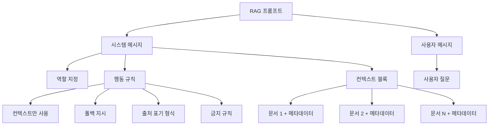
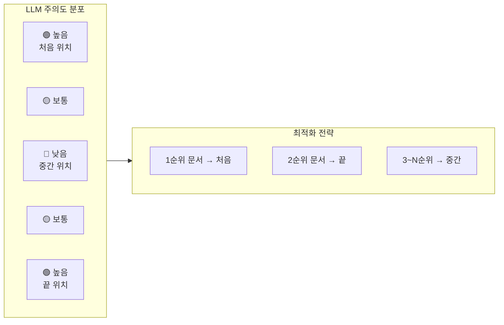
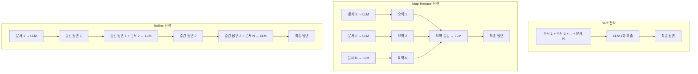
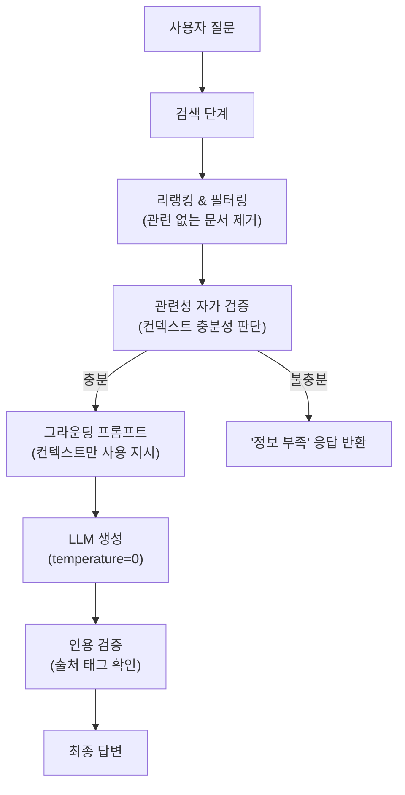

# 생성 단계 최적화 — 프롬프트와 컨텍스트

> 검색이 완벽해도 프롬프트가 엉성하면 답변은 무너진다 — RAG 생성 단계의 프롬프트 엔지니어링과 컨텍스트 최적화 전략

## 개요

이 섹션에서는 RAG 파이프라인의 **생성 단계(Generation Phase)**를 집중적으로 다룹니다. [18.1: RAG 실패 패턴 분류와 진단](18-rag-최적화와-디버깅-성능-개선-전략/01-rag-실패-패턴-분류와-진단.md)에서 실패 유형을 분류하고, [18.2: 검색 단계 디버깅과 최적화](18-rag-최적화와-디버깅-성능-개선-전략/02-검색-단계-디버깅과-최적화.md)에서 검색 품질을 끌어올렸다면, 이제는 검색된 문서를 LLM에게 **어떻게 전달하고, 어떤 지시를 내릴 것인가**에 집중할 차례입니다.

**선수 지식**:
- RAG 실패 패턴 7가지와 진단 방법 (세션 18.1)
- 검색 단계 디버깅과 파라미터 튜닝 (세션 18.2)
- LangChain LCEL 체인 구성 (챕터 8)
- 프롬프트 템플릿 기본 사용법 (챕터 8)

**학습 목표**:
- RAG에 최적화된 프롬프트 템플릿을 설계할 수 있다
- 컨텍스트 순서와 배치가 생성 품질에 미치는 영향을 이해한다
- 긴 컨텍스트를 처리하는 3가지 전략(Stuff, Map-Reduce, Refine)을 구분하고 적용할 수 있다
- 할루시네이션을 억제하는 프롬프트 기법을 실전에 적용할 수 있다

## 왜 알아야 할까?

세션 18.2에서 검색 최적화를 마쳤다면, 이런 상황이 생길 수 있습니다: **검색 결과는 완벽한데 LLM 답변은 엉뚱하다.** 실제로 프로덕션 RAG 시스템에서 발생하는 오류의 상당 부분은 검색이 아닌 생성 단계에서 비롯됩니다.

LangChain의 기업 분석(Q4 2025)에 따르면, 검색이 올바른 문서를 반환했음에도 LLM이 잘못된 답변을 생성하는 비율이 전체 실패의 **30~40%**에 달합니다. 왜 그럴까요? 원인은 크게 세 가지입니다:

1. **프롬프트 설계 미흡** — "컨텍스트를 참고해서 답하라"는 막연한 지시만으로는 부족합니다
2. **컨텍스트 배치 문제** — 핵심 정보가 프롬프트 중간에 묻혀 LLM이 무시합니다 (Lost in the Middle)
3. **컨텍스트 과부하** — 너무 많은 문서를 한꺼번에 넣으면 오히려 품질이 떨어집니다

이 세션에서는 이 세 가지 문제를 체계적으로 해결하는 방법을 배웁니다.

## 핵심 개념

### 개념 1: RAG 프롬프트 엔지니어링 — "잘 질문해야 잘 답한다"

> 💡 **비유**: 프롬프트는 음식점에서 주문하는 것과 같습니다. "맛있는 거 아무거나 주세요"라고 하면 원하는 것을 받기 어렵죠. "매운맛 없이, 해산물 알레르기가 있으니 해산물 빼고, 메인 디쉬와 샐러드를 추천해주세요"라고 구체적으로 말해야 정확한 답을 얻습니다. RAG 프롬프트도 마찬가지로, LLM에게 컨텍스트를 **어떻게** 활용할지 구체적으로 지시해야 합니다.

기본적인 RAG 프롬프트와 최적화된 프롬프트의 차이를 살펴보겠습니다.

**나쁜 예** — 막연한 지시:

```python
# ❌ 막연한 프롬프트
naive_template = """다음 컨텍스트를 참고해서 질문에 답하세요.

컨텍스트: {context}

질문: {question}
"""
```

**좋은 예** — 구체적인 역할, 규칙, 출력 형식 지정:

```python
from langchain_openai import ChatOpenAI
from langchain_core.prompts import ChatPromptTemplate
from langchain_core.output_parsers import StrOutputParser
from langchain_core.runnables import RunnablePassthrough

# ✅ 최적화된 RAG 프롬프트
rag_prompt = ChatPromptTemplate.from_messages([
    ("system", """당신은 제공된 컨텍스트만을 기반으로 정확하게 답변하는 전문 어시스턴트입니다.

## 규칙
1. 반드시 아래 컨텍스트에 포함된 정보만 사용하세요.
2. 컨텍스트에 답이 없으면 "제공된 문서에서 해당 정보를 찾을 수 없습니다"라고 답하세요.
3. 답변의 근거가 되는 컨텍스트 번호를 [출처 N] 형식으로 표기하세요.
4. 추측이나 외부 지식을 섞지 마세요.

## 컨텍스트
{context}"""),
    ("human", "{question}")
])

# 프롬프트를 LCEL 체인으로 연결
llm = ChatOpenAI(model="gpt-4o-mini", temperature=0)

rag_chain = (
    {
        "context": retriever | format_docs,   # 검색 → 포맷팅
        "question": RunnablePassthrough()      # 질문 그대로 전달
    }
    | rag_prompt    # 프롬프트 템플릿 적용
    | llm           # LLM 호출
    | StrOutputParser()  # 문자열 파싱
)

# 실행 예시
# result = rag_chain.invoke("RAG란 무엇인가요?")
```

최적화된 프롬프트에는 다섯 가지 핵심 요소가 있습니다:

| 요소 | 역할 | 예시 |
|------|------|------|
| **역할 지정** | LLM의 페르소나 설정 | "전문 어시스턴트" |
| **컨텍스트 경계** | 사용 가능한 정보 범위 한정 | "아래 컨텍스트만 사용" |
| **폴백 지시** | 정보 부재 시 행동 규정 | "찾을 수 없다고 답하라" |
| **출처 표기** | 근거 추적 가능성 확보 | "[출처 N] 형식 사용" |
| **금지 규칙** | 할루시네이션 억제 | "추측이나 외부 지식 금지" |

> ⚠️ **흔한 오해**: "프롬프트 하나만 잘 만들면 모든 RAG에 통한다"고 생각하기 쉽지만, 사실 도메인마다 최적의 프롬프트가 다릅니다. 법률 문서 RAG에서는 "정확한 조항 번호를 인용하라"가 핵심이고, 기술 문서 RAG에서는 "코드 예제를 포함하라"가 중요합니다. 프롬프트는 도메인에 맞게 커스터마이징해야 합니다.

컨텍스트를 포맷팅하는 방식도 중요합니다. 단순히 텍스트를 나열하는 것보다 **구조화된 형태**로 전달하면 LLM이 더 잘 활용합니다:

```python
def format_docs_with_metadata(docs: list) -> str:
    """검색된 문서를 구조화된 형태로 포맷팅"""
    formatted = []
    for i, doc in enumerate(docs, 1):
        source = doc.metadata.get("source", "알 수 없음")
        formatted.append(
            f"[문서 {i}] (출처: {source})\n{doc.page_content}"
        )
    return "\n\n---\n\n".join(formatted)
```

> 📊 **그림 1**: RAG 프롬프트의 구성 요소



### 개념 2: 컨텍스트 순서와 Lost in the Middle 문제

> 💡 **비유**: 책꽂이에서 책을 찾는다고 상상해보세요. 눈높이에 있는 책(처음과 끝)은 금방 눈에 띄지만, 맨 아래 칸 구석에 꽂힌 책(중간)은 잘 보이지 않죠. LLM도 마찬가지입니다. 프롬프트의 처음과 끝에 있는 정보는 잘 기억하지만, 중간에 묻힌 정보는 놓치는 경향이 있습니다.

2023년 스탠포드 대학의 Nelson F. Liu 등이 발표한 **"Lost in the Middle"** 논문은 RAG 커뮤니티에 큰 충격을 줬습니다. 핵심 발견은 이것이었죠:

- LLM은 컨텍스트의 **처음(primacy)**과 **끝(recency)**에 있는 정보를 가장 잘 활용한다
- 중간에 위치한 정보는 정확도가 **최대 20% 이상** 떨어진다
- 문서 수가 10개를 넘으면 성능 저하가 급격해진다

이 발견은 실용적인 최적화 전략으로 이어집니다:

```python
def reorder_documents_for_llm(docs: list, scores: list[float]) -> list:
    """Lost in the Middle 문제를 완화하기 위한 문서 재배치
    
    가장 관련도 높은 문서를 처음과 끝에 배치하고,
    상대적으로 덜 중요한 문서를 중간에 배치합니다.
    """
    # 점수 기준 내림차순 정렬
    paired = sorted(zip(docs, scores), key=lambda x: x[1], reverse=True)
    sorted_docs = [doc for doc, _ in paired]
    
    # 홀수 인덱스 → 앞쪽, 짝수 인덱스 → 뒤쪽 (교차 배치)
    reordered = []
    front = []
    back = []
    for i, doc in enumerate(sorted_docs):
        if i % 2 == 0:
            front.append(doc)  # 1등, 3등, 5등 → 앞쪽
        else:
            back.append(doc)   # 2등, 4등, 6등 → 뒤쪽
    
    reordered = front + list(reversed(back))
    return reordered
```

> 📊 **그림 2**: Lost in the Middle — 문서 위치별 LLM 주의도



LangChain에서는 `LongContextReorder` 변환기를 사용해 이를 자동화할 수 있습니다:

```python
from langchain_community.document_transformers import LongContextReorder

# 검색된 문서를 Lost in the Middle 패턴에 맞게 재배치
reordering = LongContextReorder()
reordered_docs = reordering.transform_documents(retrieved_docs)
```

하지만 가장 효과적인 전략은 **애초에 문서 수를 줄이는 것**입니다. 세션 18.2에서 배운 것처럼, 넓게 검색한 뒤 리랭킹으로 상위 3~5개만 남기는 것이 이상적입니다. 리랭킹의 원리와 구현에 대해서는 앞서 [Ch12: 리랭킹으로 검색 정확도 높이기](12-리랭킹으로-검색-정확도-높이기-cohere-rerank-활용/01-리랭킹의-원리-왜-초기-검색으로는-부족한가.md)에서 자세히 다루었으니, 필요하면 돌아가 복습해 보세요.

> 🔥 **실무 팁**: 프로덕션에서는 "넓게 검색, 좁게 전달"이 핵심입니다. `top_k=20`으로 넓게 검색한 뒤 [Ch12에서 배운](12-리랭킹으로-검색-정확도-높이기-cohere-rerank-활용/01-리랭킹의-원리-왜-초기-검색으로는-부족한가.md) Cross-Encoder 리랭킹으로 상위 3~5개만 LLM에 전달하세요. 이렇게 하면 Lost in the Middle 문제를 원천적으로 회피하면서도 높은 Context Recall을 유지할 수 있습니다.

### 개념 3: 긴 컨텍스트 처리 전략 — Stuff, Map-Reduce, Refine

> 💡 **비유**: 100페이지짜리 보고서 내용을 친구에게 설명한다고 해보세요. 세 가지 방법이 있습니다. (1) **Stuff**: 보고서 전체를 한꺼번에 읽어준다 — 간단하지만 너무 길면 친구가 지칩니다. (2) **Map-Reduce**: 10페이지씩 나눠 각각 요약한 뒤 요약본을 다시 종합한다 — 병렬처리가 가능합니다. (3) **Refine**: 처음 10페이지를 요약하고, 그 요약에 다음 10페이지 정보를 추가하며 점진적으로 완성한다 — 맥락이 이어지지만 시간이 오래 걸립니다.

RAG에서 검색된 문서가 LLM의 컨텍스트 윈도우보다 클 때, 또는 문서가 많을 때 어떤 전략을 선택할지가 중요합니다.

> 📊 **그림 3**: 세 가지 컨텍스트 처리 전략 비교



각 전략의 특성을 정리하면:

| 전략 | LLM 호출 수 | 장점 | 단점 | 적합한 상황 |
|------|------------|------|------|------------|
| **Stuff** | 1회 | 간단, 빠름, 문서 간 관계 파악 | 컨텍스트 초과 위험 | 문서 3~5개, 총 토큰 < 윈도우의 50% |
| **Map-Reduce** | N+1회 | 병렬처리, 대량 문서 가능 | 비용 높음, 문서 간 관계 손실 | 대량 문서, 독립적 정보 종합 |
| **Refine** | N회 | 맥락 유지, 점진적 정제 | 순차 처리로 느림, 앞쪽 편향 | 순서 중요한 문서, 서사적 답변 |

LangChain에서의 구현을 살펴보겠습니다:

```python
from langchain_openai import ChatOpenAI
from langchain_core.prompts import ChatPromptTemplate
from langchain.chains.combine_documents import create_stuff_documents_chain

llm = ChatOpenAI(model="gpt-4o-mini", temperature=0)

# --- 1) Stuff 전략: 가장 간단하고 권장되는 기본 방식 ---
stuff_prompt = ChatPromptTemplate.from_messages([
    ("system", """컨텍스트를 기반으로 질문에 답하세요. 
컨텍스트에 없는 정보는 "알 수 없습니다"라고 답하세요.

컨텍스트:
{context}"""),
    ("human", "{question}")
])

# create_stuff_documents_chain은 모든 문서를 하나의 프롬프트에 결합
stuff_chain = create_stuff_documents_chain(llm, stuff_prompt)
```

```python
from langchain.chains import MapReduceDocumentsChain, ReduceDocumentsChain
from langchain.chains.llm import LLMChain

# --- 2) Map-Reduce 전략: 대량 문서 처리 ---
# Map 단계: 각 문서를 개별 요약
map_prompt = ChatPromptTemplate.from_template(
    "다음 문서의 핵심 내용을 3문장으로 요약하세요:\n\n{context}"
)

# Reduce 단계: 요약들을 종합하여 최종 답변 생성
reduce_prompt = ChatPromptTemplate.from_template(
    """다음은 여러 문서의 요약입니다:
{context}

위 요약을 종합하여 다음 질문에 답하세요: {question}"""
)
```

```python
# --- 3) Refine 전략: 점진적 정제 ---
initial_prompt = ChatPromptTemplate.from_template(
    """다음 문서를 기반으로 질문에 답하세요.

문서: {context}
질문: {question}

답변:"""
)

refine_prompt = ChatPromptTemplate.from_template(
    """기존 답변을 새로운 문서 정보로 보강하세요.

기존 답변: {existing_answer}
새로운 문서: {context}
질문: {question}

보강된 답변:"""
)
```

> 💡 **알고 계셨나요?**: 대부분의 프로덕션 RAG 시스템은 **Stuff 전략**을 사용합니다. GPT-4o의 128K 토큰, Claude의 200K 토큰 컨텍스트 윈도우가 등장하면서, 일반적인 RAG 검색 결과(3~5개 문서)는 Stuff 전략으로 충분히 처리할 수 있기 때문입니다. Map-Reduce와 Refine은 수십~수백 개의 문서를 종합해야 하는 특수한 경우에만 필요합니다.

### 개념 4: 할루시네이션 억제 전략

> 💡 **비유**: 시험에서 모르는 문제가 나왔을 때, 아는 척하며 그럴듯한 답을 지어내는 학생이 있죠. LLM의 할루시네이션도 같은 원리입니다. 컨텍스트에 없는 정보를 **자신 있게** 만들어냅니다. 이를 막으려면 "모르면 모른다고 써라"라는 시험 규칙을 명확히 알려주는 것이 중요합니다.

할루시네이션은 RAG의 가장 큰 적입니다. 검색 증강의 핵심 목적이 "근거 있는 답변 생성"인데, LLM이 컨텍스트를 무시하고 자체 지식으로 답변을 만들면 RAG의 존재 의미가 사라집니다.

연구에 따르면, 할루시네이션 억제 기법을 종합 적용하면 할루시네이션률을 **20%에서 2~5%까지** 줄일 수 있습니다. 핵심 전략은 네 가지입니다:

**전략 1: 명시적 그라운딩 지시**

```python
GROUNDING_SYSTEM_PROMPT = """## 절대 규칙
- 아래 [컨텍스트]에 포함된 정보만 사용하세요.
- 컨텍스트에 없는 정보는 절대 추가하지 마세요.
- 확실하지 않으면 "제공된 문서에서 확인할 수 없습니다"라고 답하세요.
- 답변의 각 주장에 [출처 N] 태그를 붙이세요.

## 컨텍스트
{context}"""
```

**전략 2: 인용 기반 답변 (Citation-based answering)**

```python
CITATION_PROMPT = """질문에 답할 때 반드시 다음 형식을 지키세요:

1. 각 문장 끝에 근거 출처를 [1], [2] 형식으로 표기
2. 컨텍스트에 직접 언급되지 않은 내용은 포함 금지
3. 답변 끝에 "출처 목록" 섹션을 추가

예시:
RAG는 검색과 생성을 결합한 기법입니다[1]. 2020년 Meta AI에서 처음 제안되었습니다[2].

출처 목록:
[1] 문서 1 - RAG 개요
[2] 문서 2 - RAG 역사"""
```

**전략 3: 컨텍스트 관련성 자가 검증**

```python
from langchain_core.output_parsers import StrOutputParser
from langchain_core.runnables import RunnablePassthrough

# 2단계 파이프라인: 관련성 판단 → 답변 생성
relevance_check_prompt = ChatPromptTemplate.from_template(
    """다음 컨텍스트가 질문에 답하기에 충분한지 판단하세요.

컨텍스트: {context}
질문: {question}

"충분" 또는 "불충분"으로만 답하세요."""
)

answer_prompt = ChatPromptTemplate.from_messages([
    ("system", """컨텍스트만을 기반으로 답변하세요.
컨텍스트에 없는 내용을 추가하지 마세요.

컨텍스트:
{context}"""),
    ("human", "{question}")
])
```

**전략 4: 온도(Temperature) 제어**

```python
# 할루시네이션 억제를 위한 LLM 설정
llm = ChatOpenAI(
    model="gpt-4o-mini",
    temperature=0,      # 0으로 설정 — 가장 확실한 답변 생성
    max_tokens=1024,     # 불필요한 장문 방지
)
```

> 📊 **그림 4**: 할루시네이션 억제 전략의 다층 방어 구조



## 실습: 직접 해보기

이제 위에서 배운 기법들을 하나의 완전한 파이프라인으로 통합해 봅시다. 이 실습에서는 최적화된 프롬프트, 컨텍스트 재배치, 할루시네이션 억제를 모두 적용한 RAG 체인을 구성합니다.

```python
"""
RAG 생성 단계 최적화 실습
- 구조화된 프롬프트 설계
- 컨텍스트 재배치 (Lost in the Middle 대응)
- 할루시네이션 억제
"""
import os
from dataclasses import dataclass
from langchain_openai import ChatOpenAI, OpenAIEmbeddings
from langchain_core.prompts import ChatPromptTemplate
from langchain_core.output_parsers import StrOutputParser
from langchain_core.runnables import RunnablePassthrough, RunnableLambda
from langchain_core.documents import Document
from langchain_community.vectorstores import Chroma
from langchain_community.document_transformers import LongContextReorder

# --- 1. 평가용 샘플 데이터 구성 ---
sample_docs = [
    Document(
        page_content="RAG는 2020년 Meta AI(당시 Facebook AI Research)의 "
        "Patrick Lewis 등이 제안한 기법입니다. 외부 지식을 검색하여 "
        "LLM의 응답 생성을 보강합니다.",
        metadata={"source": "rag_overview.pdf", "page": 1}
    ),
    Document(
        page_content="RAG의 핵심 구성요소는 Retriever와 Generator입니다. "
        "Retriever는 DPR(Dense Passage Retrieval)을 사용하고, "
        "Generator는 BART 기반 seq2seq 모델을 사용합니다.",
        metadata={"source": "rag_architecture.pdf", "page": 3}
    ),
    Document(
        page_content="2024년 기준 RAG는 LangChain, LlamaIndex 등의 "
        "프레임워크에서 표준 패턴으로 자리잡았습니다. "
        "벡터 데이터베이스와 임베딩 모델의 발전이 큰 역할을 했습니다.",
        metadata={"source": "rag_trends.pdf", "page": 7}
    ),
    Document(
        page_content="할루시네이션은 LLM이 학습 데이터나 컨텍스트에 없는 "
        "정보를 사실처럼 생성하는 현상입니다. RAG는 이를 줄이기 위해 "
        "외부 지식을 근거로 제공합니다.",
        metadata={"source": "hallucination.pdf", "page": 2}
    ),
]


# --- 2. 컨텍스트 포맷팅 함수 ---
def format_docs_structured(docs: list[Document]) -> str:
    """문서를 구조화된 형태로 포맷팅 (메타데이터 포함)"""
    parts = []
    for i, doc in enumerate(docs, 1):
        source = doc.metadata.get("source", "알 수 없음")
        page = doc.metadata.get("page", "?")
        parts.append(
            f"[문서 {i}] (출처: {source}, p.{page})\n{doc.page_content}"
        )
    return "\n\n---\n\n".join(parts)


# --- 3. 컨텍스트 재배치 함수 ---
def reorder_for_attention(docs: list[Document]) -> list[Document]:
    """Lost in the Middle 완화를 위한 문서 재배치"""
    reordering = LongContextReorder()
    return reordering.transform_documents(docs)


# --- 4. 최적화된 RAG 프롬프트 ---
optimized_prompt = ChatPromptTemplate.from_messages([
    ("system", """당신은 제공된 컨텍스트만을 근거로 답변하는 정확한 어시스턴트입니다.

## 규칙
1. 아래 [컨텍스트]에 있는 정보만 사용하세요.
2. 각 주장에 [문서 N] 형식으로 출처를 표기하세요.
3. 컨텍스트에 답이 없으면 "제공된 문서에서 해당 정보를 찾을 수 없습니다"라고 답하세요.
4. 추측하거나 외부 지식을 추가하지 마세요.
5. 간결하고 정확하게 답변하세요.

## 컨텍스트
{context}"""),
    ("human", "{question}")
])


# --- 5. 파이프라인 조합 ---
llm = ChatOpenAI(model="gpt-4o-mini", temperature=0)

# LCEL 체인 구성: 검색 → 재배치 → 포맷팅 → 프롬프트 → LLM → 파싱
chain = (
    {
        "context": RunnableLambda(lambda x: x["docs"])
                   | RunnableLambda(reorder_for_attention)
                   | RunnableLambda(format_docs_structured),
        "question": RunnableLambda(lambda x: x["question"])
    }
    | optimized_prompt
    | llm
    | StrOutputParser()
)

# --- 6. 실행 ---
result = chain.invoke({
    "docs": sample_docs,
    "question": "RAG는 누가, 언제 제안했나요?"
})
print(result)
```

```output
RAG는 2020년 Meta AI(당시 Facebook AI Research)의 Patrick Lewis 등이 제안한 기법입니다[문서 1]. 외부 지식을 검색하여 LLM의 응답 생성을 보강하는 것이 핵심 아이디어입니다[문서 1].
```

이번에는 할루시네이션 테스트를 해보겠습니다. 컨텍스트에 **없는** 정보를 물어봤을 때 모델이 올바르게 거부하는지 확인합니다:

```run:python
# 할루시네이션 방지 테스트
test_questions = [
    "RAG는 누가, 언제 제안했나요?",                    # 답변 가능
    "RAG의 Retriever는 어떤 모델을 사용하나요?",       # 답변 가능
    "RAG와 Fine-tuning의 비용 차이는 얼마인가요?",     # 컨텍스트에 없음!
]

for q in test_questions:
    print(f"Q: {q}")
    print(f"→ 컨텍스트 포함 여부: ", end="")
    # 간단한 키워드 기반 관련성 체크 시뮬레이션
    keywords = {"제안": True, "Retriever": True, "비용": False}
    for kw, found in keywords.items():
        if kw in q:
            print("✅ 답변 가능" if found else "❌ 컨텍스트에 없음 → 폴백 응답 필요")
            break
    print()
```

```output
Q: RAG는 누가, 언제 제안했나요?
→ 컨텍스트 포함 여부: ✅ 답변 가능

Q: RAG의 Retriever는 어떤 모델을 사용하나요?
→ 컨텍스트 포함 여부: ✅ 답변 가능

Q: RAG와 Fine-tuning의 비용 차이는 얼마인가요?
→ 컨텍스트 포함 여부: ❌ 컨텍스트에 없음 → 폴백 응답 필요
```

프롬프트 품질을 정량적으로 비교하는 간단한 평가 함수도 만들어 봅시다:

```run:python
# 프롬프트 품질 평가 시뮬레이션
from dataclasses import dataclass

@dataclass
class PromptEvalResult:
    """프롬프트 평가 결과"""
    has_role: bool          # 역할 지정 여부
    has_grounding: bool     # 그라운딩 규칙 여부
    has_fallback: bool      # 폴백 지시 여부
    has_citation: bool      # 출처 표기 지시 여부
    has_format: bool        # 출력 형식 지정 여부
    
    @property
    def score(self) -> float:
        checks = [self.has_role, self.has_grounding, self.has_fallback,
                  self.has_citation, self.has_format]
        return sum(checks) / len(checks)

# 나쁜 프롬프트 평가
naive = PromptEvalResult(
    has_role=False, has_grounding=False, has_fallback=False,
    has_citation=False, has_format=False
)

# 최적화된 프롬프트 평가
optimized = PromptEvalResult(
    has_role=True, has_grounding=True, has_fallback=True,
    has_citation=True, has_format=True
)

print("📊 프롬프트 품질 비교")
print(f"  나쁜 프롬프트  : {naive.score:.0%} ({sum([naive.has_role, naive.has_grounding, naive.has_fallback, naive.has_citation, naive.has_format])}/5)")
print(f"  최적화 프롬프트: {optimized.score:.0%} ({sum([optimized.has_role, optimized.has_grounding, optimized.has_fallback, optimized.has_citation, optimized.has_format])}/5)")
```

```output
📊 프롬프트 품질 비교
  나쁜 프롬프트  : 0% (0/5)
  최적화 프롬프트: 100% (5/5)
```

## 더 깊이 알아보기

### "Lost in the Middle" — 직관을 뒤엎은 논문의 탄생

2023년, 스탠포드 대학의 Nelson F. Liu, Kevin Lin, John Hewitt, Ashwin Paranjape, Michele Bevilacqua, Fabio Petroni, Percy Liang은 한 가지 단순한 의문에서 출발했습니다: **"LLM이 긴 컨텍스트를 정말로 잘 활용할까?"**

당시 GPT-4와 Claude가 수만 토큰의 컨텍스트 윈도우를 지원하면서, "더 많은 문서를 넣을수록 더 좋은 답변을 얻을 수 있다"는 낙관론이 지배적이었습니다. 하지만 연구진은 놀라운 사실을 발견했습니다: **정답 문서를 20개의 문서 중간에 배치하면, 처음이나 끝에 배치했을 때보다 정확도가 20% 이상 떨어졌습니다.**

이 발견은 RAG 커뮤니티의 패러다임을 바꿨습니다. "더 많이 넣는다"가 "더 적게, 더 전략적으로 넣는다"로 바뀐 것이죠. 논문 제목 자체가 현상을 묘사하는 데 너무 적절해서, "Lost in the Middle"은 RAG 분야의 공식 용어가 되었습니다.

### 프롬프트 엔지니어링의 진화 — 규칙에서 구조로

초기 RAG 시스템의 프롬프트는 "다음 문서를 참고하여 답하세요"라는 한 줄짜리였습니다. 하지만 프로덕션에 배포해 보니, 이런 막연한 지시로는 할루시네이션을 제어할 수 없었죠. 2024년부터 업계는 **구조화된 프롬프트(Structured Prompting)**로 전환하기 시작합니다: 역할 지정, 행동 규칙, 출력 형식, 폴백 조건을 명시적으로 분리하는 방식입니다. 이는 단순한 "좋은 프롬프트 쓰기"를 넘어 **프롬프트 아키텍처(Prompt Architecture)**라는 새로운 분야로 발전하고 있습니다.

## 흔한 오해와 팁

> ⚠️ **흔한 오해**: "컨텍스트 윈도우가 크니까 검색된 문서를 최대한 많이 넣는 게 좋다." 사실 그렇지 않습니다. 128K 토큰을 지원하는 모델이라도, 관련 없는 문서를 함께 넣으면 **컨텍스트 오염(Context Pollution)**이 발생합니다. 세션 18.1에서 배운 것처럼, 적은 수의 고품질 문서가 많은 수의 저품질 문서보다 항상 낫습니다.

> 💡 **알고 계셨나요?**: 컨텍스트 프루닝(Context Pruning) — 검색된 문서에서 질문과 관련 없는 부분을 제거하는 기법 — 을 적용하면, 같은 쿼리에 대해 토큰 사용량을 25K에서 11K로 **56% 절감**하면서도 답변 품질은 동일하게 유지할 수 있다는 연구 결과가 있습니다.

> 🔥 **실무 팁**: `temperature=0`은 할루시네이션 억제의 첫 번째 방어선입니다. 하지만 그것만으로는 부족합니다. 가장 효과적인 조합은 **(1) temperature=0 + (2) 명시적 그라운딩 지시 + (3) 인용 기반 답변 형식 + (4) 폴백 지시**의 4중 방어입니다. 실제 프로덕션에서 이 조합을 적용하면 할루시네이션률을 **2~5%** 수준까지 줄일 수 있습니다.

> ⚠️ **흔한 오해**: "Map-Reduce나 Refine이 Stuff보다 항상 좋다." 실제로는 정반대입니다. Stuff 전략이 가장 빠르고, 문서 간 관계를 온전히 보존하며, 비용도 가장 적습니다. Map-Reduce와 Refine은 컨텍스트 윈도우를 초과하는 **극단적으로 긴 입력**에서만 필요합니다. 현대 LLM의 큰 컨텍스트 윈도우 덕분에 대부분의 RAG 사용 사례에서 Stuff만으로 충분합니다.

## 핵심 정리

| 개념 | 설명 |
|------|------|
| **구조화된 RAG 프롬프트** | 역할, 규칙, 폴백, 출처 표기, 금지 조항을 명시적으로 분리한 프롬프트 설계 |
| **Lost in the Middle** | LLM이 긴 컨텍스트의 중간 위치 정보를 잘 활용하지 못하는 현상. 핵심 문서를 처음/끝에 배치하여 완화 |
| **Stuff 전략** | 모든 문서를 하나의 프롬프트에 결합. 간단하고 빠르며 대부분의 RAG에 적합 |
| **Map-Reduce 전략** | 각 문서를 개별 처리 후 종합. 대량 문서에 적합하지만 비용이 높고 문서 간 관계 손실 |
| **Refine 전략** | 문서를 순차적으로 처리하며 답변을 점진적으로 정제. 맥락 유지에 강점 |
| **할루시네이션 억제** | 그라운딩 지시, 인용 기반 답변, 관련성 자가 검증, temperature=0의 4중 방어 |
| **컨텍스트 포맷팅** | 문서를 번호, 출처, 페이지 등 메타데이터와 함께 구조화하여 LLM의 활용도를 높임 |
| **컨텍스트 프루닝** | 검색된 문서에서 질문과 무관한 부분을 제거하여 토큰 절감 및 정확도 향상 |

## 다음 섹션 미리보기

이 세션에서 프롬프트와 컨텍스트를 최적화하는 방법을 배웠다면, 다음 세션 **18.4: 지연시간과 비용 최적화**에서는 RAG 파이프라인의 **속도와 비용**을 줄이는 전략을 다룹니다. 프롬프트 캐싱(Prompt Caching), 시맨틱 캐시(Semantic Cache), 임베딩 캐시, 비동기 처리 등 프로덕션 환경에서 실제로 사용하는 지연시간·비용 최적화 기법을 학습합니다.

## 참고 자료

- [Lost in the Middle: How Language Models Use Long Contexts](https://arxiv.org/abs/2307.03172) — Nelson F. Liu 등의 원본 논문. LLM이 긴 컨텍스트의 중간 정보를 활용하지 못하는 현상을 최초로 체계적으로 분석
- [Retrieval-Augmented Generation for Large Language Models: A Survey](https://arxiv.org/abs/2312.10997) — RAG 전반에 대한 포괄적 서베이. 생성 단계 최적화 기법을 포함한 최신 동향 정리
- [LangChain Prompt Templates 공식 문서](https://python.langchain.com/docs/concepts/prompt_templates/) — ChatPromptTemplate, PromptTemplate 등 LangChain의 프롬프트 시스템 공식 가이드
- [Solving the 'Lost in the Middle' Problem: Advanced RAG Techniques](https://www.getmaxim.ai/articles/solving-the-lost-in-the-middle-problem-advanced-rag-techniques-for-long-context-llms/) — Lost in the Middle 문제에 대한 실용적 해결 전략 가이드
- [RAG Hallucinations Explained: Causes, Risks, and Fixes](https://www.mindee.com/blog/rag-hallucinations-explained) — RAG에서의 할루시네이션 원인과 해결 기법을 실무 관점에서 정리
- [How to Fix Your Context — LangChain AI](https://github.com/langchain-ai/how_to_fix_your_context) — LangChain 공식 레포지토리. 컨텍스트 관리 전략(write, select, compress, isolate) 정리

---
### 🔗 Related Sessions
- [lcel](../08-기본-rag-파이프라인-구축-langchain으로-첫-rag-앱-만들기/01-langchain-v1-핵심-개념과-설정.md) (prerequisite)
- [chatprompttemplate](../08-기본-rag-파이프라인-구축-langchain으로-첫-rag-앱-만들기/01-langchain-v1-핵심-개념과-설정.md) (prerequisite)
- [stroutputparser](../08-기본-rag-파이프라인-구축-langchain으로-첫-rag-앱-만들기/01-langchain-v1-핵심-개념과-설정.md) (prerequisite)
- [runnablepassthrough](../08-기본-rag-파이프라인-구축-langchain으로-첫-rag-앱-만들기/02-lcel-langchain-expression-language-마스터하기.md) (prerequisite)
- [runnablelambda](../08-기본-rag-파이프라인-구축-langchain으로-첫-rag-앱-만들기/02-lcel-langchain-expression-language-마스터하기.md) (prerequisite)
- [failuretype](../18-rag-최적화와-디버깅-성능-개선-전략/01-rag-실패-패턴-분류와-진단.md) (prerequisite)
- [retrievaldiagnosis](../18-rag-최적화와-디버깅-성능-개선-전략/01-rag-실패-패턴-분류와-진단.md) (prerequisite)
- [diagnosisresult](../18-rag-최적화와-디버깅-성능-개선-전략/01-rag-실패-패턴-분류와-진단.md) (prerequisite)
- [context_snr](../18-rag-최적화와-디버깅-성능-개선-전략/01-rag-실패-패턴-분류와-진단.md) (prerequisite)
- [loggingretriever](../18-rag-최적화와-디버깅-성능-개선-전략/02-검색-단계-디버깅과-최적화.md) (prerequisite)
- [scoreanalyzer](../18-rag-최적화와-디버깅-성능-개선-전략/02-검색-단계-디버깅과-최적화.md) (prerequisite)
