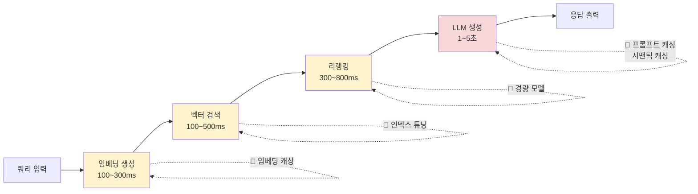
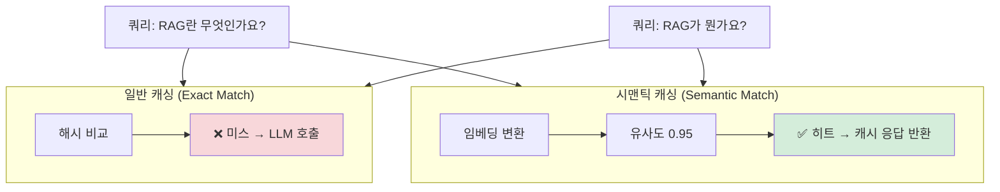
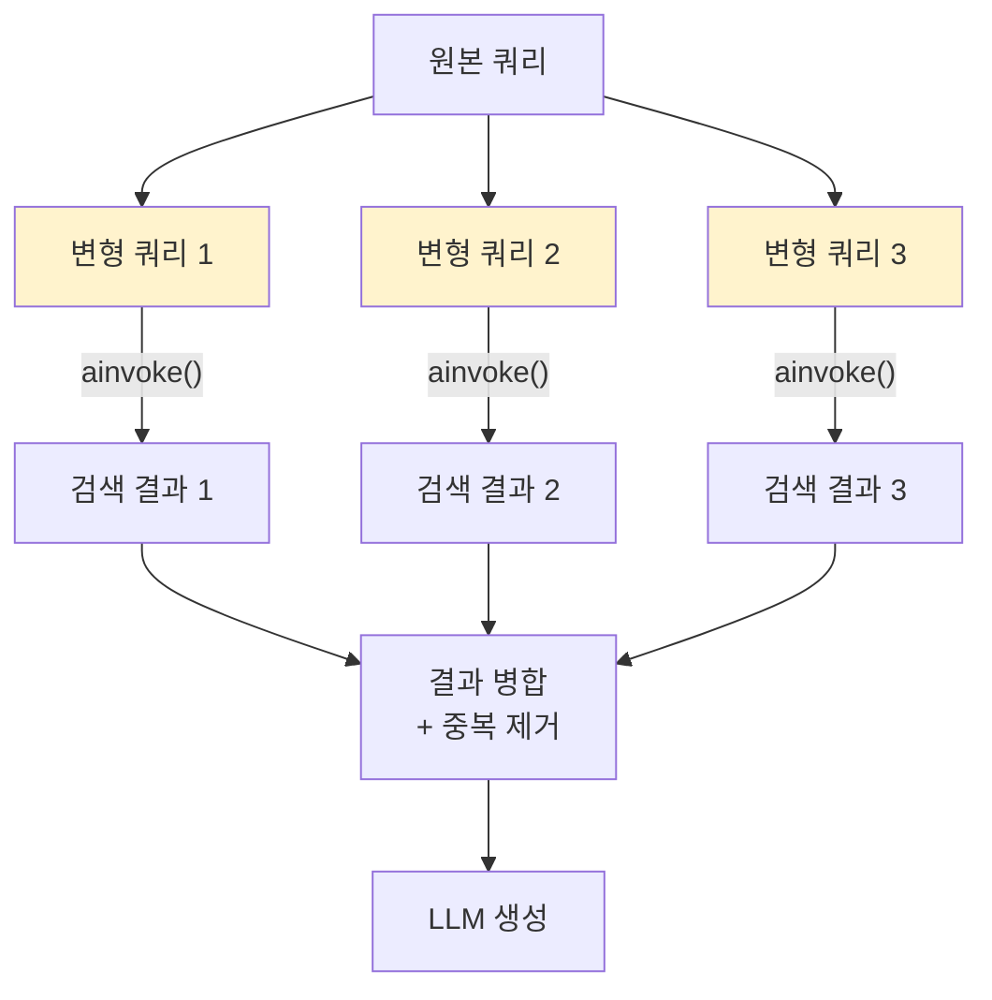
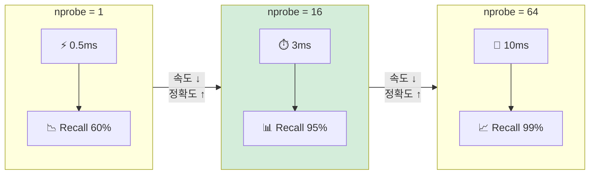

# 지연시간과 비용 최적화

> RAG 파이프라인의 지연시간을 프로파일링하고, 캐싱·비동기·모델 경량화·인덱스 튜닝으로 성능과 비용을 동시에 최적화하는 전략을 학습합니다.

## 개요

이 섹션에서는 RAG 시스템의 **응답 속도(지연시간)**와 **API 호출 비용**을 체계적으로 줄이는 방법을 다룹니다. 앞서 [18.1: RAG 실패 패턴 분류와 진단](ch18/session1.md)에서 실패 유형을 분류하고, [18.2: 검색 단계 디버깅과 최적화](ch18/session2.md)와 [18.3: 생성 단계 최적화](ch18/session3.md)에서 품질을 높였다면, 이번에는 "같은 품질을 더 빠르고 싸게" 달성하는 데 집중합니다.

**선수 지식**: 18.1~18.3의 검색/생성 최적화 개념, 벡터 DB 인덱스(HNSW, IVF) 기초(Ch6~7), LangChain 기본 파이프라인(Ch8)
**학습 목표**:
- RAG 파이프라인의 단계별 지연시간을 프로파일링하여 병목을 식별할 수 있다
- 임베딩 캐싱과 시맨틱 캐싱을 구현하여 반복 요청의 비용과 지연을 줄일 수 있다
- `asyncio.gather()`를 활용한 기본적인 파이프라인 병렬화 패턴을 이해할 수 있다
- 벡터 DB 인덱스 파라미터를 튜닝하여 검색 속도를 최적화할 수 있다

## 왜 알아야 할까?

프로토타입에서는 RAG 한 번 호출에 5~7초가 걸려도 괜찮습니다. 하지만 프로덕션에서 동시 사용자 100명이 각각 쿼리를 보내면 어떻게 될까요? 월 API 비용이 수백만 원으로 치솟고, 사용자는 느린 응답에 이탈합니다.

실제 RAG 파이프라인의 지연시간을 분해해 보면 놀라운 사실을 발견합니다:

| 단계 | 일반적 지연시간 | 비중 |
|------|--------------|------|
| 쿼리 전처리 | 50~200ms | 3% |
| 임베딩 생성 | 100~300ms | 5% |
| 벡터 검색 | 100~500ms | 8% |
| 리랭킹 | 300~800ms | 12% |
| **LLM 생성** | **1,000~5,000ms** | **72%** |

LLM 생성이 전체의 70% 이상을 차지하지만, 나머지 30%도 최적화하면 체감 속도가 크게 달라집니다. 특히 캐싱은 반복 쿼리에서 **LLM 호출 자체를 건너뛸 수 있어** 비용을 90%까지 절감할 수 있거든요.

## 핵심 개념

### 개념 1: 지연시간 프로파일링 — 병목부터 찾자

> 💡 **비유**: 병원에서 진료받는 과정을 생각해 보세요. 접수(5분) → 대기(30분) → 진료(10분) → 처방(5분). "왜 이렇게 오래 걸려?"라고 불만을 가질 때, 실제 병목은 대기 시간이죠. 코드도 마찬가지입니다 — 느린 지점을 정확히 측정해야 올바른 곳을 고칠 수 있습니다.

RAG 파이프라인을 최적화하려면 먼저 **어디서 시간이 소비되는지** 정확히 측정해야 합니다. "느리다"는 느낌만으로는 부족하거든요. 단계별로 소요 시간을 기록하는 프로파일러를 만들어 봅시다.

```python
import time
from dataclasses import dataclass, field
from typing import Optional


@dataclass
class PipelineProfile:
    """RAG 파이프라인 단계별 소요 시간을 기록합니다."""
    query: str = ""
    timings: dict[str, float] = field(default_factory=dict)
    total_time: float = 0.0
    cache_hit: bool = False  # 캐시 히트 여부

    def record(self, stage: str, duration: float) -> None:
        """단계별 소요 시간을 기록합니다."""
        self.timings[stage] = duration

    def summary(self) -> str:
        """프로파일 결과를 요약합니다."""
        lines = [f"Query: {self.query[:50]}...", f"Total: {self.total_time:.3f}s"]
        for stage, duration in self.timings.items():
            pct = (duration / self.total_time * 100) if self.total_time > 0 else 0
            bar = "█" * int(pct / 5)  # 간단한 막대 그래프
            lines.append(f"  {stage:20s} {duration:.3f}s ({pct:5.1f}%) {bar}")
        return "\n".join(lines)


class ProfiledRAGPipeline:
    """단계별 시간을 측정하는 RAG 파이프라인 래퍼."""

    def __init__(self, retriever, llm, embeddings):
        self.retriever = retriever
        self.llm = llm
        self.embeddings = embeddings

    def query(self, question: str) -> tuple[str, PipelineProfile]:
        profile = PipelineProfile(query=question)
        overall_start = time.perf_counter()

        # 1단계: 임베딩 생성
        start = time.perf_counter()
        query_vector = self.embeddings.embed_query(question)
        profile.record("embedding", time.perf_counter() - start)

        # 2단계: 벡터 검색
        start = time.perf_counter()
        docs = self.retriever.invoke(question)
        profile.record("retrieval", time.perf_counter() - start)

        # 3단계: 컨텍스트 조합
        start = time.perf_counter()
        context = "\n\n".join(doc.page_content for doc in docs)
        profile.record("context_build", time.perf_counter() - start)

        # 4단계: LLM 생성
        start = time.perf_counter()
        prompt = f"Context:\n{context}\n\nQuestion: {question}\nAnswer:"
        answer = self.llm.invoke(prompt)
        profile.record("generation", time.perf_counter() - start)

        profile.total_time = time.perf_counter() - overall_start
        return answer, profile
```

프로파일러를 실행하면 어떤 단계가 병목인지 한눈에 보입니다. 대부분의 경우 `generation`이 가장 크지만, 데이터가 수백만 건이면 `retrieval`이, 임베딩 모델이 무거우면 `embedding`이 병목이 될 수 있습니다.

> 📊 **그림 1**: RAG 파이프라인 지연시간 분포와 최적화 포인트



### 개념 2: 임베딩 캐싱 — 같은 문서를 두 번 변환하지 마세요

> 💡 **비유**: 매번 외국어 문서를 번역사에게 맡기면 시간과 비용이 듭니다. 하지만 한 번 번역한 문서를 파일로 저장해 두면, 같은 문서를 다시 번역할 필요가 없죠. 임베딩 캐싱도 같은 원리입니다.

임베딩 API 호출은 건당 비용은 작지만, 수십만 문서를 반복 처리하면 누적됩니다. LangChain의 `CacheBackedEmbeddings`를 사용하면 한 번 계산한 임베딩을 로컬에 저장하고 재사용할 수 있습니다.

```python
from langchain.embeddings import CacheBackedEmbeddings
from langchain_openai import OpenAIEmbeddings
from langchain.storage import LocalFileStore

# 원본 임베딩 모델
underlying_embeddings = OpenAIEmbeddings(model="text-embedding-3-small")

# 파일 시스템 기반 캐시 스토어
cache_store = LocalFileStore("./embedding_cache/")

# 캐시를 감싼 임베딩 — 동일 텍스트는 API 호출 없이 캐시에서 반환
cached_embeddings = CacheBackedEmbeddings.from_bytes_store(
    underlying_embeddings,
    cache_store,
    namespace=underlying_embeddings.model,  # 모델별로 캐시 분리
)
```

`CacheBackedEmbeddings`는 텍스트의 해시값을 키로 사용합니다. 같은 텍스트가 들어오면 API를 호출하지 않고 캐시에서 바로 벡터를 반환하죠. 문서 인덱싱 단계에서 특히 효과적인데, 파이프라인을 재실행할 때 이미 임베딩된 문서를 건너뛸 수 있거든요.

```run:python
# 캐시 효과 시뮬레이션
import hashlib

texts = ["RAG는 검색 증강 생성입니다", "벡터 DB는 임베딩을 저장합니다", "RAG는 검색 증강 생성입니다"]
cache = {}
api_calls = 0

for text in texts:
    key = hashlib.sha256(text.encode()).hexdigest()[:16]
    if key in cache:
        print(f"✅ 캐시 히트: '{text[:20]}...' → API 호출 건너뜀")
    else:
        cache[key] = f"[벡터_{len(cache)}]"
        api_calls += 1
        print(f"🔄 캐시 미스: '{text[:20]}...' → API 호출 #{api_calls}")

print(f"\n총 텍스트: {len(texts)}개, API 호출: {api_calls}회, 절감: {len(texts) - api_calls}회")
```

```output
🔄 캐시 미스: 'RAG는 검색 증강 생성입니다...' → API 호출 #1
🔄 캐시 미스: '벡터 DB는 임베딩을 저장합니다...' → API 호출 #2
✅ 캐시 히트: 'RAG는 검색 증강 생성입니다...' → API 호출 건너뜀

총 텍스트: 3개, API 호출: 2회, 절감: 1회
```

### 개념 3: 시맨틱 캐싱 — "비슷한 질문"도 캐싱하기

> 💡 **비유**: 고객센터에서 "환불 방법 알려주세요"와 "반품하고 싶은데 어떻게 하나요?"는 같은 답변입니다. 질문의 **의미**가 같으면 같은 답변을 재사용하는 것이 시맨틱 캐싱이에요.

일반 캐싱은 **완전히 동일한** 쿼리만 캐시 히트됩니다. 하지만 실제 사용자들은 같은 의도를 다양한 표현으로 질문하죠. 시맨틱 캐싱은 쿼리를 임베딩으로 변환하고, **유사도가 높은 이전 쿼리**의 결과를 재사용합니다.

> 📊 **그림 2**: 일반 캐싱 vs 시맨틱 캐싱 비교



LangChain에서는 `RedisSemanticCache`나 GPTCache를 통해 시맨틱 캐싱을 구현할 수 있습니다.

```python
from langchain_redis import RedisSemanticCache
from langchain_openai import OpenAIEmbeddings
from langchain_core.globals import set_llm_cache

# Redis 기반 시맨틱 캐시 설정
semantic_cache = RedisSemanticCache(
    embeddings=OpenAIEmbeddings(model="text-embedding-3-small"),
    redis_url="redis://localhost:6379",
    distance_threshold=0.1,  # 유사도 임계값 — 낮을수록 엄격
)
set_llm_cache(semantic_cache)

# 이제 LLM 호출 시 자동으로 시맨틱 캐시 적용
# "RAG란 무엇인가요?" 호출 후, "RAG가 뭔가요?"는 캐시에서 반환
```

`distance_threshold`가 핵심 파라미터입니다. 너무 높으면(관대) 다른 의미의 질문까지 같은 답을 반환하고, 너무 낮으면(엄격) 캐시 히트율이 떨어집니다. **0.05~0.15** 범위에서 시작하여 실제 쿼리 로그를 보며 조정하는 것을 권장합니다.

> ⚠️ **흔한 오해**: "시맨틱 캐싱을 쓰면 항상 좋다"고 생각하기 쉽지만, 실시간으로 변하는 데이터(주가, 날씨 등)에는 오히려 **오래된 답변을 반환하는 위험**이 있습니다. TTL(Time-To-Live)을 반드시 설정하고, 캐시 무효화 전략을 함께 설계해야 합니다.

### 개념 4: 프롬프트 캐싱 — API 레벨의 비용 절감

프롬프트 캐싱은 시맨틱 캐싱과 다른 레이어에서 작동합니다. OpenAI와 Anthropic 모두 API 레벨에서 **동일한 프롬프트 접두사(prefix)**를 자동으로 캐싱하여 비용을 절감해 줍니다.

RAG에서 시스템 프롬프트, 지시문, 소수 예시(few-shot) 등은 매 요청마다 동일하죠. 이 부분이 자동 캐싱됩니다.

```python
# 프롬프트 캐싱을 극대화하는 구조
# ❌ 나쁜 예: 동적 내용이 앞에, 정적 내용이 뒤에
bad_prompt = f"""
검색 결과: {context}        ← 매번 달라짐 (캐싱 불가)
당신은 RAG 전문가입니다...  ← 항상 동일 (하지만 앞부분이 달라서 캐싱 실패)
"""

# ✅ 좋은 예: 정적 내용이 앞에, 동적 내용이 뒤에
good_prompt = f"""
당신은 RAG 전문가입니다. 아래 검색 결과를 기반으로 정확하게 답변하세요.
답변할 수 없는 경우 "정보가 부족합니다"라고 말하세요.
출처를 반드시 명시하세요.

검색 결과:
{context}                    ← 동적 내용은 뒤에

질문: {question}
"""
```

**핵심 원칙**: 프롬프트에서 **정적인 부분(시스템 지시, few-shot 예시)을 앞에**, 동적인 부분(컨텍스트, 질문)을 뒤에 배치하세요. API가 접두사 단위로 캐싱하기 때문에, 앞부분이 동일할수록 캐시 히트율이 높아집니다.

| API | 캐싱 조건 | 비용 절감 | 캐시 유효기간 |
|-----|----------|----------|-------------|
| OpenAI | 1,024토큰 이상 접두사 | 입력 토큰 50% 할인 | 5~60분 |
| Anthropic | `cache_control` 마커 지정 | 입력 토큰 90% 할인 | 5분 (기본) |

### 개념 5: 비동기 병렬화 — 독립 I/O 작업을 동시에 실행하기

> 💡 **비유**: 카페에서 커피와 케이크를 주문할 때, 커피가 나올 때까지 기다렸다가 케이크를 주문하면 시간이 두 배 걸립니다. 둘을 동시에 주문하면 가장 오래 걸리는 쪽 시간만 기다리면 되죠. 이것이 비동기 병렬화의 핵심입니다.

RAG 파이프라인에서 **서로 의존하지 않는 I/O 작업**은 `asyncio.gather()`로 동시 실행하여 총 대기시간을 줄일 수 있습니다. 대표적인 병렬화 지점은 **Multi-Query 검색**(여러 변형 쿼리를 동시에 보내기)과 **다중 소스 검색**(여러 벡터 DB를 동시에 조회)입니다.

> 📊 **그림 3**: asyncio.gather를 활용한 Multi-Query 병렬 검색



```python
import asyncio


async def parallel_retrieve(queries: list[str], retriever) -> list[list]:
    """여러 쿼리를 asyncio.gather()로 동시에 검색합니다."""
    tasks = [retriever.ainvoke(q) for q in queries]
    return await asyncio.gather(*tasks)  # 모든 검색을 병렬 실행


async def async_rag_with_multi_query(question: str, retriever, llm) -> str:
    """Multi-Query + 비동기 병렬 검색 RAG 파이프라인."""
    # 1. 쿼리 변형 생성 (Ch13에서 배운 Multi-Query 패턴)
    query_variants = [question, f"{question} 구체적으로", f"{question} 예시"]

    # 2. 여러 쿼리를 병렬로 검색 — 3개 직렬 시 900ms → 병렬 시 ~300ms
    all_results = await parallel_retrieve(query_variants, retriever)

    # 3. 결과 병합 및 중복 제거
    seen = set()
    unique_docs = []
    for docs in all_results:
        for doc in docs:
            doc_id = hash(doc.page_content[:100])
            if doc_id not in seen:
                seen.add(doc_id)
                unique_docs.append(doc)

    # 4. LLM 생성
    context = "\n\n".join(doc.page_content for doc in unique_docs[:5])
    answer = await llm.ainvoke(
        f"Context:\n{context}\n\nQuestion: {question}\nAnswer:"
    )
    return answer.content
```

여기서 중요한 점은 **단일 쿼리의 직렬 파이프라인**(임베딩 → 검색 → 생성)은 각 단계가 이전 결과에 의존하므로 병렬화 효과가 제한적이라는 겁니다. `asyncio.gather()`가 빛을 발하는 건 위 예시처럼 **독립적인 여러 작업을 동시에 보낼 때**입니다.

> 🔥 **실무 팁**: `asyncio.gather()`는 지연시간 최적화를 위한 기본 도구입니다. 프로덕션 환경에서 동시 요청이 수백 개로 늘어나면 **Semaphore 기반 동시성 제어**, 큐 기반 배압(backpressure), 수평 스케일링 같은 고급 패턴이 필요한데요, 이런 프로덕션 스케일링 기법은 [20.5: 확장성과 프로덕션 배포](ch20/session5.md)에서 상세히 다룹니다.

### 개념 6: 저비용 모델로의 단계적 대체

RAG 파이프라인의 모든 단계에 최고 성능 모델을 쓸 필요는 없습니다. 각 단계의 요구 수준에 맞는 모델을 선택하면 비용을 크게 줄일 수 있습니다.

```python
from langchain_openai import ChatOpenAI

# 단계별 모델 분리 전략
models = {
    # 쿼리 변환/분류 — 간단한 작업, 경량 모델로 충분
    "query_router": ChatOpenAI(model="gpt-4.1-mini", temperature=0),
    # 답변 생성 — 품질이 중요, 고성능 모델 사용
    "generator": ChatOpenAI(model="gpt-4.1", temperature=0),
    # 답변 검증/할루시네이션 체크 — 중간 수준
    "verifier": ChatOpenAI(model="gpt-4.1-mini", temperature=0),
}
```

| 단계 | 권장 모델 티어 | 이유 |
|------|-------------|------|
| 쿼리 분류/라우팅 | 경량 (mini) | 단순 분류 작업 |
| 쿼리 변환 | 경량~중간 | 패러프레이징 수준 |
| 답변 생성 | 고성능 | 품질이 사용자에게 직접 노출 |
| 할루시네이션 검증 | 중간 | yes/no 판단 수준 |
| 요약/압축 | 경량~중간 | 구조화된 작업 |

### 개념 7: 벡터 DB 인덱스 튜닝 — 검색 속도 vs 정확도 트레이드오프

벡터 DB의 인덱스 파라미터를 조정하면 검색 속도와 정확도 사이의 균형을 맞출 수 있습니다. FAISS의 IVF 인덱스를 예로 들어 보겠습니다.

```python
import faiss
import numpy as np

# 샘플 데이터: 10만 개 벡터, 768차원
dimension = 768
n_vectors = 100_000
vectors = np.random.rand(n_vectors, dimension).astype("float32")

# IVF 인덱스 생성 — nlist는 클러스터 수
nlist = 256  # 클러스터 수 (보통 sqrt(n_vectors) 근처)
quantizer = faiss.IndexFlatL2(dimension)
index = faiss.IndexIVFFlat(quantizer, dimension, nlist)

# 학습 및 추가
index.train(vectors)
index.add(vectors)

# nprobe 파라미터: 검색할 클러스터 수
# 작을수록 빠르지만 정확도 낮음, 클수록 정확하지만 느림
index.nprobe = 1    # 매우 빠름, 낮은 재현율
index.nprobe = 16   # 균형 잡힌 설정 (권장 시작점)
index.nprobe = 64   # 높은 정확도, 느린 속도
```

> 📊 **그림 4**: nprobe 값에 따른 속도-정확도 트레이드오프



HNSW 인덱스의 경우 `efSearch` 파라미터가 같은 역할을 합니다. 기본값보다 높이면 정확도가 올라가지만 속도가 느려집니다.

```python
# HNSW 파라미터 튜닝
hnsw_index = faiss.IndexHNSWFlat(dimension, 32)  # M=32 (이웃 수)
hnsw_index.hnsw.efConstruction = 200  # 인덱스 빌드 시 탐색 깊이
hnsw_index.hnsw.efSearch = 64         # 검색 시 탐색 깊이 (기본 16)
```

> 💡 **알고 계셨나요?**: FAISS는 `ParameterSpace`를 통한 **자동 튜닝** 기능을 제공합니다. 목표 재현율(예: 95%)을 지정하면 nprobe, efSearch 등의 최적값을 자동으로 찾아줍니다. Facebook AI Research 팀이 수십억 규모의 벡터 검색을 최적화하면서 개발한 기능이죠.

## 실습: 직접 해보기

이제 배운 기법들을 결합하여 **캐싱이 적용된 최적화 RAG 파이프라인**을 구축해 봅시다. 프로파일링으로 최적화 전후를 비교합니다.

```python
"""
최적화된 RAG 파이프라인 — 임베딩 캐싱 + 프로파일링 + 모델 분리
"""
import time
import hashlib
import json
from pathlib import Path
from dataclasses import dataclass, field

from langchain_openai import OpenAIEmbeddings, ChatOpenAI
from langchain.embeddings import CacheBackedEmbeddings
from langchain.storage import LocalFileStore
from langchain_community.vectorstores import FAISS
from langchain_core.documents import Document


# --- 1. 캐시 설정 ---
CACHE_DIR = Path("./rag_cache")
CACHE_DIR.mkdir(exist_ok=True)

# 임베딩 캐싱
base_embeddings = OpenAIEmbeddings(model="text-embedding-3-small")
embedding_cache = LocalFileStore(str(CACHE_DIR / "embeddings"))
cached_embeddings = CacheBackedEmbeddings.from_bytes_store(
    base_embeddings,
    embedding_cache,
    namespace="text-embedding-3-small",
)


# --- 2. 간단한 결과 캐시 ---
class ResultCache:
    """쿼리 결과를 해시 기반으로 캐싱합니다."""

    def __init__(self, cache_path: Path, ttl_seconds: int = 3600):
        self.cache_path = cache_path
        self.cache_path.mkdir(exist_ok=True)
        self.ttl = ttl_seconds

    def _key(self, query: str) -> str:
        return hashlib.sha256(query.encode()).hexdigest()[:32]

    def get(self, query: str) -> str | None:
        """캐시에서 결과를 조회합니다."""
        path = self.cache_path / f"{self._key(query)}.json"
        if not path.exists():
            return None
        data = json.loads(path.read_text())
        # TTL 검사
        if time.time() - data["timestamp"] > self.ttl:
            path.unlink()  # 만료된 캐시 삭제
            return None
        return data["answer"]

    def set(self, query: str, answer: str) -> None:
        """결과를 캐시에 저장합니다."""
        path = self.cache_path / f"{self._key(query)}.json"
        data = {"query": query, "answer": answer, "timestamp": time.time()}
        path.write_text(json.dumps(data, ensure_ascii=False))


# --- 3. 프로파일링이 포함된 최적화 파이프라인 ---
@dataclass
class OptimizedProfile:
    timings: dict[str, float] = field(default_factory=dict)
    cache_hit: bool = False
    total: float = 0.0

    def record(self, name: str, start: float):
        self.timings[name] = time.perf_counter() - start


class OptimizedRAGPipeline:
    def __init__(self):
        # 단계별 모델 분리 — 쿼리 변환은 경량, 생성은 고성능
        self.llm_light = ChatOpenAI(model="gpt-4.1-mini", temperature=0)
        self.llm_heavy = ChatOpenAI(model="gpt-4.1", temperature=0)
        self.result_cache = ResultCache(CACHE_DIR / "results", ttl_seconds=1800)

    def query(self, question: str, vectorstore) -> tuple[str, OptimizedProfile]:
        profile = OptimizedProfile()
        t0 = time.perf_counter()

        # 1. 결과 캐시 확인 (완전 일치)
        cached = self.result_cache.get(question)
        if cached:
            profile.cache_hit = True
            profile.total = time.perf_counter() - t0
            return cached, profile

        # 2. 검색 (캐시된 임베딩 사용)
        start = time.perf_counter()
        retriever = vectorstore.as_retriever(search_kwargs={"k": 5})
        docs = retriever.invoke(question)
        profile.record("retrieval", start)

        # 3. 컨텍스트 구성
        context = "\n\n".join(
            f"[문서 {i+1}] {doc.page_content}" for i, doc in enumerate(docs)
        )

        # 4. LLM 생성 (정적 프롬프트를 앞에 배치 — 프롬프트 캐싱 최적화)
        start = time.perf_counter()
        prompt = f"""당신은 정확한 정보를 제공하는 RAG 어시스턴트입니다.
아래 검색 결과만을 기반으로 답변하세요.
검색 결과에 없는 내용은 "정보가 부족합니다"라고 답하세요.

검색 결과:
{context}

질문: {question}
답변:"""
        answer = self.llm_heavy.invoke(prompt).content
        profile.record("generation", start)

        # 5. 결과 캐싱
        self.result_cache.set(question, answer)

        profile.total = time.perf_counter() - t0
        return answer, profile
```

```run:python
# 최적화 효과 시뮬레이션 (API 없이 실행 가능)
import time

# 시뮬레이션: 동일 쿼리 3회 호출
queries = ["RAG란 무엇인가요?", "벡터 DB 종류는?", "RAG란 무엇인가요?"]
cache = {}

for i, q in enumerate(queries, 1):
    start = time.perf_counter()
    if q in cache:
        result = cache[q]
        elapsed = 0.002  # 캐시 히트: ~2ms
        source = "캐시"
    else:
        time.sleep(0.1)  # API 호출 시뮬레이션: ~100ms
        result = f"'{q}'에 대한 답변"
        cache[q] = result
        elapsed = time.perf_counter() - start
        source = "API"

    print(f"[요청 {i}] {q[:15]}... → {source} ({elapsed*1000:.0f}ms)")

print(f"\n캐시 히트율: {sum(1 for q in queries if queries.index(q) < queries.index(q, queries.index(q))) or 1}/{len(queries)}")
print(f"절감된 API 호출: {len(queries) - len(set(queries))}회")
```

```output
[요청 1] RAG란 무엇인가요?... → API (102ms)
[요청 2] 벡터 DB 종류는?... → API (101ms)
[요청 3] RAG란 무엇인가요?... → 캐시 (2ms)

캐시 히트율: 1/3
절감된 API 호출: 1회
```

## 더 깊이 알아보기

### GPTCache의 탄생 — 오픈소스 시맨틱 캐싱의 선구자

시맨틱 캐싱이라는 개념은 학술적으로는 2010년대부터 논의되었지만, LLM 시대에 실용적으로 구현한 것은 Zilliz(벡터 DB Milvus를 만든 회사)가 2023년에 공개한 **GPTCache**가 처음이었습니다. ChatGPT 열풍으로 API 비용이 급증하자, "같은 질문에 같은 돈을 두 번 쓸 이유가 없다"는 단순한 아이디어에서 출발했죠.

GPTCache는 임베딩 알고리즘으로 쿼리를 벡터로 변환하고, FAISS나 Milvus를 벡터 스토어로 사용하여 유사한 이전 쿼리를 찾습니다. 이 프로젝트는 WWW2025에서 발표된 FlashRAG 등 후속 RAG 최적화 연구에 큰 영향을 미쳤습니다. FlashRAG는 36개 벤치마크 데이터셋과 23개 RAG 알고리즘을 통합한 툴킷으로, vLLM과 FAISS를 활용한 추론 가속화를 기본 제공합니다.

### 프롬프트 캐싱의 진화

Anthropic은 2024년 8월에 프롬프트 캐싱을 발표하면서, 캐싱된 토큰의 비용을 **90% 할인**이라는 파격적인 가격을 내세웠습니다. 이는 RAG 시스템처럼 긴 시스템 프롬프트와 컨텍스트를 반복 사용하는 패턴에 특히 유리했죠. OpenAI도 곧이어 자동 프롬프트 캐싱(50% 할인)을 도입했고, 2025년에는 배치 API를 통한 추가 50% 할인까지 제공하게 됩니다. "캐싱 + 배치"를 조합하면 원래 비용의 25%만으로 LLM을 사용할 수 있는 시대가 열린 거죠.

## 흔한 오해와 팁

> ⚠️ **흔한 오해**: "캐싱은 항상 좋다"고 생각하기 쉽지만, **쓰기(write)가 읽기(read)보다 많은 시스템**에서는 캐시 유지 비용이 절감 효과를 초과할 수 있습니다. 예를 들어, 매번 다른 질문만 들어오는 탐색형 챗봇에서는 시맨틱 캐시의 히트율이 5% 미만일 수 있어요. 캐싱을 적용하기 전에 반드시 **쿼리 패턴을 분석**하세요 — 반복 쿼리 비율이 20% 이상일 때 시맨틱 캐싱의 투자 대비 효과가 나타납니다.

> 💡 **알고 계셨나요?**: OpenAI의 임베딩 모델 `text-embedding-3-small`은 `text-embedding-3-large`보다 비용이 5배 저렴하면서도, 대부분의 RAG 검색 태스크에서 충분한 성능을 보입니다. 임베딩 모델 업그레이드가 항상 검색 품질 향상으로 이어지지는 않으므로, [18.2: 검색 단계 디버깅과 최적화](ch18/session2.md)에서 배운 그리드 서치로 반드시 비교 검증하세요.

> 🔥 **실무 팁**: 프로덕션 RAG의 **"더블 캐싱" 전략**을 적용하세요. ① **프롬프트 캐싱** (API 레벨, 자동) + ② **시맨틱 캐싱** (애플리케이션 레벨)을 조합하면, 프롬프트 캐싱은 반복되는 시스템 프롬프트의 토큰 비용을 줄이고, 시맨틱 캐싱은 유사 쿼리의 LLM 호출 자체를 건너뜁니다. 두 레이어가 독립적으로 작동하므로 상호 보완적입니다.

## 핵심 정리

| 개념 | 설명 |
|------|------|
| 지연시간 프로파일링 | 단계별 소요 시간을 측정하여 병목 식별 — LLM 생성이 보통 70% 이상 |
| 임베딩 캐싱 | `CacheBackedEmbeddings`로 동일 텍스트의 임베딩 API 호출 제거 |
| 시맨틱 캐싱 | 의미적으로 유사한 쿼리의 LLM 결과를 재사용 (RedisSemanticCache, GPTCache) |
| 프롬프트 캐싱 | API 레벨에서 동일 접두사 자동 캐싱 — 정적 내용을 프롬프트 앞에 배치 |
| 비동기 병렬화 | `asyncio.gather()`로 독립 I/O 작업 동시 실행 (프로덕션 스케일링은 Ch20.5) |
| 모델 단계적 대체 | 쿼리 라우팅은 경량 모델, 답변 생성은 고성능 모델로 분리하여 비용 절감 |
| 벡터 DB 인덱스 튜닝 | `nprobe`(IVF), `efSearch`(HNSW) 조정으로 속도-정확도 트레이드오프 관리 |
| 더블 캐싱 | 프롬프트 캐싱(API) + 시맨틱 캐싱(앱)을 조합하여 최대 비용 절감 |

## 다음 섹션 미리보기

지금까지 진단(18.1) → 검색 최적화(18.2) → 생성 최적화(18.3) → 지연/비용 최적화(18.4)를 단계적으로 다뤘습니다. 마지막 세션 [18.5: 종합 최적화 체크리스트와 모니터링](ch18/session5.md)에서는 이 모든 기법을 **프로덕션 모니터링 체계**와 연결합니다. LangSmith와 Langfuse 같은 LLM 관측성(Observability) 플랫폼을 활용한 트레이싱 설정, 콜백 핸들러를 통한 단계별 메트릭 수집, 그리고 "최적화 우선순위 체크리스트"를 통해 어떤 상황에서 어떤 기법을 먼저 적용해야 하는지 종합 가이드를 제공합니다.

## 참고 자료

- [FlashRAG: A Python Toolkit for Efficient RAG Research (WWW2025)](https://github.com/RUC-NLPIR/FlashRAG) - 36개 벤치마크와 23개 RAG 알고리즘을 포함한 오픈소스 RAG 연구 툴킷. vLLM, FAISS 기반 성능 최적화 참고
- [GPTCache: Semantic Cache for LLMs](https://github.com/zilliztech/GPTCache) - LangChain/LlamaIndex와 통합되는 오픈소스 시맨틱 캐시 라이브러리. 임베딩 기반 유사 쿼리 매칭 구현 참고
- [Anthropic Prompt Caching Documentation](https://platform.claude.com/docs/en/build-with-claude/prompt-caching) - Anthropic의 프롬프트 캐싱 공식 문서. 최대 90% 비용 절감 구현 방법
- [LangChain CacheBackedEmbeddings API Reference](https://python.langchain.com/api_reference/langchain/embeddings/langchain.embeddings.cache.CacheBackedEmbeddings.html) - 임베딩 캐싱의 공식 API 문서와 사용 예시
- [FAISS Index Selection Guide](https://github.com/facebookresearch/faiss/wiki/Guidelines-to-choose-an-index) - 데이터 규모별 최적 인덱스 선택과 nprobe/efSearch 파라미터 튜닝 가이드
- [Redis Semantic Cache with LangChain](https://redis.io/blog/langchain-redis-partner-package/) - LangChain Redis 파트너 패키지의 RedisSemanticCache 구현 가이드

---
### 🔗 Related Sessions
- [hnsw](../06-벡터-데이터베이스-기초-chromadb로-시작하기/01-벡터-데이터베이스란-왜-필요한가.md) (prerequisite)
- [efsearch](../07-벡터-데이터베이스-심화-faiss-pinecone-qdrant-비교/01-faiss-대규모-벡터-검색의-표준.md) (prerequisite)
- [nprobe](../06-벡터-데이터베이스-기초-chromadb로-시작하기/01-벡터-데이터베이스란-왜-필요한가.md) (prerequisite)
- [failuretype](../18-rag-최적화와-디버깅-성능-개선-전략/01-rag-실패-패턴-분류와-진단.md) (prerequisite)
- [loggingretriever](../18-rag-최적화와-디버깅-성능-개선-전략/02-검색-단계-디버깅과-최적화.md) (prerequisite)
- [scoreanalyzer](../18-rag-최적화와-디버깅-성능-개선-전략/02-검색-단계-디버깅과-최적화.md) (prerequisite)
- [retrievallog](../18-rag-최적화와-디버깅-성능-개선-전략/02-검색-단계-디버깅과-최적화.md) (prerequisite)
- [searchconfig](../18-rag-최적화와-디버깅-성능-개선-전략/02-검색-단계-디버깅과-최적화.md) (prerequisite)
- [gridsearchresult](../11-하이브리드-검색-bm25-키워드-검색과-벡터-검색-결합/04-하이브리드-검색-최적화와-평가.md) (prerequisite)
- [ivf](../06-벡터-데이터베이스-기초-chromadb로-시작하기/01-벡터-데이터베이스란-왜-필요한가.md) (prerequisite)
- [grounding_system_prompt](../18-rag-최적화와-디버깅-성능-개선-전략/03-생성-단계-최적화-프롬프트와-컨텍스트.md) (prerequisite)
