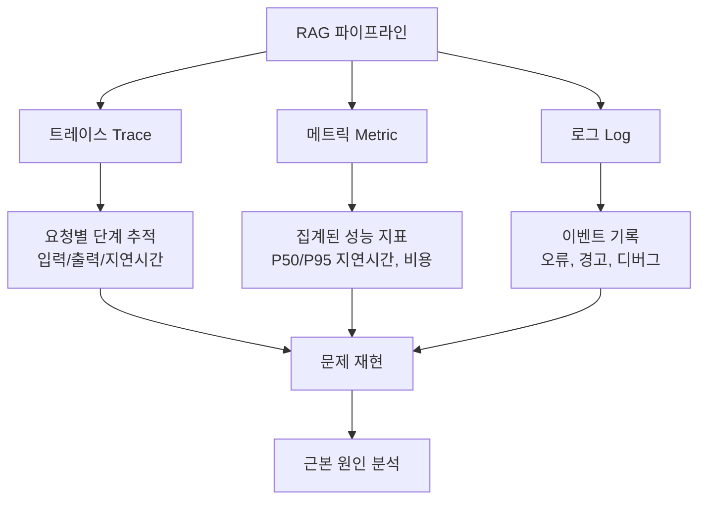
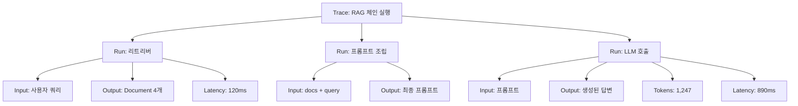
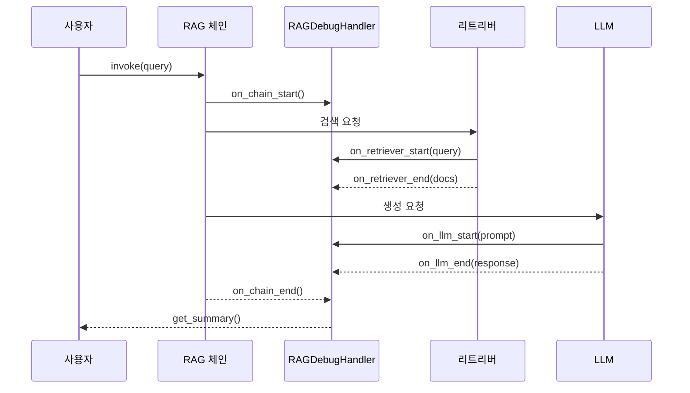
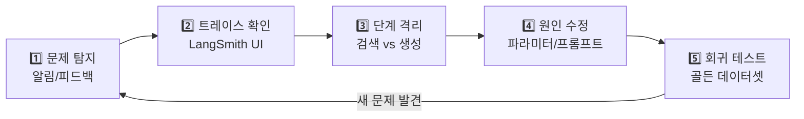

# RAG 디버깅 도구와 관찰 가능성

> LangSmith 트레이싱과 커스텀 콜백으로 RAG 파이프라인의 모든 단계를 들여다보고, 문제를 재현하고, 실시간으로 모니터링하는 방법을 배웁니다.

## 개요

이 섹션에서는 RAG 시스템의 **관찰 가능성(Observability)**을 확보하는 실전 도구와 기법을 학습합니다. 앞선 세션에서 실패 패턴 진단(18.1), 검색 디버깅(18.2), 생성 최적화(18.3), 지연시간/비용 최적화(18.4)를 다뤘다면, 이번 세션에서는 **이 모든 것을 하나의 관찰 체계로 통합**하는 방법을 다룹니다.

**선수 지식**:
- [RAG 실패 패턴 분류와 진단](18-rag-최적화와-디버깅-성능-개선-전략/01-rag-실패-패턴-분류와-진단.md)에서 배운 RAG Triad과 실패 유형
- [검색 단계 디버깅과 최적화](18-rag-최적화와-디버깅-성능-개선-전략/02-검색-단계-디버깅과-최적화.md)의 LoggingRetriever 패턴
- [생성 단계 최적화](18-rag-최적화와-디버깅-성능-개선-전략/03-생성-단계-최적화-프롬프트와-컨텍스트.md)의 프롬프트 설계 패턴
- [지연시간과 비용 최적화](18-rag-최적화와-디버깅-성능-개선-전략/04-지연시간과-비용-최적화.md)의 PipelineProfile 개념
- LangChain 기본 체인 구성 (LCEL)

**학습 목표**:
- LangSmith로 RAG 파이프라인의 전체 실행 트레이스를 수집하고 분석할 수 있다
- 커스텀 콜백 핸들러를 구현하여 검색·리랭킹·생성 단계별 메트릭을 수집할 수 있다
- 오픈소스 대안(Langfuse)을 포함한 관찰 도구의 특성을 비교하고 선택할 수 있다
- 문제 재현과 디버깅 워크플로를 체계적으로 구축할 수 있다

## 왜 알아야 할까?

여러분이 RAG 시스템을 프로덕션에 배포했다고 상상해 보세요. 어느 날 사용자로부터 "답변이 이상해요"라는 피드백이 들어옵니다. 어디서 문제가 생겼을까요? 검색이 잘못된 문서를 가져왔을까요? 리랭킹에서 순서가 뒤바뀌었을까요? 프롬프트가 컨텍스트를 제대로 활용하지 못했을까요?

**로그만으로는 부족합니다.** RAG 파이프라인은 임베딩 → 검색 → 리랭킹 → 프롬프트 조립 → LLM 생성이라는 5단계 이상의 복잡한 체인입니다. 각 단계의 입력과 출력, 지연시간, 토큰 사용량을 **한 번에 추적**할 수 있어야 문제의 근본 원인을 찾을 수 있죠.

이것이 바로 **관찰 가능성(Observability)**입니다. 소프트웨어 엔지니어링에서 분산 시스템의 디버깅을 위해 발전해온 이 개념이, 이제 LLM 애플리케이션에서도 필수가 되었습니다. LangSmith, Langfuse 같은 전문 도구를 활용하면, 마치 X-ray처럼 RAG 파이프라인 내부를 투명하게 들여다볼 수 있습니다.

## 핵심 개념

### 개념 1: RAG 관찰 가능성의 세 기둥

> 💡 **비유**: 관찰 가능성은 **자동차 계기판**과 같습니다. 속도계(메트릭)는 현재 성능을 숫자로 보여주고, 블랙박스(트레이스)는 사고 직전 상황을 재현해주며, 경고등(로그)은 이상 징후를 알려줍니다. 이 세 가지가 모여야 운전(운영) 중 문제를 빠르게 파악할 수 있죠.

분산 시스템에서 유래한 관찰 가능성의 세 기둥은 RAG에서도 동일하게 적용됩니다:

| 기둥 | 역할 | RAG 적용 예시 |
|------|------|--------------|
| **트레이스(Trace)** | 요청의 전체 여정 추적 | 쿼리 → 검색 → 리랭킹 → 생성의 각 단계 입출력 |
| **메트릭(Metric)** | 수치화된 성능 지표 | 검색 지연시간, 토큰 사용량, 유사도 점수 |
| **로그(Log)** | 이벤트 기록 | 오류 메시지, 경고, 디버그 정보 |

> 📊 **그림 1**: RAG 관찰 가능성의 세 기둥



기존 웹 서비스에서는 Jaeger, Datadog 같은 APM 도구로 관찰 가능성을 확보했습니다. 하지만 LLM 애플리케이션은 **비결정적(non-deterministic)** 특성이 있어서, 같은 입력에도 다른 출력이 나올 수 있습니다. 이 때문에 LangSmith, Langfuse 같은 **LLM 전용 관찰 도구**가 등장한 거죠.

### 개념 2: LangSmith 트레이싱 — 제로 설정으로 시작하기

> 💡 **비유**: LangSmith 트레이싱은 **CCTV 녹화**와 같습니다. 한 번 켜두면(환경 변수 설정) 건물 안에서 일어나는 모든 일(체인 실행)이 자동으로 녹화되죠. 나중에 사건(버그)이 발생하면, 녹화본을 되돌려 보면서 정확히 어디서 문제가 생겼는지 확인할 수 있습니다.

LangSmith의 가장 큰 장점은 **코드 변경 없이 환경 변수만으로 트레이싱을 활성화**할 수 있다는 점입니다:

```python
import os

# LangSmith 트레이싱 활성화 — 이 3줄이면 끝!
os.environ["LANGSMITH_TRACING"] = "true"
os.environ["LANGSMITH_API_KEY"] = "lsv2_pt_..."  # smith.langchain.com에서 발급
os.environ["LANGSMITH_PROJECT"] = "rag-debugging"  # 프로젝트별 분리
```

이 설정만으로 LangChain의 모든 컴포넌트(LLM 호출, 리트리버, 체인)가 자동으로 트레이싱됩니다. 별도의 데코레이터나 래퍼 코드가 필요 없죠.

> 📊 **그림 2**: LangSmith 트레이스의 계층 구조



트레이스(Trace)는 하나의 요청이 파이프라인을 통과하는 **전체 여정**이고, 런(Run)은 그 여정 안의 **개별 단계**입니다. LangSmith UI에서는 이 계층 구조를 트리 형태로 펼쳐볼 수 있어서, 정확히 어느 단계에서 얼마나 시간이 걸렸고 무엇이 입출력되었는지 확인할 수 있습니다.

커스텀 함수도 `@traceable` 데코레이터로 트레이스에 포함시킬 수 있습니다:

```python
from langsmith import traceable

@traceable(name="rerank_documents")
def rerank_documents(query: str, docs: list, top_k: int = 3) -> list:
    """리랭킹 단계 — LangSmith에서 입출력이 자동 기록됨"""
    # Cohere Rerank 등의 리랭킹 로직
    scored = [(doc, score_relevance(query, doc)) for doc in docs]
    scored.sort(key=lambda x: x[1], reverse=True)
    return [doc for doc, _ in scored[:top_k]]
```

> ⚠️ **흔한 오해**: "LangSmith는 LangChain 코드만 트레이싱할 수 있다"고 생각하기 쉽지만, `@traceable` 데코레이터를 사용하면 **어떤 Python 함수든** 트레이스에 포함시킬 수 있습니다. OpenAI SDK 호출도 `wrap_openai`로 감싸면 추적 가능합니다.

### 개념 3: 커스텀 콜백 핸들러 — RAG 단계별 메트릭 수집

> 💡 **비유**: 콜백 핸들러는 **경기장의 기록원**과 같습니다. 축구 경기에서 기록원이 각 선수의 패스 성공률, 슈팅 횟수, 달린 거리를 기록하듯, 콜백 핸들러는 RAG 파이프라인의 각 단계에서 발생하는 이벤트를 포착하여 원하는 메트릭을 기록합니다.

LangSmith가 트레이스의 **기록**에 중점을 둔다면, 커스텀 콜백 핸들러는 **실시간 반응**에 중점을 둡니다. `BaseCallbackHandler`를 상속하여 검색, 생성 등 각 단계의 이벤트에 맞춤 로직을 삽입할 수 있습니다:

```python
import time
from dataclasses import dataclass, field
from langchain_core.callbacks import BaseCallbackHandler
from langchain_core.documents import Document


@dataclass
class RAGMetrics:
    """RAG 파이프라인 실행 메트릭을 담는 데이터 클래스"""
    query: str = ""
    retrieval_latency_ms: float = 0.0
    llm_latency_ms: float = 0.0
    retrieved_doc_count: int = 0
    total_tokens: int = 0
    similarity_scores: list[float] = field(default_factory=list)
    

class RAGDebugHandler(BaseCallbackHandler):
    """RAG 파이프라인의 각 단계를 추적하는 커스텀 콜백 핸들러"""
    
    def __init__(self):
        self.metrics = RAGMetrics()
        self._retrieval_start: float = 0.0
        self._llm_start: float = 0.0
    
    # --- 검색 단계 ---
    def on_retriever_start(self, serialized: dict, query: str, **kwargs) -> None:
        """검색 시작 시 호출"""
        self.metrics.query = query
        self._retrieval_start = time.perf_counter()
        print(f"🔍 검색 시작: '{query[:50]}...'")
    
    def on_retriever_end(self, documents: list[Document], **kwargs) -> None:
        """검색 완료 시 호출"""
        elapsed = (time.perf_counter() - self._retrieval_start) * 1000
        self.metrics.retrieval_latency_ms = elapsed
        self.metrics.retrieved_doc_count = len(documents)
        print(f"📄 검색 완료: {len(documents)}건, {elapsed:.1f}ms")
    
    # --- LLM 생성 단계 ---
    def on_llm_start(self, serialized: dict, prompts: list[str], **kwargs) -> None:
        """LLM 호출 시작 시 호출"""
        self._llm_start = time.perf_counter()
        prompt_len = sum(len(p) for p in prompts)
        print(f"🤖 LLM 호출 시작 (프롬프트 길이: {prompt_len:,}자)")
    
    def on_llm_end(self, response, **kwargs) -> None:
        """LLM 호출 완료 시 호출"""
        elapsed = (time.perf_counter() - self._llm_start) * 1000
        self.metrics.llm_latency_ms = elapsed
        
        # 토큰 사용량 추출
        if hasattr(response, "llm_output") and response.llm_output:
            usage = response.llm_output.get("token_usage", {})
            self.metrics.total_tokens = usage.get("total_tokens", 0)
        
        print(f"✅ LLM 완료: {elapsed:.1f}ms, {self.metrics.total_tokens} tokens")
    
    def on_chain_error(self, error: Exception, **kwargs) -> None:
        """체인 실행 중 오류 발생 시 호출"""
        print(f"❌ 오류 발생: {type(error).__name__}: {error}")
    
    def get_summary(self) -> dict:
        """수집된 메트릭 요약 반환"""
        total = self.metrics.retrieval_latency_ms + self.metrics.llm_latency_ms
        return {
            "query": self.metrics.query,
            "retrieval_ms": round(self.metrics.retrieval_latency_ms, 1),
            "llm_ms": round(self.metrics.llm_latency_ms, 1),
            "total_ms": round(total, 1),
            "docs_retrieved": self.metrics.retrieved_doc_count,
            "tokens_used": self.metrics.total_tokens,
        }
```

이 핸들러를 체인에 연결하는 방법은 간단합니다:

```python
from langchain_openai import ChatOpenAI
from langchain_core.prompts import ChatPromptTemplate
from langchain_core.runnables import RunnablePassthrough

# 콜백 핸들러 생성
handler = RAGDebugHandler()

# RAG 체인 구성 (LCEL)
chain = (
    {"context": retriever, "question": RunnablePassthrough()}
    | prompt
    | llm
)

# 콜백 핸들러와 함께 실행
result = chain.invoke(
    "RAG에서 청킹 전략의 영향은?",
    config={"callbacks": [handler]}  # 여기에 핸들러 전달
)

# 메트릭 확인
print(handler.get_summary())
```

> 📊 **그림 3**: 콜백 핸들러의 이벤트 흐름



### 개념 4: 오픈소스 대안 — Langfuse

LangSmith가 LangChain 생태계와의 깊은 통합이 장점이라면, **Langfuse**는 오픈소스(MIT 라이선스)와 셀프 호스팅이라는 차별점을 가집니다.

| 기준 | LangSmith | Langfuse |
|------|-----------|---------|
| **라이선스** | 상용 SaaS | MIT 오픈소스 |
| **셀프 호스팅** | Enterprise만 가능 | 무료 셀프 호스팅 |
| **LangChain 통합** | 네이티브 (환경 변수만으로 OK) | SDK 연동 필요 |
| **프레임워크 독립성** | LangChain 중심 | 프레임워크 무관 |
| **무료 플랜** | 제한적 | 월 50K observations |
| **데이터 주권** | LangChain 서버 | 자체 서버 가능 |
| **GitHub Stars** | - | 19,000+ |

```python
# Langfuse를 LangChain과 함께 사용하는 예시
from langfuse.callback import CallbackHandler as LangfuseHandler

# Langfuse 콜백 핸들러 생성
langfuse_handler = LangfuseHandler(
    public_key="pk-lf-...",
    secret_key="sk-lf-...",
    host="https://cloud.langfuse.com"  # 또는 셀프 호스팅 URL
)

# LangChain 체인에 Langfuse 핸들러 연결
result = chain.invoke(
    "검색 증강 생성이란?",
    config={"callbacks": [langfuse_handler]}
)
```

> 🔥 **실무 팁**: 데이터 보안이 중요한 기업 환경이라면 Langfuse 셀프 호스팅을, LangChain/LangGraph를 주력으로 쓰는 팀이라면 LangSmith를 선택하세요. 두 도구를 **동시에 사용**하는 것도 가능합니다 — `config={"callbacks": [langsmith_handler, langfuse_handler]}`처럼 콜백 리스트에 둘 다 넣으면 됩니다.

### 개념 5: 디버깅 워크플로 — 문제 재현부터 해결까지

> 💡 **비유**: RAG 디버깅 워크플로는 **의사의 진료 과정**과 같습니다. 환자(사용자)가 증상(잘못된 답변)을 말하면, 의사는 먼저 증상을 기록하고(트레이스 확인), 검사를 하고(메트릭 분석), 원인을 좁히고(단계별 격리), 치료법을 적용하고(수정), 경과를 관찰합니다(모니터링).

체계적인 RAG 디버깅은 5단계로 진행됩니다:

> 📊 **그림 4**: RAG 디버깅 워크플로 5단계



**1단계: 문제 탐지** — 자동 알림 또는 사용자 피드백으로 문제를 인식합니다.

**2단계: 트레이스 확인** — 해당 요청의 트레이스를 찾아 전체 실행 과정을 확인합니다. LangSmith에서는 `run_id`나 태그로 특정 트레이스를 필터링할 수 있습니다:

```python
import langsmith as ls

# 태그를 활용해 특정 요청을 추적 가능하게 표시
result = chain.invoke(
    "할루시네이션이 발생한 쿼리",
    config={
        "tags": ["debug", "user-report-2024-03"],  # 디버깅용 태그
        "metadata": {"user_id": "u-1234", "session_id": "s-5678"},
    }
)
```

**3단계: 단계 격리** — [RAG 실패 패턴 분류와 진단](18-rag-최적화와-디버깅-성능-개선-전략/01-rag-실패-패턴-분류와-진단.md)에서 배운 것처럼, 검색이 문제인지 생성이 문제인지를 먼저 구분합니다. 트레이스에서 리트리버의 출력(검색된 문서)을 확인하면 바로 알 수 있죠.

**4단계: 원인 수정** — 검색 문제라면 [검색 단계 디버깅과 최적화](18-rag-최적화와-디버깅-성능-개선-전략/02-검색-단계-디버깅과-최적화.md)의 파라미터 그리드 서치를, 생성 문제라면 [생성 단계 최적화](18-rag-최적화와-디버깅-성능-개선-전략/03-생성-단계-최적화-프롬프트와-컨텍스트.md)의 프롬프트 엔지니어링을 적용합니다.

**5단계: 회귀 테스트** — 수정 후 기존 골든 테스트 셋으로 다른 곳이 깨지지 않았는지 확인합니다:

```python
@traceable(name="regression_test")
def run_regression_test(
    chain, 
    golden_cases: list[dict],
    handler: RAGDebugHandler
) -> dict:
    """골든 데이터셋으로 회귀 테스트 실행"""
    results = []
    for case in golden_cases:
        handler_instance = RAGDebugHandler()
        answer = chain.invoke(
            case["query"],
            config={"callbacks": [handler_instance]}
        )
        metrics = handler_instance.get_summary()
        results.append({
            "query": case["query"],
            "expected": case["expected_answer"],
            "actual": answer,
            "metrics": metrics,
            "passed": case["expected_keyword"] in answer,
        })
    
    passed = sum(1 for r in results if r["passed"])
    return {
        "total": len(results),
        "passed": passed,
        "failed": len(results) - passed,
        "pass_rate": f"{passed / len(results) * 100:.1f}%",
    }
```

## 실습: 직접 해보기

이제 지금까지 배운 개념들을 통합하여, **관찰 가능한 RAG 파이프라인**을 처음부터 끝까지 구축해 보겠습니다.

### 1단계: 환경 설정과 패키지 설치

```python
# 필요한 패키지 설치
# pip install langchain langchain-openai langchain-community chromadb langsmith

import os
import time
import json
from dataclasses import dataclass, field
from typing import Any

# LangSmith 트레이싱 활성화
os.environ["LANGSMITH_TRACING"] = "true"
os.environ["LANGSMITH_API_KEY"] = "lsv2_pt_..."  # 실제 키로 교체
os.environ["LANGSMITH_PROJECT"] = "rag-observability-lab"
os.environ["OPENAI_API_KEY"] = "sk-..."  # 실제 키로 교체
```

### 2단계: 고급 RAG 디버그 핸들러 구현

```python
from langchain_core.callbacks import BaseCallbackHandler
from langchain_core.documents import Document


@dataclass
class StageMetrics:
    """개별 단계의 메트릭"""
    name: str
    start_time: float = 0.0
    end_time: float = 0.0
    input_data: Any = None
    output_data: Any = None
    metadata: dict = field(default_factory=dict)
    
    @property
    def latency_ms(self) -> float:
        if self.end_time and self.start_time:
            return (self.end_time - self.start_time) * 1000
        return 0.0


class ObservableRAGHandler(BaseCallbackHandler):
    """프로덕션급 RAG 관찰 핸들러 — 모든 단계를 추적"""
    
    def __init__(self, verbose: bool = True):
        self.verbose = verbose
        self.stages: list[StageMetrics] = []
        self._current_stage: StageMetrics | None = None
        self.errors: list[dict] = []
        self._pipeline_start: float = 0.0
    
    def _start_stage(self, name: str, input_data: Any = None) -> None:
        """새로운 단계 시작 기록"""
        stage = StageMetrics(
            name=name,
            start_time=time.perf_counter(),
            input_data=input_data,
        )
        self._current_stage = stage
        self.stages.append(stage)
        if self.verbose:
            print(f"  ▶ {name} 시작")
    
    def _end_stage(self, output_data: Any = None, **metadata) -> None:
        """현재 단계 종료 기록"""
        if self._current_stage:
            self._current_stage.end_time = time.perf_counter()
            self._current_stage.output_data = output_data
            self._current_stage.metadata.update(metadata)
            if self.verbose:
                ms = self._current_stage.latency_ms
                print(f"  ✓ {self._current_stage.name} 완료 ({ms:.1f}ms)")
    
    # --- 콜백 메서드 오버라이드 ---
    def on_chain_start(self, serialized: dict, inputs: dict, **kwargs) -> None:
        if not self._pipeline_start:
            self._pipeline_start = time.perf_counter()
            if self.verbose:
                print("=" * 50)
                print("🚀 RAG 파이프라인 실행 시작")
                print("=" * 50)
    
    def on_retriever_start(self, serialized: dict, query: str, **kwargs) -> None:
        self._start_stage("검색(Retrieval)", input_data=query)
    
    def on_retriever_end(self, documents: list[Document], **kwargs) -> None:
        doc_preview = [d.page_content[:80] for d in documents]
        self._end_stage(
            output_data=doc_preview,
            doc_count=len(documents),
        )
    
    def on_llm_start(self, serialized: dict, prompts: list[str], **kwargs) -> None:
        prompt_chars = sum(len(p) for p in prompts)
        self._start_stage("LLM 생성", input_data=f"프롬프트 {prompt_chars:,}자")
    
    def on_llm_end(self, response, **kwargs) -> None:
        tokens = 0
        if hasattr(response, "llm_output") and response.llm_output:
            usage = response.llm_output.get("token_usage", {})
            tokens = usage.get("total_tokens", 0)
        self._end_stage(tokens=tokens)
    
    def on_chain_error(self, error: Exception, **kwargs) -> None:
        self.errors.append({
            "type": type(error).__name__,
            "message": str(error),
            "stage": self._current_stage.name if self._current_stage else "unknown",
            "timestamp": time.time(),
        })
        if self.verbose:
            print(f"  ❌ 오류: {error}")
    
    def get_report(self) -> dict:
        """전체 파이프라인 실행 리포트 생성"""
        total_ms = (time.perf_counter() - self._pipeline_start) * 1000
        stage_breakdown = {}
        for s in self.stages:
            stage_breakdown[s.name] = {
                "latency_ms": round(s.latency_ms, 1),
                "percentage": f"{s.latency_ms / total_ms * 100:.1f}%"
                    if total_ms > 0 else "0%",
                "metadata": s.metadata,
            }
        
        return {
            "total_latency_ms": round(total_ms, 1),
            "stage_count": len(self.stages),
            "stages": stage_breakdown,
            "errors": self.errors,
            "bottleneck": max(
                self.stages, key=lambda s: s.latency_ms
            ).name if self.stages else None,
        }
    
    def print_report(self) -> None:
        """리포트를 포맷팅하여 출력"""
        report = self.get_report()
        print("\n" + "=" * 50)
        print("📊 파이프라인 실행 리포트")
        print("=" * 50)
        print(f"총 지연시간: {report['total_latency_ms']}ms")
        print(f"실행 단계: {report['stage_count']}개")
        print(f"병목 단계: {report['bottleneck']}")
        print("-" * 50)
        for name, info in report["stages"].items():
            bar_len = int(float(info["percentage"].rstrip("%")) / 5)
            bar = "█" * bar_len
            print(f"  {name}: {info['latency_ms']}ms ({info['percentage']}) {bar}")
        if report["errors"]:
            print(f"\n⚠️ 오류 {len(report['errors'])}건:")
            for err in report["errors"]:
                print(f"  - [{err['stage']}] {err['type']}: {err['message']}")
```

### 3단계: 관찰 가능한 RAG 체인 구성 및 실행

```python
from langchain_openai import ChatOpenAI, OpenAIEmbeddings
from langchain_community.vectorstores import Chroma
from langchain_core.prompts import ChatPromptTemplate
from langchain_core.runnables import RunnablePassthrough
from langchain_core.output_parsers import StrOutputParser
from langsmith import traceable

# 벡터 스토어 준비 (예시 데이터)
sample_docs = [
    "RAG는 검색 증강 생성으로, 외부 지식을 LLM에 제공하여 정확한 답변을 생성합니다.",
    "청킹은 긴 문서를 작은 단위로 나누는 과정으로, chunk_size와 overlap이 핵심 파라미터입니다.",
    "임베딩 모델은 텍스트를 벡터로 변환하며, OpenAI text-embedding-3-small이 널리 사용됩니다.",
    "HNSW 인덱스는 그래프 기반 ANN 알고리즘으로, 대부분의 벡터 DB에서 기본 인덱스로 사용됩니다.",
    "시맨틱 캐싱은 의미적으로 유사한 쿼리의 결과를 재사용하여 비용과 지연시간을 줄입니다.",
]

embeddings = OpenAIEmbeddings(model="text-embedding-3-small")
vectorstore = Chroma.from_texts(sample_docs, embeddings)
retriever = vectorstore.as_retriever(search_kwargs={"k": 3})

# 프롬프트 템플릿
prompt = ChatPromptTemplate.from_messages([
    ("system", "당신은 RAG 전문가입니다. 주어진 컨텍스트만을 기반으로 답변하세요."),
    ("human", "컨텍스트:\n{context}\n\n질문: {question}"),
])

# LLM
llm = ChatOpenAI(model="gpt-4o-mini", temperature=0)

# 문서 포맷팅 함수
def format_docs(docs: list[Document]) -> str:
    return "\n\n".join(d.page_content for d in docs)

# LCEL 체인 구성
rag_chain = (
    {"context": retriever | format_docs, "question": RunnablePassthrough()}
    | prompt
    | llm
    | StrOutputParser()
)

# 관찰 핸들러와 함께 실행
handler = ObservableRAGHandler(verbose=True)
answer = rag_chain.invoke(
    "RAG에서 청킹이 왜 중요한가요?",
    config={"callbacks": [handler]}
)

print(f"\n💬 답변: {answer}")
handler.print_report()
```

```run:python
# 실행 결과 시뮬레이션 (실제 실행 시 API 키 필요)
print("=" * 50)
print("🚀 RAG 파이프라인 실행 시작")
print("=" * 50)
print("  ▶ 검색(Retrieval) 시작")
print("  ✓ 검색(Retrieval) 완료 (127.3ms)")
print("  ▶ LLM 생성 시작")
print("  ✓ LLM 생성 완료 (891.5ms)")
print()
print("💬 답변: 청킹은 RAG에서 매우 중요한 단계입니다...")
print()
print("=" * 50)
print("📊 파이프라인 실행 리포트")
print("=" * 50)
print("총 지연시간: 1024.8ms")
print("실행 단계: 2개")
print("병목 단계: LLM 생성")
print("-" * 50)
print("  검색(Retrieval): 127.3ms (12.4%) ██")
print("  LLM 생성: 891.5ms (87.0%) █████████████████")
```

```output
==================================================
🚀 RAG 파이프라인 실행 시작
==================================================
  ▶ 검색(Retrieval) 시작
  ✓ 검색(Retrieval) 완료 (127.3ms)
  ▶ LLM 생성 시작
  ✓ LLM 생성 완료 (891.5ms)

💬 답변: 청킹은 RAG에서 매우 중요한 단계입니다...

==================================================
📊 파이프라인 실행 리포트
==================================================
총 지연시간: 1024.8ms
실행 단계: 2개
병목 단계: LLM 생성
--------------------------------------------------
  검색(Retrieval): 127.3ms (12.4%) ██
  LLM 생성: 891.5ms (87.0%) █████████████████
```

### 4단계: 메트릭 수집기로 실시간 대시보드 데이터 준비

프로덕션 환경에서는 개별 요청의 메트릭을 **집계**하여 대시보드에 표시해야 합니다. [지연시간과 비용 최적화](18-rag-최적화와-디버깅-성능-개선-전략/04-지연시간과-비용-최적화.md)에서 배운 프로파일링을 관찰 체계에 통합하는 방법입니다:

```python
import statistics
from collections import deque
from threading import Lock


class MetricsAggregator:
    """실시간 메트릭 집계기 — 슬라이딩 윈도우 기반"""
    
    def __init__(self, window_size: int = 100):
        self._window_size = window_size
        self._lock = Lock()
        # 슬라이딩 윈도우: 최근 N개 요청의 메트릭만 유지
        self._latencies: deque[float] = deque(maxlen=window_size)
        self._retrieval_latencies: deque[float] = deque(maxlen=window_size)
        self._llm_latencies: deque[float] = deque(maxlen=window_size)
        self._token_counts: deque[int] = deque(maxlen=window_size)
        self._error_count: int = 0
        self._total_requests: int = 0
    
    def record(self, report: dict) -> None:
        """ObservableRAGHandler의 리포트를 기록"""
        with self._lock:
            self._total_requests += 1
            self._latencies.append(report["total_latency_ms"])
            
            for name, info in report["stages"].items():
                if "검색" in name:
                    self._retrieval_latencies.append(info["latency_ms"])
                elif "LLM" in name:
                    self._llm_latencies.append(info["latency_ms"])
                    tokens = info.get("metadata", {}).get("tokens", 0)
                    self._token_counts.append(tokens)
            
            self._error_count += len(report.get("errors", []))
    
    def get_dashboard_data(self) -> dict:
        """대시보드에 표시할 집계 메트릭 반환"""
        with self._lock:
            def _stats(data: deque) -> dict:
                if not data:
                    return {"p50": 0, "p95": 0, "avg": 0}
                sorted_d = sorted(data)
                return {
                    "p50": round(statistics.median(sorted_d), 1),
                    "p95": round(sorted_d[int(len(sorted_d) * 0.95)], 1),
                    "avg": round(statistics.mean(sorted_d), 1),
                }
            
            return {
                "total_requests": self._total_requests,
                "error_rate": f"{self._error_count / max(self._total_requests, 1) * 100:.1f}%",
                "total_latency": _stats(self._latencies),
                "retrieval_latency": _stats(self._retrieval_latencies),
                "llm_latency": _stats(self._llm_latencies),
                "avg_tokens": round(
                    statistics.mean(self._token_counts), 0
                ) if self._token_counts else 0,
            }
```

```run:python
# MetricsAggregator 시뮬레이션
from collections import deque
import statistics

# 가상의 메트릭 데이터로 대시보드 출력 시뮬레이션
latencies = [1024.8, 956.2, 1102.4, 887.6, 1243.1]
retrieval = [127.3, 98.5, 145.2, 112.8, 189.4]
llm = [891.5, 852.3, 951.1, 769.4, 1047.2]

print("📊 RAG 대시보드 — 최근 5개 요청 집계")
print("=" * 45)
print(f"총 요청 수: 5")
print(f"에러율: 0.0%")
print(f"총 지연시간 P50: {statistics.median(latencies):.1f}ms")
print(f"총 지연시간 P95: {sorted(latencies)[int(len(latencies)*0.95)]:.1f}ms")
print(f"검색 P50: {statistics.median(retrieval):.1f}ms")
print(f"LLM P50: {statistics.median(llm):.1f}ms")
```

```output
📊 RAG 대시보드 — 최근 5개 요청 집계
=============================================
총 요청 수: 5
에러율: 0.0%
총 지연시간 P50: 1024.8ms
총 지연시간 P95: 1243.1ms
검색 P50: 127.3ms
LLM P50: 891.5ms
```

## 더 깊이 알아보기

### 관찰 가능성의 탄생 — 제어 이론에서 LLM까지

"관찰 가능성(Observability)"이라는 용어는 소프트웨어 엔지니어링에서 태어난 것이 아닙니다. 1960년, 헝가리 태생의 미국 수학자 **루돌프 칼만(Rudolf Kálmán)**이 제어 이론에서 처음 정의했습니다. 칼만은 "시스템의 외부 출력만으로 내부 상태를 추론할 수 있는가?"라는 질문에 수학적 답을 제시했죠. 이 연구는 아폴로 우주선의 항법 시스템에도 적용되었습니다.

2010년대에 Twitter의 엔지니어들이 이 개념을 분산 시스템에 도입했고, **분산 트레이싱(Distributed Tracing)**이라는 실천 방법이 발전했습니다. Google의 Dapper 논문(2010)이 이 분야의 이정표가 되었고, 이후 Jaeger, Zipkin 같은 오픈소스 트레이싱 도구가 등장했죠.

2023년, LLM 애플리케이션이 폭발적으로 성장하면서, 기존 APM 도구로는 충분하지 않다는 것이 드러났습니다. LLM 호출은 **비결정적**이고, 입출력이 **자연어 텍스트**라서 기존의 구조화된 로깅으로는 디버깅이 어려웠거든요. LangChain 팀이 2023년 7월 LangSmith를 출시하고, 같은 해 Langfuse가 Y Combinator W23 배치에서 탄생한 것은 이런 배경입니다.

### 콜백 패턴의 역사

LangChain의 콜백 시스템은 GoF(Gang of Four) 디자인 패턴 중 **옵저버 패턴(Observer Pattern)**의 직계 후손입니다. 1994년 출판된 《Design Patterns》에서 정의한 이 패턴은 "객체의 상태 변화를 관찰하는 구독자에게 자동으로 알림을 보내는 일대다 관계"를 설명합니다. JavaScript의 이벤트 리스너, React의 useEffect, 그리고 LangChain의 `BaseCallbackHandler`까지 — 모두 이 30년 된 패턴의 변주입니다.

> 💡 **알고 계셨나요?**: LangSmith의 이름은 LangChain + "smith(대장장이)"의 합성어입니다. 체인을 만드는(chain) 사람이 쓰는 도구를 만드는(smith) 것이라는 의미죠. 대장간에서 도구를 벼리듯, LLM 애플리케이션을 관찰하고 다듬는 도구라는 철학이 담겨 있습니다.

## 흔한 오해와 팁

> ⚠️ **흔한 오해**: "트레이싱을 켜면 성능이 크게 떨어진다." — 실제로 LangSmith의 트레이싱 오버헤드는 요청당 수 밀리초 수준입니다. LLM 호출 자체가 수백~수천 밀리초인 것을 감안하면 무시할 수 있는 수준이죠. 프로덕션에서도 항상 켜두는 것을 권장합니다. 만약 정말 걱정된다면 `LANGCHAIN_CALLBACKS_BACKGROUND=true`를 설정하여 콜백을 백그라운드 스레드에서 처리하세요.

> ⚠️ **흔한 오해**: "관찰 도구는 하나만 써야 한다." — LangChain의 콜백 시스템은 **리스트 기반**이므로, LangSmith와 Langfuse를 동시에 사용할 수 있습니다. `config={"callbacks": [handler_a, handler_b]}`처럼 여러 핸들러를 함께 전달하면 됩니다.

> 💡 **알고 계셨나요?**: LangSmith는 무료 플랜에서도 트레이스를 확인할 수 있습니다. 개발 단계에서는 무료로 시작하고, 프로덕션 규모가 커지면 유료 플랜으로 전환하는 전략이 일반적입니다.

> 🔥 **실무 팁**: 디버깅할 때 가장 효과적인 방법은 **태그(tag)**를 적극 활용하는 것입니다. `config={"tags": ["v2-prompt", "hybrid-search"]}`처럼 실험 조건을 태그로 표시하면, LangSmith UI에서 A/B 비교가 쉬워집니다. 프롬프트 버전, 검색 전략, 모델 종류를 태그로 구분하세요.

> 🔥 **실무 팁**: 프로덕션에서 모든 트레이스를 저장하면 비용이 빠르게 증가합니다. **샘플링 전략**을 도입하세요 — 정상 요청은 10%만 트레이싱하되, 오류가 발생한 요청은 100% 트레이싱하는 조건부 샘플링이 비용 대비 효과가 가장 좋습니다.

## 핵심 정리

| 개념 | 설명 |
|------|------|
| 관찰 가능성 3기둥 | 트레이스(요청 여정), 메트릭(수치 지표), 로그(이벤트 기록) |
| LangSmith 트레이싱 | 환경 변수 3개로 LangChain 전체 자동 트레이싱, `@traceable`로 커스텀 함수 추가 |
| 트레이스와 런 | 트레이스 = 전체 요청, 런 = 개별 단계 (리트리버, LLM 등) |
| `BaseCallbackHandler` | LangChain의 이벤트 훅 시스템, `on_retriever_start/end`, `on_llm_start/end` 등 오버라이드 |
| Langfuse | MIT 오픈소스 대안, 셀프 호스팅 가능, 프레임워크 무관 |
| 디버깅 워크플로 5단계 | 탐지 → 트레이스 확인 → 단계 격리 → 원인 수정 → 회귀 테스트 |
| 태그와 메타데이터 | `config={"tags": [...], "metadata": {...}}`로 트레이스 필터링·비교 |
| `MetricsAggregator` | 슬라이딩 윈도우 기반 실시간 메트릭 집계, P50/P95 산출 |

## 다음 섹션 미리보기

이것으로 Chapter 18 "RAG 최적화와 디버깅"을 마무리합니다. 실패 패턴 진단(18.1)부터 검색 디버깅(18.2), 생성 최적화(18.3), 비용/지연시간 최적화(18.4), 그리고 이번 관찰 가능성(18.5)까지 — RAG 시스템을 **만들고, 고치고, 지켜보는** 전체 사이클을 학습했습니다.

다음 Chapter 19 [멀티모달 RAG — 이미지와 테이블 처리](19-멀티모달-rag-이미지와-테이블-처리/01-멀티모달-rag-아키텍처-텍스트를-넘어서.md)에서는 텍스트를 넘어 **이미지와 테이블**까지 처리하는 RAG 시스템을 구축합니다. 이번 장에서 배운 관찰 도구들은 멀티모달 RAG의 복잡한 파이프라인을 디버깅할 때도 그대로 활용할 수 있습니다.

## 참고 자료

- [LangSmith Observability Documentation](https://docs.langchain.com/langsmith/observability) - LangSmith 트레이싱과 관찰 기능의 공식 문서. 설정부터 고급 사용법까지 포괄
- [LangSmith Tracing Quickstart](https://docs.langchain.com/langsmith/observability-quickstart) - RAG 파이프라인에 트레이싱을 추가하는 빠른 시작 가이드
- [LangChain Callbacks Reference](https://python.langchain.com/api_reference/core/callbacks/langchain_core.callbacks.base.BaseCallbackHandler.html) - `BaseCallbackHandler`의 전체 메서드 시그니처와 파라미터 설명
- [LangSmith Cookbook (GitHub)](https://github.com/langchain-ai/langsmith-cookbook) - 디버깅, 평가, 테스트 등 실전 레시피 모음
- [Langfuse — Open Source LLM Observability](https://github.com/langfuse/langfuse) - LangSmith의 오픈소스 대안. MIT 라이선스, 셀프 호스팅 지원
- [LangChain Custom Callback Events](https://python.langchain.com/docs/how_to/callbacks_custom_events/) - `adispatch_custom_event`로 커스텀 이벤트를 생성하고 스트리밍하는 방법
- [LangSmith Python SDK (GitHub)](https://github.com/langchain-ai/langsmith-sdk) - `@traceable` 데코레이터와 Python SDK 소스 코드 및 예제

---
### 🔗 Related Sessions
- [lcel](../08-기본-rag-파이프라인-구축-langchain으로-첫-rag-앱-만들기/01-langchain-v1-핵심-개념과-설정.md) (prerequisite)
- [failuretype](../18-rag-최적화와-디버깅-성능-개선-전략/01-rag-실패-패턴-분류와-진단.md) (prerequisite)
- [retrievaldiagnosis](../18-rag-최적화와-디버깅-성능-개선-전략/01-rag-실패-패턴-분류와-진단.md) (prerequisite)
- [loggingretriever](../18-rag-최적화와-디버깅-성능-개선-전략/02-검색-단계-디버깅과-최적화.md) (prerequisite)
- [pipelineprofile](../18-rag-최적화와-디버깅-성능-개선-전략/04-지연시간과-비용-최적화.md) (prerequisite)
- [basecallbackhandler](../08-기본-rag-파이프라인-구축-langchain으로-첫-rag-앱-만들기/06-rag-앱-스트리밍과-에러-처리.md) (prerequisite)
