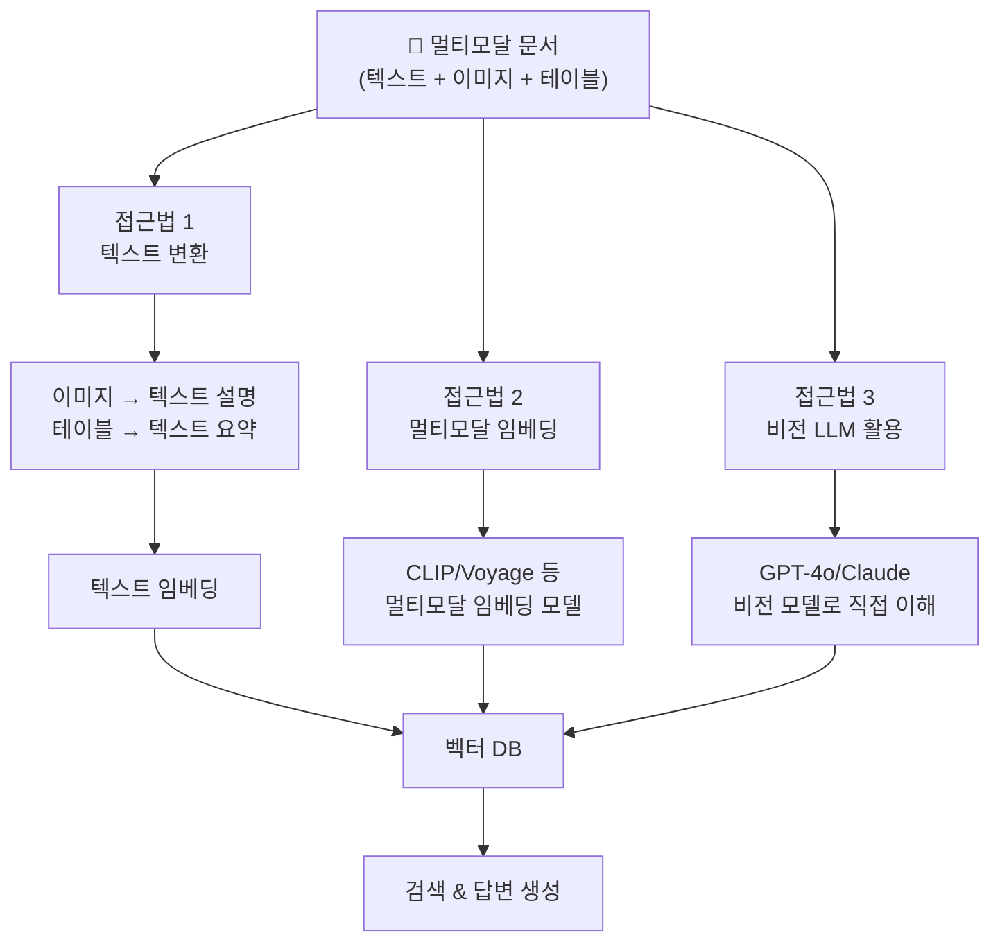
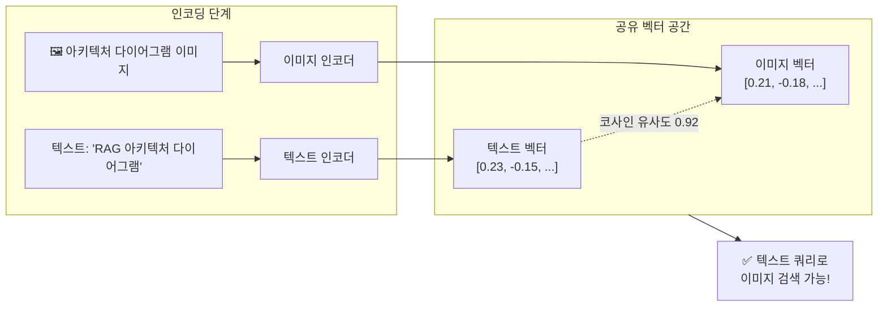
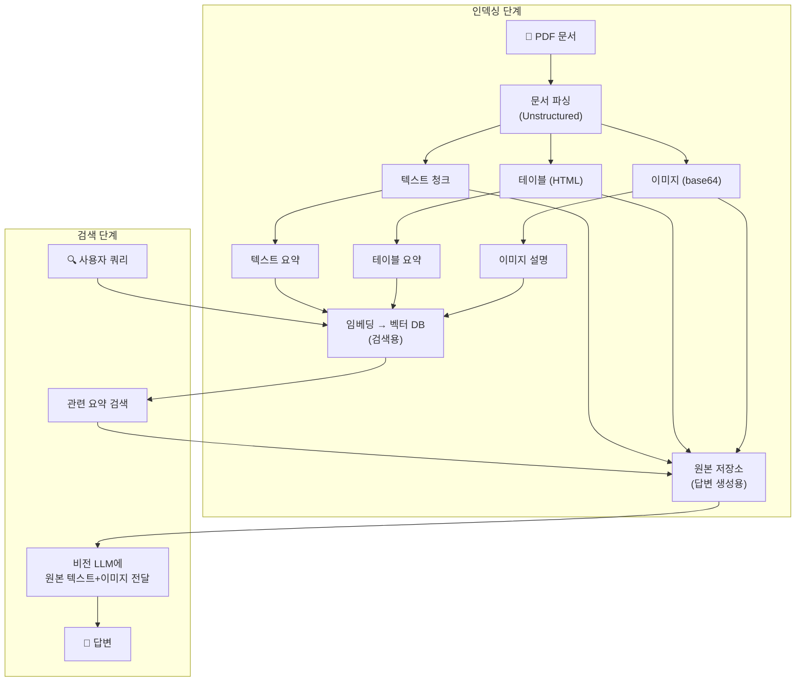
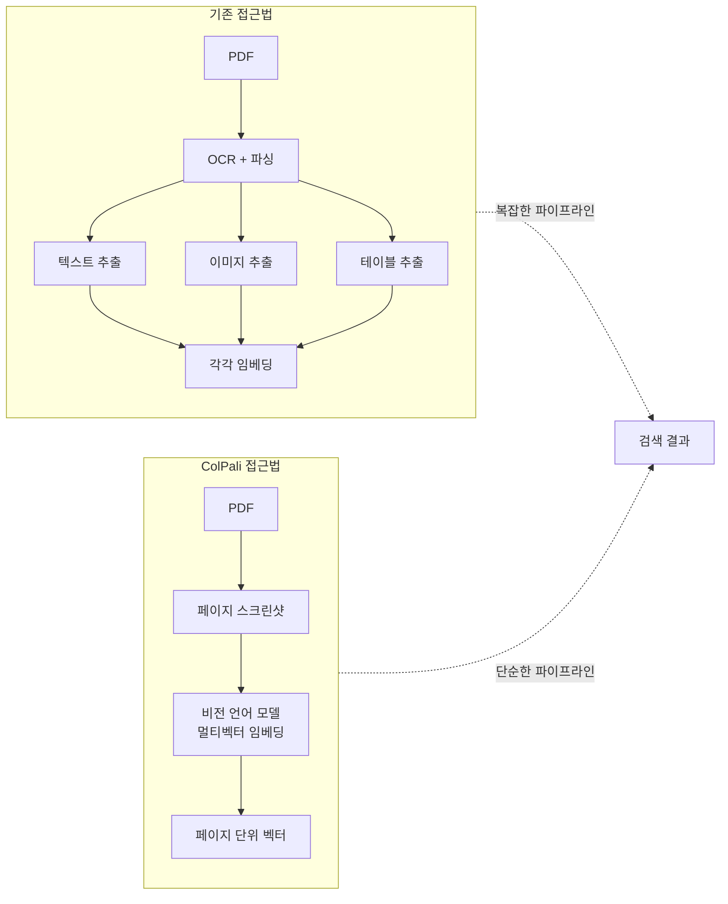

# 멀티모달 RAG 아키텍처 — 텍스트를 넘어서

> 이미지, 테이블, 차트가 포함된 문서에서도 정확하게 검색하고 답변하는 멀티모달 RAG의 세 가지 접근법을 이해합니다.

## 개요

지금까지 우리는 텍스트 기반 RAG 시스템을 깊이 있게 다뤘습니다. 문서를 청킹하고, 임베딩으로 변환하고, 벡터 DB에서 검색하는 파이프라인이죠. 하지만 현실 세계의 문서는 텍스트만으로 이루어져 있지 않습니다. 기술 문서에는 아키텍처 다이어그램이, 논문에는 실험 결과 테이블이, 재무 보고서에는 차트가 빠질 수 없거든요. 이번 세션에서는 텍스트를 넘어 **이미지, 테이블, 차트**까지 통합하는 멀티모달 RAG의 전체 그림을 그려봅니다.

**선수 지식**: 앞서 Ch8~Ch10에서 배운 기본 RAG 파이프라인 구축, 벡터 검색, 메타데이터 필터링 개념이 필요합니다. 특히 [Ch8: 기본 RAG 파이프라인 구축](08-기본-rag-파이프라인-구축-langchain으로-첫-rag-앱-만들기/01-langchain-v1-핵심-개념과-설정.md)에서 다룬 LangChain의 LCEL 체인 구조를 기억해 주세요.

**학습 목표**:
- 텍스트 전용 RAG의 한계와 멀티모달 RAG가 필요한 실제 시나리오를 설명할 수 있다
- 세 가지 멀티모달 RAG 접근법(텍스트 변환, 멀티모달 임베딩, 비전 LLM)의 원리와 차이를 비교할 수 있다
- 각 접근법의 장단점을 파악하고, 상황에 맞는 전략을 선택할 수 있다

## 왜 알아야 할까?

여러분이 사내 기술 문서 검색 시스템을 만든다고 상상해 보세요. 누군가 "시스템 아키텍처에서 인증 서버의 위치가 어디야?"라고 질문합니다. 답은 텍스트가 아니라 아키텍처 **다이어그램** 속에 있습니다. 또는 의료 논문에서 "치료 그룹 A와 B의 생존율 차이"를 묻는다면? 답은 **테이블**에 담겨 있죠.

실제로 기업 문서의 **약 40%**가 텍스트가 아닌 시각적 요소(테이블, 차트, 이미지, 수식)에 핵심 정보를 담고 있다고 합니다. 텍스트만 처리하는 RAG 시스템은 이 모든 정보를 **통째로 무시**하는 셈이에요. 멀티모달 RAG를 이해하면:

- PDF 기술 문서의 아키텍처 다이어그램까지 검색할 수 있습니다
- 논문의 실험 결과 테이블에서 직접 수치를 추출해 답변할 수 있습니다
- 재무 보고서의 차트를 분석하여 트렌드를 설명할 수 있습니다
- 매뉴얼의 스크린샷을 이해하여 단계별 가이드를 제공할 수 있습니다

## 핵심 개념

### 개념 1: 텍스트 전용 RAG의 한계 — 보이지 않는 정보의 벽

> 💡 **비유**: 텍스트 전용 RAG는 마치 **눈을 감고 미술관을 관람**하는 것과 같습니다. 작품 옆의 설명문(텍스트)은 읽을 수 있지만, 정작 그림(이미지) 자체는 볼 수 없죠. 설명문에 "인상적인 색감"이라 적혀 있어도, 그 색감이 어떤 것인지는 알 수 없는 겁니다.

기존 텍스트 RAG 파이프라인은 문서에서 텍스트만 추출합니다. PDF를 파싱할 때 이미지는 건너뛰고, 테이블은 구조가 깨진 채 평문으로 변환되며, 차트의 시각적 패턴은 완전히 사라집니다. 이게 어떤 문제를 일으키는지 구체적으로 살펴볼까요?

| 문서 요소 | 텍스트 RAG의 처리 | 손실되는 정보 |
|-----------|-------------------|---------------|
| 테이블 | 행/열 구조 붕괴, 평문 변환 | 셀 간 관계, 정렬, 헤더 매핑 |
| 차트/그래프 | 완전 무시 또는 캡션만 추출 | 데이터 트렌드, 비교, 수치 |
| 아키텍처 다이어그램 | 무시 | 컴포넌트 관계, 데이터 흐름 |
| 수식 | 깨진 텍스트로 변환 | 수학적 의미, 변수 관계 |
| 스크린샷 | 완전 무시 | UI 레이아웃, 설정 화면 정보 |

```run:python
# 텍스트 전용 RAG의 한계를 간단히 시뮬레이션해 봅시다
document_elements = {
    "텍스트 단락": {"개수": 45, "텍스트_RAG_처리": "✅ 완전 처리"},
    "데이터 테이블": {"개수": 12, "텍스트_RAG_처리": "⚠️ 구조 손실"},
    "차트/그래프": {"개수": 8, "텍스트_RAG_처리": "❌ 무시됨"},
    "아키텍처 다이어그램": {"개수": 5, "텍스트_RAG_처리": "❌ 무시됨"},
    "코드 스크린샷": {"개수": 3, "텍스트_RAG_처리": "❌ 무시됨"},
}

total = sum(e["개수"] for e in document_elements.values())
ignored = sum(e["개수"] for e in document_elements.values() 
              if "❌" in e["텍스트_RAG_처리"])
degraded = sum(e["개수"] for e in document_elements.values() 
               if "⚠️" in e["텍스트_RAG_처리"])

print(f"전체 문서 요소: {total}개")
print(f"완전 무시: {ignored}개 ({ignored/total*100:.1f}%)")
print(f"품질 저하: {degraded}개 ({degraded/total*100:.1f}%)")
print(f"정보 손실률: {(ignored + degraded)/total*100:.1f}%")
```

```output
전체 문서 요소: 73개
완전 무시: 16개 (21.9%)
품질 저하: 12개 (16.4%)
정보 손실률: 38.4%
```

문서의 약 38%에 달하는 정보가 손실되거나 품질이 저하됩니다. 이것이 바로 멀티모달 RAG가 필요한 이유입니다.

### 개념 2: 멀티모달 RAG의 세 가지 접근법

멀티모달 RAG를 구현하는 방법은 크게 세 가지로 나뉩니다. 각각의 핵심 아이디어와 작동 방식을 하나씩 살펴보겠습니다.

> 📊 **그림 1**: 멀티모달 RAG의 세 가지 접근법 비교



#### 접근법 1: 텍스트 변환 (Text Conversion)

> 💡 **비유**: 외국어 영화를 볼 때 **더빙**하는 것과 비슷합니다. 원래 배우의 연기(이미지)를 한국어 음성(텍스트)으로 변환하는 거죠. 편리하지만, 원래 배우의 목소리 톤이나 감정 뉘앙스는 일부 손실됩니다.

이 접근법의 핵심 아이디어는 간단합니다. **모든 비텍스트 요소를 텍스트로 변환**한 뒤, 기존 텍스트 RAG 파이프라인을 그대로 사용하는 것이죠.

- **이미지** → 비전 모델(GPT-4o, Claude 등)이 텍스트 설명을 생성
- **테이블** → HTML이나 마크다운으로 구조화하거나, LLM이 자연어 요약을 생성
- **차트** → 비전 모델이 트렌드와 수치를 텍스트로 서술

```python
from langchain_core.messages import HumanMessage
from langchain_openai import ChatOpenAI

# 비전 모델로 이미지를 텍스트 설명으로 변환
def image_to_text_summary(image_base64: str) -> str:
    """이미지를 텍스트 요약으로 변환합니다."""
    model = ChatOpenAI(model="gpt-4o", max_tokens=1024)
    
    message = HumanMessage(
        content=[
            {"type": "text", "text": "이 이미지를 상세하게 설명해 주세요. "
             "다이어그램이라면 각 구성 요소와 관계를, "
             "테이블이라면 행/열 구조와 데이터를, "
             "차트라면 트렌드와 주요 수치를 포함해 주세요."},
            {"type": "image_url", 
             "image_url": {"url": f"data:image/png;base64,{image_base64}"}},
        ]
    )
    response = model.invoke([message])
    return response.content
```

**장점**: 기존 텍스트 RAG 인프라를 그대로 활용할 수 있고, 구현이 가장 간단합니다.
**단점**: 변환 과정에서 정보 손실이 불가피하고, 이미지마다 LLM API를 호출해야 하므로 전처리 비용이 높습니다.

#### 접근법 2: 멀티모달 임베딩 (Multimodal Embeddings)

> 💡 **비유**: 이것은 **만국 공통어**를 만드는 것과 같습니다. 한국어든, 그림이든, 악보든 모두 같은 "우주 공통어"(벡터 공간)로 번역하면, 서로 다른 형태의 데이터끼리도 직접 비교할 수 있게 됩니다.

멀티모달 임베딩 모델(CLIP, OpenCLIP, Voyage Multimodal-3 등)은 텍스트와 이미지를 **동일한 벡터 공간**에 매핑합니다. 텍스트 쿼리로 이미지를 검색하거나, 이미지로 관련 텍스트를 찾는 "any-to-any" 검색이 가능해지는 거죠.

> 📊 **그림 2**: 멀티모달 임베딩의 동작 원리 — 텍스트와 이미지를 같은 벡터 공간에 매핑



대표적인 멀티모달 임베딩 모델들을 비교해 보겠습니다:

| 모델 | 개발사 | 벡터 차원 | 최대 토큰 | 특징 |
|------|--------|-----------|-----------|------|
| CLIP ViT-L/14 | OpenAI | 768 | 77 토큰 | 가장 널리 사용, 오픈소스 |
| OpenCLIP | LAION | 768 | 77 토큰 | CLIP의 오픈소스 재구현, 다양한 학습 데이터 |
| voyage-multimodal-3 | Voyage AI | 1024 | 32,000 토큰 | 텍스트+이미지 인터리빙, 스크린샷 특화 |
| Jina CLIP v2 | Jina AI | 1024 | 8,192 토큰 | 다국어 지원, 긴 텍스트 처리 |

```python
# OpenCLIP을 사용한 멀티모달 임베딩 예시 (개념 코드)
from langchain_experimental.open_clip import OpenCLIPEmbeddings

# 텍스트와 이미지를 같은 벡터 공간에 임베딩
embedding_model = OpenCLIPEmbeddings(
    model_name="ViT-L-14",
    checkpoint="laion2b_s32b_b82k"
)

# 텍스트 임베딩
text_vectors = embedding_model.embed_documents(
    ["RAG 시스템 아키텍처 다이어그램", "벡터 검색 흐름도"]
)

# 이미지 임베딩 — 같은 모델로 이미지도 벡터화
image_vectors = embedding_model.embed_image(
    ["./images/architecture.png", "./images/flowchart.png"]
)
```

**장점**: 텍스트 → 이미지 변환 없이 **원본 이미지를 직접** 벡터화하므로 정보 손실이 적습니다. 검색 정확도가 텍스트 변환 대비 평균 19~32% 향상된다는 연구 결과도 있습니다.
**단점**: CLIP 계열은 토큰 제한(77 토큰)이 짧아 긴 텍스트 처리에 약하고, 복잡한 테이블의 세부 수치 이해에는 한계가 있습니다.

#### 접근법 3: 비전 LLM 직접 활용 (Vision LLM)

> 💡 **비유**: 이것은 **동시통역사**를 고용하는 것과 같습니다. 미리 번역해 두는(텍스트 변환) 것도 아니고, 만국 공통어(멀티모달 임베딩)를 쓰는 것도 아닌, 실시간으로 이미지를 보면서 질문에 답하는 전문 통역사(비전 LLM)를 활용하는 방식입니다.

GPT-4o, Claude 3.5 Sonnet, Gemini 등 비전 LLM은 이미지를 직접 입력받아 이해하고 추론할 수 있습니다. 이 접근법은 검색된 원본 이미지를 비전 LLM에 **직접 전달**하여 답변을 생성합니다.

```python
import base64
from langchain_core.messages import HumanMessage
from langchain_openai import ChatOpenAI

def answer_with_vision(
    query: str, 
    text_context: str, 
    image_paths: list[str]
) -> str:
    """텍스트 컨텍스트와 이미지를 함께 활용하여 답변을 생성합니다."""
    model = ChatOpenAI(model="gpt-4o", max_tokens=2048)
    
    # 이미지를 base64로 인코딩
    image_contents = []
    for path in image_paths:
        with open(path, "rb") as f:
            img_b64 = base64.b64encode(f.read()).decode()
        image_contents.append({
            "type": "image_url",
            "image_url": {"url": f"data:image/png;base64,{img_b64}"}
        })
    
    # 텍스트 + 이미지를 함께 LLM에 전달
    message = HumanMessage(content=[
        {"type": "text", "text": f"다음 컨텍스트와 이미지를 참고하여 "
         f"질문에 답해 주세요.\n\n컨텍스트:\n{text_context}\n\n"
         f"질문: {query}"},
        *image_contents
    ])
    
    return model.invoke([message]).content
```

**장점**: 이미지의 세부 내용까지 깊이 이해할 수 있고, 복잡한 차트나 다이어그램의 추론이 가능합니다.
**단점**: 모든 검색 결과에 비전 LLM을 호출해야 하므로 지연시간과 비용이 크게 증가합니다.

### 개념 3: 하이브리드 전략 — Multi-Vector Retriever

실무에서 가장 많이 사용되는 패턴은 사실 위 세 가지를 **조합한 하이브리드 전략**입니다. LangChain의 **Multi-Vector Retriever**가 대표적인데, 핵심 아이디어는 **검색용 표현과 답변 생성용 원본을 분리**하는 것입니다.

> 📊 **그림 3**: Multi-Vector Retriever 하이브리드 전략 — 검색용 요약과 원본 분리



이 전략의 핵심을 정리하면:

1. **파싱 단계**: Unstructured 등으로 PDF에서 텍스트, 테이블, 이미지를 분리 추출
2. **요약 단계**: 각 요소의 텍스트 요약을 생성 (비전 LLM 활용)
3. **인덱싱 단계**: 요약 텍스트를 임베딩하여 벡터 DB에 저장, 원본은 별도 저장소(DocStore)에 보관
4. **검색 단계**: 쿼리와 유사한 요약을 검색 → 해당 원본(텍스트/이미지)을 비전 LLM에 전달하여 답변 생성

```run:python
# Multi-Vector Retriever의 개념을 코드로 표현
retriever_config = {
    "검색_대상": "텍스트 요약 (가벼운 벡터 검색)",
    "답변_생성_대상": "원본 텍스트 + 원본 이미지 (풍부한 정보)",
    "핵심_원리": "검색은 빠르게, 답변은 정확하게"
}

for key, value in retriever_config.items():
    print(f"  {key}: {value}")

print()
print("💡 요약으로 빠르게 찾고, 원본으로 정확하게 답한다!")
```

```output
  검색_대상: 텍스트 요약 (가벼운 벡터 검색)
  답변_생성_대상: 원본 텍스트 + 원본 이미지 (풍부한 정보)
  핵심_원리: 검색은 빠르게, 답변은 정확하게

💡 요약으로 빠르게 찾고, 원본으로 정확하게 답한다!
```

### 개념 4: 최신 연구 방향 — ColPali와 문서 스크린샷 검색

최근 멀티모달 RAG에서 가장 주목받는 연구 방향이 하나 더 있습니다. 바로 **ColPali**(Contextualized Late Interaction over PaliGemma)로 대표되는 **문서 스크린샷 기반 검색**이에요.

기존 접근법들은 문서를 텍스트/이미지/테이블로 분리해야 했지만, ColPali는 발상을 완전히 뒤집습니다. 문서 페이지를 **통째로 스크린샷**으로 찍어서, 텍스트·이미지·테이블·레이아웃을 **한 번에** 벡터화하는 거죠.

> 📊 **그림 4**: 기존 접근법 vs ColPali 접근법 비교



ColPali의 후속 모델인 **ColQwen2**는 Qwen2-VL 비전 언어 모델을 기반으로, 더 작은 모델 크기로도 유사한 성능을 달성합니다. 이 접근법은 복잡한 전처리 파이프라인 없이 PDF를 스크린샷만 찍으면 되므로, 파이프라인 구축이 극적으로 단순해집니다.

> ⚠️ **참고**: ColPali와 ColQwen2는 아직 **활발히 연구가 진행 중인 최신 접근법**입니다. 매우 유망하지만, 프로덕션 환경에서 널리 검증된 단계는 아직 아니에요. 이번 챕터(19.2~19.4)에서는 현재 실무에서 가장 많이 쓰이는 **텍스트 변환, 멀티모달 임베딩, 비전 LLM 기반 하이브리드 전략**에 집중하여 실습합니다. ColPali 계열의 실습이 궁금하다면, 참고 자료의 ColPali 논문과 [Vespa의 ColPali 실습 가이드](https://blog.vespa.ai/retrieval-with-vision-language-models-colpali/)를 살펴보세요.

## 실습: 직접 해보기

멀티모달 RAG의 전체 아키텍처를 이해하기 위해, 세 가지 접근법의 처리 흐름을 시뮬레이션하는 코드를 작성해 봅시다. 실제 모델 호출 없이도 각 접근법의 구조와 특성을 파악할 수 있습니다.

```run:python
from dataclasses import dataclass

@dataclass
class DocumentElement:
    """문서에서 추출된 요소를 표현합니다."""
    element_type: str    # "text", "table", "image"
    content: str         # 원본 내용 또는 경로
    metadata: dict       # 페이지 번호, 위치 등


# 시뮬레이션용 문서 요소 생성
elements = [
    DocumentElement("text", "RAG는 검색 증강 생성 기법으로...", {"page": 1}),
    DocumentElement("table", "<table>모델 성능 비교표</table>", {"page": 2}),
    DocumentElement("image", "architecture_diagram.png", {"page": 3}),
    DocumentElement("text", "벡터 데이터베이스는...", {"page": 4}),
    DocumentElement("image", "performance_chart.png", {"page": 5}),
]


def approach_1_text_conversion(elements: list[DocumentElement]) -> dict:
    """접근법 1: 모든 요소를 텍스트로 변환"""
    results = {"텍스트_요약": [], "원본_보존": False}
    for elem in elements:
        if elem.element_type == "text":
            results["텍스트_요약"].append(f"[텍스트] {elem.content[:30]}...")
        elif elem.element_type == "table":
            results["텍스트_요약"].append(f"[테이블→텍스트] 비전 LLM으로 요약 생성")
        elif elem.element_type == "image":
            results["텍스트_요약"].append(f"[이미지→텍스트] 비전 LLM으로 설명 생성")
    return results


def approach_2_multimodal_embedding(elements: list[DocumentElement]) -> dict:
    """접근법 2: 멀티모달 임베딩으로 직접 벡터화"""
    results = {"벡터화_대상": [], "원본_보존": True}
    for elem in elements:
        if elem.element_type == "text":
            results["벡터화_대상"].append(f"[텍스트→벡터] 텍스트 인코더")
        elif elem.element_type in ("table", "image"):
            results["벡터화_대상"].append(
                f"[{elem.element_type}→벡터] 이미지 인코더 (CLIP)")
    return results


def approach_3_vision_llm(elements: list[DocumentElement]) -> dict:
    """접근법 3: 비전 LLM으로 직접 이해"""
    results = {"처리_방식": [], "원본_보존": True}
    for elem in elements:
        if elem.element_type == "text":
            results["처리_방식"].append(f"[텍스트] 요약 임베딩 + 원본 저장")
        elif elem.element_type in ("table", "image"):
            results["처리_방식"].append(
                f"[{elem.element_type}] 요약 임베딩 → 검색 시 원본을 비전 LLM에 전달")
    return results


# 세 가지 접근법 비교
approaches = {
    "접근법 1 - 텍스트 변환": approach_1_text_conversion(elements),
    "접근법 2 - 멀티모달 임베딩": approach_2_multimodal_embedding(elements),
    "접근법 3 - 비전 LLM": approach_3_vision_llm(elements),
}

for name, result in approaches.items():
    print(f"\n{'='*50}")
    print(f"📌 {name}")
    print(f"  원본 보존: {'✅ 예' if result.get('원본_보존') else '❌ 아니오'}")
    items = result.get("텍스트_요약") or result.get("벡터화_대상") or result.get("처리_방식")
    for item in items:
        print(f"  • {item}")
```

```output

==================================================
📌 접근법 1 - 텍스트 변환
  원본 보존: ❌ 아니오
  • [텍스트] RAG는 검색 증강 생성 기법으로......
  • [테이블→텍스트] 비전 LLM으로 요약 생성
  • [이미지→텍스트] 비전 LLM으로 설명 생성
  • [텍스트] 벡터 데이터베이스는......
  • [이미지→텍스트] 비전 LLM으로 설명 생성

==================================================
📌 접근법 2 - 멀티모달 임베딩
  원본 보존: ✅ 예
  • [텍스트→벡터] 텍스트 인코더
  • [table→벡터] 이미지 인코더 (CLIP)
  • [image→벡터] 이미지 인코더 (CLIP)
  • [텍스트→벡터] 텍스트 인코더
  • [image→벡터] 이미지 인코더 (CLIP)

==================================================
📌 접근법 3 - 비전 LLM
  원본 보존: ✅ 예
  • [텍스트] 요약 임베딩 + 원본 저장
  • [table] 요약 임베딩 → 검색 시 원본을 비전 LLM에 전달
  • [image] 요약 임베딩 → 검색 시 원본을 비전 LLM에 전달
  • [텍스트] 요약 임베딩 + 원본 저장
  • [image] 요약 임베딩 → 검색 시 원본을 비전 LLM에 전달
```

이어서 각 접근법의 트레이드오프를 정량적으로 비교해 봅시다:

```run:python
# 세 가지 접근법의 트레이드오프 비교
comparison = [
    {
        "접근법": "1. 텍스트 변환",
        "구현_난이도": "★☆☆ 쉬움",
        "검색_정확도": "★★☆ 보통",
        "정보_보존": "★☆☆ 낮음",
        "비용": "★★☆ 중간 (전처리 LLM 호출)",
        "지연시간": "★★★ 빠름 (검색 시)",
        "적합한_사례": "캡션이 충분한 문서, 빠른 프로토타입"
    },
    {
        "접근법": "2. 멀티모달 임베딩",
        "구현_난이도": "★★☆ 보통",
        "검색_정확도": "★★★ 높음",
        "정보_보존": "★★★ 높음",
        "비용": "★☆☆ 저렴 (임베딩만)",
        "지연시간": "★★★ 빠름",
        "적합한_사례": "이미지 중심 검색, 대규모 문서"
    },
    {
        "접근법": "3. 비전 LLM (하이브리드)",
        "구현_난이도": "★★★ 복잡",
        "검색_정확도": "★★★ 매우 높음",
        "정보_보존": "★★★ 매우 높음",
        "비용": "★★★ 비쌈 (매 쿼리 LLM 호출)",
        "지연시간": "★☆☆ 느림",
        "적합한_사례": "정밀 분석, 복잡한 차트 해석"
    },
]

for item in comparison:
    print(f"\n📌 {item['접근법']}")
    for key, value in item.items():
        if key != "접근법":
            print(f"  {key}: {value}")
```

```output

📌 1. 텍스트 변환
  구현_난이도: ★☆☆ 쉬움
  검색_정확도: ★★☆ 보통
  정보_보존: ★☆☆ 낮음
  비용: ★★☆ 중간 (전처리 LLM 호출)
  지연시간: ★★★ 빠름 (검색 시)
  적합한_사례: 캡션이 충분한 문서, 빠른 프로토타입

📌 2. 멀티모달 임베딩
  구현_난이도: ★★☆ 보통
  검색_정확도: ★★★ 높음
  정보_보존: ★★★ 높음
  비용: ★☆☆ 저렴 (임베딩만)
  지연시간: ★★★ 빠름
  적합한_사례: 이미지 중심 검색, 대규모 문서

📌 3. 비전 LLM (하이브리드)
  구현_난이도: ★★★ 복잡
  검색_정확도: ★★★ 매우 높음
  정보_보존: ★★★ 매우 높음
  비용: ★★★ 비쌈 (매 쿼리 LLM 호출)
  지연시간: ★☆☆ 느림
  적합한_사례: 정밀 분석, 복잡한 차트 해석
```

## 더 깊이 알아보기

### CLIP의 탄생 — "인터넷 4억 장의 이미지로 학습하다"

멀티모달 임베딩의 역사를 이해하려면 2021년 OpenAI가 발표한 **CLIP**(Contrastive Language–Image Pretraining)의 탄생 이야기를 빼놓을 수 없습니다.

당시 컴퓨터 비전 분야는 ImageNet 같은 **수동 라벨링된 데이터셋**에 의존하고 있었어요. "고양이", "개"처럼 사람이 일일이 분류한 데이터로 모델을 학습시켰죠. OpenAI 연구팀은 여기서 발상을 전환합니다. "인터넷에는 이미 이미지와 텍스트가 짝을 이루어 존재하지 않나?" 웹 페이지의 이미지와 그 캡션 **4억 쌍**을 수집하여, 이미지와 텍스트를 같은 벡터 공간에 매핑하는 모델을 학습시킨 것입니다.

놀라운 점은, CLIP이 한 번도 본 적 없는 카테고리의 이미지도 텍스트 설명만으로 분류할 수 있었다는 것이에요(**제로샷 분류**). 이 "텍스트와 이미지의 공통 언어"라는 아이디어가 바로 오늘날 멀티모달 RAG의 기반이 된 것입니다.

### ColPali의 혁신 — "파싱하지 말고 그냥 찍어라"

2024년 프랑스의 AI 스타트업 Illuin Technology 연구팀은 문서 검색의 패러다임을 바꾸는 논문을 발표합니다. 기존 멀티모달 RAG가 "문서를 분해하여 각 요소를 처리"하는 방식이었다면, ColPali는 "문서 페이지를 통째로 스크린샷으로 찍어 검색"하는 방식을 제안했습니다. 연구팀의 직관은 간단했어요 — OCR과 레이아웃 분석에서 발생하는 오류를 아예 없애려면, 사람처럼 **페이지 전체를 눈으로 보고 이해**하면 되지 않을까?

이 아이디어는 ColBERT의 후기 상호작용(Late Interaction) 메커니즘을 비전 언어 모델에 결합함으로써 실현되었습니다. 복잡한 문서 파싱 파이프라인 없이도 경쟁력 있는 검색 성능을 달성하며, 멀티모달 RAG의 새로운 방향을 제시했죠.

## 흔한 오해와 팁

> ⚠️ **흔한 오해**: "멀티모달 RAG는 무조건 텍스트 RAG보다 좋다"
> 
> 그렇지 않습니다! 문서가 순수 텍스트로만 구성되어 있다면 기존 텍스트 RAG가 더 빠르고, 저렴하고, 단순합니다. 멀티모달 RAG는 **시각적 요소에 핵심 정보가 담긴 경우**에만 의미가 있어요. 솔루션의 복잡도는 문제의 복잡도에 맞춰야 합니다.

> 💡 **알고 계셨나요?**: CLIP은 원래 **이미지 분류**를 위해 만들어졌지, RAG를 위해 만든 것이 아닙니다. 텍스트-이미지 공유 벡터 공간이라는 부산물이 멀티모달 검색에 활용될 수 있다는 것은 커뮤니티가 발견한 것이죠. 과학사에서 흔한 "의도치 않은 발견(serendipity)"의 좋은 사례입니다.

> 🔥 **실무 팁**: 멀티모달 RAG를 처음 도입할 때는 **접근법 1(텍스트 변환)부터 시작**하세요. 기존 텍스트 RAG 인프라를 그대로 활용하면서 이미지 설명만 추가하면 되므로 가장 빨리 프로토타입할 수 있습니다. 성능이 부족하다고 느껴질 때 접근법 2나 3으로 점진적으로 업그레이드하는 전략이 실무에서 가장 효과적입니다.

> 🔥 **실무 팁**: 테이블을 처리할 때 Unstructured는 HTML 문자열로 출력하는데, 이것이 마크다운보다 **행/열 구조를 훨씬 잘 보존**합니다. LLM도 HTML 테이블을 마크다운보다 더 정확하게 이해하므로, 테이블은 HTML 형태를 유지하는 것이 좋습니다.

## 핵심 정리

| 개념 | 설명 |
|------|------|
| 멀티모달 RAG | 텍스트뿐 아니라 이미지, 테이블, 차트 등 다양한 모달리티를 검색·활용하는 RAG 시스템 |
| 접근법 1: 텍스트 변환 | 비텍스트 요소를 LLM으로 텍스트 설명으로 변환 후 기존 파이프라인 활용. 간단하지만 정보 손실 |
| 접근법 2: 멀티모달 임베딩 | CLIP, OpenCLIP 등으로 텍스트·이미지를 같은 벡터 공간에 매핑. 원본 보존, 빠른 검색 |
| 접근법 3: 비전 LLM | GPT-4o, Claude 등에 원본 이미지를 직접 전달. 가장 정확하지만 비용·지연시간 큼 |
| Multi-Vector Retriever | 검색용 요약과 답변용 원본을 분리하는 LangChain의 하이브리드 전략 |
| ColPali / ColQwen | 문서 페이지를 스크린샷으로 통째로 벡터화하는 최신 연구 방향. 파싱 불필요 |
| Unstructured | PDF에서 텍스트, 테이블(HTML), 이미지(base64)를 구조적으로 추출하는 파싱 라이브러리 |

## 다음 섹션 미리보기

이번 세션에서 멀티모달 RAG의 전체 지형도를 그렸다면, 다음 세션 **[19.2: PDF의 테이블과 이미지 추출]**에서는 본격적으로 실습에 들어갑니다. Unstructured 라이브러리를 사용하여 실제 PDF 문서에서 텍스트, 테이블, 이미지를 분리 추출하고, 각 요소를 멀티모달 RAG 파이프라인에 맞게 전처리하는 과정을 코드로 구현해 볼 거예요.

## 참고 자료

- [Multi-Vector Retriever for RAG on tables, text, and images — LangChain Blog](https://blog.langchain.com/semi-structured-multi-modal-rag/) - 멀티모달 RAG의 세 가지 접근법을 Multi-Vector Retriever로 구현하는 공식 가이드
- [ColPali: Efficient Document Retrieval with Vision Language Models](https://arxiv.org/abs/2407.01449) - 문서 스크린샷 기반 검색의 혁신을 제안한 논문
- [Unstructured.io — Document Parsing Library (GitHub)](https://github.com/Unstructured-IO/unstructured) - PDF에서 텍스트, 테이블, 이미지를 추출하는 오픈소스 라이브러리
- [Multimodal RAG with Vision: From Experimentation to Implementation — Microsoft ISE Blog](https://devblogs.microsoft.com/ise/multimodal-rag-with-vision/) - 비전 모델을 활용한 멀티모달 RAG 실무 구현 가이드
- [voyage-multimodal-3: All-in-one Embedding Model — Voyage AI Blog](https://blog.voyageai.com/2024/11/12/voyage-multimodal-3/) - 텍스트+이미지 인터리빙 임베딩의 최신 모델 소개
- [Comparison of Text-Based and Image-Based Retrieval in Multimodal RAG Systems](https://arxiv.org/abs/2511.16654) - 텍스트 변환 vs 멀티모달 임베딩 검색 성능 비교 연구

---
### 🔗 Related Sessions
- [embedding](../05-임베딩-모델-이해-텍스트를-벡터로-변환/01-임베딩의-기본-개념-단어에서-문장까지.md) (prerequisite)
- [vector_database](../06-벡터-데이터베이스-기초-chromadb로-시작하기/01-벡터-데이터베이스란-왜-필요한가.md) (prerequisite)
- [chunking](../04-텍스트-청킹-전략-문서-분할과-최적화/01-청킹의-중요성과-기본-원리.md) (prerequisite)
- [lcel](../08-기본-rag-파이프라인-구축-langchain으로-첫-rag-앱-만들기/01-langchain-v1-핵심-개념과-설정.md) (prerequisite)
