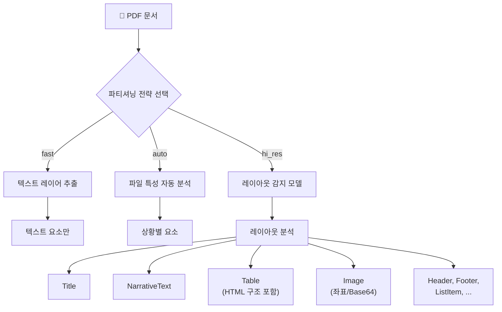
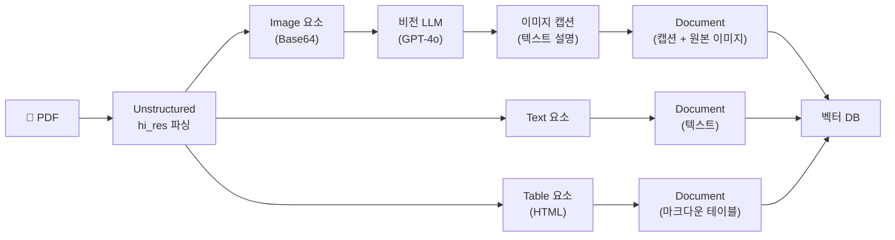
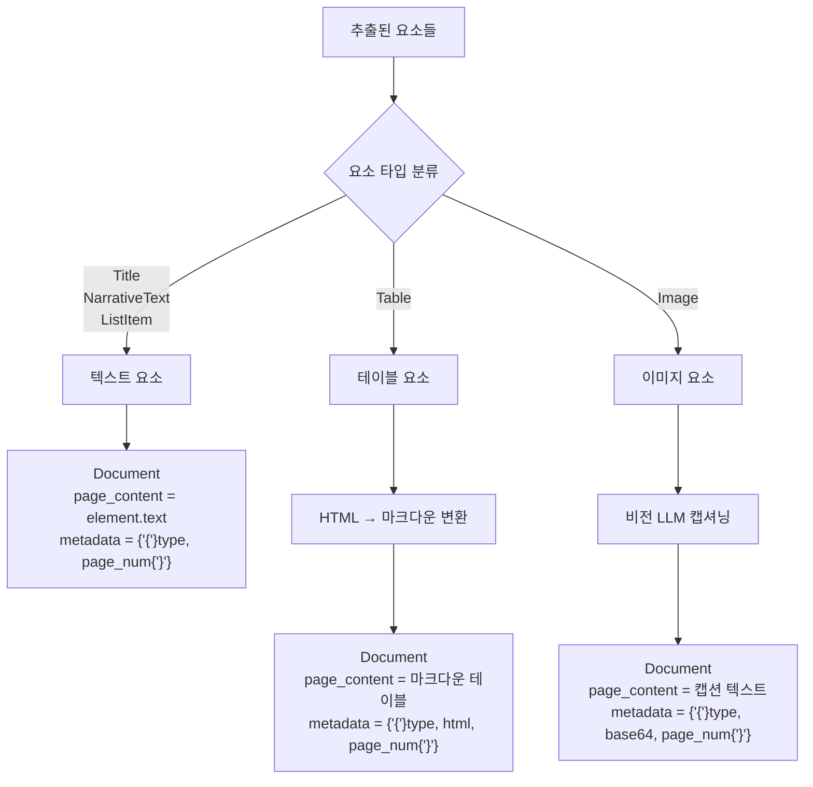
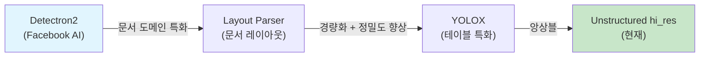

# 테이블과 이미지 추출 — 문서 파싱 심화

> Unstructured.io의 `hi_res` 전략으로 PDF 속 테이블과 이미지를 정밀하게 추출하고, 비전 LLM으로 이미지를 캡셔닝하여 RAG에 활용하는 방법을 배웁니다.

## 개요

[이전 세션(19.1: 멀티모달 RAG 아키텍처)](19-멀티모달-rag-이미지와-테이블-처리/01-멀티모달-rag-아키텍처-텍스트를-넘어서.md)에서 멀티모달 RAG의 세 가지 접근법 — 텍스트 변환, 멀티모달 임베딩, 비전 LLM — 을 비교했습니다. 이번 세션에서는 그중 가장 기본이 되는 **문서 파싱** 단계를 깊이 파고듭니다. [Ch3](03-문서-로딩과-파싱-다양한-소스에서-데이터-수집/01-문서-로딩-기초-langchain-document-loaders.md)에서 Unstructured의 기본 파티셔닝을 사용했다면, 이번에는 `hi_res` 전략으로 한 단계 올라갑니다. 아무리 훌륭한 검색 전략을 세워도, 원본 문서에서 테이블과 이미지를 제대로 추출하지 못하면 멀티모달 RAG는 출발선에도 서지 못하거든요.

**선수 지식**: 멀티모달 RAG 아키텍처(19.1), LangChain Document 객체 구조(3.1), 기본 문서 로딩(3장)
**학습 목표**:
- Unstructured.io의 파티셔닝 전략(`fast`, `hi_res`, `auto`)의 차이를 이해한다
- `hi_res` 전략으로 PDF에서 테이블을 HTML/마크다운으로 추출할 수 있다
- PDF 내 이미지를 추출하고 비전 LLM으로 캡셔닝할 수 있다
- 추출된 요소를 LangChain Document 객체로 변환하여 RAG 파이프라인에 연결할 수 있다

## 왜 알아야 할까?

실무에서 다루는 문서는 순수 텍스트만으로 이루어진 경우가 드뭅니다. 기업 보고서에는 재무 테이블이, 기술 논문에는 아키텍처 다이어그램이, 매뉴얼에는 제품 사진이 포함되어 있죠. 한 조사에 따르면 기업 문서의 **약 80%가 비정형 데이터**(이미지, 테이블, 차트 등)를 포함하고 있습니다.

텍스트만 추출하는 기존 RAG 파이프라인으로는 "3분기 매출이 전분기 대비 몇 % 증가했나?"라는 질문에 테이블 데이터를 참조할 수 없고, "시스템 아키텍처가 어떻게 생겼나?"라는 질문에 다이어그램을 활용할 수 없습니다. 문서 파싱 단계에서 테이블과 이미지를 정확하게 추출하는 것은 멀티모달 RAG의 **첫 번째이자 가장 중요한 관문**입니다.

## 핵심 개념

### 개념 1: Unstructured.io의 파티셔닝 전략

> 💡 **비유**: 문서 파싱은 마치 요리 재료 손질과 같습니다. `fast` 전략은 칼로 대충 썰기, `auto`는 재료에 따라 적당한 도구를 자동 선택하기, `hi_res`는 현미경으로 재료의 결을 살펴보며 정밀하게 손질하기와 같거든요. 테이블이나 이미지 같은 "까다로운 재료"는 `hi_res`의 정밀한 손질이 필수입니다.

Unstructured.io는 PDF를 분석할 때 세 가지 전략을 제공합니다:

| 전략 | 방식 | 테이블 추출 | 이미지 추출 | 속도 |
|------|------|-------------|-------------|------|
| `fast` | 텍스트 레이어만 추출 | ❌ | ❌ | 매우 빠름 |
| `auto` | 파일별 자동 선택 | △ (상황에 따라) | △ | 보통 |
| `hi_res` | 레이아웃 감지 모델 사용 | ✅ HTML 구조 보존 | ✅ | 느림 |

**`hi_res` 전략**은 내부적으로 **Detectron2** 또는 **YOLOX** 같은 객체 탐지 모델을 사용하여 문서의 레이아웃을 분석합니다. 이 모델이 페이지 내에서 텍스트 블록, 테이블, 이미지, 헤더, 푸터 등의 영역을 식별하죠.

> 📊 **그림 1**: Unstructured.io 파티셔닝 전략 비교



`hi_res` 전략으로 추출되는 주요 요소(Element) 타입은 다음과 같습니다:

- **Title**: 문서의 제목, 소제목
- **NarrativeText**: 본문 텍스트 단락
- **Table**: 테이블 데이터 (HTML 구조 보존)
- **Image**: 이미지 영역 (좌표 또는 Base64 인코딩)
- **ListItem**: 목록 항목
- **Header / Footer**: 페이지 머리글/꼬리글
- **FigureCaption**: 그림 캡션
- **Formula**: 수식

각 요소에는 `text` (추출된 텍스트), `category` (요소 타입), `metadata` (페이지 번호, 좌표, 파일명 등)가 포함됩니다.

```python
from unstructured.partition.pdf import partition_pdf

# hi_res 전략으로 PDF 파티셔닝
elements = partition_pdf(
    filename="report.pdf",
    strategy="hi_res",                    # 정밀 레이아웃 분석
    infer_table_structure=True,           # 테이블 HTML 구조 추론
    extract_image_block_types=["Image", "Table"],  # 이미지 블록 추출
    extract_image_block_to_payload=True,  # Base64로 메타데이터에 저장
)

# 추출된 요소 확인
for el in elements[:5]:
    print(f"[{el.category}] {el.text[:80]}...")
```

### 개념 2: 테이블 추출과 HTML/마크다운 변환

> 💡 **비유**: PDF 속 테이블을 추출하는 것은 액자에 끼워진 퍼즐을 다시 조립하는 것과 비슷합니다. PDF는 본래 "보여주기 위한" 포맷이라서 테이블의 행/열 구조를 명시적으로 저장하지 않거든요. `hi_res` 전략은 시각적 배치를 분석해서 "아, 이 글자들이 같은 행에 있고, 이 선이 열 구분선이구나"라고 추론하는 거죠.

`infer_table_structure=True`를 설정하면, Unstructured.io는 테이블 영역을 감지한 후 OCR과 레이아웃 분석을 결합하여 **행/열 구조를 복원**합니다. 복원된 구조는 `metadata.text_as_html`에 HTML 형태로 저장됩니다.

```run:python
# 테이블 요소의 구조 확인 (시뮬레이션)
class MockMetadata:
    text_as_html = """<table>
<tr><th>분기</th><th>매출(억)</th><th>성장률</th></tr>
<tr><td>Q1</td><td>150</td><td>12%</td></tr>
<tr><td>Q2</td><td>180</td><td>20%</td></tr>
<tr><td>Q3</td><td>210</td><td>17%</td></tr>
</table>"""

class MockTable:
    category = "Table"
    text = "분기 매출(억) 성장률 Q1 150 12% Q2 180 20% Q3 210 17%"
    metadata = MockMetadata()

table_el = MockTable()

# 일반 text: 구조가 사라진 평문
print("=== 평문 텍스트 ===")
print(table_el.text)

# metadata.text_as_html: 구조가 보존된 HTML
print("\n=== HTML 구조 ===")
print(table_el.metadata.text_as_html)
```

```output
=== 평문 텍스트 ===
분기 매출(억) 성장률 Q1 150 12% Q2 180 20% Q3 210 17%

=== HTML 구조 ===
<table>
<tr><th>분기</th><th>매출(억)</th><th>성장률</th></tr>
<tr><td>Q1</td><td>150</td><td>12%</td></tr>
<tr><td>Q2</td><td>180</td><td>20%</td></tr>
<tr><td>Q3</td><td>210</td><td>17%</td></tr>
</table>
```

보시다시피, `text` 속성만 사용하면 행과 열 구분이 사라져 LLM이 데이터를 정확히 해석하기 어렵습니다. 반면 `text_as_html`은 구조를 유지하죠.

HTML을 마크다운으로 변환하면 토큰을 절약하면서도 구조를 보존할 수 있습니다:

```run:python
def html_table_to_markdown(html: str) -> str:
    """HTML 테이블을 마크다운 테이블로 변환합니다."""
    from html.parser import HTMLParser
    
    class TableParser(HTMLParser):
        def __init__(self):
            super().__init__()
            self.rows: list[list[str]] = []
            self.current_row: list[str] = []
            self.current_cell = ""
            self.in_cell = False
            self.is_header = False
            
        def handle_starttag(self, tag, attrs):
            if tag in ("td", "th"):
                self.in_cell = True
                self.current_cell = ""
                if tag == "th":
                    self.is_header = True
                    
        def handle_endtag(self, tag):
            if tag in ("td", "th"):
                self.in_cell = False
                self.current_row.append(self.current_cell.strip())
            elif tag == "tr":
                if self.current_row:
                    self.rows.append(self.current_row)
                self.current_row = []
                
        def handle_data(self, data):
            if self.in_cell:
                self.current_cell += data
    
    parser = TableParser()
    parser.feed(html)
    
    if not parser.rows:
        return ""
    
    # 마크다운 테이블 생성
    lines = []
    header = parser.rows[0]
    lines.append("| " + " | ".join(header) + " |")
    lines.append("| " + " | ".join(["---"] * len(header)) + " |")
    for row in parser.rows[1:]:
        lines.append("| " + " | ".join(row) + " |")
    
    return "\n".join(lines)

# HTML → 마크다운 변환
html = """<table>
<tr><th>분기</th><th>매출(억)</th><th>성장률</th></tr>
<tr><td>Q1</td><td>150</td><td>12%</td></tr>
<tr><td>Q2</td><td>180</td><td>20%</td></tr>
<tr><td>Q3</td><td>210</td><td>17%</td></tr>
</table>"""

markdown = html_table_to_markdown(html)
print(markdown)
```

```output
| 분기 | 매출(억) | 성장률 |
| --- | --- | --- |
| Q1 | 150 | 12% |
| Q2 | 180 | 20% |
| Q3 | 210 | 17% |
```

> ⚠️ **흔한 오해**: "테이블은 그냥 텍스트로 추출하면 되지 않나?"라고 생각하기 쉽지만, 평문으로 추출된 테이블은 행/열 경계가 모호해져서 LLM이 "Q2 매출은?"이라는 질문에 엉뚱한 값을 반환할 수 있습니다. **구조 보존이 핵심**입니다.

### 개념 3: 이미지 추출과 비전 LLM 캡셔닝

> 💡 **비유**: PDF에서 이미지를 추출하는 것은 앨범에서 사진을 꺼내는 것과 같고, 캡셔닝은 그 사진 뒷면에 설명을 적는 것과 같습니다. 사진만 꺼내면 "이게 뭐지?" 싶지만, 뒷면의 설명을 읽으면 "아, 2023년 시스템 아키텍처 다이어그램이구나"라고 바로 알 수 있죠. 텍스트 기반 검색에서 이미지를 찾으려면 이 "뒷면 설명"이 반드시 필요합니다.

Unstructured.io의 `extract_image_block_types`와 `extract_image_block_to_payload` 옵션을 사용하면 이미지를 **Base64 인코딩**으로 추출할 수 있습니다.

> 📊 **그림 2**: 이미지 추출 및 캡셔닝 파이프라인



추출된 이미지는 `metadata.image_base64`와 `metadata.image_mime_type`에 저장됩니다. 이를 비전 LLM에 보내 텍스트 캡션을 생성하는 과정은 다음과 같습니다:

```python
import base64
from langchain_openai import ChatOpenAI
from langchain_core.messages import HumanMessage

def caption_image(image_base64: str, mime_type: str = "image/png") -> str:
    """비전 LLM으로 이미지 캡션을 생성합니다."""
    llm = ChatOpenAI(model="gpt-4o", max_tokens=300)
    
    message = HumanMessage(
        content=[
            {
                "type": "text",
                "text": (
                    "이 이미지를 상세하게 설명해주세요. "
                    "다이어그램이면 구성 요소와 흐름을, "
                    "차트면 데이터 추세를, "
                    "사진이면 핵심 내용을 포함해주세요."
                ),
            },
            {
                "type": "image_url",
                "image_url": {
                    "url": f"data:{mime_type};base64,{image_base64}",
                },
            },
        ]
    )
    
    response = llm.invoke([message])
    return response.content
```

> 🔥 **실무 팁**: 이미지 주변의 텍스트(캡션, 전후 200자 정도)를 함께 비전 LLM에 제공하면 훨씬 정확한 캡셔닝이 가능합니다. "Figure 3: System Architecture"라는 캡션이 있으면 LLM이 맥락을 더 잘 파악하거든요.

### 개념 4: 추출된 요소를 LangChain Document로 변환

모든 요소를 추출했다면, 이제 RAG 파이프라인에서 사용할 수 있도록 **LangChain Document 객체**로 변환해야 합니다. 핵심은 요소 타입별로 다른 전략을 적용하는 것입니다:

- **NarrativeText / Title**: `text`를 그대로 `page_content`로 사용
- **Table**: `text_as_html`을 마크다운으로 변환하여 `page_content`로 사용
- **Image**: 비전 LLM 캡션을 `page_content`로, 원본 Base64를 `metadata`에 보존

> 📊 **그림 3**: 요소 타입별 Document 변환 전략



```python
from langchain_core.documents import Document

def elements_to_documents(
    elements: list,
    caption_fn=None,  # 이미지 캡셔닝 함수
) -> list[Document]:
    """Unstructured 요소를 LangChain Document로 변환합니다."""
    documents = []
    
    for el in elements:
        # 공통 메타데이터
        base_meta = {
            "source": el.metadata.filename if hasattr(el.metadata, "filename") else "",
            "page_number": el.metadata.page_number if hasattr(el.metadata, "page_number") else 0,
            "category": el.category,
        }
        
        if el.category in ("NarrativeText", "Title", "ListItem", "FigureCaption"):
            # 텍스트 요소: 그대로 사용
            if el.text.strip():
                documents.append(Document(
                    page_content=el.text,
                    metadata=base_meta,
                ))
        
        elif el.category == "Table":
            # 테이블: HTML → 마크다운 변환
            html = getattr(el.metadata, "text_as_html", None)
            if html:
                md_table = html_table_to_markdown(html)
                content = f"[테이블]\n{md_table}"
            else:
                content = f"[테이블]\n{el.text}"
            
            documents.append(Document(
                page_content=content,
                metadata={**base_meta, "text_as_html": html or ""},
            ))
        
        elif el.category == "Image":
            # 이미지: 비전 LLM 캡셔닝
            img_b64 = getattr(el.metadata, "image_base64", None)
            mime = getattr(el.metadata, "image_mime_type", "image/png")
            
            if img_b64 and caption_fn:
                caption = caption_fn(img_b64, mime)
            else:
                caption = el.text or "이미지 설명 없음"
            
            documents.append(Document(
                page_content=f"[이미지] {caption}",
                metadata={
                    **base_meta,
                    "image_base64": img_b64 or "",
                    "image_mime_type": mime,
                },
            ))
    
    return documents
```

## 실습: 직접 해보기

아래는 PDF에서 테이블과 이미지를 추출하고, 각 요소를 LangChain Document로 변환하는 **전체 파이프라인**입니다.

```python
"""
멀티모달 문서 파싱 파이프라인
- Unstructured.io hi_res 전략으로 PDF 파싱
- 테이블 HTML → 마크다운 변환
- 이미지 Base64 추출 → 비전 LLM 캡셔닝
- LangChain Document 변환

필요 패키지:
pip install unstructured[pdf] langchain-core langchain-openai pillow
pip install "detectron2@git+https://github.com/facebookresearch/detectron2.git"
"""
import os
import base64
from pathlib import Path
from html.parser import HTMLParser

from unstructured.partition.pdf import partition_pdf
from langchain_core.documents import Document
from langchain_openai import ChatOpenAI
from langchain_core.messages import HumanMessage


# ============================================================
# 1단계: PDF 파티셔닝 (hi_res 전략)
# ============================================================
def parse_pdf(pdf_path: str, output_dir: str = "./extracted_images") -> list:
    """PDF를 hi_res 전략으로 파싱하여 요소 목록을 반환합니다."""
    os.makedirs(output_dir, exist_ok=True)
    
    elements = partition_pdf(
        filename=pdf_path,
        strategy="hi_res",                           # 정밀 레이아웃 분석
        infer_table_structure=True,                   # 테이블 HTML 구조 추론
        extract_image_block_types=["Image", "Table"], # 이미지/테이블 블록 추출
        extract_image_block_to_payload=True,          # Base64로 payload에 저장
        extract_image_block_output_dir=output_dir,    # 이미지 파일 저장 경로
    )
    
    return elements


# ============================================================
# 2단계: HTML 테이블 → 마크다운 변환
# ============================================================
class _TableParser(HTMLParser):
    """간단한 HTML 테이블 파서."""
    def __init__(self):
        super().__init__()
        self.rows: list[list[str]] = []
        self.current_row: list[str] = []
        self.current_cell = ""
        self.in_cell = False
    
    def handle_starttag(self, tag, attrs):
        if tag in ("td", "th"):
            self.in_cell = True
            self.current_cell = ""
    
    def handle_endtag(self, tag):
        if tag in ("td", "th"):
            self.in_cell = False
            self.current_row.append(self.current_cell.strip())
        elif tag == "tr" and self.current_row:
            self.rows.append(self.current_row)
            self.current_row = []
    
    def handle_data(self, data):
        if self.in_cell:
            self.current_cell += data


def html_table_to_markdown(html: str) -> str:
    """HTML 테이블을 마크다운 테이블로 변환합니다."""
    parser = _TableParser()
    parser.feed(html)
    
    if not parser.rows:
        return ""
    
    header = parser.rows[0]
    lines = [
        "| " + " | ".join(header) + " |",
        "| " + " | ".join(["---"] * len(header)) + " |",
    ]
    for row in parser.rows[1:]:
        # 열 수가 다르면 빈 셀로 보정
        padded = row + [""] * (len(header) - len(row))
        lines.append("| " + " | ".join(padded[:len(header)]) + " |")
    
    return "\n".join(lines)


# ============================================================
# 3단계: 비전 LLM 이미지 캡셔닝
# ============================================================
def caption_image_with_context(
    image_base64: str,
    mime_type: str = "image/png",
    surrounding_text: str = "",
) -> str:
    """비전 LLM으로 이미지 캡션을 생성합니다."""
    llm = ChatOpenAI(model="gpt-4o", max_tokens=500, temperature=0)
    
    prompt = "이 이미지를 상세하게 설명해주세요."
    if surrounding_text:
        prompt += f"\n\n참고 - 이미지 주변 텍스트: {surrounding_text}"
    
    message = HumanMessage(content=[
        {"type": "text", "text": prompt},
        {
            "type": "image_url",
            "image_url": {"url": f"data:{mime_type};base64,{image_base64}"},
        },
    ])
    
    return llm.invoke([message]).content


# ============================================================
# 4단계: 요소 → LangChain Document 변환
# ============================================================
def elements_to_documents(
    elements: list,
    use_vision_captioning: bool = True,
) -> list[Document]:
    """Unstructured 요소를 LangChain Document 리스트로 변환합니다."""
    documents = []
    text_elements = ("NarrativeText", "Title", "ListItem", "FigureCaption")
    
    # 이미지 주변 텍스트 수집용 (앞뒤 요소 참조)
    prev_text = ""
    
    for i, el in enumerate(elements):
        base_meta = {
            "source": getattr(el.metadata, "filename", ""),
            "page_number": getattr(el.metadata, "page_number", 0),
            "category": el.category,
        }
        
        if el.category in text_elements:
            if el.text.strip():
                documents.append(Document(
                    page_content=el.text,
                    metadata=base_meta,
                ))
                prev_text = el.text[-200:]  # 다음 이미지를 위한 컨텍스트
        
        elif el.category == "Table":
            html = getattr(el.metadata, "text_as_html", None)
            if html:
                md_table = html_table_to_markdown(html)
                content = f"[테이블]\n{md_table}"
            else:
                content = f"[테이블]\n{el.text}"
            
            documents.append(Document(
                page_content=content,
                metadata={**base_meta, "text_as_html": html or ""},
            ))
            prev_text = el.text[-200:]
        
        elif el.category == "Image":
            img_b64 = getattr(el.metadata, "image_base64", None)
            mime = getattr(el.metadata, "image_mime_type", "image/png")
            
            # 주변 텍스트 수집 (앞뒤 200자)
            next_text = ""
            if i + 1 < len(elements) and elements[i + 1].category in text_elements:
                next_text = elements[i + 1].text[:200]
            surrounding = f"{prev_text} {next_text}".strip()
            
            if img_b64 and use_vision_captioning:
                caption = caption_image_with_context(img_b64, mime, surrounding)
            else:
                caption = el.text or "이미지 설명 없음"
            
            documents.append(Document(
                page_content=f"[이미지] {caption}",
                metadata={
                    **base_meta,
                    "image_base64": img_b64 or "",
                    "image_mime_type": mime,
                },
            ))
    
    return documents


# ============================================================
# 5단계: 전체 파이프라인 실행
# ============================================================
def run_multimodal_parsing(pdf_path: str) -> list[Document]:
    """PDF → 파싱 → Document 변환 전체 파이프라인."""
    print(f"📄 PDF 파싱 중: {pdf_path}")
    elements = parse_pdf(pdf_path)
    
    # 요소 타입별 통계
    from collections import Counter
    stats = Counter(el.category for el in elements)
    print(f"📊 추출 결과: {dict(stats)}")
    
    print("🔄 Document 변환 중...")
    docs = elements_to_documents(elements, use_vision_captioning=True)
    
    print(f"✅ 총 {len(docs)}개 Document 생성 완료")
    for doc in docs[:3]:
        print(f"  [{doc.metadata['category']}] {doc.page_content[:60]}...")
    
    return docs


# 실행
if __name__ == "__main__":
    docs = run_multimodal_parsing("sample_report.pdf")
```

> 💡 **알고 계셨나요?**: Unstructured.io 로컬 설치 시 `detectron2`, `paddleocr` 등 무거운 의존성이 필요합니다. 가볍게 시작하려면 Unstructured Serverless API(`unstructured-client` 패키지)를 사용하면 로컬 설치 없이 API 호출만으로 동일한 `hi_res` 파싱이 가능합니다.

## 더 깊이 알아보기

### Unstructured.io의 탄생 이야기

Unstructured.io는 2022년 **Brian Raymond**가 설립한 스타트업으로, "세상의 데이터 중 80%가 비정형인데, 이를 AI가 활용할 수 있게 만들자"라는 비전에서 시작했습니다. 초기에는 오픈소스 프로젝트로 시작해서 빠르게 RAG 생태계의 핵심 도구로 자리잡았죠.

흥미로운 점은 Unstructured.io가 테이블 감지에 사용하는 **Detectron2**가 원래 Facebook AI Research에서 **자율주행차**의 객체 탐지를 위해 만든 모델이라는 것입니다. "도로 위의 자동차와 보행자를 감지하는 기술"이 "PDF 위의 테이블과 이미지를 감지하는 기술"로 전환된 셈이죠. 컴퓨터 비전 기술이 문서 이해 분야로 전이된 대표적인 사례입니다.

### 테이블 감지 모델의 발전

Unstructured.io는 초기에 Detectron2 기반 모델을 사용하다가, 2024년부터 **YOLOX** 모델을 테이블 감지에 도입했습니다. YOLOX는 원래 실시간 객체 탐지용으로 개발된 경량 모델인데, 문서 레이아웃 분석에서도 뛰어난 성능을 보여주었습니다. 특히 복잡한 다단 레이아웃이나 중첩 테이블을 더 잘 감지하며, Unstructured 공식 문서에서도 YOLOX를 테이블 추출에 가장 적합한 모델로 권장하고 있습니다.

> 📊 **그림 4**: 테이블 감지 모델 발전 흐름



### `extract_images_in_pdf` vs `extract_image_block_types`

Unstructured.io의 이미지 추출 API도 진화했습니다. 초기에는 `extract_images_in_pdf=True`라는 단순 boolean 옵션이었으나, 현재는 `extract_image_block_types=["Image", "Table"]`로 **추출할 요소 타입을 세밀하게 지정**할 수 있습니다. `extract_images_in_pdf`는 점차 deprecated되고 있으니 새 프로젝트에서는 `extract_image_block_types`를 사용하세요.

## 흔한 오해와 팁

> ⚠️ **흔한 오해**: "`fast` 전략으로도 테이블 추출이 될 거야" — `fast` 전략은 PDF의 텍스트 레이어만 읽기 때문에 테이블 구조를 감지하지 못합니다. 테이블의 텍스트가 행/열 구분 없이 하나의 문자열로 추출되어, RAG 검색 시 정확한 답변이 불가능합니다. 테이블이나 이미지가 있는 문서에는 반드시 `hi_res`를 사용하세요.

> ⚠️ **흔한 오해**: "이미지를 임베딩하면 캡셔닝은 필요 없다" — CLIP 같은 멀티모달 임베딩은 "이 이미지가 저 이미지와 비슷하다"는 것은 잘 찾지만, **텍스트 쿼리로 특정 이미지의 내용을 검색**하는 데는 한계가 있습니다. "3분기 매출 차트는?"이라는 텍스트 쿼리에 적절한 차트 이미지를 찾으려면, 해당 차트의 **텍스트 캡션**이 있어야 텍스트 임베딩 기반 검색이 가능합니다.

> 💡 **알고 계셨나요?**: Unstructured.io의 `hi_res` 전략은 페이지당 처리 시간이 수 초에서 수십 초까지 걸릴 수 있습니다. 700페이지 PDF를 `hi_res`로 처리하면 1시간 이상 소요된다는 보고도 있거든요. 전체 문서를 `hi_res`로 처리하기보다는, 테이블/이미지가 많은 페이지만 선별적으로 `hi_res`를 적용하고 나머지는 `fast`로 처리하는 **하이브리드 전략**을 고려해보세요.

> 🔥 **실무 팁**: 로컬 환경에서 무거운 모델(Detectron2, PaddleOCR)을 설치하기 어렵다면, **Unstructured Serverless API**를 사용하세요. `unstructured-client` 패키지로 API 키 하나만 설정하면 동일한 `hi_res` 파싱을 서버리스로 실행할 수 있습니다. 특히 CI/CD 파이프라인이나 클라우드 환경에서 유용합니다.

> 🔥 **실무 팁**: 테이블을 LLM에 전달할 때, HTML보다 **마크다운이 토큰 효율이 30~50% 더 높습니다**. `<table><tr><td>` 같은 HTML 태그는 토큰을 많이 소비하지만, 마크다운의 `| |` 구분자는 훨씬 가볍죠. 비용 절감을 위해 마크다운 변환을 권장합니다.

## 핵심 정리

| 개념 | 설명 |
|------|------|
| `hi_res` 전략 | Detectron2/YOLOX 기반 레이아웃 감지로 테이블과 이미지를 정밀 추출 |
| `infer_table_structure` | 테이블의 행/열 구조를 추론하여 `text_as_html`에 HTML로 저장 |
| `extract_image_block_types` | 추출할 이미지 요소 타입을 지정 (`["Image", "Table"]`) |
| `extract_image_block_to_payload` | 이미지를 Base64 인코딩으로 메타데이터에 저장 |
| HTML → 마크다운 변환 | 테이블 구조를 보존하면서 토큰 효율을 높이는 변환 |
| 비전 LLM 캡셔닝 | GPT-4o 등으로 이미지를 텍스트로 설명하여 텍스트 기반 검색 가능하게 함 |
| 주변 텍스트 활용 | 이미지 전후 텍스트를 캡셔닝 프롬프트에 포함하여 정확도 향상 |
| 요소별 Document 변환 | NarrativeText→텍스트, Table→마크다운, Image→캡션으로 타입별 변환 |

## 다음 섹션 미리보기

테이블과 이미지를 깔끔하게 추출했다면, 이제 이 요소들을 **하나의 벡터 DB에서 통합 검색**할 수 있어야 합니다. 다음 세션 [19.3: 멀티모달 임베딩과 검색](19-멀티모달-rag-이미지와-테이블-처리/03-멀티모달-임베딩과-검색.md)에서는 CLIP과 같은 멀티모달 임베딩 모델을 활용하여 텍스트와 이미지를 같은 벡터 공간에 매핑하고, Multi-Vector Retriever를 구성하여 "텍스트 쿼리로 이미지를 찾고, 이미지로 관련 텍스트를 찾는" 양방향 멀티모달 검색을 구현합니다.

## 참고 자료

- [Unstructured.io 공식 문서 — 파티셔닝 전략](https://docs.unstructured.io/open-source/core-functionality/partitioning) - `fast`, `hi_res`, `auto` 전략의 상세 비교와 파라미터 설명
- [Unstructured.io — 이미지/테이블 추출 가이드](https://docs.unstructured.io/open-source/how-to/extract-image-block-types) - `extract_image_block_types`와 Base64 추출 실전 가이드
- [Unstructured.io GitHub 리포지토리](https://github.com/Unstructured-IO/unstructured) - 오픈소스 문서 파싱 라이브러리 소스 코드와 이슈 트래커
- [LangChain Unstructured 통합 문서](https://docs.langchain.com/oss/python/integrations/document_loaders/unstructured_file) - LangChain에서 UnstructuredLoader 사용법
- [LangChain 멀티모달 RAG 블로그 — Multi-Vector Retriever](https://blog.langchain.com/semi-structured-multi-modal-rag/) - 테이블, 텍스트, 이미지를 통합하는 Multi-Vector Retriever 아키텍처 설명
- [Unstructured.io — hi_res 모델 선택 가이드](https://docs.unstructured.io/api-reference/how-to/choose-hi-res-model) - Detectron2 vs YOLOX 등 모델 비교

---
### 🔗 Related Sessions
- [document](../03-문서-로딩과-파싱-다양한-소스에서-데이터-수집/01-문서-로딩-기초-langchain-document-loaders.md) (prerequisite)
- [page_content](../03-문서-로딩과-파싱-다양한-소스에서-데이터-수집/01-문서-로딩-기초-langchain-document-loaders.md) (prerequisite)
- [multimodal_rag](../19-멀티모달-rag-이미지와-테이블-처리/01-멀티모달-rag-아키텍처-텍스트를-넘어서.md) (prerequisite)
- [text_conversion_approach](../19-멀티모달-rag-이미지와-테이블-처리/01-멀티모달-rag-아키텍처-텍스트를-넘어서.md) (prerequisite)
- [vision_llm_approach](../19-멀티모달-rag-이미지와-테이블-처리/01-멀티모달-rag-아키텍처-텍스트를-넘어서.md) (prerequisite)
- [multi_vector_retriever](../19-멀티모달-rag-이미지와-테이블-처리/01-멀티모달-rag-아키텍처-텍스트를-넘어서.md) (prerequisite)
