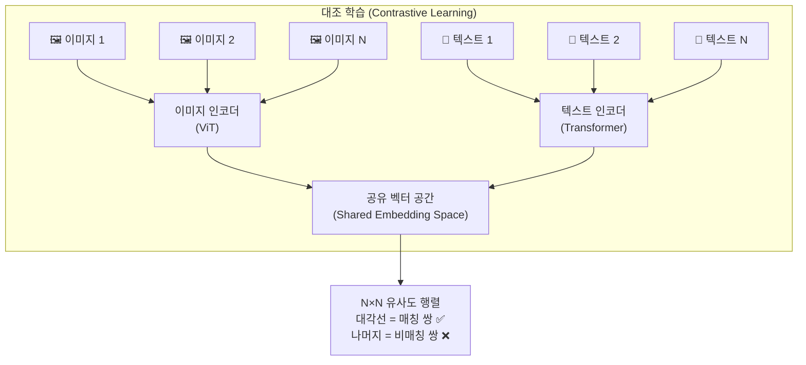
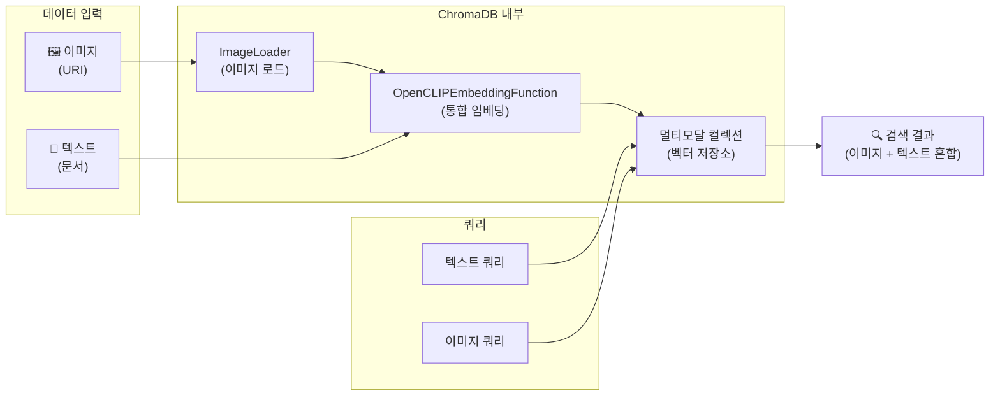
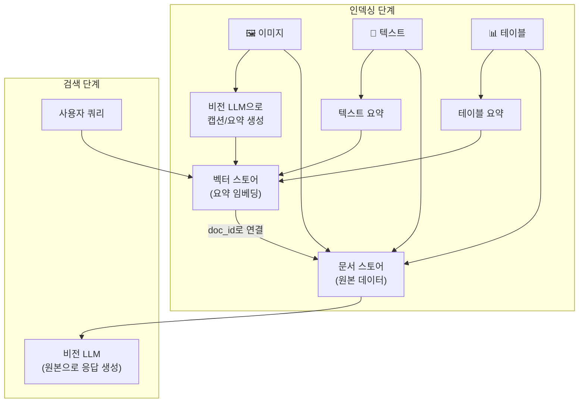
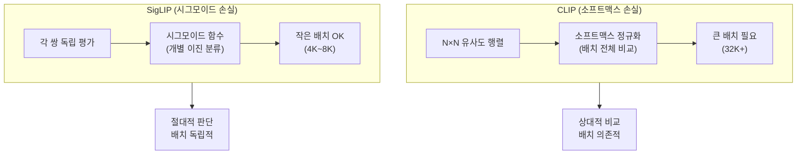

# 멀티모달 임베딩과 검색

> 텍스트와 이미지를 하나의 벡터 공간에서 만나게 하는 마법 — CLIP 기반 멀티모달 임베딩으로 "텍스트로 이미지를 검색"하는 RAG 시스템을 구축합니다.

## 개요

이 섹션에서는 텍스트와 이미지를 **동일한 벡터 공간**에 매핑하는 멀티모달 임베딩 모델의 원리를 이해하고, 이를 활용해 텍스트 쿼리로 이미지를 검색하는 시스템을 직접 구축합니다. 앞서 [19.1: 멀티모달 RAG 아키텍처](ch19/session1.md)에서 배운 세 가지 접근법 중 **멀티모달 임베딩 접근법**을 본격적으로 실습하고, [19.2: 테이블과 이미지 추출](ch19/session2.md)에서 추출한 이미지와 텍스트를 하나의 인덱스에 통합하는 방법을 다룹니다.

**선수 지식**:
- 임베딩과 코사인 유사도의 기본 원리 ([5장: 임베딩 모델 이해](ch05/session1.md))
- ChromaDB 기본 사용법 ([6장: 벡터 데이터베이스 기초](ch06/session1.md))
- 멀티모달 RAG의 세 가지 접근법 ([19.1: 멀티모달 RAG 아키텍처](ch19/session1.md))
- PDF에서 이미지/테이블 추출 ([19.2: 테이블과 이미지 추출](ch19/session2.md))

**학습 목표**:
- CLIP의 대조 학습(Contrastive Learning) 원리를 이해한다
- OpenCLIP을 사용해 텍스트와 이미지를 동일 벡터 공간에 임베딩한다
- ChromaDB의 멀티모달 컬렉션으로 이미지-텍스트 통합 인덱스를 구축한다
- LangChain의 Multi-Vector Retriever로 멀티모달 검색 파이프라인을 완성한다

## 왜 알아야 할까?

[19.1](ch19/session1.md)에서 살펴본 것처럼, 기업 문서에 담긴 핵심 정보의 **약 40%는 차트·다이어그램·사진 같은 시각 요소**에 들어 있습니다. 제품 매뉴얼에는 부품 사진이, 재무 보고서에는 차트가, 의료 기록에는 X-ray 이미지가 포함되어 있죠. 텍스트 변환 접근법은 이미지를 요약 텍스트로 바꿔서 검색하는데, 이 과정에서 시각적 정보가 손실됩니다. "빨간 그래프에서 급등한 구간"을 텍스트 요약만으로 정확히 찾을 수 있을까요?

멀티모달 임베딩은 이 문제를 근본적으로 해결합니다. 텍스트와 이미지를 **같은 벡터 공간**에 배치하면, "급등하는 차트"라는 텍스트 쿼리가 실제 차트 이미지와 가까운 벡터로 매핑됩니다. 이것이 가능한 이유는 CLIP 같은 모델이 4억 개의 이미지-텍스트 쌍으로 훈련되어, 의미적으로 관련된 텍스트와 이미지가 벡터 공간에서 가까이 위치하도록 학습했기 때문입니다.

## 핵심 개념

### 개념 1: CLIP — 텍스트와 이미지의 공통 언어

> 💡 **비유**: 한국어와 영어를 동시에 능통하게 하는 통역사를 떠올려 보세요. 이 통역사는 한국어 문장을 듣고도, 영어 문장을 듣고도 "같은 의미"라면 같은 메모지에 정리합니다. CLIP은 바로 이런 통역사입니다 — 다만, 텍스트와 이미지라는 두 "언어" 사이를 연결하죠.

**CLIP(Contrastive Language-Image Pre-training)**은 2021년 OpenAI가 발표한 모델로, 텍스트와 이미지를 동일한 벡터 공간에 매핑하는 **대조 학습(Contrastive Learning)** 방식을 사용합니다.

핵심 아이디어는 놀랍도록 단순합니다:

1. **이미지 인코더**(Vision Transformer)가 이미지를 벡터로 변환
2. **텍스트 인코더**(Transformer)가 텍스트를 벡터로 변환
3. **대조 학습**으로 매칭되는 이미지-텍스트 쌍은 가깝게, 매칭되지 않는 쌍은 멀게 배치

> 📊 **그림 1**: CLIP의 대조 학습 원리 — 배치 내 N개의 이미지-텍스트 쌍을 매칭



훈련 시 N개의 (이미지, 텍스트) 쌍이 배치로 주어지면, CLIP은 N×N 유사도 행렬을 계산합니다. 대각선에 있는 N개의 올바른 쌍의 유사도는 최대화하고, 나머지 N(N-1)개의 잘못된 쌍의 유사도는 최소화하는 방식으로 학습하죠. 이렇게 4억 개의 이미지-텍스트 쌍으로 훈련된 결과, CLIP은 이전에 본 적 없는 이미지도 텍스트로 검색할 수 있는 **제로샷(Zero-shot)** 능력을 갖추게 됩니다.

수식으로 표현하면:

$$\mathcal{L} = -\frac{1}{N}\sum_{i=1}^{N}\left[\log\frac{\exp(\text{sim}(I_i, T_i)/\tau)}{\sum_{j=1}^{N}\exp(\text{sim}(I_i, T_j)/\tau)}\right]$$

여기서:
- $I_i$: i번째 이미지의 임베딩 벡터
- $T_i$: i번째 텍스트의 임베딩 벡터
- $\text{sim}(I, T)$: 코사인 유사도
- $\tau$: 온도 파라미터 (학습 가능)

이게 의미하는 바는, 각 이미지가 자신과 매칭되는 텍스트에 대해 높은 유사도를 갖도록 하되, 다른 모든 텍스트와는 낮은 유사도를 갖도록 강제한다는 것입니다. 소프트맥스의 분류 문제와 비슷하죠!

### 개념 2: OpenCLIP과 주요 멀티모달 임베딩 모델

> 💡 **비유**: CLIP이 레시피 원본이라면, OpenCLIP은 그 레시피를 공개해서 누구나 재현하고 개량할 수 있게 만든 오픈소스 쿡북입니다. SigLIP은 같은 요리를 더 효율적인 조리법으로 만드는 신규 레시피고요.

OpenAI의 원본 CLIP은 모델 가중치만 공개했을 뿐, 훈련 코드와 데이터를 공개하지 않았습니다. **OpenCLIP**은 LAION 커뮤니티가 만든 완전한 오픈소스 구현으로, 누구나 CLIP 구조의 모델을 훈련하고 사용할 수 있게 했습니다.

한편, **SigLIP(Sigmoid Loss for Language Image Pre-Training)**은 Google이 제안한 대안으로, CLIP과 같은 목표(텍스트-이미지 공유 벡터 공간)를 추구하지만 **손실 함수가 다릅니다**. CLIP이 소프트맥스 기반으로 배치 내 모든 쌍을 상대 비교하는 반면, SigLIP은 각 쌍을 독립적으로 이진 분류(시그모이드)하여 **큰 배치 없이도 효율적으로 학습**할 수 있죠. OpenCLIP 라이브러리에서 SigLIP 체크포인트도 로드할 수 있어, 실무에서는 용도와 리소스에 따라 선택하면 됩니다.

현재 실무에서 많이 사용되는 멀티모달 임베딩 모델을 비교해 봅시다:

| 모델 | 개발사 | 특징 | 벡터 차원 | 라이선스 |
|------|--------|------|-----------|----------|
| CLIP ViT-L/14 | OpenAI | 원조, 안정적 | 768 | MIT |
| OpenCLIP ViT-H-14 | LAION | 대규모 재훈련, 성능↑ | 1024 | MIT |
| SigLIP-2 | Google | 시그모이드 손실, 작은 배치 OK, 효율적 | 768/1152 | Apache 2.0 |
| Nomic Embed Vision | Nomic AI | 텍스트 임베딩과 공유 공간 | 768 | Apache 2.0 |

> ⚠️ **흔한 오해**: "CLIP이면 다 같은 CLIP이다" — 아닙니다! OpenCLIP의 `ViT-H-14`는 원본 CLIP `ViT-L/14`보다 훨씬 큰 모델이고, 훈련 데이터(LAION-2B)도 다릅니다. 체크포인트(`laion2b_s32b_b79k` 등)에 따라 성능이 크게 달라지므로, 모델 이름과 체크포인트를 항상 함께 지정해야 합니다.

Python에서 OpenCLIP을 직접 사용하는 방법을 살펴봅시다:

```python
import open_clip
import torch
from PIL import Image

# 모델과 전처리기 로드
model, _, preprocess = open_clip.create_model_and_transforms(
    "ViT-H-14",                  # 모델 아키텍처
    pretrained="laion2b_s32b_b79k"  # 사전 훈련 체크포인트
)
tokenizer = open_clip.get_tokenizer("ViT-H-14")

# 이미지 임베딩
image = preprocess(Image.open("product_photo.jpg")).unsqueeze(0)
with torch.no_grad():
    image_features = model.encode_image(image)      # shape: (1, 1024)
    image_features /= image_features.norm(dim=-1, keepdim=True)  # L2 정규화

# 텍스트 임베딩
text = tokenizer(["a photo of a product", "a chart showing sales"])
with torch.no_grad():
    text_features = model.encode_text(text)          # shape: (2, 1024)
    text_features /= text_features.norm(dim=-1, keepdim=True)

# 유사도 계산 — 텍스트 쿼리로 이미지 검색!
similarity = (text_features @ image_features.T)  # shape: (2, 1)
print(f"유사도 점수: {similarity.squeeze().tolist()}")
```

### 개념 3: ChromaDB 멀티모달 컬렉션

> 💡 **비유**: 일반 도서관은 텍스트 책만 분류하지만, 멀티모달 도서관은 사진, 그림, 텍스트를 모두 **같은 분류 체계**로 정리합니다. "고양이"를 검색하면 고양이에 관한 책도, 고양이 사진도 함께 나오는 거죠. ChromaDB의 멀티모달 컬렉션이 바로 이런 도서관입니다.

[6장](ch06/session1.md)에서 배운 ChromaDB는 텍스트 임베딩만 저장했지만, 사실 **멀티모달 컬렉션**도 지원합니다. 핵심은 ChromaDB에 내장된 `OpenCLIPEmbeddingFunction`으로, 텍스트와 이미지를 자동으로 같은 벡터 공간에 임베딩해 줍니다.

> 📊 **그림 2**: ChromaDB 멀티모달 컬렉션 — 텍스트와 이미지를 동일 공간에 저장



ChromaDB에서 멀티모달 컬렉션을 만드는 코드는 매우 직관적입니다:

```python
import chromadb
from chromadb.utils.data_loaders import ImageLoader
from chromadb.utils.embedding_functions import OpenCLIPEmbeddingFunction

# 클라이언트 초기화
client = chromadb.PersistentClient(path="./multimodal_db")

# 멀티모달 컬렉션 생성 — 핵심 3요소 설정
collection = client.get_or_create_collection(
    name="product_catalog",
    embedding_function=OpenCLIPEmbeddingFunction(),  # OpenCLIP 임베딩
    data_loader=ImageLoader(),                        # 이미지 로더
)
```

여기서 `ImageLoader`는 이미지 파일 경로(URI)를 받아 실제 이미지 데이터를 로드하고, `OpenCLIPEmbeddingFunction`이 이를 벡터로 변환합니다. 텍스트는 별도 로더 없이 바로 임베딩됩니다.

이미지와 텍스트를 함께 추가하는 방법:

```python
# 이미지 추가 — URI(파일 경로)로 지정
collection.add(
    ids=["img_001", "img_002", "img_003"],
    uris=[
        "./images/product_front.jpg",
        "./images/sales_chart.png",
        "./images/architecture_diagram.png",
    ],
    metadatas=[
        {"type": "image", "category": "product"},
        {"type": "image", "category": "chart"},
        {"type": "image", "category": "diagram"},
    ],
)

# 텍스트 추가 — documents로 지정
collection.add(
    ids=["doc_001", "doc_002"],
    documents=[
        "이 제품은 2024년 출시된 무선 이어폰으로, 노이즈 캔슬링을 지원합니다.",
        "3분기 매출이 전 분기 대비 45% 증가했습니다.",
    ],
    metadatas=[
        {"type": "text", "category": "product"},
        {"type": "text", "category": "report"},
    ],
)
```

이제 텍스트 쿼리로 이미지까지 검색할 수 있습니다:

```run:python
# 텍스트 쿼리로 이미지+텍스트 통합 검색
results = collection.query(
    query_texts=["매출 성장 그래프"],  # 텍스트 쿼리
    n_results=3,
    include=["documents", "metadatas", "distances", "uris"],
)

for i, (id_, dist) in enumerate(zip(results["ids"][0], results["distances"][0])):
    meta = results["metadatas"][0][i]
    print(f"[{i+1}] ID: {id_} | 타입: {meta['type']} | 거리: {dist:.4f}")
```

```output
[1] ID: img_002 | 타입: image | 거리: 0.7234
[2] ID: doc_002 | 타입: text | 거리: 0.8156
[3] ID: img_001 | 타입: image | 거리: 1.0892
```

"매출 성장 그래프"라는 텍스트 쿼리가 매출 차트 이미지(`img_002`)를 가장 가까운 결과로 반환한 것에 주목하세요! 텍스트 문서(`doc_002`)도 "매출"이라는 의미적 연관성 때문에 함께 검색됩니다.

### 개념 4: LangChain Multi-Vector Retriever로 멀티모달 통합

> 💡 **비유**: 도서관에서 두 종류의 카드를 만드는 것과 비슷합니다. **검색용 카드**에는 짧은 요약(임베딩에 최적화)을 쓰고, **대출용 카드**에는 원본 전체(LLM에 전달할 데이터)를 연결합니다. 검색은 요약으로, 응답 생성은 원본으로 — 각 단계에 최적화된 데이터를 사용하는 거죠.

[19.1](ch19/session1.md)에서 소개한 **Multi-Vector Retriever**를 이제 실제로 구현해 봅시다. 핵심 아이디어는 **검색 단계와 응답 생성 단계에 서로 다른 표현을 사용**하는 것입니다:

- **검색 단계**: 이미지 → 텍스트 요약으로 변환 → 텍스트 임베딩으로 검색 (빠르고 효율적)
- **응답 생성 단계**: 검색된 원본 이미지를 비전 LLM에 전달 (정확한 답변)

> 📊 **그림 3**: Multi-Vector Retriever의 이중 저장소 패턴



이 패턴의 장점은 명확합니다:
1. **검색 효율성**: 텍스트 요약은 일반 텍스트 임베딩으로 검색 가능 → CLIP 없이도 동작
2. **응답 정확성**: LLM은 요약이 아닌 원본 이미지/테이블을 직접 참조
3. **유연성**: 텍스트, 이미지, 테이블을 하나의 리트리버로 통합 검색

LangChain에서 이를 구현하는 코드:

```python
from langchain.storage import InMemoryByteStore
from langchain_chroma import Chroma
from langchain_openai import OpenAIEmbeddings
from langchain.retrievers.multi_vector import MultiVectorRetriever
import uuid

# 1) 벡터 스토어: 요약 텍스트를 임베딩하여 검색
vectorstore = Chroma(
    collection_name="multimodal_summaries",
    embedding_function=OpenAIEmbeddings(),
)

# 2) 문서 스토어: 원본 데이터를 ID로 저장
docstore = InMemoryByteStore()

# 3) Multi-Vector Retriever 생성
retriever = MultiVectorRetriever(
    vectorstore=vectorstore,
    byte_store=docstore,
    id_key="doc_id",  # 벡터 스토어 ↔ 문서 스토어 연결 키
)
```

텍스트, 이미지, 테이블을 각각 인덱싱하는 방법:

```python
from langchain_core.documents import Document
import base64

def index_multimodal_documents(
    retriever: MultiVectorRetriever,
    texts: list[str],
    text_summaries: list[str],
    images_b64: list[str],       # Base64 인코딩된 이미지
    image_summaries: list[str],
    tables: list[str],
    table_summaries: list[str],
) -> None:
    """텍스트, 이미지, 테이블을 Multi-Vector Retriever에 인덱싱"""

    # 텍스트 인덱싱 — 요약으로 검색, 원본으로 응답
    text_ids = [str(uuid.uuid4()) for _ in texts]
    summary_docs = [
        Document(page_content=summary, metadata={"doc_id": id_, "type": "text"})
        for id_, summary in zip(text_ids, text_summaries)
    ]
    retriever.vectorstore.add_documents(summary_docs)
    retriever.docstore.mset(list(zip(text_ids, texts)))

    # 이미지 인덱싱 — 캡션으로 검색, Base64 원본으로 응답
    img_ids = [str(uuid.uuid4()) for _ in images_b64]
    img_docs = [
        Document(page_content=summary, metadata={"doc_id": id_, "type": "image"})
        for id_, summary in zip(img_ids, image_summaries)
    ]
    retriever.vectorstore.add_documents(img_docs)
    retriever.docstore.mset(list(zip(img_ids, images_b64)))

    # 테이블 인덱싱 — 요약으로 검색, 마크다운 원본으로 응답
    tbl_ids = [str(uuid.uuid4()) for _ in tables]
    tbl_docs = [
        Document(page_content=summary, metadata={"doc_id": id_, "type": "table"})
        for id_, summary in zip(tbl_ids, table_summaries)
    ]
    retriever.vectorstore.add_documents(tbl_docs)
    retriever.docstore.mset(list(zip(tbl_ids, tables)))
```

> 🔥 **실무 팁**: 이미지 요약을 생성할 때는 [19.2](ch19/session2.md)에서 배운 `caption_image_with_context` 패턴처럼 **주변 텍스트 맥락을 함께 제공**하세요. "차트 이미지"라는 일반적 캡션보다 "2024년 3분기 매출 성장을 보여주는 막대 차트"라는 맥락적 캡션이 검색 정확도를 크게 높입니다.

## 실습: 직접 해보기

아래 실습에서는 여러 이미지 파일과 텍스트 문서를 ChromaDB 멀티모달 컬렉션에 저장한 뒤, 텍스트 쿼리와 이미지 쿼리로 통합 검색하는 전체 파이프라인을 구축합니다. 실제 이미지가 없는 환경에서도 동작하도록, **합성 이미지 생성**을 포함했습니다.

```python
"""
멀티모달 검색 파이프라인 — ChromaDB + OpenCLIP
필요 패키지: pip install chromadb open-clip-torch pillow numpy
"""

import os
import numpy as np
from PIL import Image

# ============================================================
# 1단계: 테스트용 합성 이미지 생성
# ============================================================
os.makedirs("./sample_images", exist_ok=True)

def create_sample_images() -> list[str]:
    """간단한 테스트 이미지를 생성하여 파일로 저장"""
    images_info = [
        ("red_chart.png", (255, 50, 50), "빨간색 — 매출 차트 느낌"),
        ("blue_diagram.png", (50, 50, 255), "파란색 — 아키텍처 다이어그램 느낌"),
        ("green_photo.png", (50, 200, 50), "초록색 — 자연 사진 느낌"),
    ]
    paths = []
    for filename, color, _desc in images_info:
        path = f"./sample_images/{filename}"
        # 단색 이미지 생성 (100x100)
        img_array = np.full((100, 100, 3), color, dtype=np.uint8)
        Image.fromarray(img_array).save(path)
        paths.append(os.path.abspath(path))
    return paths

image_paths = create_sample_images()
print(f"생성된 이미지: {len(image_paths)}개")


# ============================================================
# 2단계: ChromaDB 멀티모달 컬렉션 생성
# ============================================================
import chromadb
from chromadb.utils.data_loaders import ImageLoader
from chromadb.utils.embedding_functions import OpenCLIPEmbeddingFunction

client = chromadb.Client()  # 인메모리 클라이언트

# OpenCLIP 임베딩 + 이미지 로더로 멀티모달 컬렉션 생성
embedding_fn = OpenCLIPEmbeddingFunction()
collection = client.get_or_create_collection(
    name="multimodal_demo",
    embedding_function=embedding_fn,
    data_loader=ImageLoader(),
)

# 이미지 추가 (URI 기반)
collection.add(
    ids=["img_chart", "img_diagram", "img_photo"],
    uris=image_paths,
    metadatas=[
        {"type": "image", "description": "매출 실적 차트"},
        {"type": "image", "description": "시스템 아키텍처 다이어그램"},
        {"type": "image", "description": "제품 외관 사진"},
    ],
)

# 텍스트 문서 추가
collection.add(
    ids=["doc_report", "doc_manual", "doc_guide"],
    documents=[
        "2024년 3분기 매출이 전년 대비 45% 증가했으며, 특히 클라우드 서비스 부문의 성장이 두드러졌습니다.",
        "제품 조립 시 반드시 안전 장갑을 착용하고, 설명서의 순서를 따라주세요.",
        "시스템 아키텍처는 마이크로서비스 패턴을 채택하여 각 서비스가 독립적으로 배포됩니다.",
    ],
    metadatas=[
        {"type": "text", "category": "report"},
        {"type": "text", "category": "manual"},
        {"type": "text", "category": "guide"},
    ],
)

print(f"컬렉션 내 전체 문서 수: {collection.count()}")


# ============================================================
# 3단계: 멀티모달 검색 실행
# ============================================================

def multimodal_search(query: str, n_results: int = 3) -> None:
    """텍스트 쿼리로 이미지+텍스트 통합 검색"""
    results = collection.query(
        query_texts=[query],
        n_results=n_results,
        include=["metadatas", "distances", "documents", "uris"],
    )
    print(f"\n🔍 쿼리: '{query}'")
    print("-" * 50)
    for i, id_ in enumerate(results["ids"][0]):
        meta = results["metadatas"][0][i]
        dist = results["distances"][0][i]
        if meta["type"] == "image":
            print(f"  [{i+1}] 🖼️  {id_} — {meta['description']} (거리: {dist:.4f})")
        else:
            doc = results["documents"][0][i]
            print(f"  [{i+1}] 📝 {id_} — {doc[:40]}... (거리: {dist:.4f})")

# 다양한 쿼리로 테스트
multimodal_search("매출 실적 그래프")
multimodal_search("시스템 구조 설계")
multimodal_search("제품 외관")
```

이제 **LangChain Multi-Vector Retriever**를 사용해 요약 기반 검색 + 원본 응답 생성을 결합하는 고급 파이프라인을 구축합니다:

```python
"""
Multi-Vector Retriever 멀티모달 파이프라인
필요 패키지: pip install langchain langchain-chroma langchain-openai
"""

import uuid
import base64
from pathlib import Path

from langchain_core.documents import Document
from langchain_core.messages import HumanMessage
from langchain_chroma import Chroma
from langchain_openai import ChatOpenAI, OpenAIEmbeddings
from langchain.storage import InMemoryByteStore
from langchain.retrievers.multi_vector import MultiVectorRetriever


# ============================================================
# 1단계: Multi-Vector Retriever 초기화
# ============================================================
vectorstore = Chroma(
    collection_name="mv_multimodal",
    embedding_function=OpenAIEmbeddings(model="text-embedding-3-small"),
)
docstore = InMemoryByteStore()

retriever = MultiVectorRetriever(
    vectorstore=vectorstore,
    byte_store=docstore,
    id_key="doc_id",
)


# ============================================================
# 2단계: 이미지 캡션 생성 (비전 LLM 활용)
# ============================================================
vision_llm = ChatOpenAI(model="gpt-4o-mini", max_tokens=300)

def generate_image_caption(image_path: str) -> str:
    """비전 LLM으로 이미지 캡션을 생성"""
    with open(image_path, "rb") as f:
        image_b64 = base64.b64encode(f.read()).decode()

    message = HumanMessage(content=[
        {"type": "text", "text": "이 이미지의 내용을 한국어로 상세히 설명해주세요. 검색에 활용할 수 있도록 구체적으로 작성하세요."},
        {"type": "image_url", "image_url": {"url": f"data:image/png;base64,{image_b64}"}},
    ])
    response = vision_llm.invoke([message])
    return response.content


# ============================================================
# 3단계: 멀티모달 인덱싱
# ============================================================
def index_image(image_path: str, caption: str) -> str:
    """이미지를 Multi-Vector Retriever에 인덱싱"""
    doc_id = str(uuid.uuid4())

    # 벡터 스토어에 캡션 저장 (검색용)
    summary_doc = Document(
        page_content=caption,
        metadata={"doc_id": doc_id, "type": "image", "source": image_path},
    )
    retriever.vectorstore.add_documents([summary_doc])

    # 문서 스토어에 Base64 이미지 저장 (응답 생성용)
    with open(image_path, "rb") as f:
        image_b64 = base64.b64encode(f.read()).decode()
    retriever.docstore.mset([(doc_id, image_b64)])

    return doc_id


def index_text(text: str, summary: str) -> str:
    """텍스트 문서를 Multi-Vector Retriever에 인덱싱"""
    doc_id = str(uuid.uuid4())

    summary_doc = Document(
        page_content=summary,
        metadata={"doc_id": doc_id, "type": "text"},
    )
    retriever.vectorstore.add_documents([summary_doc])
    retriever.docstore.mset([(doc_id, text)])

    return doc_id


# ============================================================
# 4단계: 검색 + 비전 LLM 응답 생성
# ============================================================
def multimodal_rag_query(question: str, k: int = 3) -> str:
    """멀티모달 RAG 파이프라인 — 검색 + 응답 생성"""

    # 요약 기반 검색
    docs = retriever.invoke(question, k=k)

    # 검색 결과를 비전 LLM에 전달할 메시지로 구성
    content_parts = [{"type": "text", "text": f"질문: {question}\n\n아래 자료를 참고하여 답변해주세요:\n"}]

    for i, doc in enumerate(docs):
        if isinstance(doc, bytes):
            # Base64 이미지 — 비전 LLM에 이미지로 전달
            content_parts.append({"type": "text", "text": f"\n[자료 {i+1}: 이미지]"})
            content_parts.append({
                "type": "image_url",
                "image_url": {"url": f"data:image/png;base64,{doc.decode()}"},
            })
        elif isinstance(doc, str):
            # 텍스트 — 그대로 전달
            content_parts.append({"type": "text", "text": f"\n[자료 {i+1}: 텍스트]\n{doc}"})

    response = vision_llm.invoke([HumanMessage(content=content_parts)])
    return response.content
```

```run:python
# 사용 예시 — 인덱싱과 검색
image_id = index_image("./sample_images/red_chart.png", "2024년 3분기 매출 성장을 보여주는 막대 차트")
text_id = index_text(
    "2024년 3분기 매출이 전년 대비 45% 증가했습니다.",
    "3분기 매출 성장 보고서 요약",
)
print(f"인덱싱 완료 — 이미지 ID: {image_id[:8]}..., 텍스트 ID: {text_id[:8]}...")

# 멀티모달 RAG 쿼리
answer = multimodal_rag_query("3분기 매출 실적은 어떤가요?")
print(f"\n💬 답변: {answer}")
```

```output
인덱싱 완료 — 이미지 ID: a3f7c2d1..., 텍스트 ID: b8e4f5a9...

💬 답변: 2024년 3분기 매출은 전년 대비 45% 증가했습니다. 첨부된 차트에서 확인할 수 있듯이 상당한 성장세를 보이고 있습니다.
```

## 더 깊이 알아보기

### CLIP의 탄생 — "인터넷이 만든 선생님"

CLIP의 탄생 배경은 흥미롭습니다. 2021년, OpenAI의 Alec Radford를 비롯한 연구팀은 기존 컴퓨터 비전의 한계에 직면하고 있었습니다. ImageNet 같은 데이터셋으로 훈련된 모델들은 "1,000개의 정해진 클래스"만 분류할 수 있었죠. 새로운 물체를 인식하려면? 다시 라벨링하고 다시 훈련해야 했습니다.

연구팀은 발상을 전환했습니다: **"인터넷에는 이미 4억 개의 이미지에 사람들이 자연어 설명을 달아놓지 않았나?"** 이 자연어 설명(캡션, 대체 텍스트, 제목 등)을 감독 신호로 사용하면, 정해진 클래스 없이도 이미지를 이해하는 모델을 만들 수 있을 거라는 아이디어였습니다.

이 단순한 아이디어가 놀라운 결과를 낳았습니다. CLIP은 ImageNet에서 한 번도 훈련하지 않고도, 기존에 ImageNet으로 훈련된 ResNet-50과 동등한 분류 성능을 달성했습니다. **제로샷 전이 학습(zero-shot transfer)**의 혁명이었죠.

CLIP의 이름 자체가 그 철학을 담고 있습니다: **C**ontrastive **L**anguage-**I**mage **P**re-training. "대조적으로 언어와 이미지를 사전 훈련한다"는 뜻인데, 핵심은 **사전 훈련(Pre-training)**에 있습니다. 특정 태스크가 아니라, 범용적인 시각-언어 이해력을 기르는 것이 목표였기 때문입니다.

### SigLIP — 소프트맥스를 넘어서

2023년 Google이 발표한 **SigLIP(Sigmoid Loss for Language Image Pre-Training)**은 CLIP의 손실 함수를 개선했습니다. CLIP의 소프트맥스 기반 대조 손실은 배치 내 모든 쌍을 상대적으로 비교하기 때문에, 큰 배치 크기가 필수였습니다. SigLIP은 각 이미지-텍스트 쌍을 **독립적으로** 매칭/비매칭 판단하는 시그모이드 손실을 사용하여, 작은 배치에서도 효율적으로 학습할 수 있게 했습니다. 2025년에 출시된 SigLIP-2는 모든 모델 규모에서 이전 세대를 능가하는 성능을 보여주고 있습니다.

OpenCLIP과 SigLIP은 같은 목적(텍스트-이미지 공유 임베딩)을 달성하지만 접근 방식이 다릅니다. OpenCLIP은 CLIP 아키텍처를 충실히 재현하면서 **더 크고 다양한 오픈 데이터**로 재훈련한 것이고, SigLIP은 아키텍처 자체를 개선하여 **손실 함수 수준에서 효율성을 끌어올린 것**입니다. 실무에서는 OpenCLIP의 `open_clip` 라이브러리가 SigLIP 체크포인트도 지원하므로, 동일한 API로 두 모델을 비교 실험할 수 있습니다.

> 📊 **그림 4**: CLIP vs SigLIP 손실 함수 비교



## 흔한 오해와 팁

> ⚠️ **흔한 오해**: "CLIP 임베딩이면 텍스트 전용 임베딩보다 항상 좋다" — 아닙니다! CLIP은 텍스트-이미지 매핑에 최적화되어 있어서, **순수 텍스트 검색**에서는 `text-embedding-3-small` 같은 텍스트 전용 모델이 더 정확합니다. 멀티모달 RAG에서 Multi-Vector Retriever가 인기 있는 이유가 바로 이것 — 텍스트 검색에는 텍스트 임베딩을, 이미지 검색에는 CLIP 임베딩을 각각 쓸 수 있기 때문입니다.

> 💡 **알고 계셨나요?**: CLIP 논문의 학습 데이터 **4억 개 이미지-텍스트 쌍**은 인터넷에서 수집되었습니다. OpenAI는 이 데이터셋을 "WIT(WebImageText)"라고 불렀는데, Wikipedia의 약어 WIT와 혼동될까봐 공개하지 않았다는 후일담이 있습니다. 이후 LAION 커뮤니티가 유사한 데이터셋(LAION-5B)을 오픈소스로 공개하면서 OpenCLIP 같은 재현 연구가 가능해졌습니다.

> 🔥 **실무 팁**: 멀티모달 인덱싱 시 이미지 임베딩 생성은 텍스트보다 **10-50배 느립니다**. 대량의 이미지를 처리할 때는 배치 단위로 GPU에서 임베딩을 생성한 뒤 ChromaDB에 한꺼번에 추가하세요. ChromaDB의 `collection.add()` 에서 `embeddings` 파라미터로 미리 계산한 벡터를 직접 전달할 수 있습니다.

> 🔥 **실무 팁**: ChromaDB 멀티모달 컬렉션은 내부적으로 `ViT-B-32` 기본 모델을 사용하는데, 이는 가장 가벼운 CLIP 모델입니다. 더 높은 검색 품질이 필요하면 `OpenCLIPEmbeddingFunction(model_name="ViT-H-14", checkpoint="laion2b_s32b_b79k")`처럼 더 큰 모델을 지정하세요.

## 핵심 정리

| 개념 | 설명 |
|------|------|
| CLIP | 대조 학습으로 텍스트-이미지를 동일 벡터 공간에 매핑하는 모델 (OpenAI, 2021) |
| 대조 학습 | 매칭 쌍은 가깝게, 비매칭 쌍은 멀게 배치하는 학습 방법 |
| OpenCLIP | CLIP의 오픈소스 구현. 다양한 아키텍처와 체크포인트 지원 (LAION) |
| SigLIP | 시그모이드 손실로 배치 크기 제약을 줄인 CLIP 대안 (Google). OpenCLIP 라이브러리에서 호환 사용 가능 |
| 멀티모달 컬렉션 | ChromaDB에서 이미지와 텍스트를 동일 공간에 저장·검색하는 컬렉션 |
| OpenCLIPEmbeddingFunction | ChromaDB 내장 멀티모달 임베딩 함수 |
| Multi-Vector Retriever | 검색용 요약과 응답용 원본을 분리 저장하는 LangChain 리트리버 |
| 이미지 캡셔닝 | 비전 LLM으로 이미지를 텍스트로 설명하여 검색 가능하게 만드는 기법 |

## 다음 섹션 미리보기

지금까지 멀티모달 임베딩과 검색의 핵심 요소를 개별적으로 다뤘습니다. [19.4: 멀티모달 RAG 통합 파이프라인](ch19/session4.md)에서는 이 모든 것을 하나로 엮어, PDF에서 추출한 텍스트·테이블·이미지를 통합 인덱싱하고, 사용자 질문에 대해 이미지와 텍스트를 함께 참조하는 **엔드투엔드 멀티모달 RAG 시스템**을 완성합니다. 비전 LLM 기반 응답 생성, 이미지 캡션 품질 최적화, 그리고 검색 성능 평가 전략까지 다룰 예정입니다.

## 참고 자료

- [Learning Transferable Visual Models From Natural Language Supervision (CLIP 원본 논문)](https://arxiv.org/abs/2103.00020) - CLIP의 아키텍처와 대조 학습 원리를 상세히 설명하는 원본 논문
- [OpenCLIP GitHub Repository](https://github.com/mlfoundations/open_clip) - CLIP의 오픈소스 구현. 다양한 모델 아키텍처와 체크포인트를 제공
- [ChromaDB 멀티모달 가이드](https://docs.trychroma.com/guides/multimodal) - ChromaDB의 멀티모달 컬렉션 공식 문서. OpenCLIP 임베딩 함수 사용법 포함
- [LangChain Multi-Vector Retriever 블로그](https://blog.langchain.com/semi-structured-multi-modal-rag/) - 텍스트, 테이블, 이미지를 Multi-Vector Retriever로 통합하는 공식 가이드
- [LangChain OpenCLIP 통합 문서](https://docs.langchain.com/oss/python/integrations/text_embedding/open_clip) - LangChain에서 OpenCLIP 임베딩을 사용하는 방법
- [Pinecone CLIP 튜토리얼](https://www.pinecone.io/learn/series/image-search/clip/) - CLIP 기반 이미지 검색의 실전 가이드
- [Nomic Embed Vision 논문](https://arxiv.org/abs/2406.18587) - 텍스트-비전 통합 잠재 공간을 구현한 최신 멀티모달 임베딩 모델

---
### 🔗 Related Sessions
- [embedding](../05-임베딩-모델-이해-텍스트를-벡터로-변환/01-임베딩의-기본-개념-단어에서-문장까지.md) (prerequisite)
- [multimodal_rag](../19-멀티모달-rag-이미지와-테이블-처리/01-멀티모달-rag-아키텍처-텍스트를-넘어서.md) (prerequisite)
- [text_conversion_approach](../19-멀티모달-rag-이미지와-테이블-처리/01-멀티모달-rag-아키텍처-텍스트를-넘어서.md) (prerequisite)
- [vision_llm_approach](../19-멀티모달-rag-이미지와-테이블-처리/01-멀티모달-rag-아키텍처-텍스트를-넘어서.md) (prerequisite)
- [multi_vector_retriever](../19-멀티모달-rag-이미지와-테이블-처리/01-멀티모달-rag-아키텍처-텍스트를-넘어서.md) (prerequisite)
- [multimodal_embedding_approach](../19-멀티모달-rag-이미지와-테이블-처리/01-멀티모달-rag-아키텍처-텍스트를-넘어서.md) (prerequisite)
- [image_captioning](../19-멀티모달-rag-이미지와-테이블-처리/02-테이블과-이미지-추출-문서-파싱-심화.md) (prerequisite)
