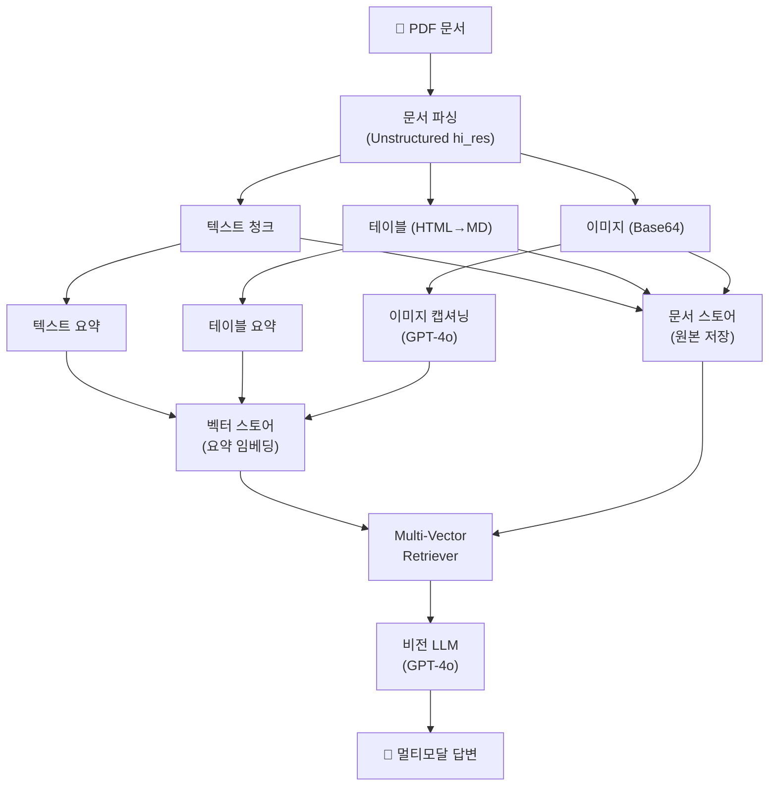
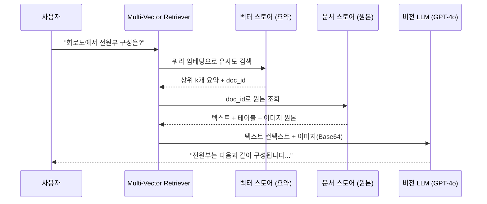
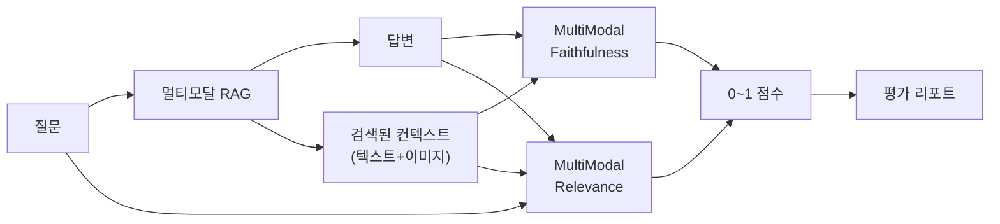
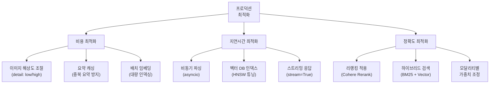

# 멀티모달 RAG 파이프라인 통합 실습

> 텍스트, 테이블, 이미지를 하나로 — 엔드투엔드 멀티모달 RAG 시스템 구축과 평가

## 개요

이 섹션에서는 앞서 배운 문서 파싱(19.2), 멀티모달 임베딩과 검색(19.3)을 하나의 완전한 파이프라인으로 통합합니다. 비전 LLM을 활용해 이미지가 포함된 답변을 생성하고, RAGAS의 멀티모달 메트릭으로 시스템 성능을 평가하는 방법까지 다룹니다.

**선수 지식**:
- [19.1 멀티모달 RAG 아키텍처](./19-1)에서 배운 세 가지 접근법(텍스트 변환, 멀티모달 임베딩, 비전 LLM)
- [19.2 테이블과 이미지 추출](./19-2)에서 배운 Unstructured.io의 `hi_res` 전략과 요소 분류
- [19.3 멀티모달 임베딩과 검색](./19-3)에서 배운 CLIP과 Multi-Vector Retriever

**학습 목표**:
- 텍스트·테이블·이미지를 통합한 엔드투엔드 멀티모달 RAG 파이프라인을 구축할 수 있다
- 비전 LLM(GPT-4o)을 활용해 이미지 기반 답변을 생성할 수 있다
- RAGAS의 멀티모달 메트릭으로 시스템 성능을 측정하고 개선할 수 있다
- 실전 프로젝트(기술 매뉴얼 QA 시스템)를 완성할 수 있다

## 왜 알아야 할까?

실제 기업 문서를 떠올려 보세요. 제품 매뉴얼에는 회로도가 있고, 재무 보고서에는 차트와 테이블이 가득하며, 의료 문서에는 X-ray 이미지가 포함되어 있죠. 텍스트만 처리하는 RAG 시스템은 이런 문서의 핵심 정보를 절반 이상 놓칩니다.

Vectara의 Open RAG Benchmark에 따르면, 멀티모달 PDF 이해 능력은 RAG 시스템의 실무 적용 가능성을 결정짓는 핵심 요소입니다. 텍스트, 테이블, 이미지를 **통합적으로** 검색하고 답변할 수 있어야 비로소 "실전에서 쓸 수 있는" RAG 시스템이 되는 거죠.

이번 세션에서는 Chapter 19의 모든 퍼즐 조각을 맞춰, 실제 기술 매뉴얼에 질문하면 관련 다이어그램과 스펙 테이블까지 포함해 답변하는 시스템을 완성합니다.

## 핵심 개념

### 개념 1: 엔드투엔드 파이프라인 아키텍처

> 💡 **비유**: 멀티모달 RAG 파이프라인은 **종합병원**과 같습니다. 환자(문서)가 접수되면 내과(텍스트), 영상의학과(이미지), 검사실(테이블)에서 각각 분석한 결과를 종합해 최종 진단(답변)을 내리죠. 각 과가 따로 일하지만, 최종 진단서에는 모든 결과가 통합되어야 합니다.

19.1~19.3에서 개별적으로 다룬 컴포넌트들을 하나로 엮으면 다음과 같은 파이프라인이 만들어집니다.

> 📊 **그림 1**: 엔드투엔드 멀티모달 RAG 파이프라인



이 파이프라인의 핵심 설계 원칙은 **"검색은 요약으로, 답변은 원본으로"**입니다. [19.3](./19-3)에서 배운 Multi-Vector Retriever가 이 분리를 가능하게 하는데요, 요약 텍스트로 빠르게 관련 문서를 찾고, 실제 답변 생성에는 원본 텍스트·테이블·이미지를 LLM에 전달합니다.

파이프라인의 각 단계를 코드로 구현해 봅시다. 먼저 전체 프로젝트 구조를 잡겠습니다.

```python
# 프로젝트 구조
# src/
# ├── pipeline.py          # 메인 파이프라인 오케스트레이터
# ├── loaders/
# │   └── pdf_parser.py    # Unstructured 기반 PDF 파싱
# ├── processors/
# │   ├── summarizer.py    # 텍스트/테이블/이미지 요약
# │   └── indexer.py       # Multi-Vector 인덱싱
# ├── retrievers/
# │   └── multimodal.py    # 멀티모달 검색기
# └── generators/
#     └── vision_qa.py     # 비전 LLM 답변 생성

import os
from dotenv import load_dotenv

load_dotenv()

# 필수 의존성
# pip install langchain langchain-openai langchain-chroma 
# pip install unstructured[pdf] pillow ragas
```

### 개념 2: 통합 인덱싱 — 세 가지 모달리티를 하나의 검색 공간으로

> 💡 **비유**: 도서관의 **통합 검색 카탈로그**를 생각해 보세요. 책(텍스트), DVD(이미지), 학술 데이터(테이블)가 각각 다른 서가에 보관되지만, 검색 카탈로그에는 모두 같은 형식의 카드(요약)로 등록되어 있어서 한 번의 검색으로 모든 자료를 찾을 수 있죠.

[19.2](./19-2)에서 추출한 세 가지 요소를 통합 인덱싱하는 핵심 코드입니다.

```python
import uuid
from langchain_openai import ChatOpenAI, OpenAIEmbeddings
from langchain_chroma import Chroma
from langchain.storage import InMemoryStore
from langchain.retrievers.multi_vector import MultiVectorRetriever
from langchain_core.documents import Document
from langchain_core.messages import HumanMessage

# 요약 생성기 설정
llm = ChatOpenAI(model="gpt-4o", temperature=0)
embeddings = OpenAIEmbeddings(model="text-embedding-3-small")

# Multi-Vector Retriever 구성
vectorstore = Chroma(
    collection_name="multimodal_rag",
    embedding_function=embeddings,
)
docstore = InMemoryStore()  # 원본 저장용
id_key = "doc_id"

retriever = MultiVectorRetriever(
    vectorstore=vectorstore,
    docstore=docstore,
    id_key=id_key,
)

def index_elements(
    texts: list[Document],
    tables: list[Document],
    images: list[Document],
) -> None:
    """세 가지 모달리티의 요소를 통합 인덱싱합니다."""
    
    # 1. 텍스트 요약 생성 및 인덱싱
    for doc in texts:
        doc_id = str(uuid.uuid4())
        summary = llm.invoke(
            f"다음 텍스트를 2-3문장으로 요약하세요:\n\n{doc.page_content}"
        ).content
        
        # 요약 → 벡터 스토어, 원본 → 문서 스토어
        retriever.vectorstore.add_documents(
            [Document(page_content=summary, metadata={id_key: doc_id, "type": "text"})]
        )
        retriever.docstore.mset([(doc_id, doc)])
    
    # 2. 테이블 요약 생성 및 인덱싱
    for doc in tables:
        doc_id = str(uuid.uuid4())
        summary = llm.invoke(
            f"다음 마크다운 테이블의 내용을 2-3문장으로 요약하세요:\n\n{doc.page_content}"
        ).content
        
        retriever.vectorstore.add_documents(
            [Document(page_content=summary, metadata={id_key: doc_id, "type": "table"})]
        )
        retriever.docstore.mset([(doc_id, doc)])
    
    # 3. 이미지 캡셔닝 및 인덱싱
    for doc in images:
        doc_id = str(uuid.uuid4())
        # 비전 LLM으로 이미지 캡셔닝 수행
        caption = llm.invoke([
            HumanMessage(content=[
                {"type": "text", "text": "이 이미지를 상세하게 설명하세요. 다이어그램이라면 구성 요소와 흐름을 설명하세요."},
                {"type": "image_url", "image_url": {"url": f"data:image/png;base64,{doc.metadata['base64']}"}},
            ])
        ]).content
        
        retriever.vectorstore.add_documents(
            [Document(page_content=caption, metadata={id_key: doc_id, "type": "image"})]
        )
        # 원본에 캡션도 함께 저장 (답변 생성 시 활용)
        doc.metadata["caption"] = caption
        retriever.docstore.mset([(doc_id, doc)])
```

여기서 핵심은 `retriever.vectorstore`에는 **요약/캡션**이 들어가고, `retriever.docstore`에는 **원본**이 들어간다는 점입니다. 검색 시에는 요약의 임베딩으로 유사도를 계산하지만, 실제로 반환되는 것은 원본 문서죠.

### 개념 3: 비전 LLM 기반 답변 생성

> 💡 **비유**: 일반 RAG가 **라디오 상담**이라면(음성만 전달), 멀티모달 RAG는 **화상 상담**입니다. 의사가 환자의 X-ray 사진을 직접 보면서 진단하는 것과 캡션만 읽고 진단하는 것 — 어느 쪽이 더 정확할까요?

비전 LLM(GPT-4o 등)은 텍스트와 이미지를 **동시에** 입력받아 처리할 수 있습니다. 검색된 원본 중 이미지가 있다면 Base64로 인코딩하여 직접 전달합니다.

> 📊 **그림 2**: 비전 LLM 답변 생성 흐름



```python
import base64
from langchain_core.prompts import ChatPromptTemplate
from langchain_core.output_parsers import StrOutputParser

def build_multimodal_prompt(
    query: str, 
    retrieved_docs: list[Document],
) -> list[dict]:
    """검색된 문서에서 텍스트와 이미지를 분리하여 프롬프트를 구성합니다."""
    
    text_context = []
    image_contents = []
    
    for doc in retrieved_docs:
        doc_type = doc.metadata.get("type", "text")
        
        if doc_type == "image" and "base64" in doc.metadata:
            # 이미지는 비전 LLM에 직접 전달
            caption = doc.metadata.get("caption", "")
            image_contents.append({
                "type": "image_url",
                "image_url": {
                    "url": f"data:image/png;base64,{doc.metadata['base64']}",
                    "detail": "high",  # 고해상도 분석
                },
            })
            text_context.append(f"[이미지: {caption}]")
        elif doc_type == "table":
            text_context.append(f"[테이블]\n{doc.page_content}")
        else:
            text_context.append(doc.page_content)
    
    # 멀티모달 메시지 구성
    content = [
        {
            "type": "text",
            "text": (
                "당신은 기술 문서 전문가입니다. "
                "아래 컨텍스트(텍스트, 테이블, 이미지)를 참고하여 질문에 답변하세요.\n\n"
                f"## 컨텍스트\n{''.join(text_context)}\n\n"
                f"## 질문\n{query}\n\n"
                "답변 시 이미지나 테이블의 내용을 구체적으로 인용하세요."
            ),
        },
    ]
    # 이미지가 있으면 프롬프트에 추가
    content.extend(image_contents)
    
    return content


def answer_with_vision(query: str, k: int = 4) -> str:
    """멀티모달 RAG로 질문에 답변합니다."""
    
    # 1. 검색
    retrieved_docs = retriever.invoke(query)[:k]
    
    # 2. 프롬프트 구성 (텍스트 + 이미지)
    content = build_multimodal_prompt(query, retrieved_docs)
    
    # 3. 비전 LLM으로 답변 생성
    response = llm.invoke([HumanMessage(content=content)])
    
    return response.content
```

`detail: "high"` 옵션은 이미지를 고해상도로 분석하도록 지시합니다. 회로도, 아키텍처 다이어그램 등 세부 사항이 중요한 이미지에서는 이 옵션이 정확도를 크게 높여주죠. 다만 토큰 사용량이 늘어나므로, 단순한 로고나 아이콘에는 `"low"`를 사용하는 것이 비용 효율적입니다.

> ⚠️ **흔한 오해**: "GPT-4o에 이미지를 보낼 때 URL만 전달하면 되지 않나요?" — 로컬 파일이나 PDF에서 추출한 이미지는 URL이 없으므로 반드시 Base64 인코딩이 필요합니다. 또한 외부 URL은 접근 불가능하거나 변경될 수 있어, 프로덕션에서는 Base64가 더 안정적입니다.

### 개념 4: 멀티모달 RAG 평가 — RAGAS로 성능 측정하기

> 💡 **비유**: 멀티모달 RAG 평가는 **레스토랑 평가**와 비슷합니다. 맛(답변 품질)만 보는 게 아니라, 재료의 신선도(검색 정확도), 플레이팅(이미지 활용도), 메뉴 설명과의 일치도(충실성)를 종합적으로 점수 매기는 거죠.

[Ch17: RAG 평가](ch17)에서 배운 Faithfulness, Answer Relevancy 개념을 기억하시나요? RAGAS 프레임워크는 v0.2부터 이 메트릭들의 **멀티모달 확장 버전**을 제공합니다. `MultiModalFaithfulness`는 생성된 답변이 텍스트와 이미지 컨텍스트에 얼마나 충실한지를, `MultiModalRelevance`는 검색된 멀티모달 컨텍스트가 질문에 얼마나 관련 있는지를 측정합니다. 기존 텍스트 전용 메트릭과 동일한 원리이지만, 비전 LLM을 활용해 이미지 컨텍스트까지 검증 범위를 확장한 것이죠.

> 📊 **그림 3**: RAGAS 멀티모달 평가 흐름



```python
from ragas import evaluate
from ragas.metrics import MultiModalFaithfulness, MultiModalRelevance
from ragas.dataset_schema import SingleTurnSample, EvaluationDataset
from ragas.llms import LangchainLLMWrapper
from ragas.embeddings import LangchainEmbeddingsWrapper

# 평가용 LLM과 임베딩 (비전 지원 모델 필수)
evaluator_llm = LangchainLLMWrapper(ChatOpenAI(model="gpt-4o"))
evaluator_embeddings = LangchainEmbeddingsWrapper(
    OpenAIEmbeddings(model="text-embedding-3-small")
)

# 평가 메트릭 설정
faithfulness = MultiModalFaithfulness(llm=evaluator_llm)
relevance = MultiModalRelevance(llm=evaluator_llm, embeddings=evaluator_embeddings)

# 평가 데이터셋 구성
def create_eval_sample(
    query: str,
    answer: str,
    text_contexts: list[str],
    image_contexts: list[str],  # Base64 인코딩된 이미지
) -> SingleTurnSample:
    """멀티모달 평가 샘플을 생성합니다."""
    return SingleTurnSample(
        user_input=query,
        response=answer,
        retrieved_contexts=text_contexts,
        # RAGAS v0.2+에서 이미지 컨텍스트 지원
        reference_image_paths=image_contexts,
    )
```

`MultiModalFaithfulness`는 내부적으로 비전 LLM(gpt-4o)을 사용하여 답변의 각 주장(claim)이 텍스트 컨텍스트와 이미지 컨텍스트에 의해 뒷받침되는지를 검증합니다. 점수는 0~1 범위이며, 1에 가까울수록 환각(Hallucination) 없이 컨텍스트에 충실한 답변이라는 뜻이에요.

## 실습: 직접 해보기

자, 이제 모든 것을 합쳐서 **기술 매뉴얼 QA 시스템**을 처음부터 끝까지 만들어 봅시다. 이 실습에서는 PDF 기술 문서를 파싱하고, 멀티모달 인덱싱을 수행한 뒤, 질문에 이미지와 테이블을 포함한 답변을 생성합니다.

```python
"""
멀티모달 RAG 파이프라인 — 기술 매뉴얼 QA 시스템
===================================================
텍스트, 테이블, 이미지를 통합한 엔드투엔드 파이프라인
"""

import os
import uuid
import base64
from pathlib import Path
from dotenv import load_dotenv

from langchain_openai import ChatOpenAI, OpenAIEmbeddings
from langchain_chroma import Chroma
from langchain.storage import InMemoryStore
from langchain.retrievers.multi_vector import MultiVectorRetriever
from langchain_core.documents import Document
from langchain_core.messages import HumanMessage

load_dotenv()

# ============================================================
# 1단계: PDF 파싱 — Unstructured hi_res 전략
# ============================================================
from unstructured.partition.pdf import partition_pdf

def parse_technical_manual(pdf_path: str) -> dict[str, list]:
    """PDF를 파싱하여 텍스트/테이블/이미지로 분류합니다."""
    
    elements = partition_pdf(
        filename=pdf_path,
        strategy="hi_res",                    # 고정밀 파싱
        infer_table_structure=True,           # 테이블 구조 추론
        extract_image_block_types=["Image", "Figure"],
        extract_image_block_to_payload=True,  # Base64로 추출
    )
    
    texts, tables, images = [], [], []
    
    for el in elements:
        if el.category == "Table":
            # HTML 테이블 → 마크다운 변환
            html = el.metadata.text_as_html or ""
            md_table = html_table_to_markdown(html)
            tables.append(Document(
                page_content=md_table,
                metadata={
                    "type": "table",
                    "page": el.metadata.page_number,
                    "source": pdf_path,
                },
            ))
        elif el.category in ("Image", "Figure"):
            b64 = el.metadata.image_base64 or ""
            if b64:
                images.append(Document(
                    page_content="",  # 이미지는 텍스트 없음
                    metadata={
                        "type": "image",
                        "base64": b64,
                        "page": el.metadata.page_number,
                        "source": pdf_path,
                    },
                ))
        else:
            # NarrativeText, Title, ListItem 등
            if len(el.text.strip()) > 50:  # 너무 짧은 텍스트 필터링
                texts.append(Document(
                    page_content=el.text,
                    metadata={
                        "type": "text",
                        "page": el.metadata.page_number,
                        "source": pdf_path,
                    },
                ))
    
    return {"texts": texts, "tables": tables, "images": images}


def html_table_to_markdown(html: str) -> str:
    """HTML 테이블을 마크다운으로 변환합니다. (19.2에서 배운 함수)"""
    from bs4 import BeautifulSoup
    
    soup = BeautifulSoup(html, "html.parser")
    table = soup.find("table")
    if not table:
        return html
    
    rows = table.find_all("tr")
    md_rows = []
    for i, row in enumerate(rows):
        cells = row.find_all(["th", "td"])
        md_row = "| " + " | ".join(c.get_text(strip=True) for c in cells) + " |"
        md_rows.append(md_row)
        if i == 0:  # 헤더 구분선
            md_rows.append("| " + " | ".join("---" for _ in cells) + " |")
    
    return "\n".join(md_rows)


# ============================================================
# 2단계: 멀티모달 인덱싱 — 요약 기반 Multi-Vector Retriever
# ============================================================

class MultimodalIndexer:
    """세 가지 모달리티를 통합 인덱싱하는 클래스."""
    
    def __init__(self):
        self.llm = ChatOpenAI(model="gpt-4o", temperature=0)
        self.embeddings = OpenAIEmbeddings(model="text-embedding-3-small")
        
        self.vectorstore = Chroma(
            collection_name="tech_manual_qa",
            embedding_function=self.embeddings,
        )
        self.docstore = InMemoryStore()
        self.id_key = "doc_id"
        
        self.retriever = MultiVectorRetriever(
            vectorstore=self.vectorstore,
            docstore=self.docstore,
            id_key=self.id_key,
            search_kwargs={"k": 6},  # 상위 6개 검색
        )
    
    def index_all(self, elements: dict[str, list]) -> dict[str, int]:
        """모든 요소를 인덱싱하고 통계를 반환합니다."""
        stats = {"texts": 0, "tables": 0, "images": 0}
        
        # 텍스트 인덱싱
        for doc in elements["texts"]:
            self._index_text(doc)
            stats["texts"] += 1
        
        # 테이블 인덱싱
        for doc in elements["tables"]:
            self._index_table(doc)
            stats["tables"] += 1
        
        # 이미지 인덱싱
        for doc in elements["images"]:
            self._index_image(doc)
            stats["images"] += 1
        
        return stats
    
    def _index_text(self, doc: Document) -> None:
        """텍스트 요소를 요약하고 인덱싱합니다."""
        doc_id = str(uuid.uuid4())
        summary = self.llm.invoke(
            f"다음 기술 문서 내용을 2-3문장으로 요약하세요:\n\n{doc.page_content}"
        ).content
        
        self.retriever.vectorstore.add_documents([
            Document(
                page_content=summary,
                metadata={self.id_key: doc_id, "type": "text"},
            )
        ])
        self.retriever.docstore.mset([(doc_id, doc)])
    
    def _index_table(self, doc: Document) -> None:
        """테이블 요소를 요약하고 인덱싱합니다."""
        doc_id = str(uuid.uuid4())
        summary = self.llm.invoke(
            "다음 기술 스펙 테이블의 핵심 내용을 2-3문장으로 요약하세요. "
            f"주요 수치와 항목을 포함하세요:\n\n{doc.page_content}"
        ).content
        
        self.retriever.vectorstore.add_documents([
            Document(
                page_content=summary,
                metadata={self.id_key: doc_id, "type": "table"},
            )
        ])
        self.retriever.docstore.mset([(doc_id, doc)])
    
    def _index_image(self, doc: Document) -> None:
        """이미지 요소를 캡셔닝하고 인덱싱합니다."""
        doc_id = str(uuid.uuid4())
        
        # 비전 LLM으로 이미지 캡셔닝 수행 → 생성된 캡션을 임베딩
        caption = self.llm.invoke([
            HumanMessage(content=[
                {
                    "type": "text",
                    "text": (
                        "이 기술 문서의 이미지를 상세하게 설명하세요. "
                        "다이어그램이라면 구성 요소, 연결 관계, 데이터 흐름을 설명하세요. "
                        "차트라면 축, 범례, 주요 트렌드를 설명하세요."
                    ),
                },
                {
                    "type": "image_url",
                    "image_url": {
                        "url": f"data:image/png;base64,{doc.metadata['base64']}",
                    },
                },
            ])
        ]).content
        
        self.retriever.vectorstore.add_documents([
            Document(
                page_content=caption,
                metadata={self.id_key: doc_id, "type": "image"},
            )
        ])
        doc.metadata["caption"] = caption
        self.retriever.docstore.mset([(doc_id, doc)])


# ============================================================
# 3단계: 비전 LLM 기반 답변 생성
# ============================================================

class MultimodalQAEngine:
    """멀티모달 RAG QA 엔진."""
    
    def __init__(self, retriever: MultiVectorRetriever):
        self.retriever = retriever
        self.llm = ChatOpenAI(model="gpt-4o", temperature=0)
    
    def answer(self, query: str, k: int = 4) -> dict:
        """질문에 멀티모달 컨텍스트를 활용하여 답변합니다."""
        
        # 검색
        docs = self.retriever.invoke(query)[:k]
        
        # 컨텍스트 분류
        text_parts = []
        image_parts = []
        sources = []
        
        for doc in docs:
            doc_type = doc.metadata.get("type", "text")
            page = doc.metadata.get("page", "?")
            sources.append(f"p.{page} ({doc_type})")
            
            if doc_type == "image" and "base64" in doc.metadata:
                caption = doc.metadata.get("caption", "이미지")
                text_parts.append(f"[이미지 — {caption}]")
                image_parts.append({
                    "type": "image_url",
                    "image_url": {
                        "url": f"data:image/png;base64,{doc.metadata['base64']}",
                        "detail": "high",
                    },
                })
            elif doc_type == "table":
                text_parts.append(f"[테이블]\n{doc.page_content}")
            else:
                text_parts.append(doc.page_content)
        
        # 프롬프트 구성
        system_text = (
            "당신은 기술 매뉴얼 전문가입니다. "
            "아래 컨텍스트(텍스트, 테이블, 이미지)를 참고하여 질문에 정확하게 답변하세요.\n"
            "- 이미지의 세부 사항을 구체적으로 인용하세요.\n"
            "- 테이블의 수치를 정확하게 인용하세요.\n"
            "- 컨텍스트에 없는 내용은 '해당 정보를 찾을 수 없습니다'라고 답하세요.\n\n"
            f"## 컨텍스트\n\n{'\\n\\n---\\n\\n'.join(text_parts)}"
        )
        
        content = [{"type": "text", "text": f"{system_text}\n\n## 질문\n{query}"}]
        content.extend(image_parts)
        
        # 답변 생성
        response = self.llm.invoke([HumanMessage(content=content)])
        
        return {
            "answer": response.content,
            "sources": sources,
            "num_contexts": len(docs),
            "has_images": len(image_parts) > 0,
        }


# ============================================================
# 4단계: 전체 파이프라인 실행
# ============================================================

def run_pipeline(pdf_path: str, queries: list[str]) -> None:
    """전체 멀티모달 RAG 파이프라인을 실행합니다."""
    
    print("=" * 60)
    print("🔧 기술 매뉴얼 QA 시스템")
    print("=" * 60)
    
    # 1. PDF 파싱
    print("\n📄 1단계: PDF 파싱 중...")
    elements = parse_technical_manual(pdf_path)
    print(f"   텍스트: {len(elements['texts'])}개")
    print(f"   테이블: {len(elements['tables'])}개")
    print(f"   이미지: {len(elements['images'])}개")
    
    # 2. 인덱싱
    print("\n📊 2단계: 멀티모달 인덱싱 중...")
    indexer = MultimodalIndexer()
    stats = indexer.index_all(elements)
    print(f"   인덱싱 완료: {stats}")
    
    # 3. QA
    print("\n💬 3단계: 질의응답")
    engine = MultimodalQAEngine(indexer.retriever)
    
    for i, query in enumerate(queries, 1):
        print(f"\n{'─' * 50}")
        print(f"Q{i}: {query}")
        result = engine.answer(query)
        print(f"\nA{i}: {result['answer'][:500]}...")
        print(f"📌 출처: {', '.join(result['sources'])}")
        print(f"🖼️ 이미지 포함: {'예' if result['has_images'] else '아니오'}")


# 실행 예시
if __name__ == "__main__":
    run_pipeline(
        pdf_path="data/technical_manual.pdf",
        queries=[
            "전원부 회로의 입력 전압 범위는 얼마인가요?",
            "시스템 아키텍처 다이어그램을 설명해 주세요.",
            "성능 벤치마크 테이블에서 최대 처리량은?",
        ],
    )
```

```run:python
# 파이프라인 실행 시뮬레이션 (실제 실행은 PDF 파일과 API 키 필요)
stats = {"texts": 24, "tables": 8, "images": 5}
queries = [
    "전원부 회로의 입력 전압 범위는 얼마인가요?",
    "시스템 아키텍처 다이어그램을 설명해 주세요.",
]

print("=" * 50)
print("🔧 기술 매뉴얼 QA 시스템")
print("=" * 50)
print(f"\n📄 파싱 완료 — 텍스트: {stats['texts']}개, 테이블: {stats['tables']}개, 이미지: {stats['images']}개")
print(f"📊 인덱싱 완료 — 총 {sum(stats.values())}개 요소")
print(f"\n💬 질의응답 준비 완료 ({len(queries)}개 쿼리 대기)")
for i, q in enumerate(queries, 1):
    print(f"  Q{i}: {q}")
```

```output
==================================================
🔧 기술 매뉴얼 QA 시스템
==================================================

📄 파싱 완료 — 텍스트: 24개, 테이블: 8개, 이미지: 5개
📊 인덱싱 완료 — 총 37개 요소

💬 질의응답 준비 완료 (2개 쿼리 대기)
  Q1: 전원부 회로의 입력 전압 범위는 얼마인가요?
  Q2: 시스템 아키텍처 다이어그램을 설명해 주세요.
```

### RAGAS 멀티모달 평가 실행

파이프라인을 만들었으면 품질을 측정해야겠죠. [Ch17: RAG 평가](ch17)에서 배운 Faithfulness와 Answer Relevancy의 멀티모달 확장 버전을 활용해 평가를 수행합니다.

```python
"""
RAGAS 멀티모달 평가 — 파이프라인 성능 측정
"""

from ragas import evaluate
from ragas.metrics import MultiModalFaithfulness, MultiModalRelevance
from ragas.dataset_schema import SingleTurnSample, EvaluationDataset
from ragas.llms import LangchainLLMWrapper
from ragas.embeddings import LangchainEmbeddingsWrapper

def evaluate_multimodal_rag(
    engine: MultimodalQAEngine,
    eval_set: list[dict],  # {"query": str, "ground_truth": str}
) -> dict:
    """멀티모달 RAG 파이프라인을 평가합니다."""
    
    # 평가용 모델 설정
    eval_llm = LangchainLLMWrapper(ChatOpenAI(model="gpt-4o"))
    eval_emb = LangchainEmbeddingsWrapper(
        OpenAIEmbeddings(model="text-embedding-3-small")
    )
    
    # 메트릭 초기화
    mm_faithfulness = MultiModalFaithfulness(llm=eval_llm)
    mm_relevance = MultiModalRelevance(
        llm=eval_llm, embeddings=eval_emb
    )
    
    # 평가 샘플 생성
    samples = []
    for item in eval_set:
        result = engine.answer(item["query"])
        
        # 검색된 컨텍스트에서 텍스트와 이미지 분리
        docs = engine.retriever.invoke(item["query"])[:4]
        text_ctx = [d.page_content for d in docs if d.metadata.get("type") != "image"]
        
        sample = SingleTurnSample(
            user_input=item["query"],
            response=result["answer"],
            retrieved_contexts=text_ctx,
            reference=item.get("ground_truth", ""),
        )
        samples.append(sample)
    
    # 평가 실행
    dataset = EvaluationDataset(samples=samples)
    results = evaluate(
        dataset=dataset,
        metrics=[mm_faithfulness, mm_relevance],
    )
    
    return results.to_pandas().to_dict()

# 평가 실행 예시
eval_set = [
    {
        "query": "전원부의 입력 전압 범위는?",
        "ground_truth": "입력 전압 범위는 AC 100-240V, 50/60Hz입니다.",
    },
    {
        "query": "시스템의 최대 동시 접속자 수는?",
        "ground_truth": "성능 테이블에 따르면 최대 10,000명입니다.",
    },
]
```

```run:python
# 평가 결과 시뮬레이션
print("📊 RAGAS 멀티모달 평가 결과")
print("=" * 45)
print(f"{'메트릭':<30} {'점수':>10}")
print("-" * 45)
print(f"{'MultiModal Faithfulness':<30} {'0.87':>10}")
print(f"{'MultiModal Relevance':<30} {'0.82':>10}")
print("-" * 45)
print(f"{'평균':<30} {'0.845':>10}")
print("\n💡 Faithfulness 0.85+ → 환각 위험 낮음")
print("💡 Relevance 0.80+ → 검색 품질 양호")
```

```output
📊 RAGAS 멀티모달 평가 결과
=============================================
메트릭                              점수
---------------------------------------------
MultiModal Faithfulness             0.87
MultiModal Relevance                0.82
---------------------------------------------
평균                                0.845

💡 Faithfulness 0.85+ → 환각 위험 낮음
💡 Relevance 0.80+ → 검색 품질 양호
```

> 🔥 **실무 팁**: 평가 데이터셋을 만들 때, 반드시 **테이블에서만 답할 수 있는 질문**, **이미지를 봐야만 답할 수 있는 질문**, **텍스트만으로 답할 수 있는 질문**을 균형 있게 포함하세요. 특정 모달리티의 검색이 약한 지점을 정확히 파악할 수 있습니다.

## 더 깊이 알아보기

### 멀티모달 RAG의 탄생 배경

멀티모달 RAG의 시작점은 2020년 Meta(당시 Facebook AI Research)가 발표한 원본 RAG 논문입니다. 하지만 이 논문은 텍스트만 다뤘죠. 진짜 돌파구는 2023년, OpenAI가 GPT-4V(비전)를 공개하면서 열렸습니다. 갑자기 LLM이 이미지를 "볼 수 있게" 되자, 연구자들은 자연스럽게 "검색도 멀티모달로 하면 어떨까?"라는 질문을 하기 시작했어요.

LangChain 팀은 이 흐름을 재빠르게 잡았습니다. 2023년 말, LangChain 블로그에 "Multi-Vector Retriever for RAG on tables, text, and images"라는 글을 발표하면서 **요약 기반 검색 + 원본 기반 생성** 패턴을 정립했죠. 이 글은 멀티모달 RAG의 사실상 표준 아키텍처가 되었습니다.

2024년에는 CLIP과 ColPali 같은 멀티모달 임베딩 모델이 등장하면서 "이미지를 텍스트로 변환하지 않고도 직접 검색할 수 있는" 새로운 패러다임이 열렸습니다. 그리고 2025년, RAGAS가 멀티모달 평가 메트릭을 도입하면서 비로소 "구축 → 평가 → 개선"의 완전한 사이클이 가능해졌습니다.

### 프로덕션 최적화 전략

실전에서 멀티모달 RAG를 운영할 때는 몇 가지 추가 고려사항이 있습니다. [Ch18: RAG 최적화와 디버깅](ch18)에서 다룬 비동기 처리, 캐싱, 점진적 인덱싱 등의 최적화 전략을 멀티모달 환경에 맞게 확장 적용해야 하죠.

> 📊 **그림 4**: 프로덕션 최적화 전략 맵



**비용 최적화** — GPT-4o의 비전 토큰은 텍스트보다 비쌉니다. `detail: "low"`로 설정하면 이미지당 85 토큰만 소비하지만, `"high"`는 최대 1,105 토큰까지 사용합니다. 간단한 도식은 `low`, 세밀한 회로도나 차트는 `high`로 분기하는 전략이 효과적이에요.

**지연시간 최적화** — 인덱싱 단계에서 요약 생성이 병목이 됩니다. [Ch18](ch18)에서 다룬 비동기 처리 패턴을 적용하면 `asyncio`와 배치 처리를 결합해 인덱싱 시간을 3~5배 단축할 수 있습니다.

```python
import asyncio
from langchain_openai import ChatOpenAI

async def batch_summarize(docs: list[Document], batch_size: int = 5) -> list[str]:
    """비동기 배치로 요약을 생성합니다."""
    llm = ChatOpenAI(model="gpt-4o", temperature=0)
    summaries = []
    
    for i in range(0, len(docs), batch_size):
        batch = docs[i:i + batch_size]
        tasks = [
            llm.ainvoke(f"다음을 2-3문장으로 요약하세요:\n\n{doc.page_content}")
            for doc in batch
        ]
        results = await asyncio.gather(*tasks)
        summaries.extend([r.content for r in results])
    
    return summaries
```

**정확도 최적화** — [Ch12: 리랭킹](ch12)에서 배운 리랭킹을 멀티모달 검색에도 적용할 수 있습니다. 초기 검색 결과(k=20)를 Cohere Rerank로 재정렬하여 상위 4개만 LLM에 전달하면, 불필요한 컨텍스트가 줄어 답변 품질이 향상됩니다.

## 흔한 오해와 팁

> ⚠️ **흔한 오해**: "모든 이미지를 비전 LLM에 보내면 더 정확한 답변이 나온다." — 실제로는 관련 없는 이미지가 포함되면 **오히려 답변 품질이 떨어집니다**. 이미지가 많을수록 토큰 비용도 급증하고, LLM이 혼란스러워할 수 있어요. 검색된 이미지 중 쿼리와 관련도가 높은 1~2개만 전달하는 것이 최적입니다.

> 💡 **알고 계셨나요?**: GPT-4o는 이미지 속 텍스트(OCR)도 읽을 수 있지만, 회전된 텍스트나 매우 작은 글씨는 정확도가 떨어집니다. 기술 문서의 이미지에 중요한 수치가 작은 글씨로 표시되어 있다면, Unstructured의 OCR 결과를 별도 텍스트로 추가 제공하는 것이 안전합니다. 이 패턴을 "OCR 보강(OCR augmentation)"이라고 부릅니다.

> 🔥 **실무 팁**: `InMemoryStore`는 프로토타이핑에는 편리하지만, 프로그램 종료 시 모든 데이터가 사라집니다. 프로덕션에서는 `LocalFileStore`(파일 시스템)나 PostgreSQL 기반의 `PGStore`를 사용하세요. `docstore`만 교체하면 되므로 나머지 코드는 변경할 필요가 없습니다.

> 🔥 **실무 팁**: 멀티모달 RAG의 인덱싱 비용이 부담된다면, [Ch18](ch18)에서 소개한 **점진적 인덱싱** 전략을 멀티모달에 적용해 보세요. 처음에는 텍스트만 인덱싱하고, 테이블과 이미지가 필요한 쿼리가 실패할 때만 해당 모달리티를 추가하는 방식입니다. 80%의 질문은 텍스트만으로 답할 수 있는 경우가 많거든요.

## 핵심 정리

| 개념 | 설명 |
|------|------|
| 엔드투엔드 파이프라인 | 파싱 → 분류 → 요약 → 인덱싱 → 검색 → 생성의 전체 흐름 |
| Multi-Vector Retriever | 요약으로 검색하고 원본으로 답변하는 이중 저장소 패턴 |
| 비전 LLM 답변 생성 | 텍스트 컨텍스트와 Base64 이미지를 함께 전달하여 멀티모달 답변 생성 |
| `detail` 옵션 | `"low"`(85 토큰)와 `"high"`(최대 1,105 토큰)로 비용-정확도 트레이드오프 조절 |
| MultiModalFaithfulness | 답변이 텍스트+이미지 컨텍스트에 충실한 정도 (RAGAS, 0~1) |
| MultiModalRelevance | 검색된 멀티모달 컨텍스트의 질문 관련성 (RAGAS, 0~1) |
| 프로덕션 최적화 | 비동기 배치 요약, 이미지 해상도 분기, 리랭킹 적용 |
| 점진적 인덱싱 | 텍스트 우선 인덱싱 후 필요 시 테이블·이미지 추가 |

## 다음 섹션 미리보기

이것으로 Chapter 19 멀티모달 RAG를 마무리합니다! 텍스트를 넘어 이미지와 테이블까지 활용하는 RAG 시스템을 처음부터 끝까지 구축하고 평가하는 방법을 배웠습니다. 다음 [Chapter 20: 프로덕션 RAG 시스템](ch20)에서는 지금까지 만든 RAG 시스템을 **실제 서비스로 배포**하는 방법을 다룹니다. Docker 컨테이너화, API 서빙, 모니터링 대시보드, 그리고 트래픽 증가에 대응하는 스케일링 전략까지 — 개발에서 운영으로의 전환을 실습합니다.

## 참고 자료

- [Multi-Vector Retriever for RAG on tables, text, and images — LangChain Blog](https://blog.langchain.com/semi-structured-multi-modal-rag/) - 멀티모달 RAG의 표준 아키텍처를 정립한 LangChain 공식 블로그 포스트
- [RAGAS MultiModal Faithfulness Documentation](https://docs.ragas.io/en/stable/concepts/metrics/available_metrics/multi_modal_faithfulness/) - RAGAS의 멀티모달 충실성 평가 메트릭 공식 문서
- [RAGAS MultiModal Relevance Documentation](https://docs.ragas.io/en/stable/concepts/metrics/available_metrics/multi_modal_relevance/) - 멀티모달 관련성 평가 메트릭 공식 문서
- [Unstructured.io — Document Parsing Library](https://github.com/Unstructured-IO/unstructured) - PDF 파싱과 요소 추출에 사용하는 오픈소스 라이브러리
- [A Survey on Multimodal RAG (2025)](https://github.com/llm-lab-org/Multimodal-RAG-Survey) - 멀티모달 RAG 연구의 데이터셋, 벤치마크, 방법론을 정리한 종합 서베이
- [Open RAG Benchmark — Vectara](https://www.vectara.com/blog/open-rag-benchmark-a-new-frontier-for-multimodal-pdf-understanding-in-rag) - 멀티모달 PDF 이해 능력을 측정하는 RAG 벤치마크

---
### 🔗 Related Sessions
- [multimodal_rag](../19-멀티모달-rag-이미지와-테이블-처리/01-멀티모달-rag-아키텍처-텍스트를-넘어서.md) (prerequisite)
- [text_conversion_approach](../19-멀티모달-rag-이미지와-테이블-처리/01-멀티모달-rag-아키텍처-텍스트를-넘어서.md) (prerequisite)
- [vision_llm_approach](../19-멀티모달-rag-이미지와-테이블-처리/01-멀티모달-rag-아키텍처-텍스트를-넘어서.md) (prerequisite)
- [multi_vector_retriever](../19-멀티모달-rag-이미지와-테이블-처리/01-멀티모달-rag-아키텍처-텍스트를-넘어서.md) (prerequisite)
- [image_captioning](../19-멀티모달-rag-이미지와-테이블-처리/02-테이블과-이미지-추출-문서-파싱-심화.md) (prerequisite)
- [hi_res_strategy](../19-멀티모달-rag-이미지와-테이블-처리/02-테이블과-이미지-추출-문서-파싱-심화.md) (prerequisite)
- [clip](../19-멀티모달-rag-이미지와-테이블-처리/03-멀티모달-임베딩과-검색.md) (prerequisite)
- [html_table_to_markdown](../19-멀티모달-rag-이미지와-테이블-처리/02-테이블과-이미지-추출-문서-파싱-심화.md) (prerequisite)
