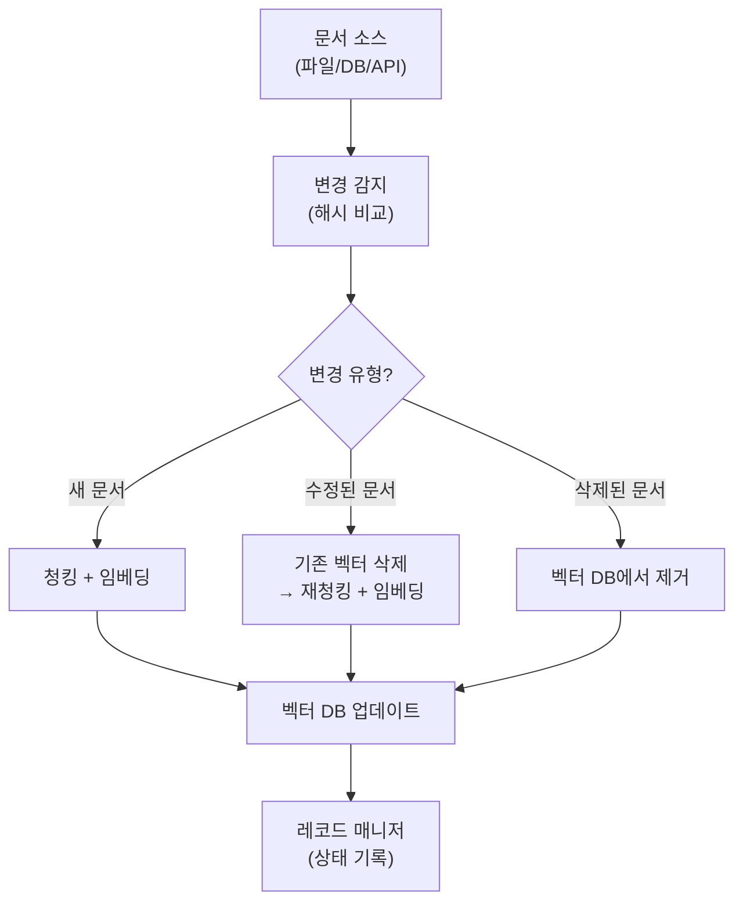
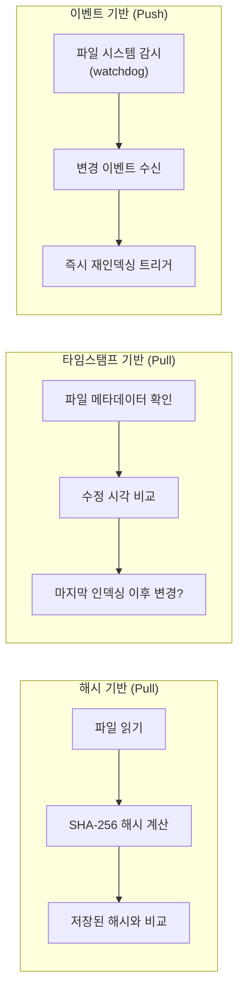
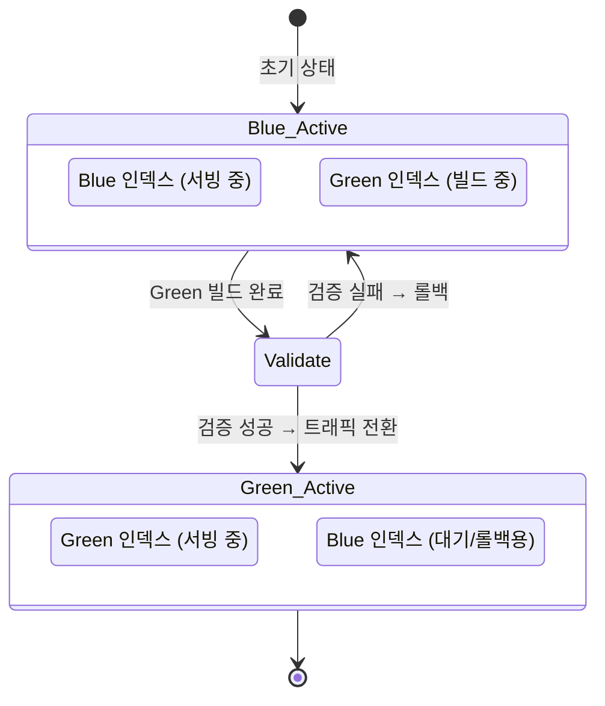
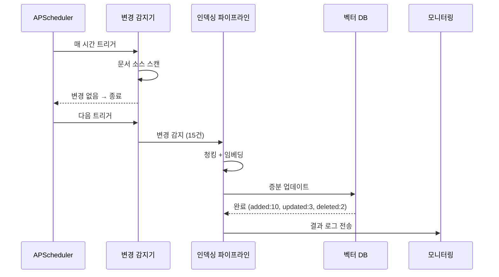
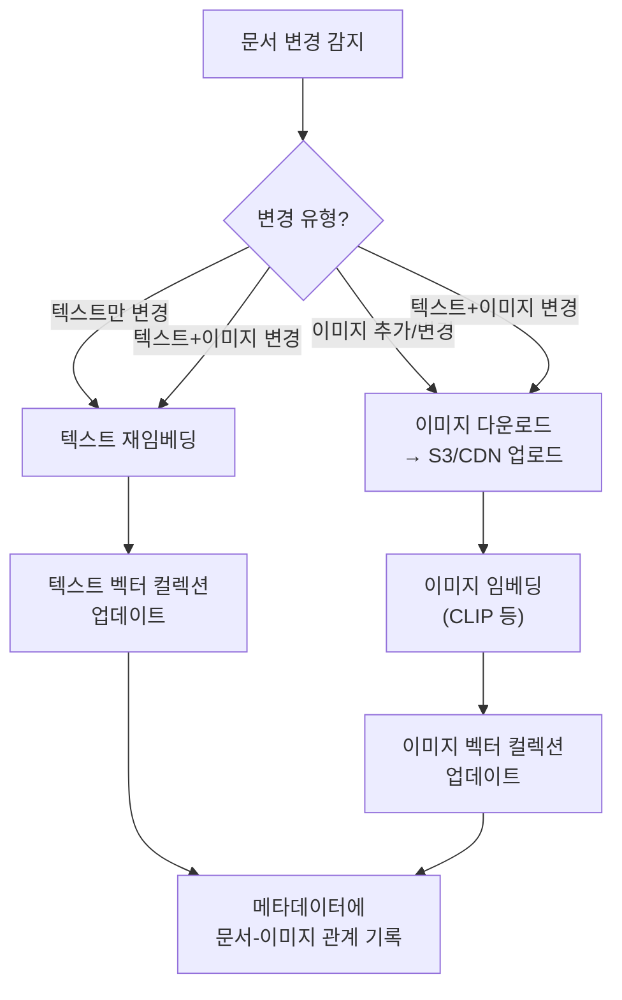

# 인덱스 관리와 데이터 파이프라인

> 프로덕션 RAG 시스템에서 문서의 추가·수정·삭제를 자동으로 감지하고, 인덱스를 안정적으로 유지하는 데이터 파이프라인을 구축합니다.

## 개요

이 섹션에서는 RAG 시스템이 실제 운영 환경에서 마주하는 가장 현실적인 문제—**"데이터가 바뀌면 인덱스를 어떻게 업데이트하지?"**—를 다룹니다. 앞서 [세션 20.1: FastAPI로 RAG API 서빙](20-프로덕션-rag-시스템-배포-모니터링-확장/01-fastapi로-rag-api-서빙.md)에서 구축한 API 서버는 정적인 인덱스를 기반으로 동작했는데요, 실제 프로덕션에서는 문서가 매일 추가되고, 수정되고, 삭제됩니다. 이 변화를 인덱스에 반영하지 않으면 RAG 시스템은 점점 "오래된 지식"을 내놓는 시스템이 되어버리죠.

**선수 지식**: 
- [세션 20.1](20-프로덕션-rag-시스템-배포-모니터링-확장/01-fastapi로-rag-api-서빙.md)의 FastAPI 기반 RAG 서비스 구조
- [Ch6: 벡터 데이터베이스 기초](06-벡터-데이터베이스-기초-chromadb로-시작하기/01-벡터-데이터베이스란-왜-필요한가.md)에서 다룬 벡터 DB의 기본 CRUD 연산
- [Ch4: 텍스트 청킹 전략](04-텍스트-청킹-전략-문서-분할과-최적화/01-청킹의-중요성과-기본-원리.md)에서 다룬 청킹 기법
- [Ch19: 멀티모달 RAG](19-멀티모달-rag-이미지와-테이블-처리/01-멀티모달-rag-아키텍처-텍스트를-넘어서.md)에서 다룬 이미지 임베딩과 멀티모달 검색 구조

**학습 목표**:
- 증분 인덱싱(Incremental Indexing) 파이프라인을 설계하고 구현할 수 있다
- 인덱스 버전 관리와 롤백 전략을 적용할 수 있다
- 스케줄러 기반 자동 인덱싱 시스템을 구축할 수 있다
- 문서 소스의 변경을 감지하고 재인덱싱 전략을 선택할 수 있다
- 멀티모달 인덱스의 증분 업데이트와 스토리지 전략을 이해할 수 있다

## 왜 알아야 할까?

"어제 올린 공지사항이 왜 검색 안 되죠?"

프로덕션 RAG 시스템을 운영하다 보면 이런 질문을 반드시 듣게 됩니다. 개발 단계에서는 문서를 한 번 로드하고 인덱싱하면 끝이었지만, 실제 운영에서는 상황이 완전히 다릅니다:

- **매일 새 문서가 생긴다**: 사내 위키, 기술 문서, 고객 FAQ가 계속 업데이트됩니다
- **기존 문서가 수정된다**: 정책 변경, 가격 업데이트, 오류 수정이 수시로 발생합니다
- **삭제된 문서가 여전히 검색된다**: 폐기된 제품 매뉴얼이 벡터 DB에 남아있으면 잘못된 답변을 생성합니다
- **전체 재인덱싱은 비용이 크다**: 수십만 건의 문서를 매번 처음부터 임베딩하면 시간과 비용이 기하급수적으로 늘어납니다

인덱스 관리 파이프라인은 이 문제를 해결합니다. 변경된 문서만 골라내서 효율적으로 인덱스를 업데이트하고, 문제가 생기면 이전 버전으로 롤백할 수 있는 안전망을 제공하죠.

## 핵심 개념

### 개념 1: 증분 인덱싱 파이프라인

> 💡 **비유**: 도서관 사서가 매일 아침 출근해서 하는 일을 생각해보세요. 전체 서가를 다시 정리하지 않습니다. 새로 도착한 책만 등록하고, 개정판이 나온 책은 교체하고, 폐기 도서는 제거합니다. 증분 인덱싱도 똑같습니다—**변경된 것만** 처리합니다.

증분 인덱싱(Incremental Indexing)이란 전체 문서를 다시 처리하는 대신, 마지막 인덱싱 이후 **변경된 문서만** 식별하여 벡터 데이터베이스를 업데이트하는 전략입니다. 이를 위해 세 가지 연산이 필요합니다:

| 연산 | 설명 | 예시 |
|------|------|------|
| **추가(Add)** | 새 문서를 청킹하고 임베딩하여 벡터 DB에 삽입 | 새 FAQ 문서 등록 |
| **수정(Update)** | 변경된 문서의 기존 벡터를 삭제하고 새로 삽입 | 정책 문서 업데이트 |
| **삭제(Delete)** | 폐기된 문서의 벡터를 벡터 DB에서 제거 | 단종 제품 매뉴얼 삭제 |

> 📊 **그림 1**: 증분 인덱싱 파이프라인의 전체 흐름



LangChain은 이 패턴을 `index()` 함수와 `RecordManager`로 공식 지원합니다. `RecordManager`는 각 문서 청크의 해시를 기록해두고, 다음 인덱싱 때 해시를 비교하여 변경 여부를 판단합니다.

```python
from langchain.indexes import SQLRecordManager, index
from langchain_core.documents import Document
from langchain_chroma import Chroma
from langchain_openai import OpenAIEmbeddings

# 벡터 스토어 초기화
embedding = OpenAIEmbeddings(model="text-embedding-3-small")
vectorstore = Chroma(
    collection_name="production_docs",
    embedding_function=embedding,
    persist_directory="./chroma_db"
)

# RecordManager: 각 청크의 해시와 인덱싱 시점을 기록
record_manager = SQLRecordManager(
    namespace="production_docs",  # 벡터 스토어 컬렉션과 매칭
    db_url="sqlite:///record_manager.db"
)
record_manager.create_schema()  # 첫 실행 시 테이블 생성
```

**cleanup 모드**가 핵심입니다. LangChain의 `index()` 함수는 네 가지 정리 모드를 제공합니다:

```python
# 1. None: 삭제 없이 새 문서만 추가 (가장 안전하지만 쓰레기 누적)
result = index(docs, record_manager, vectorstore, cleanup=None, source_id_key="source")

# 2. "incremental": 현재 배치에서 본 source_id에 대해서만 오래된 버전 삭제
#    → 가장 실용적. 실시간 업데이트에 적합
result = index(docs, record_manager, vectorstore, cleanup="incremental", source_id_key="source")

# 3. "full": 이번에 전달되지 않은 모든 문서를 삭제
#    → 전체 재인덱싱 시 사용. 전체 문서 목록을 한 번에 전달해야 함
result = index(docs, record_manager, vectorstore, cleanup="full", source_id_key="source")

# 4. "scoped_full": 배치 단위로 full 정리 수행
#    → 대규모 데이터를 여러 배치로 나눠 처리할 때 유용
result = index(docs, record_manager, vectorstore, cleanup="scoped_full", source_id_key="source")
```

> ⚠️ **흔한 오해**: `cleanup="full"` 모드에서 일부 문서만 전달하면 **나머지 문서가 전부 삭제됩니다!** "full"은 "전달된 것이 전부"라고 가정하기 때문입니다. 증분 업데이트에는 반드시 `"incremental"` 모드를 사용하세요.

`index()` 함수의 반환값은 처리 결과를 딕셔너리로 알려줍니다:

```run:python
# index() 반환값 예시 (시뮬레이션)
result = {
    "num_added": 15,      # 새로 추가된 청크 수
    "num_updated": 3,     # 업데이트된 청크 수  
    "num_deleted": 2,     # 삭제된 청크 수
    "num_skipped": 180,   # 변경 없어 건너뛴 청크 수
}

total = sum(result.values())
print(f"처리 결과: 총 {total}건")
print(f"  추가: {result['num_added']}건")
print(f"  업데이트: {result['num_updated']}건")
print(f"  삭제: {result['num_deleted']}건")
print(f"  건너뜀: {result['num_skipped']}건")
print(f"  실제 처리 비율: {(total - result['num_skipped']) / total * 100:.1f}%")
```

```output
처리 결과: 총 200건
  추가: 15건
  업데이트: 3건
  삭제: 2건
  건너뜀: 180건
  실제 처리 비율: 10.0%
```

200건 중 180건을 건너뛰었으니, 임베딩 API 호출 비용의 90%를 절약한 셈이죠.

### 개념 2: 문서 변경 감지 전략

> 💡 **비유**: 택배 기사가 배송할 물건이 바뀌었는지 확인하는 방법을 생각해보세요. 무게를 달아보거나(해시 비교), 송장 번호의 날짜를 확인하거나(타임스탬프), 아예 감시 카메라를 달아놓을 수도 있습니다(파일 워처). 각 방법마다 장단점이 있습니다.

문서의 변경을 감지하는 세 가지 주요 전략이 있습니다:

> 📊 **그림 2**: 문서 변경 감지 전략 비교



**1) 해시 기반 감지 (Content Hashing)**

파일 내용의 해시를 계산하여 이전 해시와 비교합니다. 가장 정확하지만, 매번 전체 파일을 읽어야 합니다.

```python
import hashlib
from pathlib import Path

def compute_file_hash(file_path: str) -> str:
    """파일 내용의 SHA-256 해시를 계산합니다."""
    sha256 = hashlib.sha256()
    with open(file_path, "rb") as f:
        # 대용량 파일은 청크 단위로 읽기
        for chunk in iter(lambda: f.read(8192), b""):
            sha256.update(chunk)
    return sha256.hexdigest()

def detect_changes(
    doc_dir: str,
    hash_store: dict[str, str]
) -> dict[str, list[str]]:
    """디렉토리의 문서 변경 사항을 감지합니다."""
    changes: dict[str, list[str]] = {
        "added": [],
        "modified": [],
        "deleted": [],
    }
    
    current_files = {str(p) for p in Path(doc_dir).rglob("*.md")}
    stored_files = set(hash_store.keys())
    
    # 새 파일 감지
    for f in current_files - stored_files:
        changes["added"].append(f)
    
    # 삭제된 파일 감지
    for f in stored_files - current_files:
        changes["deleted"].append(f)
    
    # 수정된 파일 감지 (해시 비교)
    for f in current_files & stored_files:
        current_hash = compute_file_hash(f)
        if current_hash != hash_store[f]:
            changes["modified"].append(f)
    
    return changes
```

**2) 타임스탬프 기반 감지**

파일의 수정 시각(`mtime`)을 확인합니다. 해시보다 빠르지만, 파일을 열었다 저장만 해도 변경으로 감지될 수 있습니다.

```python
import os
from datetime import datetime

def detect_changes_by_mtime(
    doc_dir: str,
    last_indexed: datetime
) -> list[str]:
    """마지막 인덱싱 이후 수정된 파일 목록을 반환합니다."""
    modified_files = []
    last_ts = last_indexed.timestamp()
    
    for path in Path(doc_dir).rglob("*"):
        if path.is_file() and path.stat().st_mtime > last_ts:
            modified_files.append(str(path))
    
    return modified_files
```

**3) 이벤트 기반 감지 (File Watcher)**

`watchdog` 라이브러리로 파일 시스템 이벤트를 실시간 감시합니다. 변경이 발생하는 즉시 재인덱싱을 트리거할 수 있어 지연 시간이 가장 짧습니다.

```python
from watchdog.observers import Observer
from watchdog.events import FileSystemEventHandler, FileSystemEvent
import queue

class IndexingEventHandler(FileSystemEventHandler):
    """문서 변경 이벤트를 큐에 전달하는 핸들러."""
    
    def __init__(self, change_queue: queue.Queue):
        self.change_queue = change_queue
        self._target_extensions = {".md", ".txt", ".pdf", ".docx"}
    
    def _is_target(self, path: str) -> bool:
        return Path(path).suffix.lower() in self._target_extensions
    
    def on_created(self, event: FileSystemEvent) -> None:
        if not event.is_directory and self._is_target(event.src_path):
            self.change_queue.put(("added", event.src_path))
    
    def on_modified(self, event: FileSystemEvent) -> None:
        if not event.is_directory and self._is_target(event.src_path):
            self.change_queue.put(("modified", event.src_path))
    
    def on_deleted(self, event: FileSystemEvent) -> None:
        if not event.is_directory and self._is_target(event.src_path):
            self.change_queue.put(("deleted", event.src_path))
```

| 전략 | 정확도 | 성능 | 적합한 상황 |
|------|--------|------|------------|
| 해시 기반 | 높음 | 느림 (파일 읽기 필요) | 정확성이 중요한 배치 처리 |
| 타임스탬프 | 보통 | 빠름 | 대규모 파일 시스템, 빈번한 체크 |
| 이벤트 기반 | 높음 | 매우 빠름 (실시간) | 실시간 업데이트가 필요한 시스템 |

> 🔥 **실무 팁**: 실무에서는 **이벤트 기반 + 해시 기반을 조합**하는 것이 가장 강력합니다. `watchdog`으로 변경을 실시간 감지하되, 실제 인덱싱 전에 해시를 비교하여 진짜 내용이 바뀌었는지 확인합니다. 파일을 저장만 하고 내용을 바꾸지 않은 경우의 불필요한 재인덱싱을 방지할 수 있거든요.

### 개념 3: 인덱스 버전 관리와 롤백

> 💡 **비유**: Git이 코드의 버전을 관리하듯, 인덱스에도 버전 관리가 필요합니다. 새 임베딩 모델로 전환했는데 검색 품질이 떨어졌다면? 잘못된 문서가 인덱싱되었다면? 즉시 이전 버전으로 "롤백"할 수 있어야 안전합니다. 이것은 마치 게임의 세이브 포인트와 같습니다—위험한 보스전 앞에서 저장하듯, 중요한 인덱스 변경 전에 스냅샷을 남기는 거죠.

인덱스 버전 관리에는 크게 두 가지 전략이 있습니다:

**전략 1: Blue-Green 배포**

두 개의 인덱스(Blue/Green)를 번갈아 사용합니다. 하나가 서빙 중일 때 다른 하나에 새 인덱스를 빌드하고, 검증 후 트래픽을 전환합니다.

> 📊 **그림 3**: Blue-Green 인덱스 배포 전략



```python
import json
import shutil
from datetime import datetime
from dataclasses import dataclass, field, asdict
from pathlib import Path

@dataclass
class IndexVersion:
    """인덱스 버전 메타데이터."""
    version_id: str
    created_at: str
    embedding_model: str
    doc_count: int
    chunk_count: int
    status: str = "building"  # building | active | standby | archived
    notes: str = ""

class IndexVersionManager:
    """인덱스 버전을 관리하고 롤백을 지원합니다."""
    
    def __init__(self, base_dir: str = "./index_versions"):
        self.base_dir = Path(base_dir)
        self.base_dir.mkdir(parents=True, exist_ok=True)
        self.manifest_path = self.base_dir / "manifest.json"
        self.versions: list[IndexVersion] = self._load_manifest()
    
    def _load_manifest(self) -> list[IndexVersion]:
        if self.manifest_path.exists():
            data = json.loads(self.manifest_path.read_text())
            return [IndexVersion(**v) for v in data]
        return []
    
    def _save_manifest(self) -> None:
        data = [asdict(v) for v in self.versions]
        self.manifest_path.write_text(json.dumps(data, indent=2, ensure_ascii=False))
    
    def create_version(
        self,
        embedding_model: str,
        doc_count: int,
        chunk_count: int,
        notes: str = ""
    ) -> IndexVersion:
        """새 인덱스 버전을 생성합니다."""
        version_id = datetime.now().strftime("v_%Y%m%d_%H%M%S")
        version = IndexVersion(
            version_id=version_id,
            created_at=datetime.now().isoformat(),
            embedding_model=embedding_model,
            doc_count=doc_count,
            chunk_count=chunk_count,
            notes=notes,
        )
        
        # 버전별 디렉토리 생성
        version_dir = self.base_dir / version_id
        version_dir.mkdir(exist_ok=True)
        
        self.versions.append(version)
        self._save_manifest()
        return version
    
    def activate(self, version_id: str) -> None:
        """특정 버전을 활성화하고 기존 활성 버전을 대기로 전환합니다."""
        for v in self.versions:
            if v.status == "active":
                v.status = "standby"
            if v.version_id == version_id:
                v.status = "active"
        self._save_manifest()
    
    def rollback(self) -> str | None:
        """직전 대기(standby) 버전으로 롤백합니다."""
        standby = [v for v in self.versions if v.status == "standby"]
        if not standby:
            return None
        
        # 가장 최근 standby 버전을 활성화
        latest_standby = max(standby, key=lambda v: v.created_at)
        
        # 현재 active를 archived로
        for v in self.versions:
            if v.status == "active":
                v.status = "archived"
        
        latest_standby.status = "active"
        self._save_manifest()
        return latest_standby.version_id
    
    def get_active(self) -> IndexVersion | None:
        """현재 활성 버전을 반환합니다."""
        for v in self.versions:
            if v.status == "active":
                return v
        return None
```

**전략 2: 컬렉션 별칭(Alias) 기반 전환**

Chroma, Qdrant 등 벡터 DB가 지원하는 별칭 기능을 활용하면, 원자적(atomic)으로 인덱스를 전환할 수 있습니다. 다운타임 없이 새 인덱스로 즉시 전환됩니다.

```python
# Qdrant의 별칭 기반 인덱스 전환 예시
from qdrant_client import QdrantClient

client = QdrantClient(url="http://localhost:6333")

# 새 컬렉션에 인덱스 빌드
new_collection = "docs_v20260304"
client.create_collection(
    collection_name=new_collection,
    vectors_config={"size": 1536, "distance": "Cosine"},
)
# ... 새 인덱스 빌드 완료 후 ...

# 별칭을 새 컬렉션으로 원자적 전환
client.update_collection_aliases(
    change_aliases_operations=[
        # 기존 별칭 제거
        {"delete_alias": {"alias_name": "production"}},
        # 새 컬렉션에 별칭 연결
        {"create_alias": {"alias_name": "production", "collection_name": new_collection}},
    ]
)
# 서비스는 "production" 별칭만 바라보므로 다운타임 제로!
```

### 개념 4: 스케줄러 기반 자동 인덱싱

> 💡 **비유**: 세탁기의 예약 세탁 기능을 떠올려보세요. 매일 새벽 3시에 자동으로 돌아가게 설정해두면, 아침에 깨끗한 빨래가 준비되어 있죠. 스케줄러 기반 인덱싱도 마찬가지입니다—사람이 개입하지 않아도 정해진 시간에 자동으로 인덱스가 최신 상태로 유지됩니다.

Python의 `APScheduler` 라이브러리를 사용하면 다양한 주기로 인덱싱 작업을 예약할 수 있습니다:

> 📊 **그림 4**: 스케줄러 기반 인덱싱 아키텍처



```python
from apscheduler.schedulers.asyncio import AsyncIOScheduler
from apscheduler.triggers.cron import CronTrigger
import logging

logger = logging.getLogger("indexing_scheduler")

class IndexingScheduler:
    """인덱싱 작업을 스케줄링하는 관리자."""
    
    def __init__(self, pipeline: "IncrementalIndexingPipeline"):
        self.pipeline = pipeline
        self.scheduler = AsyncIOScheduler()
    
    def setup_schedules(self) -> None:
        """인덱싱 스케줄을 설정합니다."""
        
        # 1) 증분 인덱싱: 매 시간 실행
        self.scheduler.add_job(
            self.pipeline.run_incremental,
            CronTrigger(minute=0),  # 매 정시
            id="incremental_hourly",
            name="증분 인덱싱 (매 시간)",
            max_instances=1,  # 동시 실행 방지
            misfire_grace_time=300,  # 5분 이내 지연은 허용
        )
        
        # 2) 전체 재인덱싱: 매주 일요일 새벽 3시
        self.scheduler.add_job(
            self.pipeline.run_full_reindex,
            CronTrigger(day_of_week="sun", hour=3),
            id="full_reindex_weekly",
            name="전체 재인덱싱 (매주 일요일)",
            max_instances=1,
        )
        
        # 3) 인덱스 건강 검사: 매일 자정
        self.scheduler.add_job(
            self.pipeline.health_check,
            CronTrigger(hour=0),
            id="health_check_daily",
            name="인덱스 건강 검사 (매일)",
            max_instances=1,
        )
    
    def start(self) -> None:
        self.scheduler.start()
        logger.info("인덱싱 스케줄러 시작")
    
    def shutdown(self) -> None:
        self.scheduler.shutdown()
        logger.info("인덱싱 스케줄러 종료")
```

### 개념 5: 멀티모달 인덱스의 증분 관리

[Ch19: 멀티모달 RAG](19-멀티모달-rag-이미지와-테이블-처리/01-멀티모달-rag-아키텍처-텍스트를-넘어서.md)에서 이미지와 텍스트를 함께 검색하는 시스템을 구축했는데요, 이를 프로덕션에 배포하면 인덱스 관리가 한층 복잡해집니다. 텍스트 임베딩과 이미지 임베딩이 **서로 다른 모델, 다른 차원, 다른 스토리지 특성**을 가지기 때문이죠.

> 💡 **비유**: 일반 도서관에서 책만 관리할 때는 서가 하나로 충분했지만, 영상 자료실이 추가되면 이야기가 달라집니다. 책은 책장에, DVD는 DVD 보관함에, 포스터는 포스터 거치대에 넣어야 하죠. 그런데 "아인슈타인"을 검색하면 관련 서적, 다큐멘터리 DVD, 강연 포스터가 **한꺼번에** 나와야 합니다. 멀티모달 인덱스 관리가 바로 이런 문제입니다.

**멀티모달 증분 업데이트의 핵심 과제**

텍스트 문서가 수정되면 텍스트 임베딩만 다시 계산하면 되지만, 문서에 포함된 이미지가 바뀌었거나 새 이미지가 추가되었을 때는 이미지 임베딩도 함께 업데이트해야 합니다. 이 **연쇄 의존성**을 관리하는 것이 핵심입니다.

> 📊 **그림 5**: 멀티모달 인덱스의 증분 업데이트 흐름



**스토리지 전략: 이미지 원본과 임베딩의 분리**

멀티모달 시스템에서는 이미지 원본 파일과 이미지 임베딩의 저장소를 분리하는 것이 일반적입니다. 이미지 원본은 용량이 크므로 **오브젝트 스토리지(S3, GCS)**에, 검색용 임베딩 벡터는 벡터 DB에 저장합니다. 서빙 시에는 CDN을 통해 이미지를 빠르게 제공하고, 검색은 벡터 DB에서 처리합니다.

```python
from dataclasses import dataclass

@dataclass
class MultimodalIndexConfig:
    """멀티모달 인덱스 설정."""
    # 텍스트 컬렉션: text-embedding-3-small (1536차원)
    text_collection: str = "docs_text"
    text_embedding_dim: int = 1536
    
    # 이미지 컬렉션: CLIP ViT-B/32 (512차원)
    image_collection: str = "docs_images"
    image_embedding_dim: int = 512
    
    # 이미지 원본 저장소
    image_storage: str = "s3://my-rag-bucket/images/"
    cdn_base_url: str = "https://cdn.example.com/images/"


def incremental_update_multimodal(
    changed_docs: list[dict],
    config: MultimodalIndexConfig,
    text_vectorstore,
    image_vectorstore,
    s3_client,
) -> dict:
    """멀티모달 문서의 증분 업데이트를 수행합니다."""
    results = {"text_updated": 0, "images_updated": 0, "images_uploaded": 0}
    
    for doc in changed_docs:
        # 1) 텍스트 임베딩 업데이트 (기존 방식과 동일)
        text_chunks = split_text(doc["content"])
        text_vectorstore.upsert(text_chunks, source=doc["id"])
        results["text_updated"] += len(text_chunks)
        
        # 2) 이미지 처리: 새 이미지 → S3 업로드 → 임베딩 → 벡터 DB
        for img in doc.get("images", []):
            # S3에 이미지 원본 업로드 (CDN이 자동으로 캐싱)
            s3_key = f"images/{doc['id']}/{img['filename']}"
            s3_client.upload_file(img["local_path"], config.image_storage, s3_key)
            results["images_uploaded"] += 1
            
            # 이미지 임베딩 계산 후 벡터 DB에 저장
            img_embedding = compute_clip_embedding(img["local_path"])
            image_vectorstore.upsert(
                ids=[f"{doc['id']}_{img['filename']}"],
                embeddings=[img_embedding],
                metadatas=[{
                    "source_doc": doc["id"],
                    "cdn_url": f"{config.cdn_base_url}{s3_key}",
                    "alt_text": img.get("alt_text", ""),
                }],
            )
            results["images_updated"] += 1
    
    return results
```

> 🔥 **실무 팁**: 멀티모달 인덱스를 스케일링할 때 가장 큰 병목은 **이미지 임베딩 계산**입니다. CLIP 등의 비전 모델은 텍스트 임베딩보다 연산 비용이 훨씬 높으므로, GPU 배치 처리를 통해 여러 이미지를 한 번에 임베딩하는 것이 중요합니다. 또한 이미지 원본이 변경되지 않았는데 연관 텍스트만 수정된 경우, 이미지 재임베딩을 건너뛰도록 해시 기반 변경 감지를 이미지에도 적용하세요.

## 실습: 직접 해보기

이제 위의 개념들을 통합하여 **완전한 증분 인덱싱 파이프라인**을 구축해봅시다. 이 파이프라인은 문서 변경을 감지하고, 증분 인덱싱을 수행하며, 버전 관리를 지원합니다.

```python
"""
증분 인덱싱 파이프라인 — 프로덕션 RAG 시스템용
필요 패키지: pip install langchain langchain-chroma langchain-openai apscheduler watchdog
"""

import hashlib
import json
import logging
from dataclasses import dataclass, field
from datetime import datetime
from pathlib import Path

from langchain_community.document_loaders import DirectoryLoader, TextLoader
from langchain.indexes import SQLRecordManager, index
from langchain_text_splitters import RecursiveCharacterTextSplitter
from langchain_chroma import Chroma
from langchain_openai import OpenAIEmbeddings

logging.basicConfig(level=logging.INFO)
logger = logging.getLogger("incremental_pipeline")


@dataclass
class IndexingResult:
    """인덱싱 실행 결과."""
    timestamp: str
    num_added: int = 0
    num_updated: int = 0
    num_deleted: int = 0
    num_skipped: int = 0
    duration_seconds: float = 0.0
    error: str | None = None


class IncrementalIndexingPipeline:
    """문서 변경을 감지하고 증분 인덱싱을 수행하는 파이프라인."""
    
    def __init__(
        self,
        doc_dir: str,
        chroma_dir: str = "./chroma_db",
        record_db: str = "sqlite:///record_manager.db",
        collection_name: str = "production_docs",
        chunk_size: int = 1000,
        chunk_overlap: int = 200,
    ):
        self.doc_dir = Path(doc_dir)
        self.hash_store_path = Path(chroma_dir) / "file_hashes.json"
        
        # 임베딩 모델
        self.embedding = OpenAIEmbeddings(model="text-embedding-3-small")
        
        # 벡터 스토어
        self.vectorstore = Chroma(
            collection_name=collection_name,
            embedding_function=self.embedding,
            persist_directory=chroma_dir,
        )
        
        # 레코드 매니저 (중복 방지 + 변경 추적)
        self.record_manager = SQLRecordManager(
            namespace=collection_name,
            db_url=record_db,
        )
        self.record_manager.create_schema()
        
        # 텍스트 분할기
        self.splitter = RecursiveCharacterTextSplitter(
            chunk_size=chunk_size,
            chunk_overlap=chunk_overlap,
        )
        
        # 해시 저장소 로드
        self.hash_store: dict[str, str] = self._load_hash_store()
        
        # 인덱싱 이력
        self.history: list[IndexingResult] = []
    
    def _load_hash_store(self) -> dict[str, str]:
        if self.hash_store_path.exists():
            return json.loads(self.hash_store_path.read_text())
        return {}
    
    def _save_hash_store(self) -> None:
        self.hash_store_path.parent.mkdir(parents=True, exist_ok=True)
        self.hash_store_path.write_text(
            json.dumps(self.hash_store, indent=2, ensure_ascii=False)
        )
    
    def _compute_hash(self, file_path: str) -> str:
        sha256 = hashlib.sha256()
        with open(file_path, "rb") as f:
            for chunk in iter(lambda: f.read(8192), b""):
                sha256.update(chunk)
        return sha256.hexdigest()
    
    def detect_changes(self) -> dict[str, list[str]]:
        """문서 디렉토리의 변경 사항을 감지합니다."""
        changes: dict[str, list[str]] = {
            "added": [], "modified": [], "deleted": [],
        }
        
        # 지원하는 확장자
        extensions = {".md", ".txt", ".rst"}
        current_files = {
            str(p) for p in self.doc_dir.rglob("*")
            if p.is_file() and p.suffix in extensions
        }
        stored_files = set(self.hash_store.keys())
        
        # 새 파일
        for f in current_files - stored_files:
            changes["added"].append(f)
        
        # 삭제된 파일
        for f in stored_files - current_files:
            changes["deleted"].append(f)
        
        # 수정된 파일 (해시 비교)
        for f in current_files & stored_files:
            if self._compute_hash(f) != self.hash_store[f]:
                changes["modified"].append(f)
        
        return changes
    
    def run_incremental(self) -> IndexingResult:
        """증분 인덱싱을 실행합니다."""
        import time
        start = time.time()
        result = IndexingResult(timestamp=datetime.now().isoformat())
        
        try:
            changes = self.detect_changes()
            files_to_process = changes["added"] + changes["modified"]
            
            if not files_to_process and not changes["deleted"]:
                logger.info("변경 사항 없음 — 인덱싱 건너뜀")
                result.duration_seconds = time.time() - start
                return result
            
            logger.info(
                f"변경 감지: 추가 {len(changes['added'])}건, "
                f"수정 {len(changes['modified'])}건, "
                f"삭제 {len(changes['deleted'])}건"
            )
            
            # 1) 변경된 파일 로드 + 청킹
            if files_to_process:
                from langchain_core.documents import Document
                
                docs = []
                for file_path in files_to_process:
                    loader = TextLoader(file_path, encoding="utf-8")
                    file_docs = loader.load()
                    # source 메타데이터 설정 (RecordManager가 추적에 사용)
                    for doc in file_docs:
                        doc.metadata["source"] = file_path
                    docs.extend(file_docs)
                
                chunks = self.splitter.split_documents(docs)
                
                # 2) 증분 인덱싱 (LangChain index API)
                idx_result = index(
                    chunks,
                    self.record_manager,
                    self.vectorstore,
                    cleanup="incremental",
                    source_id_key="source",
                )
                result.num_added = idx_result["num_added"]
                result.num_updated = idx_result["num_updated"]
                result.num_skipped = idx_result["num_skipped"]
            
            # 3) 삭제된 파일의 벡터 제거
            if changes["deleted"]:
                for deleted_file in changes["deleted"]:
                    # source 메타데이터로 해당 문서의 청크들을 찾아 삭제
                    self.vectorstore.delete(
                        where={"source": deleted_file}
                    )
                    result.num_deleted += 1
                    del self.hash_store[deleted_file]
            
            # 4) 해시 저장소 업데이트
            for f in files_to_process:
                self.hash_store[f] = self._compute_hash(f)
            self._save_hash_store()
            
            result.duration_seconds = time.time() - start
            self.history.append(result)
            
            logger.info(
                f"인덱싱 완료: +{result.num_added} ~{result.num_updated} "
                f"-{result.num_deleted} ({result.duration_seconds:.1f}초)"
            )
            
        except Exception as e:
            result.error = str(e)
            logger.error(f"인덱싱 실패: {e}")
        
        return result
    
    def run_full_reindex(self) -> IndexingResult:
        """전체 재인덱싱을 수행합니다 (주간 배치)."""
        import time
        start = time.time()
        
        loader = DirectoryLoader(
            str(self.doc_dir),
            glob="**/*.md",
            loader_cls=TextLoader,
            loader_kwargs={"encoding": "utf-8"},
        )
        docs = loader.load()
        chunks = self.splitter.split_documents(docs)
        
        # cleanup="full" → 전달되지 않은 문서는 모두 삭제
        idx_result = index(
            chunks,
            self.record_manager,
            self.vectorstore,
            cleanup="full",
            source_id_key="source",
        )
        
        # 해시 저장소 전체 갱신
        self.hash_store.clear()
        for doc in docs:
            src = doc.metadata.get("source", "")
            if src:
                self.hash_store[src] = self._compute_hash(src)
        self._save_hash_store()
        
        result = IndexingResult(
            timestamp=datetime.now().isoformat(),
            num_added=idx_result["num_added"],
            num_updated=idx_result["num_updated"],
            num_deleted=idx_result["num_deleted"],
            num_skipped=idx_result["num_skipped"],
            duration_seconds=time.time() - start,
        )
        self.history.append(result)
        return result
    
    def health_check(self) -> dict:
        """인덱스 건강 상태를 점검합니다."""
        collection = self.vectorstore._collection
        count = collection.count()
        
        # 해시 저장소와 실제 파일 비교
        extensions = {".md", ".txt", ".rst"}
        actual_files = len([
            p for p in self.doc_dir.rglob("*")
            if p.is_file() and p.suffix in extensions
        ])
        
        status = {
            "timestamp": datetime.now().isoformat(),
            "vector_count": count,
            "tracked_files": len(self.hash_store),
            "actual_files": actual_files,
            "orphaned_files": len(self.hash_store) - actual_files,
            "healthy": abs(len(self.hash_store) - actual_files) <= 1,
        }
        
        logger.info(f"건강 검사: 벡터 {count}건, 파일 {actual_files}개, 상태: {'정상' if status['healthy'] else '점검 필요'}")
        return status
```

이 파이프라인의 사용 예시를 확인해보겠습니다:

```run:python
# 파이프라인 사용 시뮬레이션
from datetime import datetime

# 시뮬레이션된 인덱싱 결과
runs = [
    {"time": "06:00", "added": 0, "modified": 0, "deleted": 0, "skipped": 500},
    {"time": "07:00", "added": 3, "modified": 1, "deleted": 0, "skipped": 500},
    {"time": "08:00", "added": 0, "modified": 0, "deleted": 0, "skipped": 504},
    {"time": "09:00", "added": 5, "modified": 2, "deleted": 1, "skipped": 504},
]

print("=== 증분 인덱싱 실행 이력 ===")
print(f"{'시각':<8} {'추가':>6} {'수정':>6} {'삭제':>6} {'건너뜀':>8} {'상태'}")
print("-" * 50)
for run in runs:
    changed = run["added"] + run["modified"] + run["deleted"]
    status = "변경 없음" if changed == 0 else f"{changed}건 처리"
    print(f"{run['time']:<8} {run['added']:>6} {run['modified']:>6} {run['deleted']:>6} {run['skipped']:>8} {status}")

total_processed = sum(r["added"] + r["modified"] + r["deleted"] for r in runs)
total_skipped = sum(r["skipped"] for r in runs)
print(f"\n총 처리: {total_processed}건 / 건너뜀: {total_skipped}건")
print(f"임베딩 API 절약률: {total_skipped / (total_processed + total_skipped) * 100:.1f}%")
```

```output
=== 증분 인덱싱 실행 이력 ===
시각     추가     수정     삭제   건너뜀   상태
--------------------------------------------------
06:00         0      0      0      500 변경 없음
07:00         3      1      0      500 4건 처리
08:00         0      0      0      504 변경 없음
09:00         5      2      1      504 8건 처리

총 처리: 12건 / 건너뜀: 2008건
임베딩 API 절약률: 99.4%
```

## 더 깊이 알아보기

### 인덱스 관리의 역사: 검색 엔진에서 RAG까지

증분 인덱싱이라는 개념은 RAG와 함께 등장한 것이 아닙니다. 사실 이 아이디어는 **1990년대 웹 검색 엔진 시대**로 거슬러 올라갑니다. Google의 초기 크롤러는 전체 웹을 다시 크롤링하는 것이 불가능해지자, 변경된 페이지만 선택적으로 재크롤링하는 "증분 크롤링(Incremental Crawling)"을 도입했습니다. 이것이 현대 RAG 시스템의 증분 인덱싱의 직접적인 조상이죠.

Elasticsearch의 세그먼트 기반 아키텍처도 흥미롭습니다. Lucene(Elasticsearch의 내부 엔진)은 인덱스를 불변(immutable) 세그먼트로 관리하는데, 새 문서는 새 세그먼트에 기록하고 삭제는 "삭제 표시"만 남깁니다. 나중에 백그라운드 머지 프로세스가 이를 정리하죠. 이 패턴은 벡터 데이터베이스에서도 유사하게 채택되었습니다—LanceDB가 "제로 코스트 스냅샷"을 제공할 수 있는 것도 바로 이 불변 세그먼트 아키텍처 덕분입니다.

### 임베딩 모델 업그레이드라는 난제

프로덕션 RAG 시스템에서 가장 까다로운 인덱스 관리 문제 중 하나가 **임베딩 모델 업그레이드**입니다. OpenAI가 `text-embedding-ada-002`에서 `text-embedding-3-small`로 모델을 업그레이드했을 때, 기존 벡터와 새 벡터는 **완전히 다른 벡터 공간**에 존재하게 됩니다. 하나의 컬렉션에 두 모델의 벡터를 섞으면 검색 결과가 엉망이 됩니다. 이것이 바로 Blue-Green 배포가 필요한 핵심 이유입니다—새 모델로 전체 인덱스를 다시 빌드하는 동안 기존 인덱스는 계속 서비스하고, 완료 후 원자적으로 전환하는 것이죠.

멀티모달 시스템에서는 이 문제가 더 복잡합니다. CLIP 모델을 업그레이드하면 이미지 벡터 공간이 바뀌는데, 텍스트 임베딩은 그대로일 수 있거든요. 두 모달리티의 임베딩 모델을 독립적으로 관리하고, Blue-Green 배포도 모달리티별로 적용할 수 있어야 합니다.

## 흔한 오해와 팁

> ⚠️ **흔한 오해**: "증분 인덱싱만 하면 전체 재인덱싱은 필요 없다"
> 
> 그렇지 않습니다. 증분 인덱싱을 오래 반복하면 **"인덱스 드리프트(Index Drift)"**가 발생할 수 있습니다. 해시 비교에서 놓친 변경, 임베딩 모델 업데이트, 청킹 전략 변경 등의 이유로 인덱스가 원본 문서와 미묘하게 불일치하게 됩니다. 주간 또는 월간 전체 재인덱싱을 병행하여 인덱스를 "리셋"하는 것이 좋습니다.

> 💡 **알고 계셨나요?**: LangChain의 `RecordManager`는 내부적으로 각 청크의 해시를 `문서 내용 + 메타데이터`의 조합으로 계산합니다. 따라서 문서 내용이 같더라도 메타데이터(예: `last_updated` 타임스탬프)가 바뀌면 "변경됨"으로 인식합니다. 메타데이터에 자주 바뀌는 값을 넣으면 불필요한 재인덱싱이 발생하니 주의하세요!

> 🔥 **실무 팁**: 프로덕션에서는 인덱싱 파이프라인에 반드시 **건강 검사(Health Check)**를 포함하세요. 벡터 DB의 문서 수와 원본 파일 수를 비교하고, 이상이 감지되면 알림을 보내는 것만으로도 많은 장애를 예방할 수 있습니다. 위 코드의 `health_check()` 메서드처럼, 매일 자정에 자동으로 점검하는 것을 권장합니다.

> 🔥 **실무 팁**: `cleanup="incremental"` 모드를 사용할 때는 반드시 `source_id_key`를 지정하세요. 이 키가 없으면 LangChain이 어떤 청크가 어떤 원본 문서에서 왔는지 추적할 수 없어서, 수정된 문서의 이전 버전 청크가 삭제되지 않고 벡터 DB에 남아있게 됩니다.

> ⚠️ **흔한 오해**: "멀티모달 인덱스는 하나의 컬렉션에 텍스트와 이미지 벡터를 함께 넣으면 된다"
>
> 텍스트 임베딩(예: 1536차원)과 이미지 임베딩(예: 512차원)은 차원이 다르고 벡터 공간도 다릅니다. 같은 컬렉션에 섞으면 검색이 제대로 동작하지 않습니다. **모달리티별로 컬렉션을 분리**하고, 검색 시 각 컬렉션의 결과를 병합(fusion)하는 방식이 올바른 접근입니다. CLIP처럼 공유 벡터 공간을 사용하는 모델이라도, 텍스트와 이미지의 증분 업데이트 주기가 다를 수 있으므로 컬렉션 분리가 관리에 유리합니다.

## 핵심 정리

| 개념 | 설명 |
|------|------|
| **증분 인덱싱** | 변경된 문서만 감지하여 벡터 DB를 업데이트. 전체 재인덱싱 대비 90%+ 비용 절약 |
| **RecordManager** | LangChain의 인덱스 상태 추적기. 각 청크의 해시를 기록하여 중복·변경을 판단 |
| **cleanup 모드** | `None`(추가만) / `incremental`(소스별 정리) / `full`(전체 동기화) / `scoped_full`(배치 단위 전체) |
| **변경 감지 전략** | 해시 비교(정확) / 타임스탬프(빠름) / 이벤트 기반(실시간). 조합 사용 권장 |
| **Blue-Green 배포** | 두 인덱스를 번갈아 사용. 새 인덱스 검증 후 원자적 전환, 즉시 롤백 가능 |
| **컬렉션 별칭** | 벡터 DB의 별칭 기능으로 다운타임 없이 인덱스 전환 (Qdrant, Elasticsearch 등) |
| **인덱스 버전 관리** | 각 인덱스에 버전 ID·메타데이터 부여. 문제 시 이전 버전으로 롤백 |
| **스케줄러** | APScheduler로 증분(매시간)·전체(주간)·건강검사(매일) 자동 실행 |
| **인덱스 드리프트** | 증분 인덱싱만 반복하면 누적되는 불일치. 주기적 전체 재인덱싱으로 해소 |
| **멀티모달 인덱스** | 텍스트·이미지 컬렉션 분리, 이미지 원본은 S3/CDN에, 임베딩은 벡터 DB에 저장. 모달리티별 독립 증분 업데이트 |

## 다음 세션 미리보기

인덱스를 안정적으로 관리하는 파이프라인을 갖췄으니, 다음 세션에서는 이 시스템의 **보안과 접근 제어**를 다룹니다. 프롬프트 인젝션 공격을 방어하고, 문서 레벨 ACL(접근 제어 목록)을 적용하여 사용자별로 검색 가능한 문서를 제한하며, API 인증/인가를 구축하는 방법을 배우게 됩니다.

## 참고 자료

- [How to use the LangChain indexing API](https://python.langchain.com/docs/how_to/indexing/) - LangChain 공식 문서. RecordManager, cleanup 모드, index() 함수의 상세 사용법을 설명합니다
- [Syncing data sources to vector stores](https://blog.langchain.com/syncing-data-sources-to-vector-stores/) - LangChain 블로그. 인덱싱 API의 설계 동기와 아키텍처를 소개합니다
- [Version Your Vectors — Index Versioning as the Missing Layer in RAG](https://safjan.com/version-your-vectors-index-versioning-as-the-missing-layer-in-rag/) - 인덱스 버전 관리의 필요성과 구현 전략을 체계적으로 정리한 글입니다
- [RAG Solution Design and Evaluation Guide (Azure)](https://learn.microsoft.com/en-us/azure/architecture/ai-ml/guide/rag/rag-solution-design-and-evaluation-guide) - Microsoft의 프로덕션 RAG 아키텍처 가이드. 인덱스 관리 전략 포함
- [APScheduler User Guide](https://apscheduler.readthedocs.io/en/3.x/userguide.html) - Python 스케줄러 라이브러리 공식 문서. CronTrigger 등 다양한 스케줄링 패턴을 설명합니다
- [watchdog — Python filesystem monitoring](https://github.com/gorakhargosh/watchdog) - 파일 시스템 이벤트 감시 라이브러리. 실시간 변경 감지에 활용
- [Scalable Multimodal Search with CLIP and Vector Databases](https://qdrant.tech/documentation/tutorials/multimodal-search/) - Qdrant 공식 튜토리얼. CLIP 기반 멀티모달 검색과 벡터 DB 통합 전략을 다룹니다

---
### 🔗 Related Sessions
- [document](../03-문서-로딩과-파싱-다양한-소스에서-데이터-수집/01-문서-로딩-기초-langchain-document-loaders.md) (prerequisite)
- [recursivecharactertextsplitter](../04-텍스트-청킹-전략-문서-분할과-최적화/02-고정-크기-청킹과-재귀적-청킹.md) (prerequisite)
- [ragservice](../20-프로덕션-rag-시스템-배포-모니터링-확장/01-fastapi로-rag-api-서빙.md) (prerequisite)
- [queryrequest](../20-프로덕션-rag-시스템-배포-모니터링-확장/01-fastapi로-rag-api-서빙.md) (prerequisite)
- [queryresponse](../20-프로덕션-rag-시스템-배포-모니터링-확장/01-fastapi로-rag-api-서빙.md) (prerequisite)
- [create_app](../20-프로덕션-rag-시스템-배포-모니터링-확장/01-fastapi로-rag-api-서빙.md) (prerequisite)
- [lifespan](../20-프로덕션-rag-시스템-배포-모니터링-확장/01-fastapi로-rag-api-서빙.md) (prerequisite)
