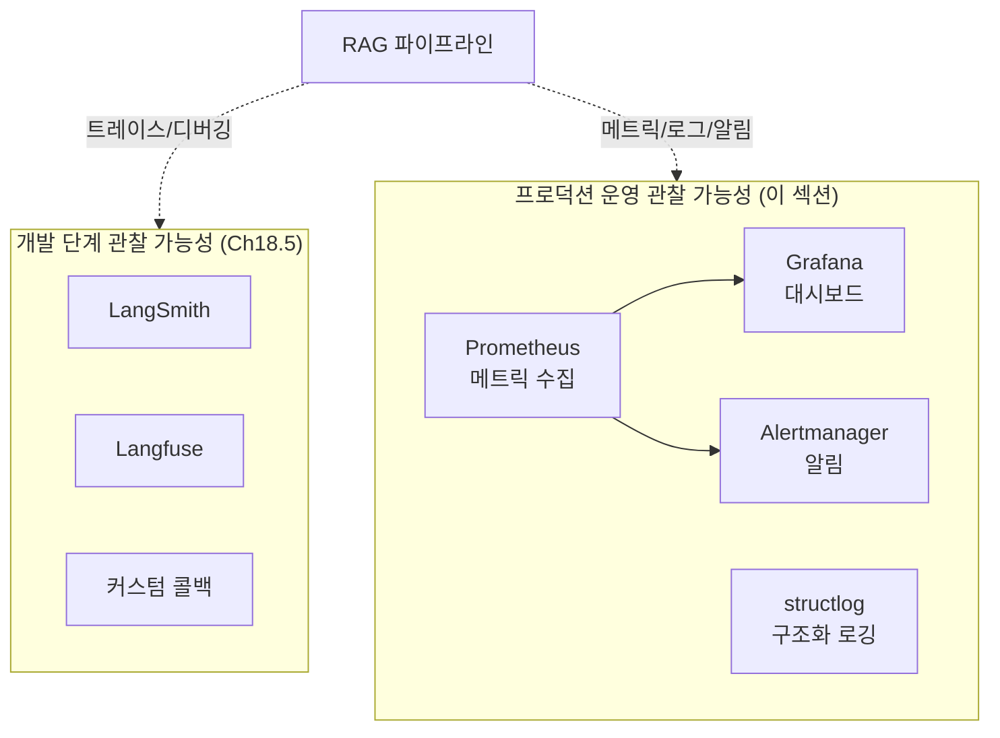
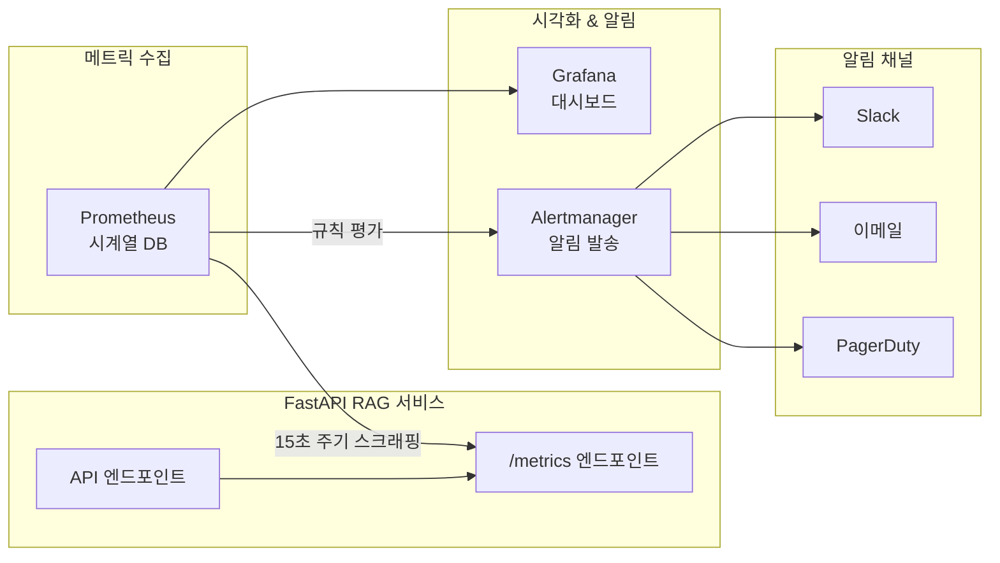
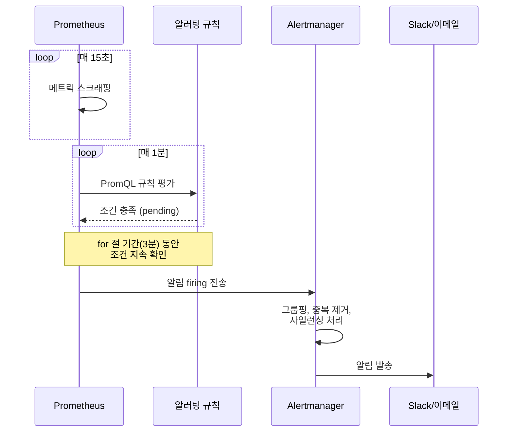
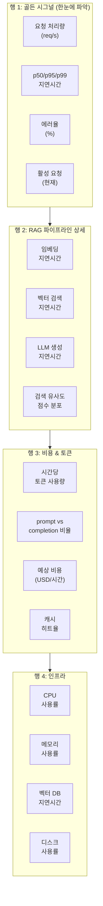

# 모니터링, 로깅, 관찰 가능성

> 프로덕션 RAG 시스템의 건강 상태를 실시간으로 파악하고, 문제가 발생하기 전에 감지하는 **운영 관찰 가능성(Operational Observability)** 체계를 구축합니다.

## 개요

이 섹션에서는 프로덕션 RAG 시스템에 **운영 수준의 관찰 가능성**을 구축하는 방법을 학습합니다. Prometheus로 RAG 전용 메트릭을 수집하고, Grafana로 실시간 대시보드를 만들며, PromQL 기반 알러팅으로 장애를 사전 감지하는 체계를 완성합니다. 여기에 structlog 기반 구조화된 로깅을 결합하여 운영 환경에서의 디버깅 효율을 높입니다.

> 💡 [Session 18.5](session_18_5.md)에서 LangSmith, Langfuse, 커스텀 콜백을 활용한 **개발 단계 디버깅 관찰 가능성**을 다루었다면, 이 섹션에서는 **프로덕션 운영 관찰 가능성** — 시계열 메트릭, 대시보드, 알러팅에 집중합니다. 같은 "관찰 가능성"이지만 목적과 도구가 다릅니다.

**선수 지식**: [Session 20.1](session_20_1.md)에서 구축한 FastAPI 기반 RAG API 서빙 구조, [Session 20.2](session_20_2.md)의 인덱스 관리 파이프라인, [Session 20.3](session_20_3.md)의 보안 체계, [Session 18.5](session_18_5.md)의 개발 단계 관찰 가능성 개념
**학습 목표**:
- RAG 시스템 전용 메트릭(검색 지연시간, 답변 품질 점수, 토큰 사용량)을 정의하고 수집할 수 있다
- structlog 기반 구조화된 로깅을 설계하고 JSON 포맷으로 출력할 수 있다
- Prometheus + Grafana 모니터링 스택을 구성하고 RAG 대시보드를 만들 수 있다
- PromQL 기반 알러팅 규칙을 설정하여 장애를 사전에 감지할 수 있다

## 왜 알아야 할까?

"잘 돌아가고 있어요"라는 말만으로는 프로덕션 시스템을 운영할 수 없습니다. 여러분이 만든 RAG 시스템이 배포된 후, 이런 상황을 상상해 보세요:

- 어느 날 갑자기 사용자들이 "답변이 느려요"라고 불만을 제기합니다. 하지만 서버 CPU는 정상입니다 — 문제가 벡터 검색인지, LLM 호출인지, 네트워크인지 알 수 없습니다.
- 검색 품질이 서서히 나빠지고 있는데, 아무도 눈치채지 못합니다. 인덱스 드리프트가 원인이지만, 측정하지 않으면 **보이지 않습니다**.
- 토큰 사용량이 예상의 3배를 넘어 비용이 폭증하지만, 월말 청구서를 받고 나서야 알게 됩니다.

[Session 18.5](session_18_5.md)에서 배운 LangSmith나 Langfuse 같은 도구는 **개발 단계에서 체인 동작을 디버깅**하는 데 탁월합니다. 하지만 프로덕션에서는 관점이 완전히 달라집니다. 개별 쿼리의 트레이스가 아니라, **수천 건의 요청에서 나타나는 패턴** — 지연시간 추세, 에러율 변동, 비용 곡선 — 을 실시간으로 감시해야 하거든요.

일반적인 웹 서비스 모니터링(CPU, 메모리, HTTP 상태 코드)만으로는 RAG 시스템의 진짜 건강 상태를 파악할 수 없습니다. **검색이 얼마나 관련 있는 문서를 찾았는지**, **LLM이 얼마나 충실하게 답변했는지**, **파이프라인의 어느 단계에서 병목이 발생하는지** — 이런 RAG 고유의 메트릭이 필요하거든요.

앞서 [Session 20.3](session_20_3.md)에서 보안 체계를 구축했다면, 이제 그 보안 이벤트를 포함한 모든 시스템 동작을 **측정 가능하고 추적 가능한 형태**로 만들 차례입니다.

## 핵심 개념

### 개념 1: 개발 관찰 가능성 vs 프로덕션 관찰 가능성

> 💡 **비유**: 자동차를 개발할 때 엔지니어는 차량 내부에 수백 개의 센서를 붙여 엔진 내부를 들여다봅니다(개발 관찰 가능성). 하지만 출시된 차량의 운전자에게는 속도계, 연료 게이지, 엔진 경고등이면 충분합니다(프로덕션 관찰 가능성). 두 가지 모두 필요하지만, 보는 대상과 목적이 다르죠.

RAG 시스템의 관찰 가능성은 **두 단계로** 나뉩니다:

| 구분 | 개발 단계 (Ch18.5) | 프로덕션 운영 (이 섹션) |
|------|---------------------|------------------------|
| **목적** | 체인 동작 디버깅, 프롬프트 튜닝 | 시스템 건강 감시, 장애 감지 |
| **관심사** | 개별 쿼리의 입출력, 중간 단계 | 수천 건의 집계 패턴, 추세 |
| **핵심 도구** | LangSmith, Langfuse, 커스텀 콜백 | Prometheus, Grafana, Alertmanager |
| **데이터 형태** | 트레이스(개별 요청 흐름) | 메트릭(시계열 숫자), 구조화 로그 |
| **사용자** | 개발자, ML 엔지니어 | SRE, DevOps, 온콜 엔지니어 |
| **핵심 질문** | "이 쿼리가 왜 나쁜 답변을 줬지?" | "지금 시스템이 정상인가?" |

> 📊 **그림 1**: 개발 vs 프로덕션 관찰 가능성 — 도구와 역할 분리



이 섹션에서는 프로덕션 운영 관찰 가능성의 핵심인 **메트릭**, **구조화 로그**, **알러팅**에 집중합니다. 개별 쿼리 수준의 트레이싱이 필요하다면 [Session 18.5](session_18_5.md)에서 다룬 LangSmith나 Langfuse를 프로덕션 환경에도 병행 적용할 수 있습니다.

### 개념 2: RAG 전용 메트릭 설계

> 💡 **비유**: 레스토랑 운영에 비유하면, 일반 메트릭은 "손님 수"나 "매출"이고, RAG 전용 메트릭은 "음식 맛 평가", "주문에서 서빙까지 시간", "재료 사용량"에 해당합니다. 레스토랑의 진짜 품질은 후자로 측정되겠죠.

RAG 시스템을 효과적으로 모니터링하려면 **파이프라인의 각 단계에 맞는 전용 메트릭**을 정의해야 합니다. Prometheus의 네 가지 메트릭 타입을 활용합니다:

**1) 지연시간 메트릭 (Histogram)**

```python
from prometheus_client import Histogram

# 전체 파이프라인 지연시간
rag_pipeline_duration = Histogram(
    "rag_pipeline_duration_seconds",
    "전체 RAG 파이프라인 처리 시간",
    buckets=[0.1, 0.25, 0.5, 1.0, 2.5, 5.0, 10.0],
)

# 단계별 지연시간
rag_stage_duration = Histogram(
    "rag_stage_duration_seconds",
    "RAG 각 단계별 처리 시간",
    labelnames=["stage"],  # embedding, retrieval, generation
    buckets=[0.05, 0.1, 0.25, 0.5, 1.0, 2.5, 5.0],
)
```

**2) 토큰 사용량 메트릭 (Counter, Histogram)**

```python
from prometheus_client import Counter, Histogram

# 토큰 사용량 — 비용 추적의 핵심
rag_tokens_total = Counter(
    "rag_tokens_total",
    "총 토큰 사용량",
    labelnames=["type"],  # prompt, completion
)

# 쿼리당 토큰 분포
rag_tokens_per_query = Histogram(
    "rag_tokens_per_query",
    "쿼리당 토큰 사용량",
    labelnames=["type"],
    buckets=[100, 500, 1000, 2000, 4000, 8000],
)
```

**3) 검색 품질 메트릭 (Gauge, Histogram)**

```python
from prometheus_client import Gauge, Histogram

# 검색된 문서 수
rag_retrieved_docs = Histogram(
    "rag_retrieved_docs_count",
    "쿼리당 검색된 문서 수",
    buckets=[1, 2, 3, 5, 10, 20],
)

# 검색 유사도 점수 분포
rag_similarity_score = Histogram(
    "rag_similarity_score",
    "검색된 문서의 유사도 점수",
    buckets=[0.1, 0.3, 0.5, 0.7, 0.8, 0.9, 0.95],
)

# 답변 품질 점수 (LLM 자체 평가 또는 사용자 피드백)
rag_answer_quality = Gauge(
    "rag_answer_quality_score",
    "답변 품질 점수 (이동 평균)",
    labelnames=["metric"],  # faithfulness, relevancy
)
```

**4) 에러 및 비즈니스 메트릭 (Counter)**

```python
# 에러 카운터
rag_errors_total = Counter(
    "rag_errors_total",
    "RAG 처리 중 발생한 에러",
    labelnames=["stage", "error_type"],
)

# 캐시 히트율 추적
rag_cache_hits = Counter(
    "rag_cache_operations_total",
    "캐시 조회 결과",
    labelnames=["result"],  # hit, miss
)
```

> ⚠️ **흔한 오해**: "Prometheus의 Gauge와 Counter를 아무거나 써도 되지 않나요?" — 절대 아닙니다! Counter는 **단조증가**(monotonically increasing)하는 값에만 사용합니다. 현재 품질 점수처럼 오르내리는 값에는 반드시 Gauge를, 누적 요청 수처럼 계속 늘어나는 값에는 Counter를 써야 합니다. 잘못 사용하면 PromQL 쿼리 결과가 완전히 틀어집니다.

### 개념 3: 구조화된 로깅 (Structured Logging)

> 💡 **비유**: 일반 로그가 "누군가 서점에 왔다 갔다"라는 일기장이라면, 구조화된 로그는 "2024년 3월 4일 14:23, 고객ID: A123, 검색어: '파이썬 입문', 결과: 3권, 구매: 1권"이라는 엑셀 시트입니다. 나중에 "지난달 검색 결과가 0권인 쿼리가 몇 건이었지?"같은 질문에 답할 수 있는 건 후자뿐이죠.

`structlog`은 Python에서 구조화된 로깅을 구현하는 가장 인기 있는 라이브러리입니다. 기존 `logging` 모듈과 호환되면서도 **JSON 포맷 출력**, **컨텍스트 바인딩**, **프로세서 체인** 등 프로덕션에 필수적인 기능을 제공합니다.

```python
import structlog

def configure_logging(environment: str = "production") -> None:
    """RAG 시스템용 구조화된 로깅 설정."""
    processors = [
        structlog.contextvars.merge_contextvars,   # 요청별 컨텍스트 자동 병합
        structlog.processors.add_log_level,         # 로그 레벨 추가
        structlog.processors.TimeStamper(fmt="iso"), # ISO 타임스탬프
        structlog.processors.StackInfoRenderer(),    # 스택 정보
        structlog.processors.format_exc_info,        # 예외 정보 포맷
    ]

    if environment == "production":
        # 프로덕션: JSON 출력 → 로그 수집기(Loki 등)로 전송
        processors.append(structlog.processors.JSONRenderer())
    else:
        # 개발: 사람이 읽기 쉬운 컬러 출력
        processors.append(structlog.dev.ConsoleRenderer())

    structlog.configure(
        processors=processors,
        wrapper_class=structlog.make_filtering_bound_logger(
            logging.INFO if environment == "production" else logging.DEBUG
        ),
        context_class=dict,
        logger_factory=structlog.PrintLoggerFactory(),
        cache_logger_on_first_use=True,
    )
```

RAG 파이프라인의 각 단계에서 **컨텍스트를 누적**하는 것이 핵심입니다:

```python
import structlog
from structlog.contextvars import bind_contextvars, clear_contextvars

logger = structlog.get_logger()

async def handle_rag_query(query: str, user_id: str) -> dict:
    """RAG 쿼리 처리 — 구조화된 로깅 적용."""
    # 요청 시작 시 컨텍스트 바인딩
    clear_contextvars()
    bind_contextvars(
        request_id=str(uuid.uuid4()),
        user_id=user_id,
        query_length=len(query),
    )

    logger.info("rag_query_started", query_preview=query[:100])

    # 임베딩 단계
    t0 = time.perf_counter()
    embedding = await embed_query(query)
    embed_ms = (time.perf_counter() - t0) * 1000
    logger.info("embedding_completed", duration_ms=round(embed_ms, 2))

    # 검색 단계
    t0 = time.perf_counter()
    docs = await vector_search(embedding, top_k=5)
    search_ms = (time.perf_counter() - t0) * 1000
    logger.info(
        "retrieval_completed",
        duration_ms=round(search_ms, 2),
        docs_count=len(docs),
        top_score=round(docs[0].score, 4) if docs else 0,
    )

    # LLM 생성 단계
    t0 = time.perf_counter()
    answer = await generate_answer(query, docs)
    gen_ms = (time.perf_counter() - t0) * 1000
    logger.info(
        "generation_completed",
        duration_ms=round(gen_ms, 2),
        prompt_tokens=answer.usage.prompt_tokens,
        completion_tokens=answer.usage.completion_tokens,
    )

    logger.info(
        "rag_query_finished",
        total_ms=round(embed_ms + search_ms + gen_ms, 2),
    )
    return answer
```

이렇게 하면 프로덕션에서 다음과 같은 JSON 로그가 출력됩니다:

```run:python
import json

# 실제 structlog JSON 출력 예시 시뮬레이션
log_entry = {
    "request_id": "a1b2c3d4-e5f6-7890-abcd-ef1234567890",
    "user_id": "user_42",
    "query_length": 28,
    "event": "retrieval_completed",
    "duration_ms": 45.23,
    "docs_count": 5,
    "top_score": 0.8921,
    "timestamp": "2026-03-04T14:23:01.456789Z",
    "level": "info",
}

print(json.dumps(log_entry, indent=2, ensure_ascii=False))
```

```output
{
  "request_id": "a1b2c3d4-e5f6-7890-abcd-ef1234567890",
  "user_id": "user_42",
  "query_length": 28,
  "event": "retrieval_completed",
  "duration_ms": 45.23,
  "docs_count": 5,
  "top_score": 0.8921,
  "timestamp": "2026-03-04T14:23:01.456789Z",
  "level": "info"
}
```

이 JSON은 Grafana Loki, Elasticsearch, Datadog 같은 로그 수집기에서 바로 파싱되어 검색·집계가 가능합니다.

### 개념 4: Prometheus + Grafana 모니터링 스택

> 💡 **비유**: Prometheus는 매 분마다 교실을 돌아다니며 학생들의 체온을 기록하는 보건 선생님이고, Grafana는 그 데이터를 예쁜 차트로 보여주는 전광판입니다. 체온이 38도를 넘으면 알림이 가는 것이 Alertmanager의 역할이죠.

Prometheus는 **풀(Pull) 방식**으로 메트릭을 수집합니다. FastAPI 앱이 `/metrics` 엔드포인트를 노출하면, Prometheus가 주기적으로 가져가는 구조입니다.

> 📊 **그림 2**: Prometheus + Grafana 모니터링 아키텍처



FastAPI에 Prometheus 메트릭 엔드포인트를 추가하는 방법:

```python
from fastapi import FastAPI, Request, Response
from prometheus_client import (
    Counter, Histogram, Gauge,
    generate_latest, CONTENT_TYPE_LATEST,
)
import time

app = FastAPI()

# --- RAG 전용 메트릭 정의 ---
REQUEST_COUNT = Counter(
    "rag_requests_total", "총 RAG 요청 수",
    labelnames=["method", "endpoint", "status"],
)
REQUEST_LATENCY = Histogram(
    "rag_request_duration_seconds", "요청 처리 시간",
    labelnames=["endpoint"],
    buckets=[0.1, 0.25, 0.5, 1.0, 2.5, 5.0, 10.0],
)
ACTIVE_REQUESTS = Gauge(
    "rag_active_requests", "현재 처리 중인 요청 수",
)
RETRIEVAL_LATENCY = Histogram(
    "rag_retrieval_duration_seconds", "벡터 검색 지연시간",
    buckets=[0.01, 0.05, 0.1, 0.25, 0.5, 1.0],
)
LLM_LATENCY = Histogram(
    "rag_llm_duration_seconds", "LLM 생성 지연시간",
    buckets=[0.5, 1.0, 2.5, 5.0, 10.0, 30.0],
)
TOKEN_USAGE = Counter(
    "rag_token_usage_total", "토큰 사용량",
    labelnames=["type"],  # prompt, completion
)


# --- 미들웨어로 자동 계측 ---
@app.middleware("http")
async def metrics_middleware(request: Request, call_next):
    """모든 HTTP 요청에 대해 자동으로 메트릭을 수집합니다."""
    if request.url.path == "/metrics":
        return await call_next(request)

    ACTIVE_REQUESTS.inc()
    start = time.perf_counter()
    try:
        response = await call_next(request)
        REQUEST_COUNT.labels(
            method=request.method,
            endpoint=request.url.path,
            status=response.status_code,
        ).inc()
        return response
    except Exception as e:
        REQUEST_COUNT.labels(
            method=request.method,
            endpoint=request.url.path,
            status=500,
        ).inc()
        raise
    finally:
        duration = time.perf_counter() - start
        REQUEST_LATENCY.labels(endpoint=request.url.path).observe(duration)
        ACTIVE_REQUESTS.dec()


# --- 메트릭 엔드포인트 ---
@app.get("/metrics")
async def metrics():
    """Prometheus가 스크래핑하는 메트릭 엔드포인트."""
    return Response(
        content=generate_latest(),
        media_type=CONTENT_TYPE_LATEST,
    )
```

### 개념 5: PromQL과 알러팅 규칙

이제 수집된 메트릭으로 **알러팅 규칙**을 정의합니다. 핵심은 "무엇이 비정상인가?"를 PromQL로 표현하는 것이죠.

RAG 시스템에 꼭 필요한 알러팅 규칙들:

```yaml
# prometheus/alerts.yml
groups:
  - name: rag_alerts
    rules:
      # 1) 파이프라인 지연시간 급증
      - alert: RAGHighLatency
        expr: |
          histogram_quantile(0.95, 
            rate(rag_request_duration_seconds_bucket[5m])
          ) > 5
        for: 3m
        labels:
          severity: warning
        annotations:
          summary: "RAG p95 지연시간이 5초를 초과했습니다"
          description: "현재 p95: {{ $value | humanizeDuration }}"

      # 2) 에러율 급증
      - alert: RAGHighErrorRate
        expr: |
          sum(rate(rag_requests_total{status=~"5.."}[5m]))
          /
          sum(rate(rag_requests_total[5m]))
          > 0.05
        for: 2m
        labels:
          severity: critical
        annotations:
          summary: "RAG 에러율이 5%를 초과했습니다"
          description: "현재 에러율: {{ $value | humanizePercentage }}"

      # 3) 검색 품질 저하
      - alert: RAGLowRetrievalQuality
        expr: |
          histogram_quantile(0.5, 
            rate(rag_similarity_score_bucket[15m])
          ) < 0.5
        for: 10m
        labels:
          severity: warning
        annotations:
          summary: "검색 유사도 중위값이 0.5 미만으로 하락했습니다"

      # 4) 토큰 비용 급증
      - alert: RAGTokenBudgetExceeded
        expr: |
          sum(increase(rag_token_usage_total[1h])) > 500000
        for: 0m
        labels:
          severity: warning
        annotations:
          summary: "시간당 토큰 사용량이 50만을 초과했습니다"

      # 5) 벡터 검색 지연 급증
      - alert: RAGSlowRetrieval
        expr: |
          histogram_quantile(0.99,
            rate(rag_retrieval_duration_seconds_bucket[5m])
          ) > 1
        for: 5m
        labels:
          severity: critical
        annotations:
          summary: "벡터 검색 p99 지연이 1초를 초과했습니다"
```

> 📊 **그림 3**: 알러팅 흐름 — 규칙 평가에서 알림 발송까지



> 🔥 **실무 팁**: 알러팅의 `for` 절을 너무 짧게 설정하면 일시적 스파이크에도 알림이 폭주합니다. p95 지연시간은 최소 3분, 에러율은 2분, 품질 지표는 10분 이상으로 설정하는 것이 경험적으로 좋습니다. "순간적 튀는 값"과 "진짜 문제"를 구별하는 것이 핵심이거든요.

### 개념 6: Grafana 대시보드 설계 — RAG 운영 패널 구성

메트릭을 수집하는 것만으로는 부족합니다. 운영팀이 한눈에 시스템 상태를 파악할 수 있는 **대시보드**가 있어야 합니다. Grafana 대시보드를 RAG 시스템에 맞게 설계하는 핵심 원칙을 살펴보겠습니다.

> 💡 **비유**: 비행기 조종석의 계기판을 떠올려 보세요. 수백 가지 정보가 있지만, 가장 중요한 고도·속도·연료량이 가장 눈에 띄는 위치에 있습니다. RAG 대시보드도 마찬가지 — **가장 중요한 지표가 가장 먼저 보여야** 합니다.

RAG 대시보드는 크게 네 개 행(row)으로 구성하는 것이 효과적입니다:

> 📊 **그림 4**: RAG Grafana 대시보드 패널 레이아웃



각 패널에서 사용하는 핵심 PromQL 쿼리들입니다:

```python
# Grafana 대시보드 패널별 PromQL 쿼리 모음
grafana_panels = {
    # --- 행 1: 골든 시그널 ---
    "요청 처리량 (req/s)": 
        'sum(rate(rag_requests_total[5m]))',
    
    "p95 지연시간":
        'histogram_quantile(0.95, sum(rate(rag_request_duration_seconds_bucket[5m])) by (le))',
    
    "에러율 (%)":
        'sum(rate(rag_requests_total{status="error"}[5m])) / sum(rate(rag_requests_total[5m])) * 100',
    
    "활성 요청":
        'rag_active_requests',

    # --- 행 2: RAG 파이프라인 ---
    "단계별 p95 지연시간":
        'histogram_quantile(0.95, sum(rate(rag_stage_duration_seconds_bucket[5m])) by (le, stage))',
    
    "검색 유사도 중위값":
        'histogram_quantile(0.5, sum(rate(rag_retrieval_similarity_score_bucket[5m])) by (le))',

    # --- 행 3: 비용 ---
    "시간당 토큰 사용량":
        'sum(increase(rag_token_usage_total[1h])) by (type)',
    
    "캐시 히트율":
        'sum(rate(rag_cache_operations_total{result="hit"}[5m])) / sum(rate(rag_cache_operations_total[5m])) * 100',
}
```

Grafana 대시보드를 JSON 모델로 프로비저닝할 수도 있지만, 처음에는 UI에서 패널을 하나씩 추가하면서 PromQL 쿼리를 검증하는 것을 추천합니다. 대시보드가 안정화되면 `grafana/dashboards/` 디렉토리에 JSON으로 내보내어 코드로 관리하세요.

## 실습: 직접 해보기

전체 모니터링 스택을 통합한 `RAGMetricsCollector` 클래스를 구축합니다. 이 클래스는 Prometheus 메트릭 수집, 구조화된 로깅, 그리고 비용 추적을 하나의 인터페이스로 통합합니다.

```python
"""rag_monitoring.py — RAG 시스템 프로덕션 모니터링 통합 모듈."""

from __future__ import annotations

import time
import uuid
import logging
from contextlib import asynccontextmanager
from dataclasses import dataclass, field
from typing import AsyncGenerator

import structlog
from prometheus_client import Counter, Histogram, Gauge, Info
from structlog.contextvars import bind_contextvars, clear_contextvars


# ──────────────────────────────────────────────
# 1. structlog 설정
# ──────────────────────────────────────────────
def configure_logging(env: str = "production") -> None:
    """환경에 맞는 구조화된 로깅을 설정합니다."""
    shared_processors: list = [
        structlog.contextvars.merge_contextvars,
        structlog.processors.add_log_level,
        structlog.processors.TimeStamper(fmt="iso"),
        structlog.processors.format_exc_info,
    ]
    if env == "production":
        shared_processors.append(structlog.processors.JSONRenderer())
    else:
        shared_processors.append(structlog.dev.ConsoleRenderer())

    structlog.configure(
        processors=shared_processors,
        wrapper_class=structlog.make_filtering_bound_logger(logging.INFO),
        context_class=dict,
        logger_factory=structlog.PrintLoggerFactory(),
        cache_logger_on_first_use=True,
    )


# ──────────────────────────────────────────────
# 2. Prometheus 메트릭 정의
# ──────────────────────────────────────────────
class RAGMetrics:
    """RAG 시스템 전용 Prometheus 메트릭 모음."""

    # 요청 메트릭
    request_count = Counter(
        "rag_requests_total",
        "총 RAG 쿼리 요청 수",
        labelnames=["status"],
    )
    request_duration = Histogram(
        "rag_request_duration_seconds",
        "전체 RAG 요청 처리 시간",
        buckets=[0.1, 0.25, 0.5, 1.0, 2.5, 5.0, 10.0, 30.0],
    )
    active_requests = Gauge(
        "rag_active_requests",
        "현재 처리 중인 RAG 요청 수",
    )

    # 단계별 지연시간
    stage_duration = Histogram(
        "rag_stage_duration_seconds",
        "RAG 파이프라인 단계별 처리 시간",
        labelnames=["stage"],
        buckets=[0.01, 0.05, 0.1, 0.25, 0.5, 1.0, 2.5, 5.0],
    )

    # 검색 품질
    retrieval_score = Histogram(
        "rag_retrieval_similarity_score",
        "검색된 문서의 코사인 유사도 점수",
        buckets=[0.1, 0.3, 0.5, 0.6, 0.7, 0.8, 0.9, 0.95],
    )
    retrieved_docs_count = Histogram(
        "rag_retrieved_docs_count",
        "쿼리당 검색된 문서 수",
        buckets=[1, 2, 3, 5, 10, 20],
    )

    # 토큰 사용량
    token_usage = Counter(
        "rag_token_usage_total",
        "총 토큰 사용량",
        labelnames=["type"],  # prompt, completion
    )

    # 에러
    errors = Counter(
        "rag_errors_total",
        "RAG 처리 중 에러 수",
        labelnames=["stage", "error_type"],
    )

    # 시스템 정보
    app_info = Info("rag_app", "RAG 애플리케이션 정보")


# ──────────────────────────────────────────────
# 3. 단계별 타이밍 결과
# ──────────────────────────────────────────────
@dataclass
class StageTimings:
    """파이프라인 단계별 소요 시간 기록."""

    embedding_ms: float = 0.0
    retrieval_ms: float = 0.0
    generation_ms: float = 0.0
    total_ms: float = 0.0
    prompt_tokens: int = 0
    completion_tokens: int = 0
    docs_retrieved: int = 0
    top_similarity: float = 0.0


# ──────────────────────────────────────────────
# 4. 모니터링 통합 클래스
# ──────────────────────────────────────────────
class RAGMetricsCollector:
    """RAG 파이프라인의 메트릭 수집과 로깅을 통합 관리합니다."""

    def __init__(self) -> None:
        self.logger = structlog.get_logger()
        self.metrics = RAGMetrics

    @asynccontextmanager
    async def track_request(
        self, query: str, user_id: str = "anonymous"
    ) -> AsyncGenerator[StageTimings, None]:
        """요청 전체를 추적하는 컨텍스트 매니저.

        사용법:
            async with collector.track_request(query, user_id) as timings:
                # 파이프라인 실행...
                timings.docs_retrieved = 5
        """
        request_id = str(uuid.uuid4())
        timings = StageTimings()

        # 요청 컨텍스트 바인딩
        clear_contextvars()
        bind_contextvars(request_id=request_id, user_id=user_id)

        self.metrics.active_requests.inc()
        self.logger.info("rag_request_started", query_preview=query[:100])
        start = time.perf_counter()

        try:
            yield timings
            # 성공 시 메트릭 기록
            timings.total_ms = (time.perf_counter() - start) * 1000
            self._record_success(timings)
        except Exception as exc:
            timings.total_ms = (time.perf_counter() - start) * 1000
            self._record_error(exc, timings)
            raise
        finally:
            self.metrics.active_requests.dec()

    def track_stage(self, stage: str) -> _StageTimer:
        """개별 파이프라인 단계를 추적합니다."""
        return _StageTimer(stage, self.metrics, self.logger)

    def record_tokens(self, prompt: int, completion: int) -> None:
        """토큰 사용량을 기록합니다."""
        self.metrics.token_usage.labels(type="prompt").inc(prompt)
        self.metrics.token_usage.labels(type="completion").inc(completion)
        self.logger.info(
            "tokens_recorded",
            prompt_tokens=prompt,
            completion_tokens=completion,
            total_tokens=prompt + completion,
        )

    def record_retrieval_quality(
        self, scores: list[float], doc_count: int
    ) -> None:
        """검색 품질 메트릭을 기록합니다."""
        self.metrics.retrieved_docs_count.observe(doc_count)
        for score in scores:
            self.metrics.retrieval_score.observe(score)
        self.logger.info(
            "retrieval_quality",
            docs_count=doc_count,
            top_score=round(scores[0], 4) if scores else 0,
            avg_score=round(sum(scores) / len(scores), 4) if scores else 0,
        )

    def _record_success(self, timings: StageTimings) -> None:
        self.metrics.request_count.labels(status="success").inc()
        self.metrics.request_duration.observe(timings.total_ms / 1000)
        self.logger.info(
            "rag_request_completed",
            total_ms=round(timings.total_ms, 2),
            embedding_ms=round(timings.embedding_ms, 2),
            retrieval_ms=round(timings.retrieval_ms, 2),
            generation_ms=round(timings.generation_ms, 2),
            docs_retrieved=timings.docs_retrieved,
        )

    def _record_error(self, exc: Exception, timings: StageTimings) -> None:
        self.metrics.request_count.labels(status="error").inc()
        self.metrics.errors.labels(
            stage="pipeline", error_type=type(exc).__name__
        ).inc()
        self.logger.error(
            "rag_request_failed",
            error=str(exc),
            error_type=type(exc).__name__,
            total_ms=round(timings.total_ms, 2),
        )


class _StageTimer:
    """단계별 소요 시간을 측정하는 컨텍스트 매니저."""

    def __init__(
        self, stage: str, metrics: type[RAGMetrics], logger
    ) -> None:
        self.stage = stage
        self.metrics = metrics
        self.logger = logger
        self.duration_ms: float = 0.0

    def __enter__(self) -> _StageTimer:
        self._start = time.perf_counter()
        return self

    def __exit__(self, exc_type, exc_val, exc_tb) -> None:
        self.duration_ms = (time.perf_counter() - self._start) * 1000
        self.metrics.stage_duration.labels(stage=self.stage).observe(
            self.duration_ms / 1000
        )
        if exc_type:
            self.metrics.errors.labels(
                stage=self.stage, error_type=exc_type.__name__
            ).inc()
            self.logger.error(
                f"{self.stage}_failed",
                duration_ms=round(self.duration_ms, 2),
                error=str(exc_val),
            )
        else:
            self.logger.info(
                f"{self.stage}_completed",
                duration_ms=round(self.duration_ms, 2),
            )
```

이제 이 모듈을 FastAPI RAG 서비스에 통합합니다:

```python
"""main.py — 모니터링이 통합된 RAG API 서비스."""

from contextlib import asynccontextmanager
from fastapi import FastAPI, Response
from prometheus_client import generate_latest, CONTENT_TYPE_LATEST

from rag_monitoring import RAGMetricsCollector, RAGMetrics, configure_logging


@asynccontextmanager
async def lifespan(app: FastAPI):
    """앱 시작/종료 시 초기화."""
    configure_logging(env="production")
    RAGMetrics.app_info.info({
        "version": "1.0.0",
        "model": "gpt-4o-mini",
        "vector_db": "chromadb",
    })
    yield


app = FastAPI(lifespan=lifespan)
collector = RAGMetricsCollector()


@app.post("/query")
async def query_endpoint(request: QueryRequest):
    """RAG 쿼리 처리 — 전 단계 모니터링 적용."""
    async with collector.track_request(request.query, request.user_id) as timings:
        # 1. 임베딩 생성
        with collector.track_stage("embedding") as emb_timer:
            embedding = await rag_service.embed(request.query)
        timings.embedding_ms = emb_timer.duration_ms

        # 2. 벡터 검색
        with collector.track_stage("retrieval") as ret_timer:
            docs = await rag_service.retrieve(embedding, top_k=5)
        timings.retrieval_ms = ret_timer.duration_ms
        timings.docs_retrieved = len(docs)

        # 검색 품질 기록
        scores = [d.score for d in docs]
        collector.record_retrieval_quality(scores, len(docs))

        # 3. LLM 답변 생성
        with collector.track_stage("generation") as gen_timer:
            answer = await rag_service.generate(request.query, docs)
        timings.generation_ms = gen_timer.duration_ms

        # 토큰 사용량 기록
        collector.record_tokens(
            answer.usage.prompt_tokens,
            answer.usage.completion_tokens,
        )

    return QueryResponse(answer=answer.text, sources=[...])


@app.get("/metrics")
async def metrics():
    return Response(
        content=generate_latest(),
        media_type=CONTENT_TYPE_LATEST,
    )
```

마지막으로 Docker Compose로 전체 모니터링 스택을 구성합니다:

```yaml
# docker-compose.monitoring.yml
services:
  rag-api:
    build: .
    ports:
      - "8000:8000"
    environment:
      - ENVIRONMENT=production

  prometheus:
    image: prom/prometheus:v3.2.0
    ports:
      - "9090:9090"
    volumes:
      - ./prometheus/prometheus.yml:/etc/prometheus/prometheus.yml
      - ./prometheus/alerts.yml:/etc/prometheus/alerts.yml
    command:
      - "--config.file=/etc/prometheus/prometheus.yml"
      - "--storage.tsdb.retention.time=30d"

  grafana:
    image: grafana/grafana:11.5.0
    ports:
      - "3000:3000"
    environment:
      - GF_SECURITY_ADMIN_PASSWORD=admin
    volumes:
      - grafana-data:/var/lib/grafana
      - ./grafana/dashboards:/etc/grafana/provisioning/dashboards
      - ./grafana/datasources:/etc/grafana/provisioning/datasources

  alertmanager:
    image: prom/alertmanager:v0.28.1
    ports:
      - "9093:9093"
    volumes:
      - ./alertmanager/config.yml:/etc/alertmanager/alertmanager.yml

volumes:
  grafana-data:
```

```yaml
# prometheus/prometheus.yml
global:
  scrape_interval: 15s       # 15초마다 메트릭 수집
  evaluation_interval: 15s    # 15초마다 규칙 평가

alerting:
  alertmanagers:
    - static_configs:
        - targets: ["alertmanager:9093"]

rule_files:
  - "alerts.yml"

scrape_configs:
  - job_name: "rag-api"
    metrics_path: "/metrics"
    static_configs:
      - targets: ["rag-api:8000"]
```

모니터링 스택을 시작하고 확인합니다:

```run:python
# 모니터링 스택 구성 요약
components = {
    "FastAPI + prometheus_client": "localhost:8000/metrics",
    "Prometheus": "localhost:9090 (메트릭 수집·저장·알림 평가)",
    "Grafana": "localhost:3000 (대시보드·시각화)",
    "Alertmanager": "localhost:9093 (알림 라우팅·발송)",
}

print("=== RAG 프로덕션 모니터링 스택 ===\n")
for component, endpoint in components.items():
    print(f"  {component}")
    print(f"    → {endpoint}\n")

print("시작 명령: docker compose -f docker-compose.monitoring.yml up -d")
```

```output
=== RAG 프로덕션 모니터링 스택 ===

  FastAPI + prometheus_client
    → localhost:8000/metrics

  Prometheus
    → localhost:9090 (메트릭 수집·저장·알림 평가)

  Grafana
    → localhost:3000 (대시보드·시각화)

  Alertmanager
    → localhost:9093 (알림 라우팅·발송)

시작 명령: docker compose -f docker-compose.monitoring.yml up -d
```

## 더 깊이 알아보기

### 관찰 가능성의 탄생 — 제어 이론에서 소프트웨어로

"관찰 가능성(Observability)"이라는 용어는 소프트웨어 엔지니어링에서 만들어진 것이 아닙니다. 1960년, 헝가리 태생의 미국 수학자 **루돌프 칼만(Rudolf Kálmán)**이 제어 이론에서 처음 정의했습니다. 칼만의 정의는 간단했습니다: "시스템의 외부 출력만으로 내부 상태를 완전히 결정할 수 있다면, 그 시스템은 관찰 가능하다(observable)." 이 개념이 우주선의 궤도 추적(칼만 필터)에서 출발하여, 반세기가 지난 2010년대에 Twitter의 엔지니어링 팀에 의해 소프트웨어 모니터링 패러다임으로 재탄생했습니다.

### Prometheus의 탄생 — SoundCloud의 선물

Prometheus는 2012년 SoundCloud에서 **Matt T. Proud**와 **Julius Volz**가 만들었습니다. 당시 SoundCloud는 마이크로서비스 아키텍처로 전환하면서 기존 모니터링 도구의 한계를 절감했거든요. Google의 내부 모니터링 시스템 **Borgmon**에서 영감을 받아 만들어졌으며, 2016년 CNCF(Cloud Native Computing Foundation)에 Kubernetes에 이어 두 번째로 합류한 프로젝트가 되었습니다. "프로메테우스"라는 이름은 그리스 신화에서 인간에게 불을 가져다 준 티탄족의 이름인데, 운영팀에게 시스템 상태의 "빛"을 가져다 준다는 의미를 담고 있습니다.

### 개발 트레이싱과 프로덕션 메트릭의 연결

실무에서는 개발 단계 트레이싱([Session 18.5](session_18_5.md)에서 다룬 LangSmith, Langfuse 등)과 이 섹션의 프로덕션 메트릭을 **함께 운영**합니다. 일반적인 패턴은 이렇습니다: Prometheus 알림으로 "p95 지연시간 급증"을 감지하면, 해당 시간대의 트레이스를 LangSmith나 Langfuse에서 조회하여 어떤 쿼리·어떤 단계에서 문제가 발생했는지 드릴다운합니다. 즉, **메트릭이 "무엇이 잘못되었는가"를 알려주고, 트레이스가 "왜 잘못되었는가"를 알려주는** 상호 보완 관계입니다.

## 흔한 오해와 팁

> ⚠️ **흔한 오해**: "로그를 많이 남기면 관찰 가능성이 높다" — 아닙니다! 로그가 아무리 많아도 **구조화되지 않으면** 사실상 사용할 수 없습니다. `print(f"검색 결과: {results}")`는 로그가 아니라 노이즈입니다. 핵심은 양이 아니라 **파싱 가능한 구조**(JSON)와 **의미 있는 컨텍스트**(request_id, user_id, 단계별 소요시간)입니다.

> 💡 **알고 계셨나요?**: Prometheus의 `/metrics` 엔드포인트는 사실 **텍스트 기반** 포맷입니다. `rag_request_duration_seconds_bucket{le="0.5"} 142`처럼 사람이 읽을 수 있는 형태죠. 이 단순한 텍스트 포맷 덕분에 curl 한 번으로 디버깅이 가능하고, 어떤 언어에서든 쉽게 구현할 수 있습니다. 바로 이 단순함이 Prometheus가 사실상의 표준이 된 비결입니다.

> 🔥 **실무 팁**: RAG 시스템에서 가장 먼저 설정해야 할 알림 3가지는 — **(1) p95 지연시간 > 5초**, **(2) 에러율 > 5%**, **(3) 시간당 토큰 사용량 급증**입니다. 품질 메트릭(유사도 점수, faithfulness)은 그 다음입니다. 이유는 간단합니다: 느리거나 죽어있거나 돈이 새는 시스템은 품질 이전의 문제니까요. 또한, 알림에는 반드시 **실행 가능한 런북(runbook) 링크**를 포함하세요. "p95가 5초를 넘었다"는 알림보다 "p95가 5초를 넘었다 → [디버깅 가이드 링크]"가 새벽 3시에 훨씬 도움이 됩니다.

> 🔥 **실무 팁**: 메트릭의 **카디널리티(cardinality)**를 반드시 관리하세요. `labelnames=["query"]`처럼 사용자 쿼리 원문을 레이블에 넣으면 Prometheus 메모리가 폭발합니다. 레이블은 반드시 **유한하고 예측 가능한 값**(stage, status, error_type 등)만 사용하고, 쿼리 원문 같은 고유값은 로그에 기록하세요.

## 핵심 정리

| 개념 | 설명 |
|------|------|
| 개발 vs 프로덕션 관찰 가능성 | 개발: LangSmith/Langfuse로 개별 쿼리 디버깅 (Ch18.5), 프로덕션: Prometheus/Grafana로 집계 메트릭 감시 (이 섹션) |
| RAG 전용 메트릭 | 단계별 지연시간, 검색 유사도, 토큰 사용량, 에러율, 답변 품질 점수 |
| Prometheus 메트릭 타입 | Counter(누적), Gauge(현재값), Histogram(분포), Summary(분위수) |
| structlog | JSON 구조화 로깅, 컨텍스트 바인딩, 프로세서 체인으로 프로덕션 로깅 구현 |
| PromQL 알러팅 | `histogram_quantile()`, `rate()`, `increase()`로 이상 탐지 규칙 정의 |
| Grafana 대시보드 | 골든 시그널 → RAG 파이프라인 → 비용/토큰 → 인프라 순으로 패널 구성 |
| for 절 | 알림 발생 전 조건 지속 시간 — 일시적 스파이크와 실제 장애 구별 |
| 메트릭 카디널리티 | 레이블에 고유값(쿼리 원문) 금지, 유한한 값(stage, status)만 사용 |

## 다음 섹션 미리보기

모니터링 체계를 갖추었으니, 이제 진짜 프로덕션 스케일의 문제를 다룰 차례입니다. 다음 [Session 20.5](session_20_5.md)에서는 **확장성과 성능 최적화** — 수평 확장, 캐싱 전략(시맨틱 캐시, 프롬프트 캐싱), 로드 밸런싱, 그리고 비용 최적화 전략을 학습합니다. 오늘 구축한 메트릭이 최적화의 **기준선(baseline)**이 되어, 개선 효과를 정확히 측정하는 도구로 활용될 것입니다.

## 참고 자료

- [Prometheus 공식 알러팅 규칙 문서](https://prometheus.io/docs/prometheus/latest/configuration/alerting_rules/) - PromQL 알림 규칙 문법과 예제의 공식 레퍼런스
- [structlog 공식 문서 — 로깅 모범 사례](https://www.structlog.org/en/stable/logging-best-practices.html) - Python 구조화 로깅의 설계 원칙과 프로덕션 패턴
- [Grafana 대시보드 모범 사례](https://grafana.com/docs/grafana/latest/dashboards/build-dashboards/best-practices/) - 효과적인 대시보드 설계의 공식 가이드
- [OpenTelemetry — LLM 관찰 가능성 소개](https://opentelemetry.io/blog/2024/llm-observability/) - OpenTelemetry 기반 LLM/GenAI 트레이싱 표준의 개요
- [Azure RAG 솔루션 설계 및 평가 가이드](https://learn.microsoft.com/en-us/azure/architecture/ai-ml/guide/rag/rag-solution-design-and-evaluation-guide) - 엔터프라이즈 RAG 시스템의 모니터링·평가 아키텍처 참조
- [prometheus-client (PyPI)](https://pypi.org/project/prometheus-client/) - Python Prometheus 클라이언트 라이브러리 (v0.24.1)

---
### 🔗 Related Sessions
- [ragservice](../20-프로덕션-rag-시스템-배포-모니터링-확장/01-fastapi로-rag-api-서빙.md) (prerequisite)
- [queryrequest](../20-프로덕션-rag-시스템-배포-모니터링-확장/01-fastapi로-rag-api-서빙.md) (prerequisite)
- [queryresponse](../20-프로덕션-rag-시스템-배포-모니터링-확장/01-fastapi로-rag-api-서빙.md) (prerequisite)
- [create_app](../20-프로덕션-rag-시스템-배포-모니터링-확장/01-fastapi로-rag-api-서빙.md) (prerequisite)
- [lifespan](../20-프로덕션-rag-시스템-배포-모니터링-확장/01-fastapi로-rag-api-서빙.md) (prerequisite)
