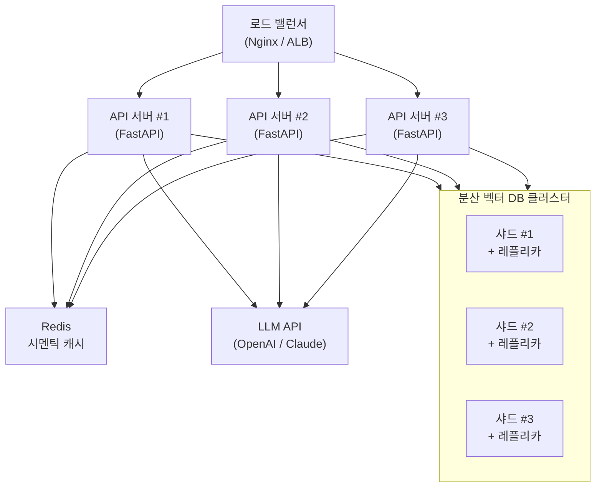
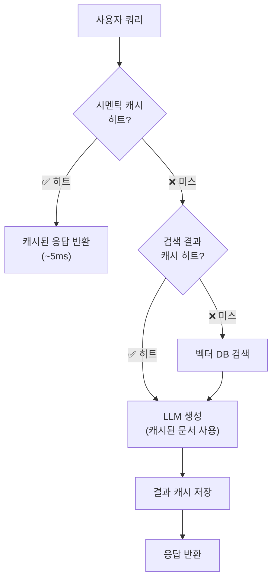
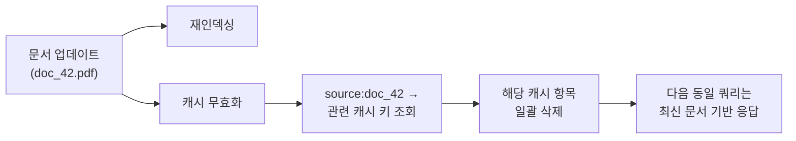
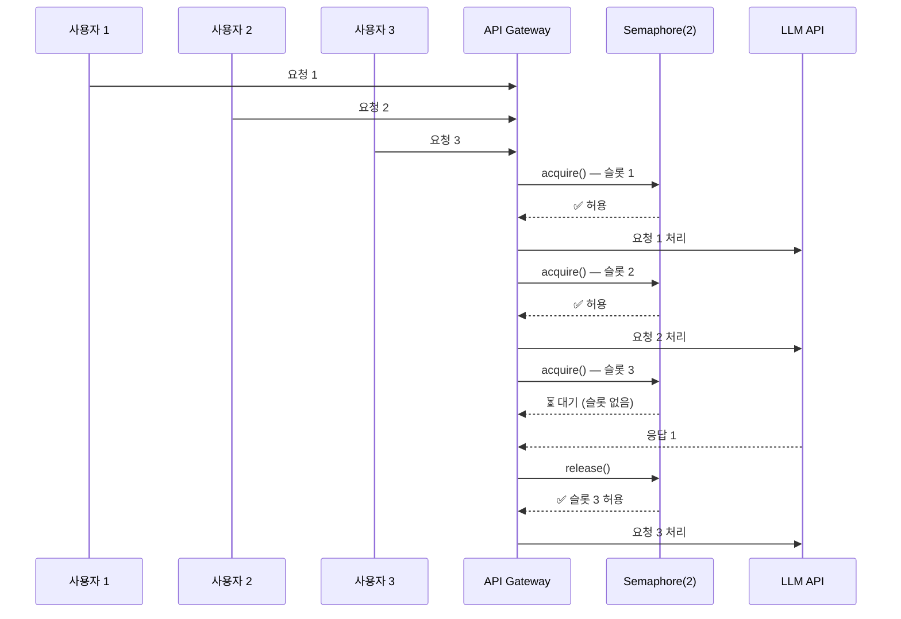
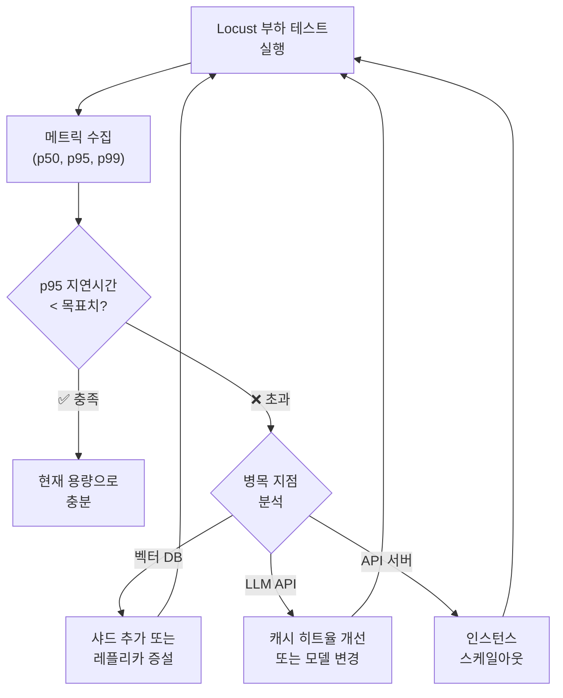

# 확장성과 성능 최적화

> 프로덕션 RAG 시스템을 수평 확장하고, 캐싱과 동시성 제어로 성능을 극대화하는 전략을 배웁니다.

## 개요

이 섹션에서는 단일 서버에서 돌아가던 RAG 시스템을 수천, 수만 명의 동시 사용자를 감당하는 프로덕션 시스템으로 확장하는 방법을 다룹니다. [Session 20.4: 모니터링, 로깅, 관찰 가능성](20-프로덕션-rag-시스템-배포-모니터링-확장/04-모니터링-로깅-관찰-가능성.md)에서 구축한 메트릭 수집 체계가 이번 섹션의 최적화 기준선이 됩니다.

**선수 지식**:
- [Session 20.1](20-프로덕션-rag-시스템-배포-모니터링-확장/01-fastapi로-rag-api-서빙.md)에서 배운 FastAPI 비동기 엔드포인트와 `StreamingResponse`
- [Session 20.2](20-프로덕션-rag-시스템-배포-모니터링-확장/02-인덱스-관리와-데이터-파이프라인.md)의 인덱스 관리 및 데이터 파이프라인 구조
- [Session 20.4](20-프로덕션-rag-시스템-배포-모니터링-확장/04-모니터링-로깅-관찰-가능성.md)의 Prometheus 메트릭과 관찰 가능성 체계
- [Session 18.4](18-rag-최적화와-디버깅-성능-개선-전략/04-지연시간과-비용-최적화.md)에서 배운 시멘틱 캐시의 원리와 `RedisSemanticCache` 기본 구현
- Python `asyncio` 기본 개념 (async/await, 이벤트 루프)

**학습 목표**:
- 벡터 DB 샤딩과 API 서버 스케일아웃으로 수평 확장을 설계할 수 있다
- [Session 18.4](18-rag-최적화와-디버깅-성능-개선-전략/04-지연시간과-비용-최적화.md)에서 배운 시멘틱 캐시를 프로덕션 환경에 맞게 확장할 수 있다 — 분산 캐시 무효화, TTL 전략, 캐시 히트율 모니터링
- `asyncio.Semaphore`와 큐잉을 활용해 동시 요청을 안전하게 처리할 수 있다
- Locust로 로드 테스트를 수행하고 용량 계획을 세울 수 있다

## 왜 알아야 할까?

개발 환경에서 잘 돌아가는 RAG 프로토타입이 프로덕션에 올라가면 전혀 다른 문제를 만납니다. 사용자 한 명이 질문할 때는 2초면 충분하던 응답이, 100명이 동시에 물어보면 30초가 걸리거든요. 더 심각한 건 비용입니다 — LLM API 호출 한 번에 수십 원씩 나가는데, 하루 10만 건 요청이 들어오면 월 비용이 수천만 원을 넘어설 수 있죠.

실제로 많은 기업이 RAG 시스템을 프로토타입에서 프로덕션으로 전환할 때, **비용이 선형적으로 증가하는 문제**에 부딪힙니다. [Session 18.4](18-rag-최적화와-디버깅-성능-개선-전략/04-지연시간과-비용-최적화.md)에서 배운 시멘틱 캐시만 제대로 적용해도 LLM 비용을 최대 68.8%까지 줄일 수 있다는 프로덕션 사례가 보고되어 있거든요(Redis, [*RAG at Scale*](https://redis.io/blog/rag-at-scale/) 사례 기반). 하지만 단일 서버의 인메모리 캐시로는 프로덕션 환경에서 한계가 있습니다 — 서버가 여러 대로 늘어나면 캐시 일관성은 어떻게 유지하죠? 데이터가 업데이트되면 캐시는 언제 무효화해야 할까요? 이번 섹션에서는 이러한 **프로덕션 규모의 확장성과 최적화 전략**을 집중적으로 다룹니다.

## 핵심 개념

### 개념 1: 수평 확장 전략 — 벡터 DB 샤딩과 API 서버 스케일아웃

> 💡 **비유**: 도서관 하나에 책이 100만 권이 되면 어떻게 될까요? 한 사서가 모든 요청을 처리하면 줄이 끝없이 길어집니다. 해결책은 간단합니다 — 도서관을 여러 개 만들고(샤딩), 사서도 여러 명 고용하는(스케일아웃) 거죠. 각 도서관은 분야별로 책을 나눠 보관하고, 안내 데스크(로드 밸런서)에서 "과학 관련 질문은 2번 도서관으로" 식으로 안내합니다.

수평 확장(Horizontal Scaling)은 단일 서버의 성능을 올리는 수직 확장과 달리, **서버의 수를 늘려** 부하를 분산하는 전략입니다. RAG 시스템에서는 두 가지 축으로 확장합니다.

**1) 벡터 DB 샤딩**: 수백만~수억 개의 벡터를 하나의 노드에 저장하면 검색 속도가 급격히 떨어집니다. 데이터를 여러 노드에 분산 저장(샤딩)하고, 각 노드에 복제본(레플리카)을 두어 가용성을 확보합니다.

**2) API 서버 스케일아웃**: FastAPI 서버를 여러 인스턴스로 실행하고, 로드 밸런서가 요청을 분배합니다. 각 인스턴스는 독립적이어서 무상태(stateless) 설계가 핵심이죠.

> 📊 **그림 1**: 수평 확장 아키텍처 — 로드 밸런서 + API 서버 풀 + 분산 벡터 DB



Qdrant를 예로 들면, 분산 클러스터를 구성하고 컬렉션을 생성할 때 샤드 수와 레플리카 수를 지정할 수 있습니다.

```python
from qdrant_client import QdrantClient
from qdrant_client.models import (
    Distance,
    VectorParams,
    ShardingMethod,
)

# 분산 Qdrant 클러스터에 연결
client = QdrantClient(
    url="http://qdrant-node-1:6333",
    prefer_grpc=True,  # gRPC로 통신하면 REST보다 빠름
)

# 샤딩 + 레플리카 설정이 포함된 컬렉션 생성
client.create_collection(
    collection_name="rag_documents",
    vectors_config=VectorParams(
        size=1536,           # OpenAI text-embedding-3-small 차원
        distance=Distance.COSINE,
    ),
    shard_number=6,          # 데이터를 6개 샤드에 분산
    replication_factor=2,    # 각 샤드를 2개 노드에 복제
    sharding_method=ShardingMethod.AUTO,  # 자동 분산
)
```

> 🔥 **실무 팁**: Qdrant 클러스터를 프로덕션에서 운영할 때는 **최소 3개 노드**에 **레플리카 2개** 이상을 권장합니다. 이렇게 하면 노드 하나가 다운되어도 모든 데이터에 접근할 수 있거든요. Raft 기반 합의 프로토콜이 노드 간 일관성을 보장합니다.

### 개념 2: 프로덕션 캐시 운영 — 분산 무효화, TTL 전략, 히트율 모니터링

> 💡 **비유**: [Session 18.4](18-rag-최적화와-디버깅-성능-개선-전략/04-지연시간과-비용-최적화.md)에서 우리는 "자주 주문되는 메뉴를 미리 만들어 놓는 카페 바리스타" 비유로 시멘틱 캐시의 원리를 배웠죠. 이제 이 카페가 전국 100개 매장으로 확장된다고 상상해보세요. 본사에서 레시피를 바꾸면 100개 매장 모두에 알려야 하고(분산 캐시 무효화), "아이스 아메리카노는 만들어 놓고 2시간 지나면 버려야" 하는 규칙도 필요하고(TTL 전략), 어떤 매장에서 미리 만들어 둔 메뉴가 실제로 얼마나 팔리는지도 추적해야(히트율 모니터링) 합니다.

[Session 18.4](18-rag-최적화와-디버깅-성능-개선-전략/04-지연시간과-비용-최적화.md)에서 시멘틱 캐시의 핵심 원리 — 쿼리를 벡터로 변환하고 코사인 유사도로 캐시 히트를 판단하는 `RedisSemanticCache` 구현 — 를 다뤘습니다. 이번 섹션에서는 그 기반 위에, 프로덕션 환경에서 반드시 해결해야 할 세 가지 과제에 집중합니다.

RAG 시스템의 캐싱은 크게 세 단계로 나뉩니다.

| 캐시 단계 | 대상 | 효과 |
|-----------|------|------|
| **시멘틱 캐시** | LLM 응답 | 유사 질문에 대해 LLM 재호출 방지 → 비용 68%↓ |
| **검색 결과 캐시** | 벡터 검색 결과 | 동일/유사 쿼리의 벡터 검색 생략 → 지연시간 ↓ |
| **프롬프트 캐싱** | LLM 프롬프트 접두사 | 반복되는 시스템 프롬프트 캐싱 → 비용 90%↓ |

> 📊 **그림 2**: 다층 캐시 구조에서 요청 처리 흐름



#### 과제 1: 분산 캐시 무효화 (Cache Invalidation)

API 서버가 여러 대로 스케일아웃되면, 모든 인스턴스가 **동일한 Redis 캐시**를 공유해야 합니다([Session 18.4](18-rag-최적화와-디버깅-성능-개선-전략/04-지연시간과-비용-최적화.md)의 `RedisSemanticCache`가 이를 지원하죠). 하지만 진짜 어려운 문제는 "**언제 캐시를 지울 것인가**"입니다.

Phil Karlton의 유명한 말처럼, "컴퓨터 과학에서 어려운 것은 두 가지뿐이다 — 캐시 무효화와 이름 짓기." RAG 시스템에서는 특히 **원본 문서가 업데이트**되었을 때 관련 캐시를 정확히 무효화해야 합니다. 오래된 문서 기반의 캐시 응답이 반환되면 사용자 신뢰가 무너지거든요.

```python
import json
import time

import redis.asyncio as redis


class ProductionCacheManager:
    """프로덕션 캐시 관리자 — 무효화 + TTL 전략 + 모니터링
    
    시멘틱 캐시의 원리와 기본 구현은 Session 18.4의
    RedisSemanticCache를 참조하세요. 이 클래스는 그 위에
    프로덕션 운영에 필요한 관리 기능을 추가합니다.
    """

    def __init__(self, redis_client: redis.Redis):
        self.redis = redis_client
        self.prefix = "sem_cache:"
        self.meta_prefix = "cache_meta:"
        # TTL 전략 설정 (초 단위)
        self.ttl_config = {
            "factual": 3600,      # 사실 기반 답변: 1시간
            "analytical": 1800,   # 분석/추론 답변: 30분
            "realtime": 300,      # 실시간성 높은 질문: 5분
        }

    # ── 1. 분산 캐시 무효화 ──

    async def invalidate_by_source(self, source_id: str) -> int:
        """특정 원본 문서가 업데이트되면 관련 캐시 항목 모두 삭제
        
        캐시 저장 시 source_id를 메타데이터로 함께 기록해두면,
        문서 업데이트 시 해당 문서를 참조한 캐시만 정확히 무효화 가능
        """
        # source_id → 관련 캐시 키 매핑 조회
        mapping_key = f"{self.meta_prefix}source:{source_id}"
        cache_keys = await self.redis.smembers(mapping_key)

        if not cache_keys:
            return 0

        # 관련 캐시 항목 일괄 삭제
        pipeline = self.redis.pipeline()
        for key in cache_keys:
            pipeline.delete(key)
        pipeline.delete(mapping_key)  # 매핑 자체도 삭제
        await pipeline.execute()

        return len(cache_keys)

    async def invalidate_by_collection(self, collection_name: str) -> int:
        """벡터 DB 컬렉션 전체가 재인덱싱되면 관련 캐시 모두 삭제"""
        pattern = f"{self.prefix}{collection_name}:*"
        keys = await self.redis.keys(pattern)

        if keys:
            await self.redis.delete(*keys)
        return len(keys)

    async def register_cache_source(
        self, cache_key: str, source_ids: list[str]
    ) -> None:
        """캐시 항목과 원본 문서의 매핑 등록 — 캐시 저장 시 호출"""
        pipeline = self.redis.pipeline()
        for source_id in source_ids:
            mapping_key = f"{self.meta_prefix}source:{source_id}"
            pipeline.sadd(mapping_key, cache_key)
            pipeline.expire(mapping_key, max(self.ttl_config.values()))
        await pipeline.execute()

    # ── 2. 적응형 TTL 전략 ──

    def compute_ttl(self, query: str, response_metadata: dict) -> int:
        """쿼리 특성에 따라 TTL을 동적으로 결정
        
        - 시간 표현이 포함된 쿼리 → 짧은 TTL
        - 분석/비교 쿼리 → 중간 TTL
        - 사실/정의 기반 쿼리 → 긴 TTL
        """
        query_lower = query.lower()

        # 실시간성이 높은 쿼리 패턴
        realtime_keywords = ["최신", "오늘", "현재", "지금", "최근", "업데이트"]
        if any(kw in query_lower for kw in realtime_keywords):
            return self.ttl_config["realtime"]

        # 분석/추론 쿼리 패턴
        analytical_keywords = ["비교", "차이", "장단점", "분석", "추천", "어떤 것이"]
        if any(kw in query_lower for kw in analytical_keywords):
            return self.ttl_config["analytical"]

        # 기본값: 사실 기반 질문
        return self.ttl_config["factual"]

    # ── 3. 캐시 히트율 모니터링 ──

    async def record_hit(self, cache_key: str) -> None:
        """캐시 히트 이벤트 기록 — Prometheus 메트릭 연동용"""
        now = int(time.time())
        pipeline = self.redis.pipeline()
        # 시간대별 히트 카운터 (1시간 단위 버킷)
        hour_bucket = f"cache_stats:hits:{now // 3600}"
        pipeline.incr(hour_bucket)
        pipeline.expire(hour_bucket, 86400 * 7)  # 7일간 보존
        # 개별 키 히트 카운터 (인기 쿼리 분석용)
        pipeline.hincrby(f"{self.meta_prefix}hits", cache_key, 1)
        await pipeline.execute()

    async def record_miss(self) -> None:
        """캐시 미스 이벤트 기록"""
        now = int(time.time())
        hour_bucket = f"cache_stats:misses:{now // 3600}"
        pipeline = self.redis.pipeline()
        pipeline.incr(hour_bucket)
        pipeline.expire(hour_bucket, 86400 * 7)
        await pipeline.execute()

    async def get_hit_rate(self, hours: int = 1) -> dict:
        """최근 N시간의 캐시 히트율 계산"""
        now = int(time.time())
        total_hits, total_misses = 0, 0

        pipeline = self.redis.pipeline()
        for h in range(hours):
            bucket = (now // 3600) - h
            pipeline.get(f"cache_stats:hits:{bucket}")
            pipeline.get(f"cache_stats:misses:{bucket}")
        results = await pipeline.execute()

        for i in range(0, len(results), 2):
            total_hits += int(results[i] or 0)
            total_misses += int(results[i + 1] or 0)

        total = total_hits + total_misses
        hit_rate = (total_hits / total * 100) if total > 0 else 0.0

        return {
            "period_hours": hours,
            "total_requests": total,
            "hits": total_hits,
            "misses": total_misses,
            "hit_rate_pct": round(hit_rate, 1),
        }

    async def get_top_cached_queries(self, top_n: int = 10) -> list[dict]:
        """가장 많이 히트된 캐시 항목 조회 — 어떤 쿼리가 반복되는지 분석"""
        hits_data = await self.redis.hgetall(f"{self.meta_prefix}hits")
        sorted_keys = sorted(hits_data.items(), key=lambda x: int(x[1]), reverse=True)

        results = []
        for key, count in sorted_keys[:top_n]:
            cached = await self.redis.get(key)
            if cached:
                data = json.loads(cached)
                results.append({
                    "query": data.get("query", "unknown"),
                    "hit_count": int(count),
                })
        return results
```

> 📊 **그림 2b**: 캐시 무효화 흐름 — 문서 업데이트 시 관련 캐시 정밀 삭제



> ⚠️ **흔한 오해**: "시멘틱 캐시를 쓰면 항상 정확한 답을 준다"고 생각하기 쉽지만, 임계값이 너무 낮으면(예: 0.85) **다른 의도의 질문**에 엉뚱한 캐시 응답을 반환할 수 있습니다. "LangChain의 체인이란?"과 "LangChain의 에이전트란?"은 유사도가 높지만 전혀 다른 질문이거든요. 프로덕션에서는 0.95 이상부터 시작하세요. 시멘틱 캐시의 유사도 매칭 원리에 대해서는 [Session 18.4](18-rag-최적화와-디버깅-성능-개선-전략/04-지연시간과-비용-최적화.md)에서 자세히 다루고 있습니다.

### 개념 3: 동시 요청 처리와 큐잉

> 💡 **비유**: 놀이공원 인기 놀이기구를 생각해보세요. 한 번에 탈 수 있는 사람(동시 처리 수)은 제한되어 있고, 나머지는 줄을 서야 합니다(큐잉). 줄이 너무 길어지면 "현재 대기 시간 30분"이라고 안내하거나, 아예 입장을 제한하죠(백프레셔). RAG 시스템의 동시성 제어도 정확히 같은 원리입니다.

LLM API는 보통 분당 요청 수(RPM)와 분당 토큰 수(TPM)에 제한이 있습니다. 100명이 동시에 요청하면 API 레이트 리밋에 걸리거나, 서버 메모리가 폭발할 수 있어요. `asyncio.Semaphore`로 동시 실행 수를 제한하고, 초과 요청은 큐에서 대기시키는 게 핵심입니다.

> 📊 **그림 3**: 동시성 제어 흐름 — Semaphore + Queue 패턴



```python
import asyncio
from contextlib import asynccontextmanager
from dataclasses import dataclass


@dataclass
class ConcurrencyConfig:
    """동시성 제어 설정"""
    max_llm_concurrent: int = 5      # LLM 동시 호출 최대 수
    max_embedding_concurrent: int = 10  # 임베딩 동시 호출 최대 수
    max_queue_size: int = 100        # 대기열 최대 크기
    request_timeout: float = 30.0    # 요청 타임아웃 (초)


class ConcurrencyManager:
    """Semaphore 기반 동시성 관리자"""

    def __init__(self, config: ConcurrencyConfig):
        self.config = config
        # LLM API 호출 제한용 세마포어
        self._llm_sem = asyncio.Semaphore(config.max_llm_concurrent)
        # 임베딩 API 호출 제한용 세마포어
        self._embed_sem = asyncio.Semaphore(config.max_embedding_concurrent)
        # 대기열 크기 제한
        self._queue_sem = asyncio.Semaphore(config.max_queue_size)
        # 현재 상태 추적
        self._active_llm = 0
        self._active_embed = 0
        self._queued = 0
        self._lock = asyncio.Lock()

    @asynccontextmanager
    async def llm_slot(self):
        """LLM API 호출 슬롯 획득 — 초과 시 대기"""
        if not self._queue_sem._value:  # 대기열도 가득 찬 경우
            raise RuntimeError("서버 과부하: 잠시 후 다시 시도해주세요")

        async with self._queue_sem:
            async with self._lock:
                self._queued += 1

            try:
                async with asyncio.timeout(self.config.request_timeout):
                    async with self._llm_sem:
                        async with self._lock:
                            self._queued -= 1
                            self._active_llm += 1
                        try:
                            yield
                        finally:
                            async with self._lock:
                                self._active_llm -= 1
            except asyncio.TimeoutError:
                async with self._lock:
                    self._queued -= 1
                raise

    @asynccontextmanager
    async def embedding_slot(self):
        """임베딩 API 호출 슬롯 획득"""
        async with self._embed_sem:
            async with self._lock:
                self._active_embed += 1
            try:
                yield
            finally:
                async with self._lock:
                    self._active_embed -= 1

    async def get_status(self) -> dict:
        """현재 동시성 상태 조회"""
        async with self._lock:
            return {
                "active_llm_calls": self._active_llm,
                "max_llm_calls": self.config.max_llm_concurrent,
                "active_embed_calls": self._active_embed,
                "queued_requests": self._queued,
            }
```

### 개념 4: 로드 테스팅과 용량 계획

> 💡 **비유**: 새 다리를 건설하면 개통 전에 반드시 하중 테스트를 합니다. 트럭 수십 대를 동시에 올려보고 다리가 버티는지 확인하죠. RAG 시스템도 마찬가지입니다 — 실제 사용자가 몰리기 전에 가상의 부하를 걸어서 "이 시스템이 동시 몇 명까지 버티는가"를 측정해야 합니다.

Locust는 Python으로 작성된 오픈소스 부하 테스트 프레임워크로, RAG API를 실제 사용 패턴에 맞게 테스트할 수 있습니다. 단순히 "초당 요청 몇 건"만 보는 게 아니라, **RAG 특유의 메트릭**도 함께 추적해야 합니다.

```python
"""
locustfile.py — RAG API 부하 테스트
실행: locust -f locustfile.py --host=http://localhost:8000
"""
import random

from locust import HttpUser, between, task

# 다양한 난이도의 테스트 쿼리 — 실제 사용 패턴을 반영
QUERIES = [
    # 캐시 히트가 기대되는 반복 쿼리
    "RAG란 무엇인가요?",
    "RAG란 무엇인가요?",
    "벡터 데이터베이스의 원리를 설명해주세요",
    # 유사하지만 다른 쿼리 (시멘틱 캐시 경계 테스트)
    "RAG의 개념을 알려주세요",
    "벡터 DB는 어떻게 동작하나요?",
    # 복잡한 쿼리 (긴 응답 예상)
    "LangChain과 LlamaIndex의 RAG 구현 방식 차이를 비교해주세요",
    "하이브리드 검색에서 BM25와 벡터 검색의 가중치를 어떻게 조절하나요?",
    # 이전에 없던 새로운 쿼리 (캐시 미스 예상)
    "RAPTOR 인덱싱과 일반 청킹의 차이점은?",
]


class RAGUser(HttpUser):
    """RAG API를 사용하는 가상 사용자"""
    wait_time = between(1, 5)  # 요청 간 1~5초 대기 (실제 사용 패턴)

    @task(7)
    def query_rag(self):
        """일반 RAG 쿼리 — 전체 트래픽의 70%"""
        query = random.choice(QUERIES)
        with self.client.post(
            "/api/v1/query",
            json={"query": query, "top_k": 5},
            catch_response=True,
            name="/api/v1/query",
        ) as resp:
            if resp.status_code == 200:
                data = resp.json()
                # 응답 품질 검증: 소스가 포함되어 있는지
                if not data.get("sources"):
                    resp.failure("응답에 소스 문서가 없음")
            elif resp.status_code == 429:
                resp.failure("레이트 리밋 초과")
            elif resp.status_code == 503:
                resp.failure("서버 과부하")

    @task(2)
    def query_streaming(self):
        """스트리밍 쿼리 — 전체 트래픽의 20%"""
        query = random.choice(QUERIES)
        with self.client.post(
            "/api/v1/query/stream",
            json={"query": query, "top_k": 3},
            stream=True,
            catch_response=True,
            name="/api/v1/query/stream",
        ) as resp:
            if resp.status_code == 200:
                # 스트리밍 응답의 첫 청크 도착 시간 확인
                chunks = list(resp.iter_lines())
                if len(chunks) < 2:
                    resp.failure("스트리밍 청크가 너무 적음")
            else:
                resp.failure(f"스트리밍 실패: {resp.status_code}")

    @task(1)
    def health_check(self):
        """헬스 체크 — 전체 트래픽의 10%"""
        self.client.get("/health", name="/health")
```

> 📊 **그림 4**: 용량 계획 — 부하 테스트 결과에 따른 확장 의사결정 흐름



용량 계획의 핵심은 **목표 지연시간(SLA)**을 먼저 정하고, 그 기준을 만족하는 인프라 구성을 찾는 것입니다. 일반적인 RAG 시스템의 SLA 예시를 보면:

| 메트릭 | 목표 | 측정 방법 |
|--------|------|-----------|
| p50 응답시간 | < 2초 | Locust 통계 |
| p95 응답시간 | < 5초 | Locust 통계 |
| p99 응답시간 | < 10초 | Locust 통계 |
| 동시 사용자 | 500명 | Locust Users 설정 |
| 캐시 히트율 | > 30% | Prometheus 메트릭 |
| 에러율 | < 1% | Prometheus 메트릭 |

## 실습: 직접 해보기

이제 앞서 배운 개념들을 하나로 묶어, **캐시 모니터링과 동시성 제어가 통합된 RAG 서비스**를 구현해봅시다. [Session 20.1](20-프로덕션-rag-시스템-배포-모니터링-확장/01-fastapi로-rag-api-서빙.md)에서 만든 FastAPI 기반 RAG 서비스를 확장합니다.

여기서는 개발/테스트 편의를 위해 간단한 인메모리 캐시를 사용합니다. 프로덕션 환경에서는 [Session 18.4](18-rag-최적화와-디버깅-성능-개선-전략/04-지연시간과-비용-최적화.md)에서 구현한 `RedisSemanticCache`로 교체하고, 위 개념 2의 `ProductionCacheManager`를 결합하면 — 분산 캐시 무효화, 적응형 TTL, 히트율 모니터링까지 갖춘 완전한 프로덕션 캐시 시스템이 됩니다.

```python
"""
optimized_rag_service.py
캐싱, 동시성 제어, 메트릭이 통합된 프로덕션 RAG 서비스
"""
import asyncio
import hashlib
import time
from contextlib import asynccontextmanager
from dataclasses import dataclass

import numpy as np
from fastapi import FastAPI, HTTPException
from pydantic import BaseModel


# ──────────────────────────────────────
# 설정 모델
# ──────────────────────────────────────
@dataclass
class ServiceConfig:
    cache_ttl: int = 3600
    similarity_threshold: float = 0.95
    max_llm_concurrent: int = 5
    max_embed_concurrent: int = 10
    max_queue_size: int = 100
    request_timeout: float = 30.0


# ──────────────────────────────────────
# 요청/응답 스키마
# ──────────────────────────────────────
class QueryRequest(BaseModel):
    query: str
    top_k: int = 5
    use_cache: bool = True  # 캐시 사용 여부 (디버깅 시 끌 수 있음)


class SourceDocument(BaseModel):
    content: str
    metadata: dict


class QueryResponse(BaseModel):
    answer: str
    sources: list[SourceDocument]
    cached: bool = False           # 캐시에서 가져왔는지 여부
    latency_ms: float = 0.0        # 총 처리 시간


# ──────────────────────────────────────
# 인메모리 시멘틱 캐시 — 개발/테스트용
# ──────────────────────────────────────
class InMemorySemanticCache:
    """딕셔너리 기반 인메모리 시멘틱 캐시 — 개발/테스트용
    프로덕션에서는 Session 18.4의 RedisSemanticCache +
    ProductionCacheManager 조합을 사용하세요.
    """

    def __init__(self, embed_fn, config: ServiceConfig):
        self.embed = embed_fn
        self.threshold = config.similarity_threshold
        self._store: dict[str, dict] = {}  # 메모리 내 캐시 저장소

    async def lookup(self, query: str) -> dict | None:
        """의미적으로 유사한 캐시 검색"""
        query_vec = await self.embed(query)
        query_np = np.array(query_vec, dtype=np.float32)

        best_match = None
        best_score = 0.0

        for data in self._store.values():
            cached_vec = np.array(data["embedding"], dtype=np.float32)

            # 코사인 유사도 계산
            score = float(
                np.dot(query_np, cached_vec)
                / (np.linalg.norm(query_np) * np.linalg.norm(cached_vec) + 1e-10)
            )
            if score > self.threshold and score > best_score:
                best_score = score
                best_match = data

        return best_match

    async def store(self, query: str, answer: str, sources: list[dict]) -> None:
        """응답을 캐시에 저장"""
        embedding = await self.embed(query)
        key = hashlib.sha256(query.encode()).hexdigest()[:16]
        self._store[key] = {
            "query": query,
            "embedding": embedding,
            "answer": answer,
            "sources": sources,
        }


# ──────────────────────────────────────
# 동시성 관리자 + 캐시 히트율 추적
# ──────────────────────────────────────
class RequestManager:
    """세마포어 기반 동시성 + 캐시 히트율 모니터링"""

    def __init__(self, config: ServiceConfig):
        self._llm_sem = asyncio.Semaphore(config.max_llm_concurrent)
        self._embed_sem = asyncio.Semaphore(config.max_embed_concurrent)
        self._timeout = config.request_timeout
        # 메트릭 카운터
        self.total_requests = 0
        self.cache_hits = 0
        self.cache_misses = 0
        self.errors = 0
        self._lock = asyncio.Lock()

    @asynccontextmanager
    async def llm_call(self):
        """LLM 호출 슬롯을 획득한 후 실행"""
        async with asyncio.timeout(self._timeout):
            async with self._llm_sem:
                yield

    @asynccontextmanager
    async def embed_call(self):
        """임베딩 호출 슬롯 획득"""
        async with self._embed_sem:
            yield

    async def record_request(self, cached: bool) -> None:
        async with self._lock:
            self.total_requests += 1
            if cached:
                self.cache_hits += 1
            else:
                self.cache_misses += 1

    async def get_stats(self) -> dict:
        async with self._lock:
            hit_rate = (
                self.cache_hits / self.total_requests * 100
                if self.total_requests > 0
                else 0
            )
            return {
                "total_requests": self.total_requests,
                "cache_hits": self.cache_hits,
                "cache_misses": self.cache_misses,
                "cache_hit_rate": f"{hit_rate:.1f}%",
                "errors": self.errors,
            }


# ──────────────────────────────────────
# 모의(Mock) RAG 컴포넌트 — 실습용
# ──────────────────────────────────────
async def mock_embed(text: str) -> list[float]:
    """실습용 모의 임베딩 함수"""
    await asyncio.sleep(0.05)  # API 호출 시뮬레이션
    np.random.seed(hash(text) % 2**32)
    return np.random.randn(256).tolist()


async def mock_retrieve(query_vec: list[float], top_k: int) -> list[dict]:
    """실습용 모의 벡터 검색"""
    await asyncio.sleep(0.1)
    return [
        {"content": f"검색된 문서 {i+1}: {query_vec[0]:.2f}에 관련된 내용...", "metadata": {"source": f"doc_{i}.pdf"}}
        for i in range(top_k)
    ]


async def mock_generate(query: str, context: list[dict]) -> str:
    """실습용 모의 LLM 생성"""
    await asyncio.sleep(0.5)  # LLM 호출 시뮬레이션
    return f"'{query}'에 대한 답변: {len(context)}개의 문서를 참고하여 생성된 응답입니다."


# ──────────────────────────────────────
# FastAPI 앱
# ──────────────────────────────────────
config = ServiceConfig()
manager = RequestManager(config)


@asynccontextmanager
async def lifespan(app: FastAPI):
    """서버 시작/종료 시 리소스 관리"""
    # 시작: 인메모리 캐시 초기화
    # 프로덕션에서는 Session 18.4의 RedisSemanticCache로 교체
    app.state.cache = InMemorySemanticCache(mock_embed, config)
    app.state.manager = manager
    print("✅ RAG 서비스 시작 — 캐시 및 동시성 관리자 초기화 완료")
    yield
    print("🛑 RAG 서비스 종료")


app = FastAPI(title="Optimized RAG API", lifespan=lifespan)


@app.post("/api/v1/query", response_model=QueryResponse)
async def query_rag(request: QueryRequest):
    """최적화된 RAG 쿼리 엔드포인트"""
    start = time.time()
    cache = app.state.cache
    mgr = app.state.manager

    # 1단계: 시멘틱 캐시 조회
    if request.use_cache:
        cached = await cache.lookup(request.query)
        if cached:
            await mgr.record_request(cached=True)
            return QueryResponse(
                answer=cached["answer"],
                sources=[SourceDocument(**s) for s in cached["sources"]],
                cached=True,
                latency_ms=(time.time() - start) * 1000,
            )

    # 2단계: 임베딩 생성 (동시성 제한 적용)
    async with mgr.embed_call():
        query_vec = await mock_embed(request.query)

    # 3단계: 벡터 검색
    docs = await mock_retrieve(query_vec, request.top_k)

    # 4단계: LLM 생성 (동시성 제한 적용)
    async with mgr.llm_call():
        answer = await mock_generate(request.query, docs)

    # 5단계: 결과 캐싱
    await cache.store(request.query, answer, docs)
    await mgr.record_request(cached=False)

    return QueryResponse(
        answer=answer,
        sources=[SourceDocument(**d) for d in docs],
        cached=False,
        latency_ms=(time.time() - start) * 1000,
    )


@app.get("/stats")
async def get_stats():
    """서비스 통계 — 캐시 히트율, 요청 수 등"""
    return await app.state.manager.get_stats()


@app.get("/health")
async def health():
    return {"status": "healthy"}
```

이 서비스를 실행하고 테스트해봅시다.

```run:python
# 서비스 통계 시뮬레이션 — 캐시 효과 시연
import asyncio

async def simulate_traffic():
    """10건의 요청 중 캐시 히트/미스 비율 시뮬레이션"""
    queries = [
        "RAG란 무엇인가요?",
        "벡터 DB의 원리는?",
        "RAG란 무엇인가요?",          # 동일 쿼리 → 캐시 히트
        "RAG의 정의를 알려주세요",      # 유사 쿼리 → 시멘틱 캐시 히트 가능
        "임베딩 모델이란?",
        "벡터 DB의 원리는?",          # 동일 쿼리 → 캐시 히트
        "RAG란 무엇인가요?",          # 동일 쿼리 → 캐시 히트
        "청킹 전략은?",
        "임베딩 모델이란?",            # 동일 쿼리 → 캐시 히트
        "리랭킹이란?",
    ]

    cache = {}       # 간단한 정확 매칭 캐시 시뮬레이션
    hits, misses = 0, 0

    for q in queries:
        if q in cache:
            hits += 1
            latency = 5   # 캐시 히트: 5ms
        else:
            misses += 1
            cache[q] = f"'{q}'에 대한 답변"
            latency = 650  # 캐시 미스: 650ms (임베딩+검색+LLM)

        print(f"  {'✅ HIT' if q in cache and hits > 0 and q in list(cache.keys())[:-1] else '❌ MISS':>8} | {latency:>5}ms | {q}")

    total = hits + misses
    print(f"\n📊 결과: {total}건 중 캐시 히트 {hits}건 ({hits/total*100:.0f}%)")
    print(f"💰 LLM 호출 절감: {hits}건 × $0.01 = ${hits*0.01:.2f} 절약")

asyncio.run(simulate_traffic())
```

```output
     ❌ MISS |   650ms | RAG란 무엇인가요?
     ❌ MISS |   650ms | 벡터 DB의 원리는?
     ✅ HIT  |     5ms | RAG란 무엇인가요?
     ❌ MISS |   650ms | RAG의 정의를 알려주세요
     ❌ MISS |   650ms | 임베딩 모델이란?
     ✅ HIT  |     5ms | 벡터 DB의 원리는?
     ✅ HIT  |     5ms | RAG란 무엇인가요?
     ❌ MISS |   650ms | 청킹 전략은?
     ✅ HIT  |     5ms | 임베딩 모델이란?
     ❌ MISS |   650ms | 리랭킹이란?

📊 결과: 10건 중 캐시 히트 4건 (40%)
💰 LLM 호출 절감: 4건 × $0.01 = $0.04 절약
```

위 시뮬레이션은 정확 매칭만 사용했는데, [Session 18.4](18-rag-최적화와-디버깅-성능-개선-전략/04-지연시간과-비용-최적화.md)에서 배운 시멘틱 캐시를 적용하면 "RAG의 정의를 알려주세요"도 히트가 되어 히트율이 더 올라갑니다. 프로덕션에서 시멘틱 캐시의 히트율은 보통 **30~80%** 범위에 들어옵니다.

## 더 깊이 알아보기

### 프롬프트 캐싱 — API 비용을 90%까지 줄이는 비밀

시멘틱 캐시가 "동일한 질문"에 대한 캐싱이라면, **프롬프트 캐싱(Prompt Caching)**은 LLM API 제공자 측에서 제공하는 또 다른 최적화 기법입니다. Anthropic의 Claude API는 동일한 프롬프트 접두사(시스템 프롬프트, 지시문 등)를 서버 측에서 캐싱하여, 반복 호출 시 입력 토큰 비용을 **90%까지** 절감합니다.

RAG 시스템에서는 시스템 프롬프트와 지시문이 매 요청마다 반복되므로, 프롬프트 캐싱의 효과가 극대화됩니다. 핵심은 **정적 콘텐츠(시스템 프롬프트)를 앞에, 동적 콘텐츠(검색 결과)를 뒤에** 배치하는 것입니다. Anthropic의 프롬프트 캐싱은 캐시 기록 시 25% 추가 비용이 들지만, 캐시 읽기는 기본 가격의 10%에 불과합니다. 캐시 유효 시간은 기본 5분이며, 사용할 때마다 갱신됩니다.

### C10K 문제에서 비동기까지 — 동시성 제어의 역사

동시 접속 처리 문제는 인터넷 초기부터 핵심 과제였습니다. 1999년 Dan Kegel이 제기한 **C10K 문제** — "어떻게 하면 서버 하나에서 동시 접속 1만 개를 처리할 수 있을까?" — 는 웹 서버 아키텍처의 패러다임을 바꿨어요.

초기에는 접속 하나당 프로세스 하나를 할당하는 방식(Apache prefork)이었는데, 이건 메모리 소모가 어마어마했습니다. 그래서 등장한 것이 **이벤트 루프 기반 비동기 I/O** — Node.js의 libuv, Python의 asyncio가 이 계보를 잇고 있죠. FastAPI가 사용하는 Uvicorn은 내부적으로 **uvloop**(libuv의 Python 바인딩)을 사용해 표준 asyncio보다 2~4배 빠른 이벤트 루프를 제공합니다. 덕분에 RAG처럼 I/O 대기(API 호출, DB 검색)가 많은 워크로드에서 단일 프로세스로도 수천 건의 동시 요청을 처리할 수 있게 된 겁니다.

### 시멘틱 캐시의 탄생 — GPTCache

시멘틱 캐시 개념을 대중화한 건 Zilliz(Milvus 개발사)가 2023년에 공개한 **GPTCache** 프로젝트입니다. 기존의 문자열 정확 매칭 캐시로는 "RAG란?" / "RAG가 뭐야?" / "RAG의 정의" 같은 동일 의도의 다른 표현을 잡아낼 수 없었거든요. GPTCache는 임베딩 벡터의 유사도 검색을 캐시 키 매칭에 도입해서, **문자열이 달라도 의미가 같으면 캐시 히트**가 되게 만들었습니다. 이 아이디어는 이후 LangChain과 LlamaIndex에 공식 통합되어 프로덕션 RAG의 표준 패턴이 되었죠. 시멘틱 캐시의 원리와 기본 구현에 대해서는 [Session 18.4](18-rag-최적화와-디버깅-성능-개선-전략/04-지연시간과-비용-최적화.md)에서 자세히 다루고 있습니다.

## 흔한 오해와 팁

> ⚠️ **흔한 오해**: "수직 확장(더 비싼 서버)이 수평 확장보다 항상 간단하고 좋다"고 생각하기 쉽습니다. 하지만 RAG 시스템의 병목은 보통 **CPU/메모리가 아니라 외부 API 호출(LLM, 임베딩)**이에요. 서버를 아무리 좋은 걸로 바꿔도 LLM API의 레이트 리밋은 변하지 않습니다. 캐싱과 요청 분산이 훨씬 효과적이죠.

> 💡 **알고 계셨나요?**: Redis의 시멘틱 캐시를 적용한 실제 프로덕션 사례에서, 전체 RAG 쿼리의 약 31%가 캐시 가능한(의미적으로 반복되는) 쿼리였고, 이를 통해 LLM 비용을 **68.8%** 절감했다는 보고가 있습니다(Redis, [*RAG at Scale*](https://redis.io/blog/rag-at-scale/) 참조). 의외로 사용자들은 비슷한 질문을 많이 하거든요.

> 🔥 **실무 팁**: 로드 테스트 시 **평균값에 속지 마세요**. RAG 시스템은 p50(중앙값)은 괜찮아 보이지만 p99(상위 1%)가 극단적으로 느릴 수 있습니다. 특히 LLM API의 응답 시간은 분포가 넓기 때문에, **p95와 p99 지연시간**을 반드시 확인하세요. Locust의 통계 탭에서 이 수치를 바로 볼 수 있습니다.

> 🔥 **실무 팁**: 캐시 무효화 전략 없이 시멘틱 캐시를 운영하면, 원본 문서가 업데이트되어도 **오래된 답변**이 계속 반환됩니다. 반드시 `ProductionCacheManager.invalidate_by_source()`처럼 문서 업데이트 시 관련 캐시를 정밀 삭제하는 메커니즘을 구축하세요. "전체 캐시 flush"는 최후의 수단입니다.

## 핵심 정리

| 개념 | 설명 |
|------|------|
| **수평 확장** | 서버 수를 늘려 부하 분산. 벡터 DB 샤딩 + API 서버 스케일아웃 |
| **벡터 DB 샤딩** | 데이터를 여러 노드에 분산 저장. Qdrant는 `shard_number`, `replication_factor`로 설정 |
| **프로덕션 캐시 운영** | [Session 18.4](18-rag-최적화와-디버깅-성능-개선-전략/04-지연시간과-비용-최적화.md)의 시멘틱 캐시 위에 분산 무효화, 적응형 TTL, 히트율 모니터링 추가 |
| **캐시 무효화** | 원본 문서 업데이트 시 관련 캐시만 정밀 삭제. source→cache 매핑으로 구현 |
| **적응형 TTL** | 쿼리 특성에 따라 캐시 만료 시간 동적 결정 (사실 1h, 분석 30m, 실시간 5m) |
| **프롬프트 캐싱** | LLM API 측 최적화. 반복되는 시스템 프롬프트 접두사를 캐싱하여 비용 90%↓ |
| **동시성 제어** | `asyncio.Semaphore`로 LLM/임베딩 API 동시 호출 수 제한. 백프레셔로 과부하 방지 |
| **로드 테스팅** | Locust로 실제 사용 패턴을 시뮬레이션. p95/p99 지연시간 기준으로 용량 계획 |
| **용량 계획** | SLA 목표 설정 → 부하 테스트 → 병목 분석 → 확장 → 재테스트 반복 |

## 다음 섹션 미리보기

이번 섹션에서 개별 기술의 확장 전략을 배웠다면, 다음 [Session 20.6: 종합 프로젝트 — 프로덕션 RAG 시스템 완성](20-프로덕션-rag-시스템-배포-모니터링-확장/06-종합-프로젝트-프로덕션-rag-시스템-완성.md)에서는 이 모든 것을 하나로 통합합니다. Docker Compose로 전체 스택(FastAPI + Redis 캐시 + 분산 벡터 DB + 모니터링)을 구성하고, CI/CD 파이프라인과 함께 실제 배포 가능한 프로덕션 RAG 시스템을 완성합니다.

## 참고 자료

- [Design and Develop a RAG Solution — Azure Architecture Center](https://learn.microsoft.com/en-us/azure/architecture/ai-ml/guide/rag/rag-solution-design-and-evaluation-guide) — Microsoft의 프로덕션 RAG 설계 가이드. 데이터 파이프라인, 인덱싱, 평가까지 포괄적으로 다룹니다
- [Qdrant Distributed Deployment Guide](https://qdrant.tech/documentation/guides/distributed_deployment/) — Qdrant 분산 클러스터 구성, 샤딩, 레플리카 설정의 공식 문서
- [RAG at Scale: How to Build Production AI Systems — Redis](https://redis.io/blog/rag-at-scale/) — Redis를 활용한 시멘틱 캐시, 에이전트 메모리, 실시간 RAG의 확장 전략. 68.8% LLM 비용 절감 사례 포함
- [GPTCache — Semantic Cache for LLMs (GitHub)](https://github.com/zilliztech/GPTCache) — Zilliz의 오픈소스 시멘틱 캐시 라이브러리. LangChain, LlamaIndex와 공식 통합
- [Locust — A Modern Load Testing Framework](https://locust.io/) — Python 기반 부하 테스트 도구. RAG API 성능 테스트에 적합
- [Load Testing a Python Chat App Using RAG with Locust — Microsoft](https://learn.microsoft.com/en-us/azure/developer/python/get-started-app-chat-app-load-test-locust) — RAG 챗 앱의 Locust 부하 테스트 실전 가이드
- [Prompt Caching Guide: Lower AI Costs with OpenAI, Anthropic, and Google](https://promptbuilder.cc/blog/prompt-caching-token-economics-2025) — 주요 LLM 제공자별 프롬프트 캐싱 비교 분석

---
### 🔗 Related Sessions
- [ragservice](../20-프로덕션-rag-시스템-배포-모니터링-확장/01-fastapi로-rag-api-서빙.md) (prerequisite)
- [queryrequest](../20-프로덕션-rag-시스템-배포-모니터링-확장/01-fastapi로-rag-api-서빙.md) (prerequisite)
- [queryresponse](../20-프로덕션-rag-시스템-배포-모니터링-확장/01-fastapi로-rag-api-서빙.md) (prerequisite)
- [lifespan](../20-프로덕션-rag-시스템-배포-모니터링-확장/01-fastapi로-rag-api-서빙.md) (prerequisite)
- [streamingresponse](../08-기본-rag-파이프라인-구축-langchain으로-첫-rag-앱-만들기/06-rag-앱-스트리밍과-에러-처리.md) (prerequisite)
- [ragmetrics](../20-프로덕션-rag-시스템-배포-모니터링-확장/04-모니터링-로깅-관찰-가능성.md) (prerequisite)
