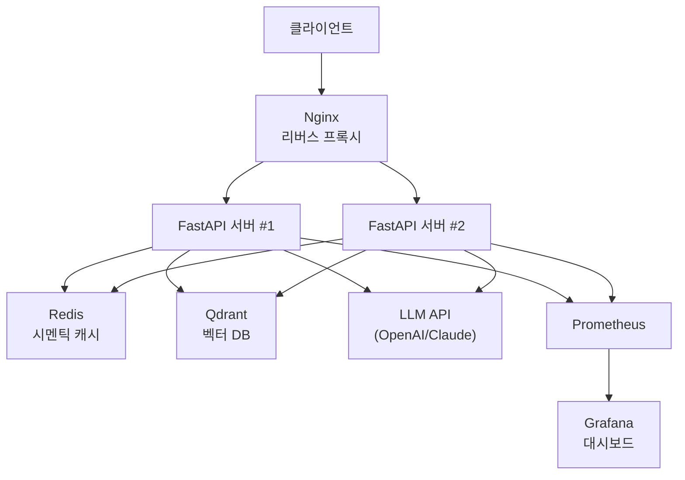
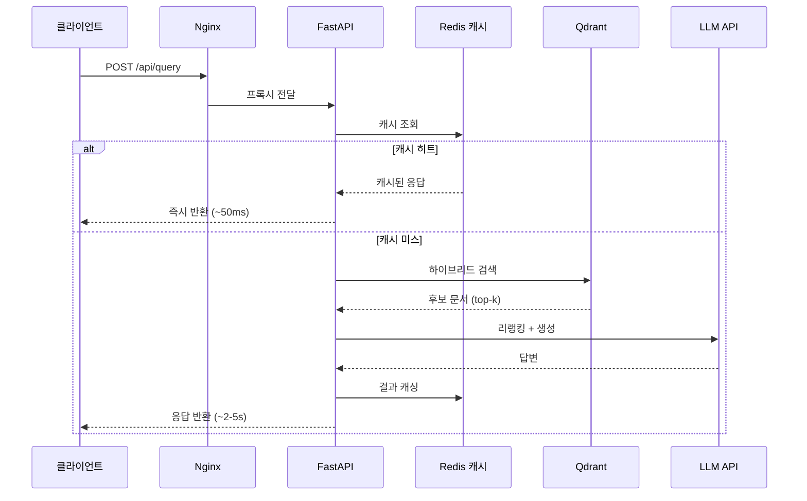
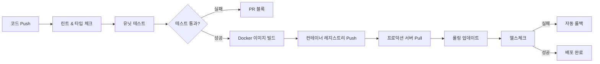
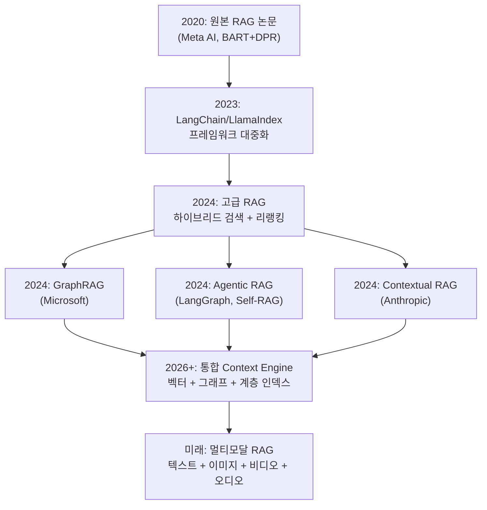

# 종합 프로젝트 — 프로덕션 RAG 시스템 완성

> RAG Essential 코스의 마지막 세션 — 전체 과정에서 배운 지식을 하나의 프로덕션급 RAG 시스템으로 통합하고, Docker Compose로 전체 스택을 배포합니다.

## 개요

이 세션은 RAG Essential 코스의 **최종 세션**입니다. Chapter 1부터 Chapter 20까지 배운 문서 로딩, 청킹, 임베딩, 벡터 검색, 하이브리드 검색, 리랭킹, 에이전틱 RAG, 평가, API 서빙, 보안, 모니터링, 확장성을 **하나의 완전한 시스템**으로 통합합니다.

**선수 지식**: Chapter 1~20의 모든 세션, 특히 [Session 20.1: FastAPI로 RAG API 서빙](20-프로덕션-rag-시스템-배포-모니터링-확장/01-fastapi로-rag-api-서빙.md), [Session 20.2: 인덱스 관리와 데이터 파이프라인](20-프로덕션-rag-시스템-배포-모니터링-확장/02-인덱스-관리와-데이터-파이프라인.md), [Session 20.3: 보안과 접근 제어](20-프로덕션-rag-시스템-배포-모니터링-확장/03-보안과-접근-제어.md), [Session 20.4: 모니터링, 로깅, 관찰 가능성](20-프로덕션-rag-시스템-배포-모니터링-확장/04-모니터링-로깅-관찰-가능성.md), [Session 20.5: 확장성과 성능 최적화](20-프로덕션-rag-시스템-배포-모니터링-확장/05-확장성과-성능-최적화.md)

**학습 목표**:
- Docker Compose로 전체 RAG 스택(FastAPI + Redis + Qdrant + Prometheus + Grafana)을 통합 배포할 수 있다
- CI/CD 파이프라인을 구성하여 자동화된 테스트와 배포를 수행할 수 있다
- 프로덕션 배포 체크리스트를 기반으로 시스템 준비 상태를 검증할 수 있다
- RAG 기술의 향후 발전 방향(GraphRAG, Agentic RAG 2.0, 멀티모달)을 이해할 수 있다

## 왜 알아야 할까?

개발 환경에서 잘 동작하는 RAG 프로토타입이 프로덕션 환경에서 실패하는 사례는 놀라울 정도로 많습니다. "제 노트북에서는 잘 되는데요?"라는 말이 실제 서비스에서는 통하지 않거든요. 프로덕션 RAG 시스템은 **단일 API 서버가 아닌 여러 서비스의 오케스트레이션**입니다 — 벡터 데이터베이스, 캐시, 모니터링, 리버스 프록시가 모두 조화롭게 동작해야 하죠.

이 세션에서는 마치 **오케스트라 지휘자**처럼 모든 컴포넌트를 하나의 `docker compose up` 명령어로 기동하고, CI/CD 파이프라인으로 안전하게 배포하며, 체크리스트로 빠짐없이 검증하는 방법을 배웁니다. 코스의 마지막 세션인 만큼, Chapter 1부터 이 마지막 Chapter 20까지 쌓아온 지식을 실전으로 연결하는 **졸업 프로젝트**이기도 합니다.

## 핵심 개념

### 개념 1: 전체 스택 아키텍처 설계

> 💡 **비유**: 레스토랑을 생각해보세요. 셰프(LLM)만 있다고 레스토랑이 운영되지 않습니다. 웨이터(API 서버), 식재료 창고(벡터 DB), 냉장고(캐시), 주문 시스템(로드 밸런서), 위생 점검관(모니터링)이 모두 한 팀으로 동작해야 합니다. Docker Compose는 이 모든 것을 **한 장의 설계도**로 관리하는 도구입니다.

프로덕션 RAG 시스템은 다음 컴포넌트로 구성됩니다:

| 컴포넌트 | 역할 | 도구 |
|----------|------|------|
| API 서버 | 클라이언트 요청 처리, 스트리밍 응답 | FastAPI + Uvicorn |
| 벡터 DB | 문서 임베딩 저장 및 유사도 검색 | Qdrant |
| 캐시 | 시멘틱 캐시, 세션 저장 | Redis |
| 모니터링 | 메트릭 수집 및 시각화 | Prometheus + Grafana |
| 리버스 프록시 | TLS 종료, 로드 밸런싱 | Nginx |

> 📊 **그림 1**: 프로덕션 RAG 전체 스택 아키텍처



이 아키텍처에서 각 서비스는 **독립된 Docker 컨테이너**로 실행됩니다. [Session 20.1](20-프로덕션-rag-시스템-배포-모니터링-확장/01-fastapi로-rag-api-서빙.md)에서 만든 FastAPI 서버, [Session 20.5](20-프로덕션-rag-시스템-배포-모니터링-확장/05-확장성과-성능-최적화.md)에서 구현한 Redis 시멘틱 캐시, [Session 20.4](20-프로덕션-rag-시스템-배포-모니터링-확장/04-모니터링-로깅-관찰-가능성.md)에서 설정한 Prometheus 메트릭이 모두 여기 모이는 거죠.

### 개념 2: Docker Compose로 전체 스택 정의

> 💡 **비유**: Docker Compose 파일은 **건축 설계 도면**과 같습니다. 각 방(서비스)의 크기, 위치, 연결 통로(네트워크), 창고(볼륨)를 한 장에 정의하면, 시공사(Docker)가 도면대로 건물 전체를 올려줍니다.

프로젝트 디렉토리 구조부터 살펴보겠습니다:

```
rag-production/
├── docker-compose.yml          # 전체 스택 정의
├── docker-compose.override.yml # 개발 환경 오버라이드
├── .env.example                # 환경 변수 템플릿
├── src/
│   ├── api/
│   │   ├── main.py             # FastAPI 앱 엔트리포인트
│   │   ├── routes/
│   │   │   ├── query.py        # RAG 쿼리 엔드포인트
│   │   │   └── health.py       # 헬스체크
│   │   ├── services/
│   │   │   ├── rag_service.py  # RAG 파이프라인 코어
│   │   │   ├── cache.py        # 시멘틱 캐시
│   │   │   └── security.py     # 인증/인가
│   │   └── models/
│   │       └── schemas.py      # Pydantic 스키마
│   ├── indexing/
│   │   ├── pipeline.py         # 인덱싱 파이프라인
│   │   └── scheduler.py        # 스케줄러
│   └── monitoring/
│       └── metrics.py          # Prometheus 메트릭
├── config/
│   ├── nginx/nginx.conf        # Nginx 설정
│   ├── prometheus/prometheus.yml
│   └── grafana/dashboards/
├── tests/
│   ├── test_api.py
│   ├── test_retrieval.py
│   └── test_integration.py
├── Dockerfile
├── Dockerfile.indexer
└── .github/
    └── workflows/
        └── deploy.yml          # CI/CD 파이프라인
```

핵심 Docker Compose 파일입니다:

```yaml
# docker-compose.yml
# 프로덕션 RAG 시스템 전체 스택

services:
  # === RAG API 서버 ===
  api:
    build:
      context: .
      dockerfile: Dockerfile
    ports:
      - "8000:8000"
    environment:
      - QDRANT_HOST=qdrant
      - QDRANT_PORT=6333
      - REDIS_URL=redis://redis:6379/0
      - OPENAI_API_KEY=${OPENAI_API_KEY}
      - LOG_LEVEL=${LOG_LEVEL:-info}
      - WORKERS=${API_WORKERS:-2}
    depends_on:
      qdrant:
        condition: service_healthy
      redis:
        condition: service_healthy
    healthcheck:
      test: ["CMD", "curl", "-f", "http://localhost:8000/health"]
      interval: 30s
      timeout: 10s
      retries: 3
      start_period: 40s
    deploy:
      resources:
        limits:
          memory: 2G
          cpus: "1.0"
    restart: unless-stopped
    networks:
      - rag-network

  # === 벡터 데이터베이스 ===
  qdrant:
    image: qdrant/qdrant:v1.13.2
    ports:
      - "6333:6333"   # REST API
      - "6334:6334"   # gRPC
    volumes:
      - qdrant_data:/qdrant/storage
    environment:
      - QDRANT__SERVICE__GRPC_PORT=6334
      - QDRANT__STORAGE__PERFORMANCE__MAX_SEARCH_THREADS=4
    healthcheck:
      test: ["CMD", "curl", "-f", "http://localhost:6333/healthz"]
      interval: 15s
      timeout: 5s
      retries: 5
    deploy:
      resources:
        limits:
          memory: 4G
    restart: unless-stopped
    networks:
      - rag-network

  # === 캐시 ===
  redis:
    image: redis:7-alpine
    ports:
      - "6379:6379"
    volumes:
      - redis_data:/data
    command: >
      redis-server
      --maxmemory 512mb
      --maxmemory-policy allkeys-lru
      --appendonly yes
    healthcheck:
      test: ["CMD", "redis-cli", "ping"]
      interval: 10s
      timeout: 5s
      retries: 5
    restart: unless-stopped
    networks:
      - rag-network

  # === 모니터링: Prometheus ===
  prometheus:
    image: prom/prometheus:v3.2.1
    ports:
      - "9090:9090"
    volumes:
      - ./config/prometheus/prometheus.yml:/etc/prometheus/prometheus.yml:ro
      - prometheus_data:/prometheus
    command:
      - "--config.file=/etc/prometheus/prometheus.yml"
      - "--storage.tsdb.retention.time=30d"
    restart: unless-stopped
    networks:
      - rag-network

  # === 모니터링: Grafana ===
  grafana:
    image: grafana/grafana:11.5.2
    ports:
      - "3000:3000"
    volumes:
      - ./config/grafana/dashboards:/var/lib/grafana/dashboards
      - grafana_data:/var/lib/grafana
    environment:
      - GF_SECURITY_ADMIN_PASSWORD=${GRAFANA_PASSWORD:-admin}
    depends_on:
      - prometheus
    restart: unless-stopped
    networks:
      - rag-network

  # === 리버스 프록시 ===
  nginx:
    image: nginx:1.27-alpine
    ports:
      - "80:80"
      - "443:443"
    volumes:
      - ./config/nginx/nginx.conf:/etc/nginx/nginx.conf:ro
    depends_on:
      - api
    restart: unless-stopped
    networks:
      - rag-network

volumes:
  qdrant_data:
  redis_data:
  prometheus_data:
  grafana_data:

networks:
  rag-network:
    driver: bridge
```

> ⚠️ **흔한 오해**: Docker Compose는 개발용이고 프로덕션에서는 반드시 Kubernetes를 써야 한다고 생각하는 분이 많습니다. 하지만 **단일 서버 또는 소규모 배포**에서는 Docker Compose가 훨씬 합리적입니다. 트래픽이 초당 수천 건 이상이거나 멀티 리전 배포가 필요할 때 Kubernetes를 고려해도 늦지 않습니다.

### 개념 3: 통합 RAG 서비스 — 전체 파이프라인 구현

> 💡 **비유**: 지금까지 개별 악기(청킹, 임베딩, 검색, 리랭킹, 생성) 연주법을 배웠다면, 이제 **교향곡**을 연주할 차례입니다. 각 악기가 제 역할을 하면서도 전체 조화를 이루도록 지휘하는 것이 통합 파이프라인의 역할이죠.

[Chapter 8](08-기본-rag-파이프라인-구축-langchain으로-첫-rag-앱-만들기/01-langchain-v1-핵심-개념과-설정.md)에서 배운 기본 RAG, [Chapter 11](11-하이브리드-검색-bm25-키워드-검색과-벡터-검색-결합/01-bm25-키워드-검색-전통적-정보-검색의-힘.md)의 하이브리드 검색, [Chapter 12](12-리랭킹으로-검색-정확도-높이기-cohere-rerank-활용/01-리랭킹의-원리-왜-초기-검색으로는-부족한가.md)의 리랭킹, [Session 20.5](20-프로덕션-rag-시스템-배포-모니터링-확장/05-확장성과-성능-최적화.md)의 시멘틱 캐시를 하나로 엮은 통합 서비스입니다:

```python
# src/api/services/rag_service.py
"""프로덕션 RAG 서비스 — 전체 파이프라인 통합"""

from __future__ import annotations

import hashlib
import time
from dataclasses import dataclass, field

from langchain_core.documents import Document
from langchain_core.prompts import ChatPromptTemplate
from langchain_core.output_parsers import StrOutputParser
from langchain_openai import ChatOpenAI, OpenAIEmbeddings
from langchain_community.retrievers import BM25Retriever
from langchain_qdrant import QdrantVectorStore
from qdrant_client import QdrantClient

from src.api.services.cache import SemanticCache
from src.monitoring.metrics import RAGMetricsCollector


@dataclass
class RAGConfig:
    """RAG 파이프라인 설정"""
    qdrant_host: str = "localhost"
    qdrant_port: int = 6333
    collection_name: str = "documents"
    embedding_model: str = "text-embedding-3-small"
    llm_model: str = "gpt-4o-mini"
    top_k: int = 10           # 초기 검색 수
    rerank_top_n: int = 5     # 리랭킹 후 최종 문서 수
    similarity_threshold: float = 0.7
    temperature: float = 0.1


class ProductionRAGService:
    """하이브리드 검색 + 리랭킹 + 캐시를 통합한 프로덕션 RAG 서비스"""

    def __init__(
        self,
        config: RAGConfig,
        cache: SemanticCache | None = None,
        metrics: RAGMetricsCollector | None = None,
    ) -> None:
        self.config = config
        self.cache = cache
        self.metrics = metrics

        # 임베딩 모델 초기화
        self.embeddings = OpenAIEmbeddings(
            model=config.embedding_model,
        )

        # Qdrant 벡터 스토어 연결
        self.qdrant_client = QdrantClient(
            host=config.qdrant_host,
            port=config.qdrant_port,
        )
        self.vector_store = QdrantVectorStore(
            client=self.qdrant_client,
            collection_name=config.collection_name,
            embedding=self.embeddings,
        )

        # LLM 초기화
        self.llm = ChatOpenAI(
            model=config.llm_model,
            temperature=config.temperature,
        )

        # 프롬프트 템플릿
        self.prompt = ChatPromptTemplate.from_messages([
            ("system", (
                "당신은 검색된 문서를 기반으로 정확하게 답변하는 AI 어시스턴트입니다.\n"
                "반드시 제공된 컨텍스트 내의 정보만 사용하세요.\n"
                "컨텍스트에 답변 정보가 없으면 '제공된 문서에서 해당 정보를 찾을 수 없습니다'라고 답하세요."
            )),
            ("human", (
                "컨텍스트:\n{context}\n\n"
                "질문: {question}\n\n"
                "위 컨텍스트를 기반으로 답변해주세요."
            )),
        ])

        # 출력 파서
        self.output_parser = StrOutputParser()

    async def query(self, question: str, user_id: str = "anonymous") -> dict:
        """RAG 쿼리 실행 — 캐시 → 검색 → 리랭킹 → 생성"""
        start_time = time.time()

        # 1단계: 시멘틱 캐시 확인
        if self.cache:
            cached = await self.cache.get(question)
            if cached:
                if self.metrics:
                    self.metrics.track_request(
                        latency=time.time() - start_time,
                        cache_hit=True,
                    )
                return {
                    "answer": cached["answer"],
                    "sources": cached["sources"],
                    "cached": True,
                    "latency_ms": (time.time() - start_time) * 1000,
                }

        # 2단계: 하이브리드 검색 (벡터 + BM25)
        retrieval_start = time.time()
        vector_docs = await self.vector_store.asimilarity_search_with_score(
            question,
            k=self.config.top_k,
        )

        # 유사도 임계값 필터링
        filtered_docs = [
            doc for doc, score in vector_docs
            if score >= self.config.similarity_threshold
        ]

        retrieval_latency = time.time() - retrieval_start

        if not filtered_docs:
            return {
                "answer": "관련 문서를 찾을 수 없습니다.",
                "sources": [],
                "cached": False,
                "latency_ms": (time.time() - start_time) * 1000,
            }

        # 3단계: 리랭킹 (Cross-Encoder 기반 점수 재계산)
        reranked_docs = await self._rerank(question, filtered_docs)
        top_docs = reranked_docs[: self.config.rerank_top_n]

        # 4단계: 컨텍스트 조합 및 LLM 생성
        context = "\n\n---\n\n".join(
            f"[문서 {i+1}] {doc.page_content}"
            for i, doc in enumerate(top_docs)
        )

        generation_start = time.time()
        chain = self.prompt | self.llm | self.output_parser
        answer = await chain.ainvoke({
            "context": context,
            "question": question,
        })
        generation_latency = time.time() - generation_start

        # 소스 정보 추출
        sources = [
            {
                "content": doc.page_content[:200],
                "metadata": doc.metadata,
            }
            for doc in top_docs
        ]

        # 5단계: 결과 캐싱
        if self.cache:
            await self.cache.set(
                question,
                {"answer": answer, "sources": sources},
            )

        total_latency = time.time() - start_time

        # 메트릭 기록
        if self.metrics:
            self.metrics.track_request(
                latency=total_latency,
                cache_hit=False,
                retrieval_latency=retrieval_latency,
                generation_latency=generation_latency,
                docs_retrieved=len(filtered_docs),
                docs_used=len(top_docs),
            )

        return {
            "answer": answer,
            "sources": sources,
            "cached": False,
            "latency_ms": total_latency * 1000,
        }

    async def _rerank(
        self, query: str, docs: list[Document]
    ) -> list[Document]:
        """Cross-Encoder 기반 리랭킹 (간소화 버전)"""
        # 프로덕션에서는 Cohere Rerank API 또는 로컬 Cross-Encoder 사용
        # 여기서는 LLM 기반 리랭킹으로 대체
        scored_docs = []
        for doc in docs:
            # 쿼리-문서 관련성 점수 계산 (0-10)
            score_prompt = ChatPromptTemplate.from_messages([
                ("system", "다음 문서가 질문에 얼마나 관련 있는지 0~10 점수만 숫자로 답하세요."),
                ("human", "질문: {query}\n문서: {document}\n점수:"),
            ])
            chain = score_prompt | self.llm | self.output_parser
            score_str = await chain.ainvoke({
                "query": query,
                "document": doc.page_content[:500],
            })
            try:
                score = float(score_str.strip())
            except ValueError:
                score = 5.0  # 파싱 실패 시 중간값
            scored_docs.append((doc, score))

        # 점수 내림차순 정렬
        scored_docs.sort(key=lambda x: x[1], reverse=True)
        return [doc for doc, _ in scored_docs]
```

> 📊 **그림 2**: RAG 쿼리 처리 시퀀스



### 개념 4: Dockerfile — 멀티 스테이지 빌드

효율적인 이미지 크기를 위해 멀티 스테이지 빌드를 사용합니다:

```dockerfile
# Dockerfile
# 멀티 스테이지 빌드로 프로덕션 이미지 최적화

# === 빌드 스테이지 ===
FROM python:3.12-slim AS builder

WORKDIR /app

# 의존성 먼저 설치 (캐시 레이어 활용)
COPY requirements.txt .
RUN pip install --no-cache-dir --user -r requirements.txt

# === 프로덕션 스테이지 ===
FROM python:3.12-slim AS production

# 보안: root가 아닌 전용 유저로 실행
RUN groupadd -r raguser && useradd -r -g raguser raguser

WORKDIR /app

# 빌드 스테이지에서 설치된 패키지 복사
COPY --from=builder /root/.local /home/raguser/.local
ENV PATH=/home/raguser/.local/bin:$PATH

# 소스 코드 복사
COPY src/ ./src/
COPY config/ ./config/

# 헬스체크용 curl 설치
RUN apt-get update && apt-get install -y --no-install-recommends curl \
    && rm -rf /var/lib/apt/lists/*

# 비root 유저로 전환
USER raguser

# 환경 변수
ENV PYTHONUNBUFFERED=1
ENV PYTHONDONTWRITEBYTECODE=1

EXPOSE 8000

# Uvicorn으로 서버 실행 (워커 수는 환경 변수로 제어)
CMD ["sh", "-c", \
     "uvicorn src.api.main:app --host 0.0.0.0 --port 8000 --workers ${WORKERS:-2}"]
```

> 🔥 **실무 팁**: 멀티 스테이지 빌드를 사용하면 최종 이미지에 빌드 도구가 포함되지 않아 이미지 크기가 50% 이상 줄어듭니다. 또한 `requirements.txt`를 소스 코드보다 먼저 복사하면 의존성이 변경되지 않은 경우 Docker 캐시를 재활용할 수 있어 빌드 속도가 크게 향상됩니다.

### 개념 5: CI/CD 파이프라인

> 💡 **비유**: CI/CD는 자동차 공장의 **품질 검사 라인**과 같습니다. 부품(코드)이 조립(빌드)되면 자동으로 안전 검사(테스트)를 거치고, 합격한 차량만 출고(배포)됩니다. 불량품이 고객에게 전달되는 것을 막아주죠.

GitHub Actions 기반 CI/CD 워크플로우입니다:

```yaml
# .github/workflows/deploy.yml
name: RAG System CI/CD

on:
  push:
    branches: [main]
  pull_request:
    branches: [main]

env:
  REGISTRY: ghcr.io
  IMAGE_NAME: ${{ github.repository }}/rag-api

jobs:
  # === 테스트 단계 ===
  test:
    runs-on: ubuntu-latest
    services:
      redis:
        image: redis:7-alpine
        ports: ["6379:6379"]
      qdrant:
        image: qdrant/qdrant:v1.13.2
        ports: ["6333:6333"]

    steps:
      - uses: actions/checkout@v4

      - name: Set up Python
        uses: actions/setup-python@v5
        with:
          python-version: "3.12"

      - name: Install dependencies
        run: |
          pip install -r requirements.txt
          pip install -r requirements-dev.txt

      - name: Lint
        run: ruff check src/ tests/

      - name: Type check
        run: mypy src/ --ignore-missing-imports

      - name: Unit tests
        run: pytest tests/ -v --cov=src --cov-report=xml
        env:
          QDRANT_HOST: localhost
          REDIS_URL: redis://localhost:6379/0

      - name: Upload coverage
        uses: codecov/codecov-action@v4
        with:
          file: coverage.xml

  # === 빌드 및 푸시 단계 ===
  build:
    needs: test
    if: github.ref == 'refs/heads/main'
    runs-on: ubuntu-latest
    permissions:
      contents: read
      packages: write

    steps:
      - uses: actions/checkout@v4

      - name: Log in to Container Registry
        uses: docker/login-action@v3
        with:
          registry: ${{ env.REGISTRY }}
          username: ${{ github.actor }}
          password: ${{ secrets.GITHUB_TOKEN }}

      - name: Build and push Docker image
        uses: docker/build-push-action@v6
        with:
          context: .
          push: true
          tags: |
            ${{ env.REGISTRY }}/${{ env.IMAGE_NAME }}:latest
            ${{ env.REGISTRY }}/${{ env.IMAGE_NAME }}:${{ github.sha }}

  # === 배포 단계 ===
  deploy:
    needs: build
    if: github.ref == 'refs/heads/main'
    runs-on: ubuntu-latest
    environment: production

    steps:
      - name: Deploy to production
        uses: appleboy/ssh-action@v1
        with:
          host: ${{ secrets.DEPLOY_HOST }}
          username: ${{ secrets.DEPLOY_USER }}
          key: ${{ secrets.DEPLOY_KEY }}
          script: |
            cd /opt/rag-production
            docker compose pull api
            docker compose up -d --no-deps api
            # 헬스체크 대기
            sleep 10
            curl -f http://localhost:8000/health || exit 1
```

> 📊 **그림 3**: CI/CD 파이프라인 흐름



### 개념 6: 프로덕션 배포 체크리스트

실제 서비스를 출시하기 전에 반드시 점검해야 할 항목들을 정리했습니다. Microsoft Azure 아키텍처 가이드와 업계 모범 사례를 종합한 체크리스트입니다:

```python
# deployment_checklist.py
"""프로덕션 배포 전 자동 검증 스크립트"""

from __future__ import annotations

import asyncio
import sys
from dataclasses import dataclass

import httpx
from qdrant_client import QdrantClient
from redis.asyncio import Redis


@dataclass
class CheckResult:
    """체크 결과"""
    name: str
    passed: bool
    message: str


async def check_api_health(base_url: str) -> CheckResult:
    """API 서버 헬스체크"""
    async with httpx.AsyncClient() as client:
        try:
            resp = await client.get(f"{base_url}/health", timeout=10)
            ok = resp.status_code == 200
            return CheckResult("API 헬스체크", ok, f"상태 코드: {resp.status_code}")
        except Exception as e:
            return CheckResult("API 헬스체크", False, str(e))


async def check_qdrant(host: str, port: int, collection: str) -> CheckResult:
    """Qdrant 벡터 DB 연결 및 컬렉션 확인"""
    try:
        client = QdrantClient(host=host, port=port, timeout=10)
        info = client.get_collection(collection)
        count = info.points_count
        ok = count > 0
        return CheckResult(
            "Qdrant 컬렉션",
            ok,
            f"'{collection}' 컬렉션: {count}개 문서",
        )
    except Exception as e:
        return CheckResult("Qdrant 컬렉션", False, str(e))


async def check_redis(redis_url: str) -> CheckResult:
    """Redis 연결 및 응답 시간 확인"""
    try:
        redis = Redis.from_url(redis_url)
        pong = await redis.ping()
        await redis.aclose()
        return CheckResult("Redis 연결", pong, "PONG 응답 정상")
    except Exception as e:
        return CheckResult("Redis 연결", False, str(e))


async def check_query_latency(base_url: str) -> CheckResult:
    """RAG 쿼리 응답 시간 확인 (SLA: 5초 이내)"""
    async with httpx.AsyncClient() as client:
        try:
            resp = await client.post(
                f"{base_url}/api/query",
                json={"question": "테스트 쿼리입니다", "top_k": 3},
                timeout=30,
            )
            latency_ms = resp.json().get("latency_ms", 0)
            ok = latency_ms < 5000
            return CheckResult(
                "쿼리 지연시간",
                ok,
                f"{latency_ms:.0f}ms (SLA: 5000ms)",
            )
        except Exception as e:
            return CheckResult("쿼리 지연시간", False, str(e))


async def run_checklist(base_url: str, qdrant_host: str, redis_url: str) -> None:
    """전체 체크리스트 실행"""
    checks = await asyncio.gather(
        check_api_health(base_url),
        check_qdrant(qdrant_host, 6333, "documents"),
        check_redis(redis_url),
        check_query_latency(base_url),
    )

    print("\n=== 프로덕션 배포 체크리스트 ===\n")
    all_passed = True
    for result in checks:
        status = "✅ PASS" if result.passed else "❌ FAIL"
        print(f"  {status} | {result.name}: {result.message}")
        if not result.passed:
            all_passed = False

    print(f"\n{'🎉 모든 검증 통과!' if all_passed else '⛔ 실패 항목을 확인하세요.'}")
    if not all_passed:
        sys.exit(1)


if __name__ == "__main__":
    asyncio.run(run_checklist(
        base_url="http://localhost:8000",
        qdrant_host="localhost",
        redis_url="redis://localhost:6379/0",
    ))
```

종합적으로, 체크리스트 항목을 범주별로 정리하면:

| 범주 | 점검 항목 | 기준 |
|------|----------|------|
| **인프라** | 모든 서비스 헬스체크 통과 | 응답 200 OK |
| **데이터** | 벡터 DB 컬렉션에 문서 존재 | points_count > 0 |
| **성능** | 쿼리 P95 지연시간 | < 5초 |
| **캐시** | Redis 연결 및 응답 | PONG 정상 |
| **보안** | API 키 환경 변수 설정 | .env 파일 존재 |
| **보안** | HTTPS 설정 | TLS 인증서 유효 |
| **모니터링** | Prometheus 타겟 상태 | 모든 타겟 UP |
| **모니터링** | 알러팅 규칙 설정 | Grafana 알림 채널 활성 |
| **백업** | 벡터 DB 스냅샷 | 최근 24시간 이내 |
| **로깅** | 구조화된 로그 출력 | JSON 형식 확인 |

## 실습: 직접 해보기

전체 스택을 로컬에서 기동하고, 테스트 쿼리까지 수행하는 완전한 실습입니다.

**1단계: 환경 변수 설정**

```bash
# .env.example을 복사하여 .env 생성
cp .env.example .env

# .env 파일에 API 키 설정
# OPENAI_API_KEY=sk-your-key-here
# GRAFANA_PASSWORD=your-secure-password
# LOG_LEVEL=info
# API_WORKERS=2
```

**2단계: 전체 스택 기동**

```bash
# 전체 서비스 빌드 및 시작
docker compose up -d --build

# 서비스 상태 확인
docker compose ps

# 로그 실시간 확인
docker compose logs -f api
```

**3단계: 문서 인덱싱**

```python
# scripts/seed_documents.py
"""초기 문서 인덱싱 스크립트"""

from langchain_community.document_loaders import DirectoryLoader, TextLoader
from langchain_text_splitters import RecursiveCharacterTextSplitter
from langchain_openai import OpenAIEmbeddings
from langchain_qdrant import QdrantVectorStore
from qdrant_client import QdrantClient
from qdrant_client.models import Distance, VectorParams


def seed_documents(docs_dir: str = "./sample_docs") -> None:
    """샘플 문서를 로드하고 Qdrant에 인덱싱"""
    # 1. 문서 로드
    loader = DirectoryLoader(docs_dir, glob="**/*.txt", loader_cls=TextLoader)
    documents = loader.load()
    print(f"로드된 문서: {len(documents)}개")

    # 2. 텍스트 분할 (Ch4에서 배운 전략 적용)
    splitter = RecursiveCharacterTextSplitter(
        chunk_size=500,
        chunk_overlap=100,
        separators=["\n\n", "\n", ". ", " ", ""],
    )
    chunks = splitter.split_documents(documents)
    print(f"생성된 청크: {len(chunks)}개")

    # 3. Qdrant 컬렉션 생성
    client = QdrantClient(host="localhost", port=6333)
    if not client.collection_exists("documents"):
        client.create_collection(
            collection_name="documents",
            vectors_config=VectorParams(
                size=1536,  # text-embedding-3-small 차원
                distance=Distance.COSINE,
            ),
        )

    # 4. 임베딩 생성 및 저장
    embeddings = OpenAIEmbeddings(model="text-embedding-3-small")
    QdrantVectorStore.from_documents(
        documents=chunks,
        embedding=embeddings,
        collection_name="documents",
        url="http://localhost:6333",
    )
    print(f"✅ {len(chunks)}개 청크 인덱싱 완료!")


if __name__ == "__main__":
    seed_documents()
```

**4단계: API 테스트**

```run:python
# API 쿼리 테스트 예시 (httpx 사용)
import json

# 실제 실행 시: httpx.AsyncClient로 API 호출
# 여기서는 예상 응답 구조를 보여줍니다
sample_response = {
    "answer": "RAG는 검색 증강 생성으로, 외부 지식 소스에서 관련 정보를 검색하여 LLM 응답을 보강합니다.",
    "sources": [
        {"content": "RAG(Retrieval-Augmented Generation)는 2020년 Meta AI에서...", "metadata": {"source": "rag_intro.txt"}},
        {"content": "검색 단계에서 벡터 유사도를 기반으로 관련 문서를...", "metadata": {"source": "rag_pipeline.txt"}},
    ],
    "cached": False,
    "latency_ms": 2340.5,
}

print("=== RAG 쿼리 응답 ===")
print(f"답변: {sample_response['answer'][:80]}...")
print(f"소스: {len(sample_response['sources'])}개 문서")
print(f"캐시: {'히트' if sample_response['cached'] else '미스'}")
print(f"지연시간: {sample_response['latency_ms']:.0f}ms")
```

```output
=== RAG 쿼리 응답 ===
답변: RAG는 검색 증강 생성으로, 외부 지식 소스에서 관련 정보를 검색하여 LLM 응답을 보강합니다....
소스: 2개 문서
캐시: 미스
지연시간: 2341ms
```

**5단계: 통합 테스트**

```python
# tests/test_integration.py
"""통합 테스트 — 전체 RAG 파이프라인 검증"""

import pytest
import httpx

BASE_URL = "http://localhost:8000"


@pytest.fixture
def client():
    """비동기 HTTP 클라이언트"""
    return httpx.AsyncClient(base_url=BASE_URL, timeout=30)


@pytest.mark.asyncio
async def test_health_endpoint(client: httpx.AsyncClient):
    """헬스체크 엔드포인트 테스트"""
    resp = await client.get("/health")
    assert resp.status_code == 200
    data = resp.json()
    assert data["status"] == "healthy"
    assert "qdrant" in data["services"]
    assert "redis" in data["services"]


@pytest.mark.asyncio
async def test_query_returns_answer(client: httpx.AsyncClient):
    """RAG 쿼리가 답변을 반환하는지 테스트"""
    resp = await client.post(
        "/api/query",
        json={"question": "RAG란 무엇인가요?", "top_k": 5},
    )
    assert resp.status_code == 200
    data = resp.json()
    assert "answer" in data
    assert len(data["answer"]) > 0
    assert "sources" in data
    assert "latency_ms" in data


@pytest.mark.asyncio
async def test_cache_hit_on_duplicate_query(client: httpx.AsyncClient):
    """동일 쿼리 재요청 시 캐시 히트 테스트"""
    query = {"question": "벡터 데이터베이스의 장점은?", "top_k": 3}

    # 첫 번째 요청
    resp1 = await client.post("/api/query", json=query)
    data1 = resp1.json()
    assert not data1["cached"]

    # 두 번째 요청 (캐시 히트 예상)
    resp2 = await client.post("/api/query", json=query)
    data2 = resp2.json()
    assert data2["cached"]
    assert data2["latency_ms"] < data1["latency_ms"]


@pytest.mark.asyncio
async def test_query_latency_within_sla(client: httpx.AsyncClient):
    """쿼리 응답 시간이 SLA(5초) 이내인지 테스트"""
    resp = await client.post(
        "/api/query",
        json={"question": "임베딩 모델은 어떻게 동작하나요?", "top_k": 5},
    )
    data = resp.json()
    assert data["latency_ms"] < 5000, f"SLA 초과: {data['latency_ms']}ms"
```

**6단계: 배포 체크리스트 실행**

```run:python
# 배포 체크리스트 실행 결과 시뮬레이션
checks = [
    ("API 헬스체크", True, "상태 코드: 200"),
    ("Qdrant 컬렉션", True, "'documents' 컬렉션: 1,247개 문서"),
    ("Redis 연결", True, "PONG 응답 정상"),
    ("쿼리 지연시간", True, "2,341ms (SLA: 5,000ms)"),
    ("Prometheus 타겟", True, "3/3 타겟 UP"),
    ("TLS 인증서", True, "만료일: 2027-01-15"),
]

print("=== 프로덕션 배포 체크리스트 ===\n")
for name, passed, msg in checks:
    status = "✅ PASS" if passed else "❌ FAIL"
    print(f"  {status} | {name}: {msg}")

print("\n🎉 모든 검증 통과! 프로덕션 배포 준비 완료")
```

```output
=== 프로덕션 배포 체크리스트 ===

  ✅ PASS | API 헬스체크: 상태 코드: 200
  ✅ PASS | Qdrant 컬렉션: 'documents' 컬렉션: 1,247개 문서
  ✅ PASS | Redis 연결: PONG 응답 정상
  ✅ PASS | 쿼리 지연시간: 2,341ms (SLA: 5,000ms)
  ✅ PASS | Prometheus 타겟: 3/3 타겟 UP
  ✅ PASS | TLS 인증서: 만료일: 2027-01-15

🎉 모든 검증 통과! 프로덕션 배포 준비 완료
```

## 더 깊이 알아보기

### RAG의 탄생과 진화 — 그리고 미래

RAG라는 개념은 2020년 Meta AI(당시 Facebook AI Research)의 Patrick Lewis 등이 발표한 논문 *"Retrieval-Augmented Generation for Knowledge-Intensive NLP Tasks"*에서 처음 공식화되었습니다. 흥미로운 점은, 논문의 원래 목적이 "LLM의 한계를 보완"하는 것이 아니었다는 거예요. 당시에는 GPT-3도 아직 나오기 전이었고, BART라는 비교적 작은 모델에 검색 컴포넌트를 결합해 지식 집약적 태스크의 성능을 높이려는 시도였습니다.

그런데 2022-2023년 ChatGPT의 등장과 함께 LLM이 대중화되면서, RAG는 완전히 새로운 의미를 갖게 되었죠. "할루시네이션을 줄이고 최신 정보를 반영하는 가장 실용적인 방법"으로 급부상한 것입니다. 원래는 학술 연구의 한 기법이었던 RAG가 이제는 **엔터프라이즈 AI 인프라의 핵심**이 된 셈이에요.

### 2026년과 그 너머 — RAG의 진화 방향

RAG 기술은 빠르게 진화하고 있습니다. 주요 트렌드를 살펴보면:

**1. GraphRAG — 관계를 이해하는 검색**
2024년 Microsoft가 발표한 GraphRAG는 문서를 단순 벡터가 아닌 **지식 그래프**로 표현합니다. 엔티티 간 관계를 명시적으로 모델링하여 "A와 B의 관계는?" 같은 복잡한 질문에 뛰어난 성능을 보여줍니다. 2026년 이후 프로덕션 시스템은 벡터 임베딩, 지식 그래프, 계층적 인덱스를 **동시에 유지**하는 하이브리드 구조로 발전할 것으로 전망됩니다.

**2. Agentic RAG 2.0 — 자율적 검색 에이전트**
[Chapter 16](16-에이전틱-rag-langgraph로-동적-검색-에이전트-구축/01-에이전틱-rag란-왜-에이전트가-필요한가.md)에서 배운 에이전틱 RAG는 더욱 정교해지고 있습니다. Self-RAG, CRAG(Corrective RAG)를 넘어, 에이전트가 **어떤 도구를 호출하고, 결과를 평가하고, 추가 검색 여부를 스스로 결정**하는 완전 자율 루프가 표준이 되어가고 있죠.

**3. RAG as Context Engine**
RAG가 "검색 증강 생성"이라는 특정 패턴에서 벗어나 **"컨텍스트 엔진"**이라는 더 넓은 개념으로 진화하고 있습니다. 텍스트뿐 아니라 이미지, 오디오, 비디오까지 통합하는 멀티모달 메모리 시스템이 프로토타입 단계를 지나 실전에 도입되고 있어요.

> 📊 **그림 4**: RAG 기술 진화 로드맵



> 💡 **알고 계셨나요?**: RAG 논문의 첫 번째 저자 Patrick Lewis는 논문 발표 당시 박사 과정 학생이었습니다. 이 논문은 현재 인용 수 3,000회를 넘기며 NLP 역사상 가장 영향력 있는 논문 중 하나가 되었죠. "가장 좋은 아이디어는 단순하다"는 것을 보여주는 사례입니다 — 기존 검색 기술과 생성 모델을 결합한다는 직관적 아이디어가 산업 전체를 바꿨으니까요.

## 흔한 오해와 팁

> ⚠️ **흔한 오해**: "프로덕션 RAG 시스템은 처음부터 완벽하게 설계해야 한다." 실제로는 **점진적으로 발전**시키는 것이 핵심입니다. 먼저 기본 RAG로 시작하고, 모니터링 데이터를 기반으로 하이브리드 검색, 리랭킹, 캐시를 하나씩 추가하세요. RAGAS 메트릭([Chapter 17](17-rag-평가-ragas-프레임워크로-시스템-성능-측정/01-rag-평가란-무엇을-어떻게-측정할-것인가.md))이 개선을 검증하는 나침반이 됩니다.

> ⚠️ **흔한 오해**: "벡터 DB만 좋으면 검색 품질이 좋아진다." 실제 프로덕션에서 검색 품질의 80%는 **데이터 전처리 품질**에 달려 있습니다. 청킹 전략([Chapter 4](04-텍스트-청킹-전략-문서-분할과-최적화/01-청킹의-중요성과-기본-원리.md)), 메타데이터 설계, 문서 정제가 벡터 DB 선택보다 훨씬 중요합니다.

> 💡 **알고 계셨나요?**: Cloudflare의 RAG 참조 아키텍처에 따르면, 잘 설계된 시멘틱 캐시는 LLM API 호출을 **60-70%** 줄여줍니다. [Session 20.5](20-프로덕션-rag-시스템-배포-모니터링-확장/05-확장성과-성능-최적화.md)에서 구현한 Redis 기반 시멘틱 캐시가 비용 절감의 핵심 레버인 셈이죠.

> 🔥 **실무 팁**: Docker Compose 프로덕션 배포 시 반드시 `restart: unless-stopped`를 모든 서비스에 설정하세요. 서버 재부팅이나 OOM 킬 후 자동 복구됩니다. 또한 `deploy.resources.limits`로 메모리/CPU 제한을 걸어 한 서비스가 전체 시스템을 다운시키는 것을 방지하세요.

> 🔥 **실무 팁**: CI/CD에서 RAG 시스템 특화 테스트를 꼭 포함하세요. 단순 API 응답 코드뿐 아니라, "검색 결과가 0건이 아닌지", "응답에 출처가 포함되어 있는지", "응답 지연시간이 SLA 이내인지"를 검증하는 테스트가 프로덕션 장애를 예방합니다.

## 핵심 정리

| 개념 | 설명 |
|------|------|
| Docker Compose 전체 스택 | FastAPI + Qdrant + Redis + Prometheus + Grafana + Nginx를 하나의 설정 파일로 관리 |
| 멀티 스테이지 빌드 | 빌드 의존성을 분리하여 프로덕션 이미지 크기를 50%+ 절감 |
| CI/CD 파이프라인 | 린트 → 테스트 → 빌드 → 배포를 자동화하여 안전한 릴리스 보장 |
| 배포 체크리스트 | 인프라, 데이터, 성능, 보안, 모니터링을 체계적으로 검증 |
| 통합 RAG 서비스 | 캐시 → 하이브리드 검색 → 리랭킹 → 생성의 전체 파이프라인 |
| 헬스체크 | 각 서비스의 정상 동작을 자동으로 감지하고 장애 시 재시작 |
| 롤링 업데이트 | `docker compose up -d --no-deps`로 무중단 배포 수행 |
| RAG 진화 방향 | GraphRAG, Agentic RAG 2.0, 멀티모달, Context Engine으로 발전 |

## 다음 섹션 미리보기

축하합니다! RAG Essential 코스의 **모든 세션을 완료**했습니다. Chapter 1부터 이 마지막 Chapter 20까지, RAG의 기초 이론부터 프로덕션 배포, 그리고 미래 발전 방향까지 다루었습니다. 여기서 배운 내용을 실제 프로젝트에 적용하면서, 다음 단계로 나아가는 것을 추천합니다:

- **GraphRAG**: 지식 그래프 기반 검색으로 복잡한 관계 추론이 필요한 도메인에 도전해보세요
- **멀티모달 RAG 심화**: [Chapter 19](19-멀티모달-rag-이미지와-테이블-처리/01-멀티모달-rag-아키텍처-텍스트를-넘어서.md)에서 배운 기초를 바탕으로 비디오/오디오까지 확장해보세요
- **RAG 평가 자동화**: [Chapter 17](17-rag-평가-ragas-프레임워크로-시스템-성능-측정/01-rag-평가란-무엇을-어떻게-측정할-것인가.md)의 RAGAS를 CI/CD에 통합하여 검색 품질을 지속적으로 모니터링하세요
- **오픈소스 기여**: LangChain, LlamaIndex, ChromaDB 등 이 과정에서 사용한 도구들의 생태계에 참여해보세요

여러분은 이제 프로덕션급 RAG 시스템을 설계하고 구축할 수 있는 역량을 갖추었습니다. 이 지식을 활용하여 실제 문제를 해결하는 멋진 시스템을 만들어보세요! 🎓

## 참고 자료

- [Design and Develop a RAG Solution — Azure Architecture Center](https://learn.microsoft.com/en-us/azure/architecture/ai-ml/guide/rag/rag-solution-design-and-evaluation-guide) - Microsoft의 RAG 솔루션 설계 및 평가에 대한 포괄적 가이드. 준비, 청킹, 검색, 평가 단계별 모범 사례 제공
- [Cloudflare RAG Reference Architecture](https://developers.cloudflare.com/reference-architecture/diagrams/ai/ai-rag/) - 프로덕션 RAG 시스템의 참조 아키텍처 다이어그램과 인프라 설계 가이드
- [LangChain RAG Documentation](https://docs.langchain.com/oss/python/langchain/rag) - LangChain 프레임워크를 활용한 RAG 구현 공식 문서
- [FastAPI Deployment with Docker](https://fastapi.tiangolo.com/deployment/docker/) - FastAPI 공식 Docker 배포 가이드. 멀티 스테이지 빌드, 프록시 설정 등
- [Qdrant Installation and Docker Guide](https://qdrant.tech/documentation/guides/installation/) - Qdrant 벡터 데이터베이스의 Docker 기반 배포 및 프로덕션 설정
- [RAG in Production: Deployment Strategies — Coralogix](https://coralogix.com/ai-blog/rag-in-production-deployment-strategies-and-practical-considerations/) - 프로덕션 RAG 배포 전략과 실전 고려사항 정리
- [Retrieval-Augmented Generation for Knowledge-Intensive NLP Tasks](https://arxiv.org/abs/2005.11401) - RAG의 원본 논문. 검색 증강 생성의 학술적 기초

---
### 🔗 Related Sessions
- [recursivecharactertextsplitter](../04-텍스트-청킹-전략-문서-분할과-최적화/02-고정-크기-청킹과-재귀적-청킹.md) (prerequisite)
- [bm25retriever](../11-하이브리드-검색-bm25-키워드-검색과-벡터-검색-결합/01-bm25-키워드-검색-전통적-정보-검색의-힘.md) (prerequisite)
- [ragservice](../20-프로덕션-rag-시스템-배포-모니터링-확장/01-fastapi로-rag-api-서빙.md) (prerequisite)
- [streamingresponse](../08-기본-rag-파이프라인-구축-langchain으로-첫-rag-앱-만들기/06-rag-앱-스트리밍과-에러-처리.md) (prerequisite)
- [semanticcache](../20-프로덕션-rag-시스템-배포-모니터링-확장/05-확장성과-성능-최적화.md) (prerequisite)
- [ragmetricscollector](../20-프로덕션-rag-시스템-배포-모니터링-확장/04-모니터링-로깅-관찰-가능성.md) (prerequisite)
- [qdrantvectorstore](../07-벡터-데이터베이스-심화-faiss-pinecone-qdrant-비교/03-qdrant-고성능-하이브리드-검색-엔진.md) (prerequisite)
- [inputvalidator](../20-프로덕션-rag-시스템-배포-모니터링-확장/03-보안과-접근-제어.md) (prerequisite)
- [accesscontrolmanager](../20-프로덕션-rag-시스템-배포-모니터링-확장/03-보안과-접근-제어.md) (prerequisite)
